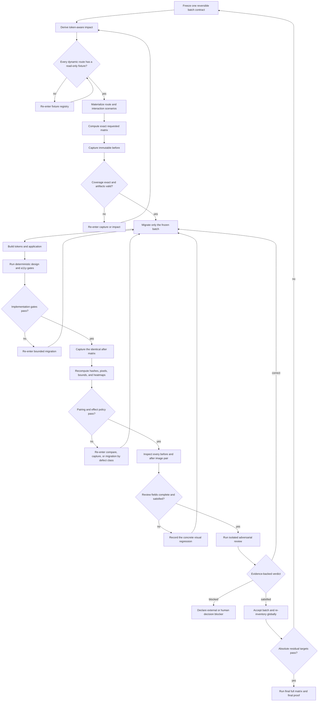

# Refactor UI with evidence

## Contract

A UI refactor is complete only when rendered evidence proves its declared
effect. Source diffs, successful builds, fresh manifest timestamps, and green
ratchets are necessary signals, but none proves the pixels or interaction state.

This skill implements the visual portion of the broader
`tokenize-design-system` state machine. For repository-wide tokenization, read
that skill's `reference/end-to-end-workflow.md` first; its artifact schemas,
batch effect policy, re-entry codes, and absolute completion predicates are
normative.

## Required evidence

Every accepted batch binds the following to one source fingerprint:

- batch contract and `preserve`, `change`, or `mixed` effect policy;
- planned and actual mutation files;
- affected consumer files and route patterns;
- concrete fixture identities;
- route, scenario, theme, locale, writing mode, and Playwright project;
- browser, viewport, device scale factor, fonts, token sources, and generated
  CSS hashes;
- before and after PNG bytes, dimensions, and recomputed SHA-256 values;
- exact and perceptual differing-pixel metrics, bounds, and heatmap;
- console errors, page errors, failed requests, HTTP errors, overflow, and Axe
  results;
- one completed visual review per comparison pair; and
- an isolated adversarial verdict.

Requested and produced capture IDs must be identical non-empty sets. Missing,
extra, duplicate, stale, or invalid captures fail closed.

## Closed loop



## Execution sequence

### 1. Freeze the batch

Do not start from an open-ended diff. Record:

- one semantic target;
- exact planned files;
- rollback source fingerprint;
- expected changed and unchanged scenario IDs;
- absolute residual targets; and
- the intended visual effect.

Never combine alias-only tokenization with an undocumented visual cleanup.

### 2. Derive impact

Run the canonical route-impact adapter. Required contexts are the union of:

1. edited call sites;
2. reverse-import consumers;
3. every consumer of changed tokens or aliases;
4. routes and states rendering those consumers; and
5. global fan-out for token sources, generated CSS, Tailwind configuration,
   themes, fonts, application shells, and shared layouts.

A deleted or unresolved source file expands impact; it must never produce an
empty route set. Parameterized routes remain required until a concrete fixture
or approved out-of-scope decision exists.

### 3. Materialize scenarios

Each scenario declares a concrete route, fixture, auth role, projects, themes,
preconditions, actions, witness assertion, optional target clips, and whether
the actions are read-only.

Default route load is insufficient for components visible only under:

- hover or focus-visible;
- pressed, selected, disabled, or loading state;
- expanded menus, popovers, modals, drawers, and backdrops;
- empty, error, or extreme-content fixtures; or
- drag and keyboard interaction.

If the witness cannot be reproduced, the scenario is `NOT_PROVED`; do not
capture an unrelated page under the requested ID.

### 4. Capture `before`

Use a new immutable label. The runner must stage output and promote it only
after Playwright and exact-coverage validation succeed. A previous label,
partial directory, or fresh timestamp cannot substitute for the current run.

The runner's canonical interface is:

```bash
cd frontend
yarn ui:evidence -- <label> \
  --batch <B0001> \
  --phase before \
  --contexts <comma-separated-context-ids> \
  --themes light,dark \
  --projects mobile-sm,mobile-md,tablet,desktop
```

Use `--project <name>` only as a compatibility spelling for one project.

### 5. Mutate and run deterministic gates

Migrate exactly one batch, then run the batch's declared formatter, typecheck,
application build, token build/check, emitted-class assertion, hardcode,
naming, cohesion, variety, dead-class, bundle, contrast, semantic HTML,
keyboard, Axe, request, overflow, and route-coverage checks.

Unknown Tailwind classes can emit zero CSS without failing the build. Verify
the emitted artifact, not just the source token definition.

### 6. Capture and compare `after`

Use the exact same capture IDs, fixtures, and toolchain. The comparator must
read actual files and recompute:

- dimensions and SHA-256;
- exact RGBA changed pixels;
- perceptual changed pixels;
- changed ratio and bounding box;
- maximum channel delta; and
- an inspectable diff image.

Policy:

- `preserve`: exact pixel identity unless the contract records an approved
  non-zero threshold;
- `change`: every declared target changes and guard regions remain stable;
- `mixed`: changed and preserved scenario sets are both explicit.

An identical image is success for a preserve batch and a defect for a scenario
that was required to change.

### 7. Inspect pixels and review adversarially

The LLM reads both images and the heatmap for every pair. Computed metrics
prioritize attention but do not eliminate pairs from review. Review entries
must describe expected effect, observed effect, verdict, and evidence.

Then an isolated reviewer compares the original request, batch contract,
actual diff, deterministic gates, manifests, comparison, visual reviews, and
residual inventory. Only findings classified as real and backed by a path,
artifact, command, test, or rendered image cause correction.

Continue the same reviewer thread after a correction. A source mutation
invalidates all final evidence generated before it.

## Re-entry map

| Failure | Re-enter |
|---|---|
| missing route, fixture, auth, or witness | fixture/scenario materialization |
| actual mutation outside covered impact | restore pre-batch source, then impact |
| absent emitted class or failed build/gate | bounded migration |
| missing/extra/stale/corrupt capture | capture/manifest |
| mismatched pair or corrupt pixel metrics | comparator |
| preserve changed or intended change stayed identical | bounded migration |
| defensible competing visual standards | human decision board |
| incomplete image review | visual review |

## Hard rules

1. Derive contexts from code and token consumers, never guess routes.
2. Capture every required interactive state.
3. Inspect rendered pixels; never infer the visual verdict from a code diff.
4. Recompute hashes from actual files.
5. Preserve immutable `before` evidence.
6. Keep migrations sequential and reversible.
7. Treat uncovered context as failure, not a skip.
8. Run adversarial review in an isolated subagent.
9. Re-run final evidence after the last source mutation.
10. Never report completion without the repository's proof-of-completion gate.

## Related canonical assets

> **Dependency surface:** this skill is **not** self-contained — its engine is 13
> files / 4.303 lines living in the repo, 74% of them wired to Playwright test
> discovery, a `package.json` script, a Stop hook, or project data. Every file,
> its role, and why it stays in the repo:
> [`reference/engine.md`](reference/engine.md). The protocol in this SKILL.md
> travels to another repo; the 13 files do not.


- `frontend/scripts/affected-routes.mjs` — code/token impact to route contexts.
- `frontend/scripts/gen-visual-routes.mjs` — read-only fixture materialization.
- `frontend/scripts/ui-evidence.sh` — staged Playwright runner.
- `frontend/tests/visual/evidence.spec.ts` — rendered capture engine.
- `frontend/scripts/evidence-manifest.mjs` — exact manifest construction.
- `frontend/scripts/compare-evidence.mjs` — pixel and policy comparison.
- `.harness/hooks/ui-evidence-gate.sh` — stop-time freshness and coverage gate.
- `tokenize-design-system` — full tokenization state machine and artifact law.
