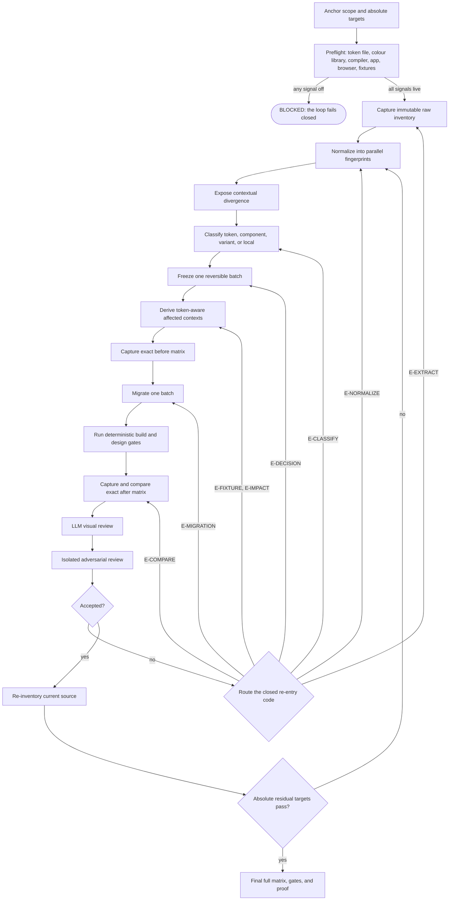

# Tokenize design system — end-to-end orchestration

## Start here: one command, the whole loop

```bash
node .claude/skills/tokenize-design-system/scripts/tokenize.mjs --root <app>
```

`scripts/tokenize.mjs` is the **only** entrypoint. It drives every phase in
order and prints what each one decided:

| Phase | Who decides | What it produces |
|---|---|---|
| `PREFLIGHT` | deterministic | target compiler and colour library resolve, or the loop stops |
| `MINE` | deterministic | repeated `className` bundles — the canonical-entity candidates, with an 80% scan-coverage guard |
| `EXTRACT` + `CLUSTER` | deterministic | occurrences violating the law, grouped by **semantic context** |
| `CONVERGE` | deterministic | Newton–Raphson merge until two consecutive iterations change nothing |
| `REPORT` | deterministic | three chapters: decided alone / exposed / needs the owner |
| `DECIDE` | **human** | only pairs above the uncertainty cut |
| `APPLY` | — | declared, **not implemented**: token creation, AST codemod, pixel proof |

Useful flags: `--until <PHASE>` stops early (`PREFLIGHT`, `MINE`, `EXTRACT`,
`CLUSTER`, `CONVERGE`, `REPORT`, `DECIDE`), `--max-uncertainty <n>` moves the
human cut (default `30`), `--json` emits machine-readable output.

**The loop fails closed at every phase.** A missing compiler, colour library or
token file stops the run instead of continuing with a signal switched off — a
run once reported *"0 merges, 400 queued"* purely because the colour library
did not resolve, and that number looked like a result.

**`tokenize.mjs` never mutates the target.** It produces a proposal and the
evidence behind it. Rendered visual proof for the mutation phase is
`reference/visual-evidence.md`, and its engine inventory is
`reference/visual-evidence-engine.md` — the same loop, not a separate skill.

### What each script is, so nothing looks orphaned

`scripts/` holds **29 executables** (`*.mjs` minus tests) and 17 modules under
`lib/`. Four of them run as processes inside `tokenize.mjs`; two more are
imported by those. The rest are invoked on purpose — and five have no caller at
all, which is stated here rather than hidden.

| script | role |
|---|---|
| `tokenize.mjs` | **the entrypoint.** Everything below is reached through it or run by hand |
| `classname-miner-v2.mjs` | loop — AST/JSX miner spawned by the `MINE` phase; its `--ext` default of `ts,tsx` is the trap the coverage guard exists for |
| `context-clusters.mjs` | loop — walks the tree itself and groups occurrences by semantic context |
| `converge-tokens.mjs` | loop — Newton–Raphson merge with weighted measured signals |
| `tokenization-report.mjs` | loop — writes the three-chapter report into the **target** repo |
| `find-owner.mjs` | module — owner from rendered context; imported by `context-clusters` and `propose-semantic-html` |
| `score-naming.mjs` | module — the naming oracle and closed vocabulary; imported by `context-clusters`, `find-owner`, `measure-coverage` |
| `measure-coverage.mjs`, `measure-disposition.mjs` | census oracles — the pinned denominator and the complete 7-instrument partition; `test/oracle-reconciliation.test.mjs` keeps them on one universe |
| `propose-vocabulary.mjs`, `vocabulary-ratchet.mjs` | generate the layout-vocabulary contract from `measure-disposition`, then enforce it |
| `propose-entities.mjs` | proposes canonical entity contracts (a repeated bundle becomes one named contract) |
| `propose-semantic-html.mjs` | proposes the semantic-HTML enrichment that unblocks owner attribution; spawns `context-clusters` |
| `tokenization-runner.mjs` | standalone CLI — durable control plane for the unimplemented `APPLY` phase. It records and validates transitions; it does **not** execute them |
| `discover-axes.mjs` | state-machine adapter — reconciles axes against the closed 19-kind registry. Takes explicit paths, **no `--root`** |
| `inventory-surface.mjs`, `inventory-usage.mjs`, `cluster-leftovers.mjs` | state-machine adapters for `CLASSIFIED` — census of declared tokens, of consumption, and of the ownerless leftovers |
| `extract-design-occurrences.mjs`, `normalize-occurrences.mjs` | state-machine adapters for `INVENTORIED`/`NORMALIZED`. They are **not** the loop's scan: `context-clusters.mjs` scans on its own, and the two must not be re-added to the loop without deciding which scan is authoritative |
| `derive-tokens.mjs` | proposal generator for the human `DECIDED` phase; prepares the DTCG fragment, never decides it |
| `validate-contract.mjs`, `validate-token-build.mjs`, `evaluate-absolute-completion.mjs` | for `APPLY`: artifact schemas, the target's `tokens:build`, completion predicates |
| `audit-exceptions.mjs`, `audit-extraction-delta.mjs`, `measure-vectors.mjs`, `normalize-vectors.mjs`, `sample-weight-validation.mjs` | **no caller and no test.** Complete programs whose output is unverified until something exercises them |

Two wiring facts that change how the table is read:
`lib/phase-executors.mjs` maps every phase to its command, but **no executable
imports it** — every adapter above runs by hand today. And `normalize-vectors.mjs
--apply` is the only script here that rewrites target **source files** — the
others that write into the target (`tokenization-report`, `propose-entities`,
`propose-vocabulary --write`) emit reports and proposals, never code.

## Scope and guarantees

This skill is self-contained as the **orchestration and decision contract** for
tokenizing an entire frontend design system. The complete state machine,
normalization model, deterministic/LLM/human boundaries, evidence policy,
re-entry rules, decision trade-offs, and absolute completion predicates are in
`reference/end-to-end-workflow.md`.

Its portable implementation includes the schema-validated durable control
plane, append-only recovery journal, atomic state snapshot, complete
cross-artifact invariant engine, and the colour law, vocabulary, scoring rules,
clustering method, and analysis scripts. Remaining capabilities that are not
implemented as reusable executables are explicitly marked `BUILD` in the
end-to-end reference. Never infer that a documented adapter already exists.

The physical directory and public skill identifier are both
`tokenize-design-system`. Repository hooks and links must point to this single
canonical implementation; a second compatibility copy is forbidden.

The implementation/build pipeline and rendered visual evidence are deliberately
separate adapters:

- `validate-token-build.mjs` discovers and invokes the analysed project’s
  `tokens:build` and `tokens:check` scripts.
- A configured UI-evidence adapter owns affected-route discovery, authenticated
  browser setup, before/after screenshots, console capture, and visual review.
  The adapter may be a project script or another installed skill; this skill
  does not require a particular adapter name.

Do not copy target-repository generators, source pins, routes, credentials, or
obsolete codemods into this skill. A portable skill receives those as project
adapters or hands them off to the skill that owns them.

## The naming law

The code-facing identifier is:

```
entity [ . variant ] [ . anatomy ] [ . property ] [ . state ]
```

Only those slots belong in the identifier. Tier, architecture, visual depth, and
location are metadata. `surface`, `semantic`, `content`, pigment names, and
generic layer names are therefore forbidden in a new identifier.

| Slot | Question answered | When to write it |
|---|---|---|
| `entity` | **Whose** visual decision is this? | **always** — §4.1, includes parentless globals (`divider`, `focus-ring`) |
| `variant` | **Which version** of that entity? | only where the entity genuinely has variants — §4.4 |
| `anatomy` | **Which addressable part** of that entity? | only where the entity has more than one — §4.2 |
| `property` | **What** does it paint, size or set? | only where the anatomy permits more than one — §4.3, §7.2 |
| `state` | **When** does it apply? | only when it is not `default` — §4.5 |

> **ORDER — the variant sits next to what it qualifies.** `button.secondary.border-color`,
> never `button.border-color.secondary`: the *button* is secondary, the border is not.
> This block taught the opposite until 2026-08-01 — it was written on 07-30 and the
> correction of the following day did not sweep it, so the first file every agent reads
> was the last one still teaching the old order. Seven reference systems were surveyed
> and, among those carrying both an entity and a property in the name, not one writes
> the variant last. Full record in `reference/law.md` §6.

The complete closed vocabulary and property matrix are in
`reference/law.md` and `reference/anatomy-property.md`.

## Required workflow

Read `reference/end-to-end-workflow.md` before planning or executing a
repository-wide tokenization. It is normative when this shorter colour workflow
omits a phase or when a project adapter is incomplete.



### 1. Inventory before naming

Never infer a role from a hexadecimal value. Measure all consumption paths:

1. Tailwind utility classes;
2. `var(--color-*)` references in CSS and JavaScript; and
3. DTCG aliases in token JSON.

Then inspect context for every decision group: component, carrying JSX tag,
semantic attributes, property prefix, state prefix, nearby class names, and
source locations.

### 2. Infer, then cluster

Owner evidence is ordered by strength:

1. native tag and `role`/`type` attributes;
2. whole-word component name;
3. non-structural ancestor directory.

An unresolved case is not a license to invent a generic owner. Group unresolved
files by their top four colour utilities plus structural signals. A cluster is a
decision candidate; it becomes an owner only after its members and divergent
tones have been inspected.

### 3. Score both the name and each use

The removal test is deterministic: a word carries semantic value only when
removing it loses information. Score both the standalone identifier and every
call site. The threshold is 70/100. A valid name used with the wrong property or
state is still a defect.

### 4. Apply one reversible batch

For an accepted proposal, create a `component`-tier token that aliases the
current primitive value. Sharing a primitive preserves today’s pixel; sharing a
semantic name couples unrelated owners.

Before editing call sites, create a batch entry from
`reference/migration-ledger-template.md`. Build generated artifacts, verify the
new utility exists in generated CSS, migrate only that batch, and then hand the
changed paths and ledger entry to the configured UI-evidence adapter. Require
before/after images, a manifest, a console-error comparison, and human review.
Do not start the next batch after a failed check or a visual regression.

## Portable commands

Run every script with an explicit application root when possible:

```bash
SKILL=.claude/skills/tokenize-design-system
ROOT=frontend

node "$SKILL/scripts/tokenize.mjs" --root "$ROOT"
node "$SKILL/scripts/inventory-surface.mjs" --root "$ROOT"
node "$SKILL/scripts/inventory-usage.mjs" --root "$ROOT" > inventory.json
node "$SKILL/scripts/score-naming.mjs" --root "$ROOT" --review
node "$SKILL/scripts/find-owner.mjs" --root "$ROOT" --json
node "$SKILL/scripts/cluster-leftovers.mjs" --root "$ROOT" --json
node "$SKILL/scripts/derive-tokens.mjs" --root "$ROOT" --dtcg
node "$SKILL/scripts/measure-coverage.mjs" --root "$ROOT" --json
node "$SKILL/scripts/measure-disposition.mjs" --root "$ROOT" --json
node "$SKILL/scripts/propose-entities.mjs" --root "$ROOT"
node "$SKILL/scripts/propose-vocabulary.mjs" --root "$ROOT" --json
node "$SKILL/scripts/vocabulary-ratchet.mjs" --root "$ROOT" --report
node "$SKILL/scripts/validate-token-build.mjs" --root "$ROOT" --build --check
node "$SKILL/scripts/validate-contract.mjs"
node "$SKILL/scripts/tokenization-runner.mjs" help
node "$SKILL/scripts/evaluate-absolute-completion.mjs" \
  --root "$ROOT" \
  --run-root ".harness/runs/tokenize-<run-id>"
```

`--root` may be replaced by `TOKENIZE_ROOT` **only** for the 19 scripts that
resolve the root through `lib/paths.mjs`. `discover-axes.mjs` and
`validate-contract.mjs` take no root at all, and eight others parse `--root`
themselves and ignore the variable — `reference/script-contracts.md` lists the
three groups. The law is loaded from this skill’s `reference/law.md`;
`<root>/tokens/GRAMMAR.md` is only a compatibility fallback.

### Script contracts

| Script | Purpose |
|---|---|
| `tokenize.mjs` | The entrypoint: runs `PREFLIGHT → MINE → EXTRACT+CLUSTER → CONVERGE → REPORT → DECIDE`, fails closed at every phase, writes only into `<root>/.tokenize/`. |
| `classname-miner-v2.mjs` | Canonical TypeScript-API class extractor with complete NDJSON output. |
| `context-clusters.mjs` | Scans the target and groups law-violating occurrences by semantic context, deriving one name per cluster. |
| `converge-tokens.mjs` | Newton–Raphson merge of clusters until two consecutive iterations change nothing. |
| `tokenization-report.mjs` | The three-chapter report, written into the target repository. |
| `inventory-surface.mjs` | Three-path inventory for legacy `surface` tokens, aliases, duplicates, and dead tokens. |
| `inventory-usage.mjs` | Contextual decision groups for all colour utility uses. |
| `score-naming.mjs` | Name and call-site scores, including the review queue. |
| `find-owner.mjs` | Deterministic rendered-context owner evidence. |
| `cluster-leftovers.mjs` | Consumption-signature clusters for cases the owner inference cannot resolve. |
| `derive-tokens.mjs` | Per-use DTCG proposals that preserve the current value. |
| `extract-design-occurrences.mjs` | `INVENTORIED` adapter: `design-occurrences.ndjson` + `extraction-summary.json`. |
| `discover-axes.mjs` | `INVENTORIED` adapter: reconciles measured axes against the closed 19-kind registry. Explicit input paths, no `--root`. |
| `normalize-occurrences.mjs` | `NORMALIZED` adapter: raw-order, canonical-multiset and canonical-set fingerprints per occurrence. |
| `measure-coverage.mjs` | The pinned denominator of `className` usage; fails closed on an empty universe. |
| `measure-disposition.mjs` | The complete 7-instrument partition of that same universe; the oracle the vocabulary scripts spawn. |
| `measure-vectors.mjs` | Census of the style vectors `className` does not see (`style={{}}`, hand-written CSS). No caller. |
| `normalize-vectors.mjs` | Proposes normalization of those vectors; the only script that mutates target source, and only with `--apply`. No caller. |
| `propose-entities.mjs` | Proposes canonical entity contracts from repeated class bundles. Writes proposals only. |
| `propose-semantic-html.mjs` | Proposes the semantic-HTML enrichment that unblocks owner attribution. Writes proposals only. |
| `propose-vocabulary.mjs` | Generates the layout-vocabulary contract as a pure function of a `measure-disposition` run, with provenance. |
| `vocabulary-ratchet.mjs` | Enforces that contract: exit 1 when a class enters the residue or an entity bundle. |
| `audit-exceptions.mjs` | Itemises stratum 7 against built CSS so every exception carries owner, reason, scope, evidence and review policy. No caller. |
| `audit-extraction-delta.mjs` | Multiset diff between two class extractors, to prove a parser change loses no legitimate class. No caller. |
| `sample-weight-validation.mjs` | Emits the human labelling form for the merge weights, without showing the score. No caller. |
| `validate-token-build.mjs` | Project build/check adapter and optional generated-CSS class assertion. |
| `validate-contract.mjs` | Self-contained parity and non-vacuity gate for the law, executable score, artifact schemas, design-occurrence universe, and evidence contract. |
| `tokenization-runner.mjs` | Durable fail-closed state-machine **recorder** with Ajv schema validation, cross-artifact invariants, atomic state, append-only recovery journal, and code-specific re-entry. It validates and journals transitions; it never runs a phase's command. |
| `evaluate-absolute-completion.mjs` | Recomputes the live source/toolchain fingerprints, evaluates all 24 Section 14 predicates, rejects ratchet-only/stale/vacuous evidence, and writes `final-proof.json` only on absolute success. |
| `lib/artifact-contract.mjs` | Reusable 19-schema validator, SHA/reference verifier, invariant engine, canonical fingerprint functions, and transition contract. |
| `lib/absolute-completion-contract.mjs` | Closed predicate registry and absolute-report contract shared by the evaluator and runner invariant engine. |
| `lib/phase-executors.mjs` | Phase→command registry with the `deterministic`/`model`/`human` split. **Imported by no executable** — the mapping is documentation until something loads it. |

`reference/script-contracts.md` documents arguments, input assumptions, and
expected output for all 29 executables, the three different `--root`
conventions, this repository's 11 adapter scripts under `scripts/`, and the
gaps that are missing implementation rather than missing prose.

## Validation gate

The following must all succeed for a colour batch to be accepted:

1. naming score and application score meet the threshold, or an explicit human
   decision records the exception;
2. the project’s `tokens:build` and `tokens:check` adapters succeed;
3. the generated CSS contains every new utility used by the batch;
4. the before/after visual-evidence handoff covers all routes affected by the
   batch and reports no unexplained console or pixel regression; and
5. the migration ledger has a completed record with commands and raw evidence.

Repository-wide completion additionally requires every absolute predicate in
`reference/end-to-end-workflow.md`. Existing ratchets demonstrate
non-regression only; they must never be reported as proof of zero residual debt.

## Clarification — asking the owner

**A bare question to the owner is forbidden.** This process is 99.999% AI-driven;
the human is asked at the limit, not in the routine. Before asking, apply the test
in [`reference/clarification.md`](reference/clarification.md): if the answer
depends on evidence you can measure, **decide and execute** — report the choice
instead of asking.

When the question IS legitimate (preference, business limit, destructive action,
credential, or merge uncertainty above 30%), it must carry the `### D[n]` block:
four items per option — Behaviour, Applied good example, Applied bad example, When
to choose — **plus your own recommendation with the data behind it**.

Enforced deterministically by the `clarification-gate` Stop hook, whose regression
table was built from the bare questions this agent actually asked.

## References

| File | Content |
|---|---|
| `reference/law.md` | Normative law and closed vocabulary. |
| `reference/anatomy-property.md` | Normative anatomy × property matrix. |
| `reference/oracle.md` | Scoring implementation and thresholds. |
| `reference/examples.md` | Measured good/bad naming examples. |
| `reference/pitfalls.md` | Recurrent failure modes and corrections. |
| `reference/canonical-documents.md` | Status of historical source material. |
| `reference/migration-ledger-template.md` | One-batch evidence record. |
| `reference/end-to-end-workflow.md` | Normative full-system state machine, normalization, evidence, re-entry, trade-offs, and completion proof. |
| `reference/artifact-schemas.json` | Normative JSON Schema 2020-12 bundle for every durable state-machine artifact. |

## Explicit exclusions

The following are not copied into this generic skill:

- project-specific affected-route discovery, fixtures, authentication, and
  screenshot execution: supplied by configured adapters whose exact contracts
  are defined in `reference/end-to-end-workflow.md`;
- cross-repository parity, source pins, and motion keyframe parity: project
  integration concerns;
- a raw-colour codemod that emits `surface-*`: it violates this law and must be
  replaced by owner-based proposals before use;
- project source, generated artifacts, credentials, and fixtures. The AST
  className miner itself is included here and consumes the target project's
  TypeScript installation at runtime.
