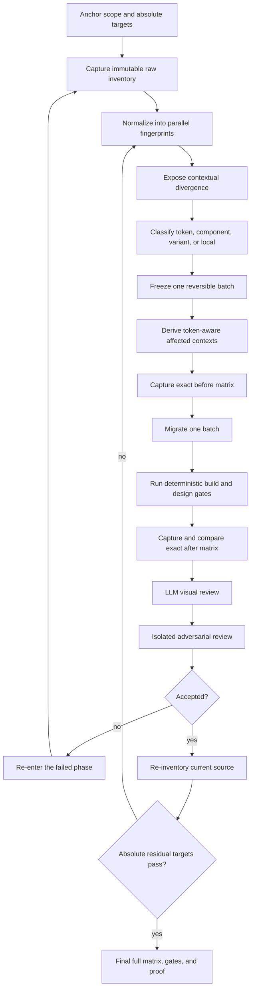

# Tokenize design system — end-to-end orchestration

## Scope and guarantees

This skill is self-contained as the **orchestration and decision contract** for
tokenizing an entire frontend design system. The complete state machine,
normalization model, deterministic/LLM/human boundaries, evidence policy,
re-entry rules, decision trade-offs, and absolute completion predicates are in
`reference/end-to-end-workflow.md`.

Its portable implementation includes the schema-validated durable control
plane, append-only recovery journal, atomic state snapshot, complete
cross-artifact invariant engine, and the colour law, vocabulary, scoring rules,
clustering method, and analysis scripts. Remaining capabilities that are not
implemented as reusable executables are explicitly marked `BUILD` in the
end-to-end reference. Never infer that a documented adapter already exists.

The physical directory and public skill identifier are both
`tokenize-design-system`. Repository hooks and links must point to this single
canonical implementation; a second compatibility copy is forbidden.

The implementation/build pipeline and rendered visual evidence are deliberately
separate adapters:

- `validate-token-build.mjs` discovers and invokes the analysed project’s
  `tokens:build` and `tokens:check` scripts.
- A configured UI-evidence adapter owns affected-route discovery, authenticated
  browser setup, before/after screenshots, console capture, and visual review.
  The adapter may be a project script or another installed skill; this skill
  does not require a particular adapter name.

Do not copy target-repository generators, source pins, routes, credentials, or
obsolete codemods into this skill. A portable skill receives those as project
adapters or hands them off to the skill that owns them.

## The naming law

The code-facing identifier is:

```
owner . anatomy . property [ . variant ] [ . state ]
```

Only those slots belong in the identifier. Tier, architecture, visual depth, and
location are metadata. `surface`, `semantic`, pigment names, and generic layer
names are therefore forbidden in a new identifier.

| Slot | Question answered |
|---|---|
| `owner` | Whose colour is this? |
| `anatomy` | Which addressable part of that owner? |
| `property` | Which CSS property does it paint? |
| `variant` | Which genuine version of that owner? |
| `state` | When does it apply? |

The complete closed vocabulary and property matrix are in
`reference/law.md` and `reference/anatomy-property.md`.

## Required workflow

Read `reference/end-to-end-workflow.md` before planning or executing a
repository-wide tokenization. It is normative when this shorter colour workflow
omits a phase or when a project adapter is incomplete.



### 1. Inventory before naming

Never infer a role from a hexadecimal value. Measure all consumption paths:

1. Tailwind utility classes;
2. `var(--color-*)` references in CSS and JavaScript; and
3. DTCG aliases in token JSON.

Then inspect context for every decision group: component, carrying JSX tag,
semantic attributes, property prefix, state prefix, nearby class names, and
source locations.

### 2. Infer, then cluster

Owner evidence is ordered by strength:

1. native tag and `role`/`type` attributes;
2. whole-word component name;
3. non-structural ancestor directory.

An unresolved case is not a license to invent a generic owner. Group unresolved
files by their top four colour utilities plus structural signals. A cluster is a
decision candidate; it becomes an owner only after its members and divergent
tones have been inspected.

### 3. Score both the name and each use

The removal test is deterministic: a word carries semantic value only when
removing it loses information. Score both the standalone identifier and every
call site. The threshold is 70/100. A valid name used with the wrong property or
state is still a defect.

### 4. Apply one reversible batch

For an accepted proposal, create a `component`-tier token that aliases the
current primitive value. Sharing a primitive preserves today’s pixel; sharing a
semantic name couples unrelated owners.

Before editing call sites, create a batch entry from
`reference/migration-ledger-template.md`. Build generated artifacts, verify the
new utility exists in generated CSS, migrate only that batch, and then hand the
changed paths and ledger entry to the configured UI-evidence adapter. Require
before/after images, a manifest, a console-error comparison, and human review.
Do not start the next batch after a failed check or a visual regression.

## Portable commands

Run every script with an explicit application root when possible:

```bash
SKILL=.claude/skills/tokenize-design-system
ROOT=frontend

node "$SKILL/scripts/inventory-surface.mjs" --root "$ROOT"
node "$SKILL/scripts/inventory-usage.mjs" --root "$ROOT" > inventory.json
node "$SKILL/scripts/score-naming.mjs" --root "$ROOT" --review
node "$SKILL/scripts/find-owner.mjs" --root "$ROOT" --json
node "$SKILL/scripts/cluster-leftovers.mjs" --root "$ROOT" --json
node "$SKILL/scripts/derive-tokens.mjs" --root "$ROOT" --dtcg
node "$SKILL/scripts/validate-token-build.mjs" --root "$ROOT" --build --check
node "$SKILL/scripts/validate-contract.mjs"
node "$SKILL/scripts/tokenization-runner.mjs" help
node "$SKILL/scripts/evaluate-absolute-completion.mjs" \
  --root "$ROOT" \
  --run-root ".harness/runs/tokenize-<run-id>"
```

`--root` may be replaced by `TOKENIZE_ROOT`. The law is loaded from this skill’s
`reference/law.md`; `<root>/tokens/GRAMMAR.md` is only a compatibility fallback.

### Script contracts

| Script | Purpose |
|---|---|
| `classname-miner-v2.mjs` | Canonical TypeScript-API class extractor with complete NDJSON output. |
| `inventory-surface.mjs` | Three-path inventory for legacy `surface` tokens, aliases, duplicates, and dead tokens. |
| `inventory-usage.mjs` | Contextual decision groups for all colour utility uses. |
| `score-naming.mjs` | Name and call-site scores, including the review queue. |
| `find-owner.mjs` | Deterministic rendered-context owner evidence. |
| `cluster-leftovers.mjs` | Consumption-signature clusters for cases the owner inference cannot resolve. |
| `derive-tokens.mjs` | Per-use DTCG proposals that preserve the current value. |
| `validate-token-build.mjs` | Project build/check adapter and optional generated-CSS class assertion. |
| `validate-contract.mjs` | Self-contained parity and non-vacuity gate for the law, executable score, artifact schemas, design-occurrence universe, and evidence contract. |
| `tokenization-runner.mjs` | Durable fail-closed state-machine executor with Ajv schema validation, cross-artifact invariants, atomic state, append-only recovery journal, and code-specific re-entry. |
| `evaluate-absolute-completion.mjs` | Recomputes the live source/toolchain fingerprints, evaluates all 24 Section 14 predicates, rejects ratchet-only/stale/vacuous evidence, and writes `final-proof.json` only on absolute success. |
| `lib/artifact-contract.mjs` | Reusable 19-schema validator, SHA/reference verifier, invariant engine, canonical fingerprint functions, and transition contract. |
| `lib/absolute-completion-contract.mjs` | Closed predicate registry and absolute-report contract shared by the evaluator and runner invariant engine. |

`reference/script-contracts.md` documents arguments, input assumptions, and
expected output.

## Validation gate

The following must all succeed for a colour batch to be accepted:

1. naming score and application score meet the threshold, or an explicit human
   decision records the exception;
2. the project’s `tokens:build` and `tokens:check` adapters succeed;
3. the generated CSS contains every new utility used by the batch;
4. the before/after visual-evidence handoff covers all routes affected by the
   batch and reports no unexplained console or pixel regression; and
5. the migration ledger has a completed record with commands and raw evidence.

Repository-wide completion additionally requires every absolute predicate in
`reference/end-to-end-workflow.md`. Existing ratchets demonstrate
non-regression only; they must never be reported as proof of zero residual debt.

## Clarification — asking the owner

**A bare question to the owner is forbidden.** This process is 99.999% AI-driven;
the human is asked at the limit, not in the routine. Before asking, apply the test
in [`reference/clarification.md`](reference/clarification.md): if the answer
depends on evidence you can measure, **decide and execute** — report the choice
instead of asking.

When the question IS legitimate (preference, business limit, destructive action,
credential, or merge uncertainty above 30%), it must carry the `### D[n]` block:
four items per option — Behaviour, Applied good example, Applied bad example, When
to choose — **plus your own recommendation with the data behind it**.

Enforced deterministically by the `clarification-gate` Stop hook, whose regression
table was built from the bare questions this agent actually asked.

## References

| File | Content |
|---|---|
| `reference/law.md` | Normative law and closed vocabulary. |
| `reference/anatomy-property.md` | Normative anatomy × property matrix. |
| `reference/oracle.md` | Scoring implementation and thresholds. |
| `reference/examples.md` | Measured good/bad naming examples. |
| `reference/pitfalls.md` | Recurrent failure modes and corrections. |
| `reference/canonical-documents.md` | Status of historical source material. |
| `reference/migration-ledger-template.md` | One-batch evidence record. |
| `reference/end-to-end-workflow.md` | Normative full-system state machine, normalization, evidence, re-entry, trade-offs, and completion proof. |
| `reference/artifact-schemas.json` | Normative JSON Schema 2020-12 bundle for every durable state-machine artifact. |

## Explicit exclusions

The following are not copied into this generic skill:

- project-specific affected-route discovery, fixtures, authentication, and
  screenshot execution: supplied by configured adapters whose exact contracts
  are defined in `reference/end-to-end-workflow.md`;
- cross-repository parity, source pins, and motion keyframe parity: project
  integration concerns;
- a raw-colour codemod that emits `surface-*`: it violates this law and must be
  replaced by owner-based proposals before use;
- project source, generated artifacts, credentials, and fixtures. The AST
  className miner itself is included here and consumes the target project's
  TypeScript installation at runtime.
