# End-to-end design-system tokenization workflow

Status: normative orchestration contract

Audience: engineers, coding agents, reviewers, and project owners

Goal: converge a handmade frontend to a fully classified, tokenized, rendered,
and verified design system without erasing source evidence or hiding residual
debt.

## 1. Executive decision

The repository already contains most leaf capabilities required for design
tokenization. The missing product is the control plane that composes them into a
durable, fail-closed state machine.

The user’s “more than 80% already exists” hypothesis is directionally correct
for leaf tools, but not for remaining engineering risk. The missing minority is
the control plane that prevents partial coverage, stale evidence, and false
completion, so its leverage and validation cost are disproportionate to its
line count.

The workflow therefore integrates existing miners, token oracles, token builds,
route impact analysis, Playwright evidence, accessibility checks, migration
ledgers, and adversarial review. It does not replace those tools with another
scanner.

Three corrections govern the design:

1. Class order is normalized in the analysis dataset, not in source code.
   `gap-2 px-2 mb-3` and `px-2 gap-2 mb-3` share an order-insensitive
   fingerprint while retaining different raw-order hashes.
2. Apparent utility equivalence is graded, not assumed. `pl-2 pr-2` and `px-2`
   can match in a horizontal writing mode but are not universally equivalent
   because physical and logical CSS properties differ. The target compiler and
   rendered computed styles are the final project-specific evidence.
3. Semantic HTML is a separate, pixel-preserving enrichment batch. It improves
   owner and context inference, but it is not itself a token and must not delay
   the immutable raw inventory.

## 2. Completion objective

The process may report `DONE` only when every in-scope design occurrence is in
one of two explicit terminal states:

- migrated to an approved primitive, role, or component contract; or
- retained as an approved, documented exception with an owner, reason, scope,
  evidence, and expiry/review policy.

“No regression,” “ratchet did not increase,” and “the build is green” are
necessary but insufficient. They do not prove that the design system is fully
tokenized.

## 3. Non-negotiable invariants

1. Preserve raw source evidence, locations, branches, and class order.
2. Use one shared AST extraction and normalization dataset. Consumers may add
   projections; they may not independently reinterpret source with incompatible
   regular expressions.
3. Record the target Tailwind version, entry CSS hash, token configuration hash,
   normalizer version, and `tailwind-merge` configuration when applicable.
4. Never use `tailwind-merge` as a universal CSS-equivalence oracle. Use it only
   for expressions that actually execute through `twMerge` or an equivalent
   wrapper.
5. Never auto-standardize by majority. Frequency creates a proposal, not proof.
6. Migrate one reversible batch at a time.
7. Bind every before/after artifact to the exact batch, source fingerprint,
   route, scenario, theme, viewport project, and fixture.
8. A coverage gap is a failure, not a skip.
9. Re-run the global census after every accepted batch.
10. Run deterministic gates after the final mutation, then run an isolated
    adversarial review before declaring completion.
11. Cover every approved design axis, not only colour: at least colour,
    spacing, sizing, typography, border, radius, elevation/shadow, opacity,
    motion, iconography, layout/container, breakpoint, and z-index where those
    axes exist in the target product.

## 4. Capability map and reuse decision

Legend:

- `USE`: integrate without rewriting.
- `ADAPT`: keep the implementation and harden its contract.
- `BUILD`: capability is not present as a complete reusable unit.
- `REPLACE`: existing artifact is unsafe as a source of truth.

Read the `Existing asset` column with its repository in mind — the table mixes
two of them, and a path alone does not say which:

- paths starting with `reference/` or `scripts/` are **this skill**;
- paths starting with `.harness/lib/`, `frontend/scripts/`, `frontend/tokens/`,
  or `frontend/tests/` are the **audited target application** (the Makers
  worktree listed in section 19), not this repository. In this repository the
  equivalents live under `tools/gates/`, `tools/hooks/`, `tools/mining/`, and
  `scripts/`.

| Capability | Existing asset | Status | Decision |
|---|---|---:|---|
| AST/JSX class extraction | `.harness/lib/classname-miner-v2.mjs` | ADAPT | Keep one canonical miner; add shared normalization output and branch completeness metadata. |
| Colour consumption inventory | `scripts/inventory-usage.mjs` in this skill | ADAPT | Consume the shared AST dataset; stop broad regex matching of comments and prose. |
| Naming grammar and owner model | `reference/law.md`, `reference/anatomy-property.md` | USE | Keep as the normative colour-token law. |
| Non-colour token contracts | Existing DTCG scale, motion, system-token files and project guards | ADAPT | Define a schema-versioned property/type/scale contract per in-scope axis; do not force the colour grammar onto typography, motion, or dimensional tokens. |
| Naming and use scoring | `score-naming.mjs`, `reference/oracle.md` | ADAPT | Add a parity test so prose, weights, and executable scoring cannot diverge. |
| Owner inference and leftovers | `find-owner.mjs`, `cluster-leftovers.mjs` | ADAPT | Enrich with implicit role, landmark, state, and normalized style fingerprints. |
| Relational co-occurrence analysis | LearnHouse class-mining NDJSON/Postgres schema | ADAPT | Keep NDJSON as the portable core; enable relational ingestion for large projects and pin one `activeRunId`. |
| DTCG source and project emitters | Project token JSON and build scripts | USE | Keep the working emitter. Do not replace it during migration merely to standardize tooling. |
| Token build/check adapter | `validate-token-build.mjs` | USE | Require emitted-class assertions for every batch. |
| Deterministic design guards | `ds-gate`, naming, cohesion, variety, dead-class, bundle, pair checks | ADAPT | Preserve ratchets, then add absolute completion predicates. |
| Semantic/a11y census | `frontend/scripts/a11y-audit.mjs` and existing Axe probes | ADAPT | Turn defects and unclassified interactive containers into structured queues and fail-closed gates. |
| Route impact | `frontend/scripts/affected-routes.mjs` | ADAPT | Replace duplicate implementations with one AST-aware, token-consumer-aware engine. |
| Route registry | `routes.json` and `gen-visual-routes.mjs` | REPLACE | The current generator is a stub and dynamic routes need fixture-backed materialization. |
| Playwright capture | `ui-evidence.sh`, `evidence.spec.ts`, Playwright projects | ADAPT | Execute the complete requested project matrix and bind manifests to the batch. |
| Before/after report | `evidence-report.mjs` | ADAPT | Recompute bytes, dimensions, hashes, pixel metrics, and require completed review fields. |
| Interactive-state probes | Existing `capture-*`, `measure-*`, `audit-*`, and `probe-*` scripts | ADAPT | Wrap reusable actions in one scenario registry instead of maintaining isolated workflows. |
| Migration ledger | `reference/migration-ledger-template.md` and project ledger | ADAPT | Add machine-readable batch state, impact, rollback, and evidence references. |
| Council and adversarial review | Project delivery council and adversarial reviewer | USE | Use as governance around deterministic execution; never replace deterministic gates with LLM judgement. |
| Durable artifact contracts | `reference/artifact-schemas.json` | USE | Validate all JSON/NDJSON artifacts and enforce the documented cross-artifact invariants at every transition. |
| Durable state-machine executor | `scripts/tokenization-runner.mjs` + `scripts/lib/phase-executors.mjs` | BUILD | The 15-state machine, the append-only journal, the atomic snapshot and the artifact-validated transitions exist; **nothing drives them.** The only entrypoint, `scripts/tokenize.mjs`, never calls the runner. Wiring it is the remaining build. |
| Absolute completion evaluator | `scripts/evaluate-absolute-completion.mjs` | USE | Recompute live source/toolchain fingerprints and all 24 predicates; write `final-proof.json` only when absolute current residuals are zero. |
| Tailwind-aware normalizer | partial logic in miner and abstraction analysis | BUILD | Extract one shared adapter-backed normalizer; do not create a fourth scanner. |
| Exact evidence coverage gate | none | BUILD | Compare requested and produced route × scenario × theme × project sets exactly. |

Project-local scripts under `frontend/tokens` that duplicate the portable skill
must become thin adapters or be retired. Two independently evolving
implementations are not acceptable.

## 5. Responsibility boundary

| Actor | Must decide or prove | Must not decide |
|---|---|---|
| Deterministic scripts | extraction, counts, fingerprints, compiler output, route impact, coverage, token build, contrast, Axe, overflow, console/network errors, bytes, hashes, and pixel metrics | semantic intent or whether two defensible visual variants should converge |
| LLM | contextual role, candidate abstraction type, divergence explanation, screenshot review, and standardization proposal | numeric facts that can be computed, missing coverage, or silent exceptions |
| Human | material ambiguity between defensible visual contracts, approved canonical cardinalities, business-owned exceptions | routine migrations already proven equivalent |
| Isolated adversarial reviewer | request-to-plan traceability, scope gaps, stale evidence, false-green gates, and contradictions across code/docs/results | implementation in the same review turn |

The LLM receives bounded evidence packets. It does not browse the repository
freely and then invent counts. Every factual input includes a source location or
artifact identifier.

## 6. Durable run model

Each engagement creates one immutable run root:

```text
.harness/runs/tokenize-<run-id>/
  anchor.md
  config.json
  state.json
  inventory/
    design-occurrences.ndjson
    normalized-occurrences.ndjson
    axis-discovery.json
    inventory-reports.ndjson
    cluster-packets.ndjson
  decisions.ndjson
  batches/
    B0001/
      contract.json
      impacted-contexts.json
      before-manifest.json
      mutation-manifest.json
      deterministic-checks.json
      after-manifest.json
      comparison.json
      visual-review.json
      adversarial-review.json
      acceptance.json
  final-proof.json
```

`state.json` is append-only or journaled. A process interruption resumes from
the first state whose output fingerprint is absent or invalid. A change to an
upstream fingerprint invalidates every downstream state.

Recommended state progression:

```text
ANCHORED
  -> PREFLIGHTED
  -> INVENTORIED
  -> NORMALIZED
  -> CLASSIFIED
  -> DECIDED
  -> BEFORE_CAPTURED
  -> MIGRATED
  -> BUILT
  -> AFTER_CAPTURED
  -> COMPARED
  -> REVIEWED
  -> ACCEPTED
  -> REINVENTORIED
  -> COMPLETE
```

No state may be inferred from the existence of an old report. The artifact must
match the current run and all declared input fingerprints.

### 6.1 Normative artifact schemas

`reference/artifact-schemas.json` is the executable JSON Schema 2020-12 bundle.
Each JSON artifact, and each line of an NDJSON artifact, validates against
exactly one of 19 root `artifactType` contracts:

```text
run-config
run-state
design-occurrence
normalized-occurrence
axis-discovery
inventory-report
cluster-packet
decision
batch-contract
impacted-context
scenario
evidence-manifest
mutation-manifest
deterministic-checks
comparison
visual-review
adversarial-review
acceptance
final-proof
```

Every artifact carries schema version, run ID, source fingerprint, toolchain
fingerprint, and generation time. The schema closes enums, IDs, required hashes,
re-entry codes, and the shapes exchanged by adapters.

JSON Schema validates one artifact. The executor must additionally enforce
these cross-artifact invariants:

| Invariant | Required relationship |
|---|---|
| Run identity | Every referenced artifact has the same `runId`. |
| Reference integrity | `artifactRef.sha256` equals the current bytes at `artifactRef.path`. |
| Source freshness | An artifact’s `sourceFingerprint` equals the source state from which it was produced. |
| Toolchain freshness | An artifact’s `toolchainFingerprint` equals `run-config.toolchain`. |
| Source-kind registry | The 19 closed `occurrenceKind` values appear exactly once in `run-config.sourceKindRegistry`; each is either bound to a scanner or explicitly out of scope with a rationale. |
| Design reconciliation | Every design-occurrence ID exists exactly once and reaches one terminal reconciliation state before `DONE`. `discovered` and `opaque` are non-terminal; approved token/contract/exception/out-of-scope and evidenced invalid source are terminal. |
| Class projection parity | Every `utility-class` and `generated-class` design occurrence maps to exactly one normalized occurrence. Non-class occurrences are handled by their registered axis adapters and must not be forced into the class schema. |
| Axis discovery | Every discovered axis has one configured contract or is reported in `uncoveredAxes`; `uncoveredAxes` and `uncoveredOccurrenceKinds` must be empty at `DONE`. |
| Batch scope | `mutation-manifest.actualMutationFiles` is a subset of `batch-contract.plannedFiles` and `impacted-context.consumerFiles`; otherwise emit `E-IMPACT`. |
| Scenario coverage | Requested scenarios are non-empty; requested IDs, produced IDs, and unique capture IDs are identical sets and `exactCoverage` is true. Counts must also match, so duplicate IDs cannot hide a missing capture. |
| Pairing | Before and after manifests have identical non-empty scenario sets; comparison pair IDs equal that set and fixture/route/toolchain dimensions match. |
| Effect policy | Comparison results satisfy the batch’s `preserve`, `change`, or `mixed` scenario declarations. |
| Review completeness | `requiredReviewScenarioIds`, comparison pair IDs, and visual-review entry IDs are the same non-empty set, with one completed image review per scenario. |
| Acceptance | The immutable contract and its before manifest retain `preSourceFingerprint`; `mutation-manifest.beforeSourceFingerprint` equals that value. Mutation result, checks, after manifest, comparison, visual review, and adversarial review match the distinct `acceptedSourceFingerprint`; checks, comparison, and reviews pass. |
| Final order | Final matrix and final deterministic checks match the final source fingerprint and precede the final adversarial review. |
| Final proof | `done` is legal only when every predicate passes and every unapproved, unreconciled, uncovered, or unreviewed residual count — including axes and occurrence kinds — is zero. |

The executor validates schema and cross-artifact invariants before every state
transition. Invalid artifacts emit the re-entry code associated with their
producer; they are never coerced into a later state.

## 7. Shared design-occurrence contract

Every source construct carrying a design decision emits a `design-occurrence`.
This includes utility classes, CSS declarations and variables, inline styles,
CSS-in-JS, SVG presentation, chart/canvas configuration, typography and font
assets, motion, images/icons/gradients/illustrations, token definitions and
aliases, and generated classes. It is invalid to omit an occurrence kind or
drop an unresolved expression and still count the inventory as complete.

The following is an abbreviated class-bearing design occurrence. The common
artifact header is omitted. Durable records use the closed shapes in
`reference/artifact-schemas.json`.

```json
{
  "occurrenceId": "stable-location-and-branch-id",
  "occurrenceKind": "utility-class",
  "axis": "spacing",
  "location": {
    "file": "src/path/Component.tsx",
    "line": 42,
    "column": 7
  },
  "sourceLanguage": "tsx",
  "rawValue": "p-2 px-1 disabled:opacity-50",
  "property": null,
  "context": {
    "component": "Component",
    "nativeTag": "button",
    "implicitRole": "button",
    "explicitRole": null,
    "nearestLandmark": "main",
    "routeAreas": ["/settings"],
    "interactionState": "disabled"
  },
  "sourcePayload": {
    "selectorOrObjectPath": null,
    "classExpression": {
      "expressionKind": "call-expression",
      "resolverKind": "twMerge",
      "branchId": "branch-2",
      "conditionExpression": "disabled",
      "rawClassName": "p-2 px-1 disabled:opacity-50",
      "rawTokens": ["p-2", "px-1", "disabled:opacity-50"],
      "unresolvedDynamicFragments": [],
      "branchExpansionTruncated": false
    },
    "asset": null
  },
  "reconciliation": {
    "status": "discovered",
    "decisionId": null,
    "exceptionId": null,
    "reason": null
  }
}
```

`normalized-occurrence` is deliberately a class-only projection. It points
back through `designOccurrenceId` and adds parsed Tailwind candidates,
order-preserving and order-insensitive fingerprints, compiler/computed-style
evidence, and normalizer provenance. Other occurrence kinds use their
registered axis adapters while retaining the shared identity, context, and
reconciliation contract.

Supported resolver kinds are at least:

```text
direct | clsx | twMerge | cva | template | conditional | unknown
```

Conditional expansion must have a configured ceiling. When the ceiling is
exceeded, mark the occurrence as truncated and route it to a manual extraction
queue. Never manufacture a partial “complete” branch set.

## 8. Normalization without source mutation

### 8.1 Candidate parsing

Whitespace splitting is insufficient. The parser must be bracket-aware and
represent each candidate as:

```text
variants[]
important
negative
utilityRoot
value
modifier
canonicalCandidate
status: valid | opaque | invalid
```

It must preserve constructs such as:

```text
[&::-webkit-scrollbar]:hidden
group-data-[active=true]:block
bg-[url(http://example.test/a:b)]
p-2!
!p-2
```

The Tailwind parser/compiler installed in the target project is accessed behind
an adapter with feature detection. Internal Tailwind APIs are not a stable
contract, so the project build remains the final compiler oracle.

### 8.2 Parallel fingerprints

The normalized record keeps all of these projections:

```text
rawOrderHash
canonicalMultisetFingerprint
canonicalSetFingerprint
runtimeMergedFingerprint
compiledCssFingerprint
computedStyleFingerprint[]
semanticContextFingerprint
```

- `rawOrderHash` detects exact textual recipes.
- `canonicalMultisetFingerprint` sorts candidates and retains duplicates.
- `canonicalSetFingerprint` sorts and deduplicates candidates for
  order-insensitive discovery.
- `runtimeMergedFingerprint` exists only when the real resolver executes
  `twMerge` or an equivalent configured merger.
- `compiledCssFingerprint` records emitted declarations, selectors, variants,
  layers, and at-rules from the target compiler.
- `computedStyleFingerprint[]` records the properties observed for declared
  route/scenario/theme/viewport/writing-mode contexts.
- `semanticContextFingerprint` records owner evidence separately from style.

Every fingerprint includes provenance:

```text
normalizerVersion
tailwindVersion
tailwindEntryCssHash
tailwindConfigHash
tokenSourceHash
twMergeVersion
twMergeConfigHash
```

### 8.3 Equivalence lattice

| Level | Meaning | Automatic action |
|---|---|---|
| `EXACT_SET` | Same canonical candidates; raw order may differ | Safe to group analytically |
| `COMPILER_EQUIVALENT` | Same effective emitted CSS in the pinned project compiler | Candidate for automatic normalization, still verified visually |
| `OBSERVED_EQUIVALENT` | Same computed styles only in the complete declared evidence matrix | Proposal requiring a recorded decision |
| `CONDITIONAL_EQUIVALENT` | Equality depends on writing mode, viewport, state, theme, variables, or resolver | Suggestion only |
| `NOT_EQUIVALENT` | A proven effective-style difference exists | Keep separate or perform an explicitly visual-changing batch |
| `UNKNOWN` | Dynamic, custom, invalid, or unresolved candidate | Block automatic migration |

Examples:

| Input A | Input B | Initial classification |
|---|---|---|
| `gap-2 px-2 mb-3` | `px-2 gap-2 mb-3` | `EXACT_SET`, different raw-order hashes |
| `p-2 p-2` | `p-2` | Duplicate finding; effect must be compiler-confirmed |
| `p-2 md:p-4` | `p-2 p-4` | `NOT_EQUIVALENT`; variant scopes differ |
| `pl-2 pr-2` | `px-2` | `CONDITIONAL_EQUIVALENT`; physical versus logical axes |
| `p-2 px-1` | `py-2 px-1` | Compiler-project candidate, not a universal rewrite |
| `cn("p-2 px-1")` | `cn("px-1 p-2")` | Potentially different runtime merge results |
| `after:content-[` | any valid candidate | `UNKNOWN`/invalid; report, never discard |

Alphabetical sorting is suitable for a fingerprint. If source formatting is
later desired, use the official Tailwind-aware Prettier plugin order, not plain
alphabetical order. Formatting is a separate, pixel-preserving batch.

### 8.4 Two complementary mining modes

Keep both:

1. Original contiguous n-grams, which find copied component contracts and
   order-dependent recipes.
2. Frequent itemsets and exact-set fingerprints, which find the same utility
   recipe written in different orders.

Do not sort a class list and then compute n-grams. That creates artificial
adjacency that never existed in source.

### 8.5 Normalization gates

All must pass:

```text
class-like design occurrences = valid normalized + opaque + invalid + truncated
zero occurrence lost
zero silently truncated branch
same input and toolchain = same fingerprints
no opaque or invalid candidate disappears between runs
all fingerprint provenance fields present
AST/miner and relational-ingestion row counts have exact parity
all non-class design occurrences are accounted for by registered axis adapters
zero uncovered design axis or occurrence kind
```

## 9. Contextual divergence report

Handmade design is evidence. The report must expose, not erase, inconsistent
style contracts.

Group first by semantic context:

```text
owner
native tag and implicit/explicit role
nearest landmark
component
anatomy
property
interaction state
route area
theme
viewport/breakpoint
```

Within each context, report:

- every distinct raw recipe and normalized fingerprint;
- frequency and source locations;
- emitted and computed property deltas;
- equivalent, conditional, and non-equivalent candidates;
- representative screenshots at all decision-relevant resolutions;
- proposed canonical contract and confidence;
- exceptions that should remain distinct;
- predicted files, consumers, routes, and scenarios affected by convergence.

The decision board must show at least:

```text
CURRENT A | CURRENT B | PROPOSED STANDARD
```

with crops, full-page context, computed values, occurrence counts, and links to
source. The LLM explains the options; the human is asked only when two or more
contracts remain materially defensible.

## 10. Semantic HTML enrichment

Run semantic enrichment after the immutable raw baseline and before relying on
HTML semantics as a strong owner signal.

Classify candidates into:

- landmark;
- true control;
- navigation;
- list;
- independent content;
- heading structure;
- form;
- intentional neutral container such as layout, backdrop, drag surface, or
  capture region.

Migration sequence for each case:

1. Record current DOM, accessibility tree, interactions, form context, and
   screenshots.
2. Change one semantic case, not every `div`.
3. Add `type="button"` where a converted button must not submit a form.
4. Preserve or deliberately reset browser default styles.
5. Verify keyboard behavior, focus, accessible name, disabled state, and form
   behavior.
6. Run Axe and the exact preserve-pixel evidence matrix.
7. Re-run extraction so improved semantics can enrich owner inference.

Native HTML is preferred where it supplies required semantics and behavior.
ARIA is not a substitute for missing keyboard and interaction behavior. Layout
containers with no semantic role remain `div` elements.

## 11. End-to-end execution sequence

### 11.0 What runs today, against what this sequence specifies

Phases 0–17 below are the **target** sequence. The command that exists today is
`scripts/tokenize.mjs --root <app>`, and it is the only entrypoint. It runs seven
phases, in this order, and declares the eighth without implementing it:

```text
PREFLIGHT   MINE   EXTRACT+CLUSTER   CONVERGE   REPORT   DECIDE   (APPLY)
```

Reproduce the mapping instead of trusting this table — every row below is a line
of stdout from one run:

```bash
node .claude/skills/tokenize-design-system/scripts/tokenize.mjs --root <app>
node .claude/skills/tokenize-design-system/scripts/tokenize.mjs --root <app> --until CLUSTER
```

| `tokenize.mjs` phase | covers | does **not** cover |
|---|---|---|
| `PREFLIGHT` | Phase 1, partially: the target's DTCG file exists and `colorjs.io` resolves from the target. `@tailwindcss/node` is reported but not required | AST config load, token build/check, app build, browser, auth, fixtures, route materialization, Playwright matrix |
| `MINE` | Phase 3, class-bearing expressions only: extensions are **derived from the target** and coverage below 80% of eligible files is an error, not a warning | every non-class occurrence kind; `axis-discovery.json` is not produced by this path |
| `EXTRACT` + `CLUSTER` | Phases 3, 6 and 9 for classes: one script, `context-clusters.mjs`, walks and groups by rendered context and derives the name | the relational projection (Phase 5), which nothing implements |
| `CONVERGE` | Phase 7 with no model in the loop: a deterministic fixed point, iterating until two consecutive rounds merge nothing | LLM classification of cluster packets |
| `REPORT` | the reporting half of Phases 6 and 8 | — |
| `DECIDE` | Phase 8, restricted to merge pairs above the uncertainty cut | every other human gate in this document |
| `APPLY` | **nothing.** Declared and not implemented | Phases 9–17 in full: batch contract, impact, scenarios, before/after capture, mutation, gates, comparison, review, acceptance, re-inventory, final proof |

Two consequences follow, and both are load-bearing:

1. **Nothing in `tokenize.mjs` mutates the target's source.** It emits a proposal
   and the evidence for it. Every phase from `MIGRATED` onward in section 6 is
   unreachable through this entrypoint.
2. **The fail-closed rule is real, not aspirational.** Both stops were exercised
   while auditing this document, and both exit 1:

   ```bash
   # PREFLIGHT: --root pointing at a tree with no tokens/color.tokens.json
   node scripts/tokenize.mjs --root <repository-root-instead-of-app-root>

   # MINE: coverage guard. The threshold is overridable only to test the guard;
   # production is 0.8, and a guard never seen failing is an intention, not a guard.
   TOKENIZE_MIN_COVERAGE=1.0 node scripts/tokenize.mjs --root <app>
   ```

The state names of section 6 (`ANCHORED` … `COMPLETE`) belong to the *other*
implementation, `scripts/tokenization-runner.mjs`, which validates artifacts and
journals transitions but is not called by `tokenize.mjs`. Two phase models
coexist in this repository; do not read one as a description of the other.

### Phase 0 — Anchor the contract

Deterministically record:

- exact user request;
- repository root and source roots;
- in-scope CSS properties and asset types;
- a source-kind registry covering every closed occurrence kind with either a
  scanner adapter or an approved out-of-scope rationale;
- an axis registry declaring which token types exist and which validator,
  naming contract, emitter, and absolute targets govern each one;
- token schema and existing generators;
- approved exception policy;
- target route, theme, viewport, writing-mode, locale, and state dimensions;
- tool versions and configuration hashes;
- absolute completion predicates.

Output: `anchor.md` and `config.json`; the closed run-config contract embeds the
toolchain and configuration fingerprints.

### Phase 1 — Preflight the project

Verify:

- AST parser can load the target TypeScript/JavaScript configuration;
- token source parses and current token build/check run;
- Tailwind entry CSS and configuration are discoverable;
- application builds;
- browser, authentication, fixtures, themes, and fonts are stable;
- static and dynamic routes can be materialized;
- Playwright projects cover the agreed resolution matrix.

Environment or credential failures produce `BLOCKED`, not an empty inventory.

### Phase 2 — Capture the immutable global baseline

Before modifying code:

1. Capture the complete route × scenario × theme × viewport matrix.
2. Record screenshots, DOM/accessibility metadata, console, page errors,
   failed network requests, overflow, and Axe results.
3. Hash actual files after writing them.
4. Refuse partial matrices or silent skips.

The global baseline supports discovery and final comparison. Each migration
batch still receives an exact, immutable batch-specific `before`.

### Phase 3 — Extract the raw census

Use the canonical AST miner and project adapters to inventory:

- class-bearing expressions and every bounded branch;
- authored CSS, CSS modules, CSS-in-JS, CSS declarations, custom properties,
  inline styles, and arbitrary values;
- SVG presentation attributes and icon assets;
- chart, canvas, and visualization configuration that carries design values;
- typography declarations, font files, and font-loading contracts;
- motion, transitions, animations, and keyframes;
- image, gradient, pattern, illustration, and other design assets whose reuse or
  exception policy is in scope;
- DTCG tokens, aliases, and generated classes;
- token consumers;
- components, routes, DOM roles, states, and source locations;
- interactive non-native containers and semantic HTML candidates.

Output immutable `design-occurrences.ndjson`, `axis-discovery.json`, and a
parity summary. Axis discovery is data-driven: a newly observed design axis is
recorded as uncovered and blocks completion until a contract is configured or
the scope decision is explicitly approved. A colour-only scanner cannot
produce a complete census merely because its own queue is empty.

### Phase 4 — Normalize and fingerprint

For class-like design occurrences, parse candidates, preserve raw order,
produce parallel fingerprints, compile candidate CSS where possible, and
explicitly queue invalid, opaque, or truncated occurrences. Run the registered
property/asset adapters for non-class occurrences and bind their outputs to the
same occurrence IDs and axis registry.

Run the normalization gates before clustering.

### Phase 5 — Ingest the relational projection

For projects where scale justifies SQL analysis, ingest the same immutable
NDJSON into the existing relational schema. Pin `activeRunId` in every query.
Queries without a run filter are invalid because they can mix historical
snapshots.

Postgres is optional infrastructure, not a portability requirement. NDJSON
remains authoritative.

### Phase 6 — Build deterministic inventories

Produce at least:

- hardcoded values by property and source;
- primitives, role tokens, component tokens, aliases, and consumers;
- missing emitted classes and dead classes;
- arbitrary values and custom CSS escapes;
- raw-order permutations, duplicates, and exact-set groups;
- compiler, observed, conditional, and unknown equivalence groups;
- naming-law and application-score queues;
- ownerless and context-divergent clusters;
- scale cardinality for colour, spacing, typography, radius, iconography,
  motion, elevation, border, opacity, and layout;
- accessibility and semantic-HTML queues;
- route and scenario coverage.

The inventory must distinguish current debt from accepted exceptions and from
ratchet baselines.

### Phase 7 — LLM classification

Give the LLM bounded cluster packets and require one of:

```text
primitive
role token
component token
component contract
component variant
hook/utility
keep local
invalid source
requires human decision
```

For token proposals, require:

```text
entity[.variant][.anatomy][.property][.state]
```

for colour tokens, and apply the colour naming and call-site oracles. Other
token types use their declared axis contract; they must not be squeezed into a
colour-only property grammar. Low scores return to owner/context analysis. The
LLM may not manufacture a generic owner to empty the queue.

### Phase 8 — Resolve material decisions

Use a decision board and the grill process only when:

- screenshots show two materially defensible standards;
- convergence changes product meaning or hierarchy;
- a conditional equivalence would narrow supported contexts;
- canonical scale cardinality is a product/design decision;
- an exception has long-term design-system consequences.

Technical, reversible choices with a dominant evidence-backed option are
decided automatically and recorded.

### Phase 9 — Freeze one batch contract

One batch has one coherent semantic target and a bounded mutation set.

```json
{
  "runId": "tokenize-2026-07-29-001",
  "batchId": "B0001",
  "targetClusterIds": ["cluster-42"],
  "plannedFiles": ["src/components/Button.tsx"],
  "expectedVisualEffect": "preserve",
  "expectedChangedScenarios": [],
  "expectedUnchangedScenarios": ["settings/button/default"],
  "themes": ["light", "dark"],
  "projects": ["mobile-sm", "mobile-md", "tablet", "desktop"],
  "routes": ["/settings"],
  "interactionStates": ["default", "hover", "focus-visible", "disabled"],
  "absoluteTargets": {
    "unclassifiedOccurrences": 0
  },
  "rollbackRef": "immutable-pre-batch-source-fingerprint"
}
```

`expectedVisualEffect` has three values:

- `preserve`: pixel identity or a declared near-zero threshold is expected.
- `change`: declared targets must change and undeclared targets must not.
- `mixed`: the contract lists changed and preserved scenarios separately.

This resolves the false contradiction where identical evidence can be either
success for alias migration or failure for an intentional visual correction.

### Phase 10 — Derive token-aware impact

Affected contexts are the union of:

1. planned source call sites;
2. reverse-import consumers;
3. every consumer of changed tokens or aliases;
4. every route and state that renders those consumers;
5. global fan-out when token source, global CSS, Tailwind configuration,
   themes, fonts, or shared layout primitives change.

The batch must assert that actual mutated files are a subset of the files whose
contexts received valid `before` evidence. If an uncovered consumer is found
after mutation, the batch cannot patch its baseline retrospectively. Restore
the pre-batch state, expand impact, and capture a new immutable `before`.

### Phase 11 — Materialize exact scenarios

Each scenario declares:

```text
route and concrete parameters
fixture identity
authentication role
theme
viewport project
locale and writing mode when relevant
preconditions
actions
target selector or instrumented region
state assertions
expected visual effect
```

Dynamic routes require stable non-secret fixtures. States include, when
applicable:

```text
default
hover
focus-visible
pressed
selected
expanded/open
disabled
loading
error
empty
long/extreme content
drag/backdrop
```

### Phase 12 — Capture immutable batch `before`

The manifest must bind:

- run and batch IDs;
- requested and produced matrix entries;
- source and worktree fingerprints;
- route registry and fixture hashes;
- token source, generated CSS, Tailwind, and theme hashes;
- browser and Playwright versions;
- actual PNG bytes, dimensions, and recomputed hashes;
- console, page errors, network failures, DOM/a11y metadata.

Coverage equality is exact:

```text
requested matrix = produced matrix
```

Set inclusion is insufficient.

### Phase 13 — Migrate exactly one batch

For pixel-preserving tokenization:

1. Add the role/component token as an alias of the current primitive.
2. Build generated artifacts.
3. Assert that every new class or variable exists in emitted output.
4. Migrate the bounded call sites.

For intentional standardization, use the approved decision-board contract.
Never mix an undocumented visual cleanup into a preserve batch.

### Phase 14 — Run deterministic mutation gates

Execute:

- formatter/linter/typecheck/build;
- token build/check and source parity;
- emitted class assertion;
- raw-hardcode and arbitrary-value gates;
- naming, application, cohesion, variety, dead-class, and bundle gates;
- contrast and coloured-pair checks;
- semantic HTML, keyboard, Axe, and form behavior checks;
- route/scenario coverage and overflow checks.

A failing implementation gate returns to migration. A failing extraction or
coverage gate returns to the corresponding upstream phase.

### Phase 15 — Capture `after` and compare

Run the same fixture and exact matrix as `before`. Recompute from actual output:

- file presence;
- bytes, dimensions, and cryptographic hash;
- differing-pixel count and percentage;
- diff bounds and heatmap;
- region metrics where declared;
- new or increased console/page/network errors;
- accessibility and overflow deltas.

Fail when either side of a declared pair is missing. Do not trust hashes copied
from a manifest without verifying the files.

### Phase 16 — Visual and adversarial review

The LLM must inspect every image pair under the batch policy. Deterministic
metrics prioritize attention but do not remove expected-identical pairs from
the review set:

- preserve + changed: explain or reject;
- change + identical: likely missing generated CSS, wrong target, or uncovered
  state;
- mixed: compare each scenario against its declaration.

Then an isolated adversarial reviewer compares:

```text
original request
run contract
batch contract
actual diff
deterministic results
coverage manifests
all relevant screenshot pairs
LLM/human decisions
residual inventory
```

Re-entry is determined by the defect class, not by a generic retry.

### Phase 17 — Accept, re-inventory, and converge

Accept the batch only after all required review fields are non-empty and the
adversarial verdict is satisfied. Record acceptance, update the ledger, and
then regenerate the global census from source.

Residual debt creates the next candidate queue. When absolute targets appear
met, run the complete final matrix and every deterministic gate against the
same final source fingerprint. Only then run the final adversarial review over
those results. Any correction invalidates the final matrix, gates, and review;
all three must run again. A final deterministic proof then validates and binds
the reviewed artifacts without mutating source before `DONE`.

## 12. Orchestration graph

Legend:

- `[D]`: deterministic script or gate;
- `[LLM]`: bounded model judgement;
- `[H]`: human decision;
- `[A]`: isolated adversarial subagent.

```mermaid
flowchart TD
    START([START]) --> ANCHOR["[H] Anchor request, scope,<br/>toolchain and absolute targets"]

    subgraph BASELINE["A. Contract and immutable baseline"]
        ANCHOR --> PREFLIGHT["[D] Preflight AST, token build,<br/>app, browser, auth and fixtures"]
        PREFLIGHT -->|environment or fixture failure| BLOCKED([BLOCKED])
        PREFLIGHT --> GLOBAL_MATRIX["[D] Materialize global route × state ×<br/>theme × viewport matrix"]
        GLOBAL_MATRIX -->|coverage gap| FIXTURE["[D/H] Add concrete dynamic-route<br/>fixture or scenario"]
        FIXTURE --> GLOBAL_MATRIX
        GLOBAL_MATRIX --> GLOBAL_BEFORE["[D] Capture immutable global baseline<br/>with exact coverage manifest"]
        GLOBAL_BEFORE -->|manifest invalid or incomplete| GLOBAL_MATRIX
    end

    subgraph DISCOVERY["B. Extraction and normalization"]
        GLOBAL_BEFORE --> RAW["[D] Design-occurrence census: classes, CSS,<br/>assets, type, motion, tokens and contexts"]
        RAW --> PARITY{"[D] Source-kind, axis, parity<br/>and vacuity gates"}
        PARITY -->|lost, opaque, invalid or truncated| EXTRACTION_FIX["[D] Correct extractor/parser<br/>or explicit manual queue"]
        EXTRACTION_FIX --> RAW
        PARITY -->|pass| NORMALIZE["[D] Parallel fingerprints: raw order,<br/>set, compiler, computed and context"]
        NORMALIZE --> NORMALIZATION_GATE{"[D] Normalization determinism,<br/>version and parity gates"}
        NORMALIZATION_GATE -->|extractor or parser parity failure| EXTRACTION_FIX
        NORMALIZATION_GATE -->|fingerprint or provenance failure| NORMALIZER_FIX["[D] Correct canonicalizer,<br/>compiler adapter or provenance"]
        NORMALIZER_FIX --> NORMALIZE
        NORMALIZATION_GATE -->|pass| RELATIONAL["[D] Optional NDJSON → relational view<br/>pinned to activeRunId<br/><b>NOT IMPLEMENTED</b>"]
        RELATIONAL --> INVENTORIES["[D] Inventories: hardcodes, scales,<br/>owners, equivalence, a11y and coverage"]
    end

    subgraph DECISION["C. Classification and contract decision"]
        INVENTORIES --> CLUSTERS["[D] Contextual divergence clusters<br/>with all raw variants retained"]
        CLUSTERS --> CLASSIFY["[D] Derive the contract name from context:<br/>owner, anatomy, property, variant, state"]
        CLASSIFY -->|no owner in the rendered context| OWNER["[LLM] Re-evaluate owner, anatomy,<br/>property, state and cluster split"]
        OWNER --> CLASSIFY
        CLASSIFY -->|no §4.3 slot for this family| LAWGAP["[H] LAW GAP: amend §4.3 before<br/>any name can exist for this family"]
        LAWGAP --> CLASSIFY
        CLASSIFY -->|named| CONVERGE{"[D] Fixed point: two consecutive<br/>iterations with no merge?"}
        CONVERGE -->|not yet| CLASSIFY
        CONVERGE -->|does not converge| BLOCKED
        CONVERGE -->|yes| SCORE{"[D] Naming and application<br/>oracles pass?"}
        SCORE -->|no| OWNER
        SCORE -->|yes| AMBIGUITY{"Uncertainty above the cut, or material<br/>visual or semantic ambiguity?"}
        AMBIGUITY -->|yes| BOARD["[D/LLM] Build decision board with<br/>frequency, CSS, crops and contexts"]
        BOARD --> HUMAN["[H] Grill decision: standard,<br/>variant, exception or no adoption"]
        HUMAN --> BATCH
        AMBIGUITY -->|no| BATCH["[D/H] Freeze one reversible batch and<br/>expected effect: preserve/change/mixed"]
    end

    subgraph MIGRATION["D. Impact, evidence and migration"]
        BATCH --> IMPACT["[D] Token-aware impact: planned files,<br/>reverse imports, consumers and globals"]
        IMPACT --> COVERAGE{"Exact routes, fixtures, states,<br/>themes and viewports known?"}
        COVERAGE -->|no| SCENARIO["[D/H] Register missing scenario<br/>or stable fixture"]
        SCENARIO --> IMPACT
        COVERAGE -->|yes| BEFORE["[D] Capture batch BEFORE bound to<br/>batch, source and requested matrix"]
        BEFORE -->|coverage or fingerprint invalid| SCENARIO
        BEFORE --> MIGRATE["[D] Migrate exactly one batch"]
        MIGRATE --> BUILD["[D] Build, emitted CSS, naming,<br/>cohesion, contrast, Axe and overflow"]
        BUILD -->|implementation failure| MIGRATE
        BUILD -->|extraction contract invalidated| RAW
        BUILD --> AFTER["[D] Capture AFTER with the<br/>same fixture and exact matrix"]
        AFTER --> BIND{"[D] Do before and after bind the same run, batch,<br/>matrix, toolchain, route and fixture fingerprints?"}
        BIND -->|yes| COMPARE["[D] Recompute bytes, dimensions, hashes,<br/>pixel diff, heatmap and error deltas"]
        BIND -->|only fixtureRegistryFingerprint diverges| WAIVER["[D] AST proof: contract-source delta confined<br/>to className value and design-entity import"]
        WAIVER -->|PASS pinned to this exact pair| COMPARE
        WAIVER -->|any other verdict, E-COMPARE| AFTER
        BIND -->|any other field, never waivable| AFTER
        COMPARE -->|implementation regression| MIGRATE
        COMPARE -->|late coverage gap| RESTORE["[D] Restore pre-batch source;<br/>expand impact and baseline"]
        RESTORE --> IMPACT
    end

    subgraph VERIFICATION["E. Review, re-entry and fixed point"]
        COMPARE --> VISUAL["[LLM] Inspect every before/after<br/>image pair"]
        VISUAL -->|visual regression| MIGRATE
        VISUAL -->|material decision| BOARD
        VISUAL --> ADV["[A] Adversarial review: request × scope ×<br/>diff × gates × pixels × residuals"]
        ADV -->|inventory or classification gap| RAW
        ADV -->|implementation gap| MIGRATE
        ADV -->|evidence gap| IMPACT
        ADV -->|contract decision gap| BOARD
        ADV -->|blocked or review limit| PENDING([PENDING / BLOCKED])
        ADV -->|satisfied| ACCEPT["[D/H] Accept batch and append ledger;<br/>only now update ratchets"]
        ACCEPT --> REINVENTORY["[D] Re-run global census<br/>from current source"]
        REINVENTORY --> RESIDUAL{"Absolute residual targets<br/>all satisfied?"}
        RESIDUAL -->|no| NORMALIZE
        RESIDUAL -->|yes| FINAL_MATRIX["[D] Run complete final route × state ×<br/>theme × viewport suite"]
        FINAL_MATRIX -->|failure| FAILURE_CODE{"[D] Route structured<br/>failure code"}
        FINAL_MATRIX -->|pass| FINAL_GATES["[D] Re-run every deterministic gate<br/>on the final source fingerprint"]
        FINAL_GATES -->|failure| FAILURE_CODE
        FINAL_GATES -->|pass| FINAL_ADV["[A] Review final matrix, gates,<br/>residuals and source fingerprint"]
        FINAL_ADV -->|correction required| FAILURE_CODE
        FINAL_ADV -->|satisfied; no later mutation| PROOF["[D] Validate final-proof schema,<br/>refs and zero residuals"]
        PROOF -->|failure| FAILURE_CODE
        PROOF -->|all predicates pass| DONE([DONE])
        FAILURE_CODE -->|E-EXTRACT| EXTRACTION_FIX
        FAILURE_CODE -->|E-NORMALIZE| NORMALIZER_FIX
        FAILURE_CODE -->|E-CLASSIFY| CLASSIFY
        FAILURE_CODE -->|E-FIXTURE| SCENARIO
        FAILURE_CODE -->|E-IMPACT| IMPACT
        FAILURE_CODE -->|E-MIGRATION| MIGRATE
        FAILURE_CODE -->|E-COMPARE| COMPARISON_FIX["[D] Correct comparator,<br/>manifest or corrupt artifacts"]
        COMPARISON_FIX --> COMPARE
        FAILURE_CODE -->|E-DECISION| BOARD
    end

    classDef deterministic fill:#dbeafe,stroke:#1d4ed8,color:#111827;
    classDef model fill:#f3e8ff,stroke:#7e22ce,color:#111827;
    classDef human fill:#fef3c7,stroke:#b45309,color:#111827;
    classDef adversarial fill:#fee2e2,stroke:#b91c1c,color:#111827;
    classDef terminal fill:#dcfce7,stroke:#15803d,color:#111827;
    classDef notImplemented fill:#f3f4f6,stroke:#6b7280,color:#374151,stroke-dasharray:5 3;

    class PREFLIGHT,GLOBAL_MATRIX,GLOBAL_BEFORE,FIXTURE,RAW,PARITY,EXTRACTION_FIX,NORMALIZE,NORMALIZER_FIX,NORMALIZATION_GATE,INVENTORIES,CLUSTERS,CLASSIFY,CONVERGE,SCORE,BATCH,IMPACT,COVERAGE,SCENARIO,BEFORE,MIGRATE,BUILD,AFTER,BIND,WAIVER,COMPARE,RESTORE,ACCEPT,REINVENTORY,RESIDUAL,FINAL_MATRIX,FINAL_GATES,FAILURE_CODE,COMPARISON_FIX,PROOF deterministic;
    class OWNER,BOARD,VISUAL model;
    class ANCHOR,HUMAN,LAWGAP human;
    class RELATIONAL notImplemented;
    class ADV,FINAL_ADV adversarial;
    class START,DONE,BLOCKED,PENDING terminal;
```



## 13. Re-entry routing

Every failed artifact emits one of the closed re-entry codes below. A generic
`retry` or `return to start` code is invalid.

| Code | Finding | Re-enter at | Reason |
|---|---|---|---|
| `E-EXTRACT` | Empty inventory, row-count mismatch, lost candidate, or truncated branch without an explicit queue | Extraction/parser correction | The evidence base is invalid. |
| `E-NORMALIZE` | Same raw input yields different fingerprints or provenance is incomplete | Normalizer/compiler adapter | The dataset is not reproducible. |
| `E-CLASSIFY` | Cluster mixes roles/anatomy or naming/application score fails | Context classification | Migration would encode an over-grouped or weak contract. |
| `E-FIXTURE` | Route parameters, authentication, data, state, or viewport scenario cannot be reproduced | Scenario/fixture registry | There is no valid rendered context to compare. |
| `E-IMPACT` | An actual file or token consumer is outside baseline-covered scope | Restore pre-batch source, then impact analysis | A valid `before` no longer exists for the discovered context. |
| `E-MIGRATION` | Emitted utility is absent, preserve pixels changed, intended change is identical, or a console/page/network/Axe/overflow regression appears | Token definition, build, or bounded migration | The implementation does not satisfy the batch contract. |
| `E-COMPARE` | Pairing, bytes, dimensions, hashes, pixel metrics, or manifest validation is corrupt/incomplete | Comparator or evidence-manifest adapter | Review cannot rely on the comparison artifact. |
| `E-DECISION` | Screenshots expose two defensible standards or conditional equivalence narrows support | Decision board/human gate | Deterministic evidence cannot choose product intent. |

An omitted design axis emits `E-EXTRACT`. Residual debt after re-inventory emits
`E-NORMALIZE` or `E-CLASSIFY` according to whether the occurrence is
unresolved at the style or semantic layer.

Retries are capped only for review policy; unfinished work remains `PENDING` or
`BLOCKED`. A retry limit must never coerce a passing verdict.

## 14. Absolute completion predicates

The final proof requires all applicable predicates:

### Inventory and classification

- 100% of class-like design occurrences reconcile with normalized, opaque,
  invalid, or explicitly truncated queues.
- Zero unresolved dynamic fragment is silently ignored.
- 100% of design occurrences are migrated or approved exceptions.
- All 19 occurrence kinds are registered, every discovered occurrence kind is
  covered, and no source kind silently disappears from the census.
- Every discovered design axis is reconciled to a configured token/contract
  adapter; uncovered axes and occurrence kinds are both zero.
- Every exception has owner, reason, scope, evidence, and review policy.

### Token contract

- Zero unapproved hardcoded or arbitrary value in covered design properties.
- Zero unapproved naming or application-law violation.
- Zero missing, dead, or non-emitted token class.
- Approved scale cardinalities match the actual final cardinalities.
- No prohibited legacy vocabulary remains.
- DTCG aliases resolve without cycles and project source/build parity passes.

### Rendered product

- 100% of static and dynamic routes are materialized or explicitly out of scope.
- 100% of declared interactive scenarios are captured.
- Exact route × scenario × theme × viewport coverage; no silent skip.
- Every pair has actual bytes, dimensions, recomputed hashes, and comparison.
- Zero unexplained new console error, page error, failed request, overflow, or
  Axe violation.
- Every batch satisfies its `preserve`, `change`, or `mixed` contract.
- Every comparison pair has a completed image review.

### Process integrity

- Every accepted batch is reversible and linked to its evidence.
- The final census was generated after the last accepted mutation.
- The complete matrix and all deterministic gates ran after the last mutation.
- The final worktree/toolchain fingerprint matches every final artifact.
- Final isolated adversarial review is `SATISFIED`.

If one predicate lacks current-session evidence, the final status is not
`DONE`.

The executable evaluator uses this closed predicate set:

```text
inventory.class-projection-reconciled
inventory.dynamic-fragments-accounted
inventory.design-occurrences-terminal
inventory.occurrence-kinds-covered
inventory.axes-covered
inventory.exceptions-complete
tokens.hardcodes-and-arbitrary-zero
tokens.naming-and-application-zero
tokens.classes-emitted-live
tokens.scale-cardinalities-approved
tokens.legacy-vocabulary-zero
tokens.dtcg-parity
rendered.routes-materialized
rendered.scenarios-captured
rendered.exact-matrix
rendered.pairs-integrity
rendered.runtime-regressions-zero
rendered.batch-effects-satisfied
rendered.image-reviews-complete
process.accepted-batches-reversible
process.final-census-fresh
process.final-matrix-and-gates-fresh
process.fingerprints-current
process.final-adversarial-satisfied
```

`run-config.completionPolicy.predicateIds`, the proof predicate IDs, and this
set must match exactly. Project-specific absolute gates emit current
`inventory-report` artifacts with a positive `counts.population` and
`counts.unapprovedResidual`; a ratchet delta is never interpreted as the
absolute residual. `scripts/evaluate-absolute-completion.mjs` binds each report
to a passing final check by exact output SHA-256, verifies actual PNG bytes and
dimensions, recomputes live source/toolchain fingerprints, and refuses to
write `final-proof.json` when any artifact is missing, stale, empty, uncovered,
unreviewed, or non-terminal. See `reference/script-contracts.md` for the
operator contract.

## 15. Current lower-bound commands

The commands below are accurate for capabilities that exist today. They are a
diagnostic and per-project evidence lower bound, not the target executor. The
current runner has no common interaction-state registry, its per-project labels
must be kept separate to prevent PNG overwrite, and its manifests do not yet
prove the batch contract. Therefore this sequence intentionally stops short of
`ACCEPTED` or `DONE`.

**Run this block from the audited target's repository root, not from this one.**
Everything under `.harness/lib/`, `frontend/scripts/` and `frontend/tokens/` is
the target's, per the note in section 4; only `$TOKENIZATION_SKILL/scripts/*` is
this skill's. `TOKENIZATION_APP_ROOT` must be the directory that owns
`package.json` and `tokens/`, which for the audited target is `frontend/` and not
the repository root — pointing it at the root is what makes `tokenize.mjs` stop in
`PREFLIGHT`.

The single-command path of section 11.0 is deliberately absent from the sequence
below, because it answers a different question. Run it first to get the proposal,
then this block to get the per-project evidence:

```bash
node "$TOKENIZATION_SKILL/scripts/tokenize.mjs" --root "$TOKENIZATION_APP_ROOT"
```

Replace the explicit batch values with paths from the machine-readable batch
contract:

```bash
set -euo pipefail

TOKENIZATION_SKILL=${TOKENIZATION_SKILL:-.claude/skills/tokenize-design-system}
TOKENIZATION_APP_ROOT=${TOKENIZATION_APP_ROOT:-frontend}
TOKENIZATION_PROJECTS=${TOKENIZATION_PROJECTS:-"mobile-sm mobile-md tablet desktop"}
: "${TOKENIZATION_BATCH_ID:?Set an immutable batch ID such as B0001}"
: "${TOKENIZATION_BATCH_FILES:?Set comma-separated paths relative to frontend}"
: "${TOKENIZATION_THEMES:?Set comma-separated names from theme-map.config.ts}"
: "${TOKENIZATION_NEW_CLASSES:?Set space-separated emitted classes}"
: "${TOKENIZATION_GENERATED_CSS:?Set the exact built CSS artifact path}"
TOKENIZATION_RUN_TMP=$(mktemp -d)

python3 .harness/lib/scan_project.py all --target .

# Preflight the current, unmodified token source and generated artifacts.
node "$TOKENIZATION_SKILL/scripts/validate-token-build.mjs" \
  --root "$TOKENIZATION_APP_ROOT" \
  --build \
  --check

# --emit-full requires a directory and writes the complete NDJSON file set.
node .harness/lib/classname-miner-v2.mjs \
  --root "$TOKENIZATION_APP_ROOT" \
  --ext js,jsx,ts,tsx \
  --emit-full "$TOKENIZATION_RUN_TMP/miner"

node "$TOKENIZATION_SKILL/scripts/inventory-surface.mjs" \
  --root "$TOKENIZATION_APP_ROOT"
node "$TOKENIZATION_SKILL/scripts/inventory-usage.mjs" \
  --root "$TOKENIZATION_APP_ROOT" \
  > "$TOKENIZATION_RUN_TMP/legacy-colour-usage.json"
node "$TOKENIZATION_SKILL/scripts/score-naming.mjs" \
  --root "$TOKENIZATION_APP_ROOT" \
  --review
node "$TOKENIZATION_SKILL/scripts/find-owner.mjs" \
  --root "$TOKENIZATION_APP_ROOT" \
  --json
node "$TOKENIZATION_SKILL/scripts/cluster-leftovers.mjs" \
  --root "$TOKENIZATION_APP_ROOT" \
  --json
node "$TOKENIZATION_SKILL/scripts/derive-tokens.mjs" \
  --root "$TOKENIZATION_APP_ROOT" \
  --dtcg

# The current regex colour inventory is diagnostic only. It is not
# decision-grade until it consumes the shared AST/normalized occurrence set.

TOKENIZATION_ROUTES=$(
  node frontend/scripts/affected-routes.mjs \
    --files "$TOKENIZATION_BATCH_FILES" \
    --routes-arg
)
test -n "$TOKENIZATION_ROUTES"

# Existing runner: one immutable label per project prevents cross-viewport
# overwrite. Themes are expanded inside each project run.
for TOKENIZATION_PROJECT in $TOKENIZATION_PROJECTS; do
  (
    cd frontend
    npm run ui:evidence -- \
      "before-${TOKENIZATION_BATCH_ID}-${TOKENIZATION_PROJECT}" \
      --routes "$TOKENIZATION_ROUTES" \
      --themes "$TOKENIZATION_THEMES" \
      --project "$TOKENIZATION_PROJECT"
  )
done

# Apply exactly one batch here:
# 1. add aliases/token definitions;
# 2. migrate only TOKENIZATION_BATCH_FILES;
# 3. record the actual mutation manifest.

# The build/check and emitted-class assertions are mandatory after mutation.
node "$TOKENIZATION_SKILL/scripts/validate-token-build.mjs" \
  --root "$TOKENIZATION_APP_ROOT" \
  --build \
  --check
yarn --cwd frontend build

for TOKENIZATION_CLASS in $TOKENIZATION_NEW_CLASSES; do
  node "$TOKENIZATION_SKILL/scripts/validate-token-build.mjs" \
    --root "$TOKENIZATION_APP_ROOT" \
    --css "$TOKENIZATION_GENERATED_CSS" \
    --class "$TOKENIZATION_CLASS"
done

bash .harness/lib/ds-gate.sh
python3 frontend/scripts/ds-naming-law.py
python3 frontend/scripts/ds-cohesion.py
python3 .harness/lib/ds-variety.py
python3 .harness/lib/ds-dead-classes.py
python3 .harness/lib/ds-bundle-classes.py
python3 .harness/lib/ds-pairs-check.py
node frontend/scripts/a11y-audit.mjs

for TOKENIZATION_PROJECT in $TOKENIZATION_PROJECTS; do
  (
    cd frontend
    npm run ui:evidence -- \
      "after-${TOKENIZATION_BATCH_ID}-${TOKENIZATION_PROJECT}" \
      --routes "$TOKENIZATION_ROUTES" \
      --themes "$TOKENIZATION_THEMES" \
      --project "$TOKENIZATION_PROJECT"
  )

  node frontend/scripts/evidence-report.mjs \
    --before "before-${TOKENIZATION_BATCH_ID}-${TOKENIZATION_PROJECT}" \
    --after "after-${TOKENIZATION_BATCH_ID}-${TOKENIZATION_PROJECT}" \
    --out "docs/reports/${TOKENIZATION_BATCH_ID}-${TOKENIZATION_PROJECT}.md"
done
```

Known limitations are deliberate and fail-closed:

- `TOKENIZATION_BATCH_FILES` is a comma-separated list relative to
  `frontend/`.
- `TOKENIZATION_GENERATED_CSS` must be the exact built artifact supplied by the
  project adapter. It must be absolute or relative to
  `TOKENIZATION_APP_ROOT`; never pass a repository-relative path beginning in
  `frontend/` when `TOKENIZATION_APP_ROOT=frontend`, because the validator
  resolves the CSS path from that app root. Do not use an unchecked broad glob.
- Existing ratchets can be green with residual debt, and some current gates are
  red or fail-open. Record their results, but do not convert them to an
  acceptance verdict.
- The current colour regex inventory maps some `outline-*` candidates to
  `border-color` and `stroke-*` candidates to `fill`; it is discovery evidence
  only until the shared AST candidate/property adapter replaces those mappings.
- `a11y-audit.mjs` is currently a census, not a failing gate.
- The existing route engine does not materialize parameterized routes.
- The existing runner captures default rendered state only. Until the scenario
  registry, exact manifest v2, and comparison gate in section 17 exist, the
  sequence cannot satisfy the required state matrix or prove completion.

## 16. Target executor interfaces

The durable executor should expose narrow interfaces instead of importing
project internals directly:

```text
validateArtifact(artifact, schemaBundle, relatedArtifacts) -> valid | re-entry code
extract(sourceRoots, sourceKindRegistry, toolchain) -> design occurrences + axis discovery
normalize(classLikeDesignOccurrences, projectAdapter) -> normalized occurrences
inventory(designOccurrences, normalizedOccurrences, axisRegistry) -> inventories
classify(clusterPackets, law) -> proposals
impact(batch, graphAdapter, tokenConsumers) -> contexts
materialize(contexts, fixtureRegistry) -> scenarios
capture(label, scenarios, evidenceAdapter) -> manifest
migrate(batch, migrationAdapter) -> mutation manifest
check(batch, guardAdapters) -> deterministic results
compare(before, after, policy) -> comparison
review(packet, modelAdapter) -> visual review
adversarial(packet, reviewerAdapter) -> verdict
reinventory(run) -> residual queue
prove(run, absolutePredicates) -> final proof
```

Each interface writes a schema-versioned artifact and never relies only on
process memory.

## 17. Known gaps that block automatic end-to-end execution

### Priority 0

1. Build the durable executor and enforce
   `reference/artifact-schemas.json` plus its cross-artifact invariants.
2. Build the shared Tailwind-aware normalizer and make all class-analysis
   consumers read its dataset.
3. Implement the source-kind scanner registry and executable,
   schema-versioned adapters/completion predicates for every discovered
   non-colour design axis.
4. Consolidate route impact into one AST-aware, token-consumer-aware engine.
5. Replace the route-registry stub and materialize dynamic routes with fixtures.
6. Execute and prove the entire Playwright project matrix.
7. Bind visual manifests to batch, requested matrix, source, fixtures,
   toolchain, token source, and emitted CSS.
8. Add `expectedVisualEffect` and exact review requirements.

### Priority 1

1. Add pixel percentage, bounds, region metrics, and heatmap generation.
2. Add a common interaction-scenario registry around existing probes.
3. Turn semantic/a11y findings into fail-closed queues.
4. Make CI validate freshness, exact evidence coverage, normalized parity, and
   final absolute predicates.
5. Add a safe fixture provider for authenticated and parameterized routes.

### Priority 2

1. Generate a decision board with crops and computed-style deltas.
2. Add optional `data-ai-*` source mapping for region-level visual review.
3. Store report assets immutably by run and batch.

### Measured on 2026-07-31, in this repository

These four are not forecasts. Each was observed by running the command shown.

1. **`APPLY` is declared and not implemented.** `scripts/tokenize.mjs` prints the
   phase and states what is missing — token creation in `color.tokens.json`, an
   AST codemod at the call sites, and pixel proof. Nothing downstream of it in
   section 11 can run today.
   Command: `node scripts/tokenize.mjs --root <app>`, final block of stdout.
2. **The durable runner is built but unwired.** `scripts/tokenization-runner.mjs`
   and `scripts/lib/phase-executors.mjs` implement all 15 states of section 6,
   and `scripts/tokenize.mjs` never imports either. The repository has two phase
   models and no bridge between them.
   Command: `grep -rn "tokenization-runner" scripts/tokenize.mjs` → no match.
3. **The artifact-contract layer cannot be exercised in this repository.** Its
   validator resolves Ajv from a target `package.json`, so every test that builds
   a run fails at setup with `Target package.json not found: <repo>/frontend/package.json`.
   Command: `node --test scripts/test/ scripts/tokenization-runner.test.mjs
   scripts/lib/artifact-contract.test.mjs` → 29 tests, 1 pass, 28 fail, all with
   that same error. The schema bundle is therefore validated only by
   `scripts/validate-contract.mjs`, which reads files and never instantiates Ajv.
4. **The clarification Stop hook has no regression suite.** `tools/hooks/clarification-gate.py`
   is registered in `.claude/settings.json` and has no test anywhere in the tree;
   see `reference/clarification.md` §4.
   Command: `find . -name '*clarification*'` → the hook and its document, no test.

## 18. Decision records and trade-offs

### D1 — Analytical normalization versus source reordering

- Decision: preserve source; normalize only in parallel fingerprints.
- Quality delta: discovers order permutations without changing runtime resolver
  behavior or erasing raw evidence.
- Cost delta: one extra projection and hash per occurrence.
- Breakeven: immediate for any codebase using `cn`, `clsx`, conditionals, or
  custom class parsing.
- Do not adopt source sorting during discovery. Use a separate formatter batch
  only after semantic migration.
- Reversibility: remove the derived fingerprints and restore the previous
  dataset consumer; source code was never reordered.
- Local-pattern fit: extends `.harness/lib/classname-miner-v2.mjs` and the
  order-insensitive seed in `frontend/tokens/analyze-abstractions.mjs`.

### D2 — Universal `tailwind-merge` oracle versus resolver-specific use

- Decision: calculate a runtime-merged fingerprint only for real merge call
  sites; use compiler/computed evidence elsewhere.
- Quality delta: avoids false equivalence and order-dependent source rewrites.
- Cost delta: requires resolver provenance and project configuration hashes.
- Breakeven: immediate once one direct class and one `twMerge` call coexist.
- Do not add `tailwind-merge` merely to analyze a project that does not use it
  at runtime.
- Reversibility: disable the resolver-specific projection without changing raw
  occurrences or compiler/computed evidence.
- Local-pattern fit: respects LearnHouse `apps/web/lib/utils.ts`, where `cn`
  actually executes `twMerge`, and Makers, where no runtime merge dependency is
  currently declared.

### D3 — Shared dataset versus separate scanners

- Decision: one AST occurrence dataset, many deterministic projections.
- Quality delta: gives row-count parity and removes contradictory extraction
  semantics.
- Cost delta: adapters must migrate from existing regex outputs.
- Breakeven: reached as soon as two consumers need the same occurrence.
- Keep a specialist scanner only when it consumes the shared occurrence schema
  or proves a genuinely different source language.
- Reversibility: adapters can temporarily read a versioned compatibility
  projection while the authoritative raw NDJSON remains unchanged.
- Local-pattern fit: consolidates `.harness/lib/classname-miner-v2.mjs`,
  `frontend/tokens/inventory-usage.mjs`, and
  `frontend/tokens/analyze-abstractions.mjs` instead of adding a fourth parser.

### D4 — Semantic HTML before inventory versus enrichment batch

- Decision: raw inventory first; semantic HTML as a separate preserve batch;
  then re-inventory.
- Quality delta: preserves the original handmade evidence while improving
  future owner inference.
- Cost delta: one additional census and evidence cycle.
- Breakeven: justified wherever non-native interactivity or weak landmark
  structure exists.
- Do not convert layout-only containers.
- Reversibility: each semantic migration is one preserve batch with its own
  rollback source fingerprint.
- Local-pattern fit: reuses `frontend/scripts/a11y-audit.mjs`; rendered
  semantics, Axe violations, and overflow are captured by the canonical
  `frontend/tests/visual/evidence.spec.ts` matrix rather than a second legacy
  manifest producer.

### D5 — Tokenize and visually standardize together versus two contracts

- Decision: default to pixel-preserving tokenization; run intentional
  convergence as `change` or `mixed` batches.
- Quality delta: separates semantic correctness from product-design change and
  makes rollback causal.
- Cost delta: more, smaller batches.
- Breakeven: justified whenever a visual regression would be expensive to
  diagnose.
- Combine only when the batch explicitly enumerates changed and preserved
  scenarios.
- Reversibility: revert one batch to its immutable `before` fingerprint without
  undoing accepted earlier batches.
- Local-pattern fit: extends
  `reference/migration-ledger-template.md`,
  `.claude/skills/ui-evidence/SKILL.md`, and the existing evidence report.

### D6 — Desktop sample versus exact evidence matrix

- Decision: affected route × scenario × theme × viewport coverage.
- Quality delta: catches responsive, theme, and state regressions invisible on
  one desktop page.
- Cost delta: screenshots grow multiplicatively; reduce by impact analysis, not
  by silent skips.
- Breakeven: any responsive or theme-aware application.
- A single viewport is acceptable only for a component contract proven
  viewport-invariant and recorded as such.
- Reversibility: matrix expansion changes only scenario configuration and
  regenerable evidence artifacts, not production behavior.
- Local-pattern fit: activates the four existing projects in
  `frontend/playwright.visual.config.ts` through
  `frontend/scripts/ui-evidence.sh`.

### D7 — Ratchet green versus absolute completion

- Decision: retain ratchets for safe incremental work and add absolute final
  predicates.
- Quality delta: prevents historical debt from being mislabeled as complete.
- Cost delta: explicit exception classification and final census.
- Breakeven: mandatory when the stated goal is “all design tokenized.”
- For ordinary maintenance with no completion claim, ratchets alone may remain
  the acceptance policy.
- Reversibility: absolute predicates are additive; existing ratchets remain
  available for incremental maintenance.
- Local-pattern fit: wraps `.harness/lib/ds-gate.sh`, `.harness/lib/ds-*`, and
  `frontend/scripts/ds-naming-law.py`/`ds-cohesion.py` without redefining their
  historical baselines.

### D8 — Existing emitter versus replacing it with a generic token platform

- Decision: keep a working project emitter during tokenization.
- Quality delta: avoids introducing a second migration axis.
- Cost delta: adapter work for project-specific output.
- Breakeven for a generic DTCG build tool: multiple target platforms, no
  reliable emitter, or recurring format drift.
- Style Dictionary, whose DTCG support began in v4, or a DTCG-native build/lint
  tool is a fallback, not a compulsory rewrite.
- Reversibility: evaluate any generic platform in an isolated adapter/spike;
  the current emitter remains authoritative until parity is proven.
- Local-pattern fit: preserves `frontend/tokens/build-tokens.mjs`,
  `emit-motion.mjs`, and `emit-tailwind-bridge.mjs`.

### D9 — Postgres required versus optional relational projection

- Decision: portable NDJSON core; optional Postgres at scale.
- Quality delta: reproducible files remain usable without infrastructure while
  SQL supports high-volume co-occurrence and audit queries.
- Cost delta: relational ingestion, schema, and active-run discipline.
- Breakeven: large inventories or repeated cross-run analysis.
- Do not add a database for a small project whose complete inventory is easily
  processed in memory.
- Reversibility: discard and rebuild the relational projection from immutable
  NDJSON; no decision depends solely on database state.
- Local-pattern fit: ports the LearnHouse class-mining NDJSON/Postgres schema
  while correcting its historical missing-`activeRunId` query risk.

### D10 — Majority auto-standardization versus human decision

- Decision: majority is a ranked suggestion. Auto-migrate only exact or
  compiler-equivalent cases under a preserve contract.
- Quality delta: prevents common-but-wrong styles from becoming canonical.
- Cost delta: a small decision queue for observed or conditional equivalence.
- Breakeven: mandatory for visual hierarchy, product meaning, accessibility, or
  responsive differences.
- Human review is unnecessary for deterministic duplicate removal that passes
  compiler and evidence gates.
- Reversibility: revise a pending decision before migration, or roll back its
  isolated batch afterward.
- Local-pattern fit: combines the divergent-signature output of
  `frontend/tokens/analyze-abstractions.mjs` with the existing Playwright
  before/after report rather than introducing an independent design board.

## 19. Audit provenance

This contract was derived by comparing live code and generated evidence rather
than treating historical reports as current truth.

Makers sources inspected:

```text
.harness/lib/classname-miner-v2.mjs
.harness/lib/ds-*
.claude/skills/tokenize-design-system/**
.claude/skills/refactor-ui-with-evidence/SKILL.md
.claude/skills/ui-evidence/SKILL.md
.claude/loop.md
frontend/tokens/*.mjs
frontend/tokens/*.json
frontend/tokens/inventory/**
frontend/tokens/MIGRATION-LEDGER.md
frontend/scripts/affected-routes.mjs
frontend/scripts/evidence-report.mjs
frontend/scripts/gen-visual-routes.mjs
frontend/scripts/ui-evidence.sh
frontend/scripts/a11y-audit.mjs
frontend/tests/visual/**
frontend/playwright.visual.config.ts
docs/plans/2026-07-28-design-system-abstraction-plan.md
docs/plans/2026-07-28-legacy-token-migration-plan.md
```

LearnHouse sources inspected as reusable references:

```text
.agents/skills/classname-token-workflow/**
.claude/skills/ui-evidence/SKILL.md
LearnHouse historical design-system token plan indexed in its repository wiki
apps/web/tests/visual/**
the class-mining NDJSON/Postgres schema and ingestion documentation
```

The current executable name oracle was also compared criterion-by-criterion
with `reference/law.md` and `reference/oracle.md`. A discovered weight mismatch
was corrected so all three now use:

```text
30 + 25 + 15 + 10 + 10 + 10 = 100
```

That parity is not a claim to be trusted; it is a gate that runs. It also checks
the cutoff, the closed 19 artifact types, the closed 19 occurrence kinds, the
closed 24-predicate completion contract and its 14 report-backed IDs, and that
every predicate ID appears in this document exactly once:

```bash
node .claude/skills/tokenize-design-system/scripts/validate-contract.mjs
```

Historical counts are useful provenance but are never accepted as current run
state without reproducing them from the current source fingerprint. Section 20
now applies that rule to itself.

## 20. Measured baseline from the current Makers audit

A measurement is only usable with the command that produced it and the state it
was produced from. **The numbers previously stored in this section no longer
reproduce** — the class extractor was replaced (regex splitting → literal
reading) after they were taken, so the census moved. They are kept below only as
the delta that proves the point.

Every number here was re-measured on **2026-07-31**, with
`--root /home/augusto/code/makers-ai-hub/frontend`, against target HEAD
`01fab2a7` with **169 modified entries under `frontend/src`**. That worktree is
dirty: no commit reproduces these values, and the next run will not either. Treat
the commands as the durable part and the numbers as a dated sample.

| metric | command | re-measured 2026-07-31 | previously stored |
|---|---|---|---|
| AST miner | `classname-miner-v2.mjs --root <app> --ext js,jsx,ts,tsx` | 608 files · 5,639 occurrences · 4,915 n-grams · 5,042 entities · **136 clusters** | 6,013 · 5,187 · 5,416 · 136 — only the cluster count survived |
| Colour-usage inventory | `inventory-usage.mjs --root <app>` | 8,348 uses · 5,369 groups · 413 files | 10,594 · 6,446 · 452 — none reproduce |
| Abstraction analysis | target's own `tokens/analyze-abstractions.mjs` | 2,441 chains · **752 signatures** · 56 divergent · impact 641 | 2,835 · 752 · 58 · 2,256 — only the signature count survived |
| Full loop | `tokenize.mjs --root <app>` | 729/730 files (99.9%) · 480 law-violating occurrences · 293 context clusters · 232 named (80.4%) · 58 ownerless · 3 clusters / 8 occurrences in LAW GAP · converged in 4 iterations · 192 merges · 40 final contracts · 8 pairs / 9 occurrences above the cut | not previously recorded |
| Name and use oracles | `score-naming.mjs --root <app>` | 97 names (avg 68.9; 56 pass, 41 in review) · 145 evaluable uses (avg 86.3; 117 pass, 28 in review) · 3,902 NOT EVALUABLE · 6 LAW GAP · 45 of 53 prefixes unlawed | not previously recorded |
| Disposition partition | `measure-disposition.mjs --root <app>` | universe 29,253 uses, sum closes at 100% · 438 exact entities | not previously recorded |
| Playwright viewport projects | `playwright.visual.config.ts` | four: `mobile-sm`, `mobile-md`, `tablet`, `desktop` | four — reproduces |

Two measurements in the previous list could **not** be re-run and are therefore
withdrawn rather than restated: the whitespace-normalized recipe/fingerprint
counts, whose producer is not identified anywhere in this repository; and the
semantic `div` census, whose script fails closed on the dirty target worktree and
refuses to emit a number without a declared `--baseline`.

⚠ The last two rows moved **during this audit**, not between sessions. §4.3 of the
law renamed the text property while these commands were being re-run, and the
loop went from 234 named / 193 merges / 41 contracts / 0 LAW GAP to the values in
the table. The numbers above are post-change. This is the argument for storing
commands rather than results, made by the section that used to do the opposite —
see `reference/oracle.md` §2.2 for the divergence that caused it.

Current false-green risks include stale versioned inventory, duplicate route
engines, a route-generator stub, ratchets with residual debt, and visual
manifests that do not prove exact matrix coverage.

## 21. External standards and mature reuse

Use mature tools at their actual contract boundary:

- W3C DTCG token format for portable token structure, groups, aliases, and
  metadata: <https://www.designtokens.org/tr/2025.10/format/>
- The versioned DTCG 2025.10 JSON Schema as an additional format guard, pinned
  with a repository checksum:
  <https://www.designtokens.org/schemas/2025.10/format.json>
- Style Dictionary (with DTCG support introduced in v4) when a project needs a
  mature multi-platform build pipeline:
  <https://styledictionary.com/info/dtcg/>
- Terrazzo when a project needs DTCG-native lint/build capabilities and its
  adoption cost is justified: <https://terrazzo.app/docs/guides/dtcg/>
- Official Tailwind Prettier plugin for optional source formatting after
  analysis: <https://github.com/tailwindlabs/prettier-plugin-tailwindcss>
- Tailwind's documented cascade rule: conflicting utilities are determined by
  generated stylesheet order, not by their order in a raw HTML class attribute:
  <https://tailwindcss.com/docs/styling-with-utility-classes#conflicting-utility-classes>
- `tailwind-merge` only for runtime merge semantics at actual merge call sites:
  <https://github.com/dcastil/tailwind-merge> and its documented limitations:
  <https://github.com/dcastil/tailwind-merge/blob/v3.6.0/docs/limitations.md>
- Playwright projects for device/viewport matrices and screenshot assertions
  for stable comparison:
  <https://playwright.dev/docs/test-projects> and
  <https://playwright.dev/docs/test-snapshots>
- Native HTML before ARIA, with the responsibility to implement all promised
  behavior for custom roles:
  <https://www.w3.org/TR/using-aria/> and
  <https://www.w3.org/WAI/ARIA/apg/practices/read-me-first/>

No external package replaces the project-specific orchestration, impact graph,
fixtures, acceptance policy, or adversarial verification loop. Those are the
integration layer described here.

Adoption conditions:

- The Tailwind Prettier sorter is optional presentation/source formatting. It
  is not required for the lexical analysis fingerprint and must not be added
  without regression tests around configured merge functions.
- Evaluate Terrazzo in an isolated spike against the real token corpus before
  adoption. Adopt only if it replaces enough maintained validators to justify a
  new dependency.
- Adopt Style Dictionary only when the project has at least two real output
  platforms or lacks a reliable emitter.
- Adopt Tokens Studio transformations only when Figma/Tokens Studio becomes an
  official token editing or synchronization surface:
  <https://docs.tokens.studio/manage-settings/token-format>
- Use Chromium for bounded per-batch evidence when the product support contract
  permits it, then run the declared cross-browser smoke/final matrix. Pin the
  rendering environment because browser, operating system, and fonts affect
  screenshot bytes.

## 22. Operator checklist

Before a batch:

- [ ] Current run and toolchain fingerprints are valid.
- [ ] Raw and normalized parity gates pass.
- [ ] Cluster packet retains all divergent raw variants.
- [ ] Proposal type and naming/application scores are recorded.
- [ ] Material ambiguity is resolved or explicitly queued.
- [ ] Batch effect policy is declared.
- [ ] Token-aware impact and exact scenario matrix are complete.
- [ ] Immutable `before` matches the exact planned scope.

After mutation:

- [ ] Actual files remain within baseline-covered scope.
- [ ] Token build and emitted-class checks pass.
- [ ] Deterministic DS, contrast, a11y, and overflow gates pass.
- [ ] `after` uses the identical matrix and fixture versions.
- [ ] Actual PNG bytes, dimensions, hashes, and pixel metrics are verified.
- [ ] Every required visual pair has a completed review.
- [ ] Isolated adversarial review is satisfied.
- [ ] Global census was regenerated and residuals re-queued.

Before `DONE`:

- [ ] Every absolute completion predicate has current evidence.
- [ ] Complete final matrix ran after the final mutation.
- [ ] Every deterministic gate ran after the final mutation.
- [ ] Final adversarial review is satisfied.
- [ ] `final-proof.json` matches the final worktree fingerprint.
