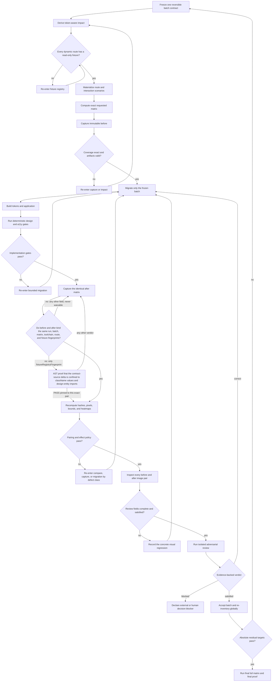

# Refactor UI with evidence

## Contract

A UI refactor is complete only when rendered evidence proves its declared
effect. Source diffs, successful builds, fresh manifest timestamps, and green
ratchets are necessary signals, but none proves the pixels or interaction state.

This skill implements the visual portion of the broader
`tokenize-design-system` state machine. For repository-wide tokenization, read
that skill's `reference/end-to-end-workflow.md` first; its artifact schemas,
batch effect policy, re-entry codes, and absolute completion predicates are
normative.

## Required evidence

Every accepted batch binds the following to one source fingerprint:

- batch contract and its `expectedVisualEffect` policy, whose only legal values
  are `preserve`, `change`, and `mixed` (`scripts/lib/visual-contract.mjs`
  `Linha 1085`);
- the six immutable bindings compared across the pair — `runId`, `batchId`,
  `matrixFingerprint`, `toolchainFingerprint`, `routeRegistryFingerprint`,
  `fixtureRegistryFingerprint` (`Linha 1251`);
- planned and actual mutation files;
- affected consumer files and route patterns;
- concrete fixture identities;
- route, scenario, theme, locale, writing mode, and Playwright project;
- browser, viewport, device scale factor, fonts, token sources, and generated
  CSS hashes;
- before and after PNG bytes, dimensions, and recomputed SHA-256 values;
- exact and perceptual differing-pixel metrics, bounds, and heatmap;
- console errors, page errors, failed requests, HTTP errors, overflow, and Axe
  results;
- one completed visual review per comparison pair; and
- an isolated adversarial verdict.

Requested and produced capture IDs must be identical non-empty sets. Missing,
extra, duplicate, stale, or invalid captures fail closed.

## Closed loop



## Execution sequence

### 1. Freeze the batch

Do not start from an open-ended diff. Record:

- one semantic target;
- exact planned files;
- rollback source fingerprint;
- expected changed and unchanged scenario IDs;
- absolute residual targets; and
- the intended visual effect.

Never combine alias-only tokenization with an undocumented visual cleanup.

### 2. Derive impact

Run the canonical route-impact adapter. Required contexts are the union of:

1. edited call sites;
2. reverse-import consumers;
3. every consumer of changed tokens or aliases;
4. routes and states rendering those consumers; and
5. global fan-out for token sources, generated CSS, Tailwind configuration,
   themes, fonts, application shells, and shared layouts.

A deleted or unresolved source file expands impact; it must never produce an
empty route set. Parameterized routes remain required until a concrete fixture
or approved out-of-scope decision exists.

### 3. Materialize scenarios

Each scenario declares a concrete route, fixture, auth role, projects, themes,
preconditions, actions, witness assertion, optional target clips, and whether
the actions are read-only.

Default route load is insufficient for components visible only under:

- hover or focus-visible;
- pressed, selected, disabled, or loading state;
- expanded menus, popovers, modals, drawers, and backdrops;
- empty, error, or extreme-content fixtures; or
- drag and keyboard interaction.

If the witness cannot be reproduced, the scenario is `NOT_PROVED`; do not
capture an unrelated page under the requested ID.

### 3.5 Authenticating without mutating the target

Protected routes cannot be captured without a session, and the runner is right to
**refuse** rather than follow the redirect — a runner that captures the login page
under the requested route ID produces evidence that is worse than none. Measured
on a real target: the first run failed **16 of 24** for exactly this reason.

Three ways to supply the session, in order of preference:

| | cost |
|---|---|
| **pre-issued session** — mint a JWT from the target's own dev secret | **no mutation, no password** |
| `UI_EVIDENCE_USER` / `PASS` | needs a real password in the environment |
| create/reset a user | **mutates the database to take a screenshot** |

The first is the one to use. Read the signing shape from the target's own
endpoint — do not guess the payload — then sign with the local dev secret and
write `{token, user}` to a file outside the repo:

```js
// payload shape must match what the target's login endpoint issues
const token = JWT.sign({ id: user.id, username: user.username }, SECRET, { expiresIn });
writeFileSync(sessionFile, JSON.stringify({ token, user }));
```

```bash
export UI_EVIDENCE_SESSION="$(cat <sessionFile>)"
```

Never print the secret or the token. Strip `password` and `recoveryCodes` from the
user record before writing it.

**Then verify with your eyes, not the exit code.** A green run proves the
scenario completed, not that it rendered the right screen. Open one PNG and
confirm the authenticated chrome is present — sidebar, user identity, the content
that only exists behind login.

### 4. Capture `before`

Use a new immutable label. The runner must stage output and promote it only
after Playwright and exact-coverage validation succeed. A previous label,
partial directory, or fresh timestamp cannot substitute for the current run.

The runner's canonical interface, run from the directory that holds
`scripts/ui-evidence.sh`, is:

```bash
npm run evidence -- <label> \
  --run-id tokenize-<id> \
  --batch-id B0001 \
  --phase before \
  --routes /a,/b \
  --scenario-ids <scenario-id>,<scenario-id> \
  --themes light,dark \
  --projects mobile-sm,mobile-md,tablet,desktop \
  --locales en-US \
  --writing-modes ltr
```

Every flag above is the spelling actually parsed by `scripts/ui-evidence.sh`
(`Linha 44`–`Linha 66`) and forwarded to `scripts/prepare-evidence-run.mjs`
(`Linha 153`–`Linha 167`). An unrecognized flag exits `2` (`Linha 56`), so a
misremembered `--batch` or `--contexts` fails the run instead of being silently
dropped. The `package.json` script is `evidence`, not `ui:evidence`
(`package.json` `Linha 9`).

- `<label>` is positional, immutable, and must match `[a-zA-Z0-9._-]+`
  (`Linha 69`). An existing label is never overwritten (`Linha 111`).
- `--run-id` defaults to `tokenize-ui-<label>` and must match
  `tokenize-[a-zA-Z0-9._-]+` (`Linha 73`–`Linha 77`).
- `--phase` is one of `global-before`, `before`, `after`, `final`; omitted, it is
  inferred from the label prefix (`Linha 78`–`Linha 90`). Phases `before` and
  `after` require a `--batch-id` matching `B[0-9]{4,}` and default it to `B0000`
  (`Linha 88`–`Linha 94`; enforced again at `prepare-evidence-run.mjs`
  `Linha 65`–`Linha 72`).
- `--project <name>` remains a compatibility spelling for a single `--projects`
  value (`Linha 53`).
- The comparator later requires the `before` side to carry phase `global-before`
  or `before` and the `after` side `after` or `final`
  (`scripts/lib/visual-contract.mjs` `Linha 1236`).

### 4.1 Render determinism is a precondition, not a detail

A `preserve` policy defaults to `preserveMaxExactChangedPixels: 0` and
`preserveMaxExactChangedPixelRatio: 0` (`scripts/lib/visual-contract.mjs`
`Linha 1134`–`Linha 1137`). Zero means zero: if the renderer has a noise floor of
its own, `preserve` is unsatisfiable **even by a no-op**, and accepting a batch
degrades into render luck.

Measured on this engine: three NULL runs — two captures, zero source change
between them — all reported a divergent pair. Between 1 and 5 pixels, always in
column `x=293`, always with the delta confined to the BLUE channel
(43 → 49 → 55), with the neighbour at `x=294` being `rgb(79,148,208)`: raster
antialiasing on the left edge of a blue element bleeding into the previous
column by an amount that varies between renders. The measurement is recorded in
version control at `playwright.visual.config.ts` `Linha 27`–`Linha 38`, next to
the flags it justifies, and in the run log at
`.claude/runs/tokenizer-cobertura/RUN.md` `Linha 279` — that directory is
gitignored, so the config comment is the durable citation.

The fix is at the source, never a threshold. `playwright.visual.config.ts`
`Linha 39`–`Linha 51` pins software raster and deterministic font and colour:

```
--no-sandbox  --disable-setuid-sandbox  --disable-dev-shm-usage
--disable-gpu  --disable-partial-raster  --disable-skia-runtime-opts
--disable-lcd-text  --disable-font-subpixel-positioning
--force-color-profile=srgb
```

After the flags: two null runs, **40/40 byte-identical**, verdict `pass`
(`RUN.md` `Linha 279`). The claim "this pipeline has a zero noise floor" is
therefore true **only with those flags present**. A target repository that copies
the engine without them inherits a non-zero floor and cannot honestly declare
`preserve`. Raising `preserveMaxExactChangedPixels` to absorb the floor is the
forbidden shortcut: it converts a render defect into a permanent budget and hides
every real single-pixel regression behind it.

### 5. Mutate and run deterministic gates

Migrate exactly one batch, then run the batch's declared formatter, typecheck,
application build, token build/check, emitted-class assertion, hardcode,
naming, cohesion, variety, dead-class, bundle, contrast, semantic HTML,
keyboard, Axe, request, overflow, and route-coverage checks.

Unknown Tailwind classes can emit zero CSS without failing the build. Verify
the emitted artifact, not just the source token definition.

### 6. Capture and compare `after`

Use the exact same capture IDs, fixtures, and toolchain. The comparator must
read actual files and recompute:

- dimensions and SHA-256;
- exact RGBA changed pixels;
- perceptual changed pixels;
- changed ratio and bounding box;
- maximum channel delta; and
- an inspectable diff image.

The comparator is `scripts/compare-evidence.mjs`, and its arguments are
`--before`, `--after`, `--policy`, `--out`, `--review-input`, and optionally
`--review-output` (`Linha 24`–`Linha 29`). It exits `3` while the verdict is
`review` and `1` on failure (`Linha 86`–`Linha 87`), so exit `0` alone never means
"approved".

Policy, keyed on `expectedVisualEffect` in the policy JSON
(`scripts/lib/visual-contract.mjs` `Linha 1085`):

- `preserve`: exact pixel identity — the default thresholds are literally `0`
  (`Linha 1134`–`Linha 1137`) — and declaring changed scenarios under it throws
  (`Linha 1103`–`Linha 1109`);
- `change`: every declared target changes and guard regions remain stable;
- `mixed`: changed and preserved scenario sets are both explicit and non-empty
  (`Linha 1116`), and together they must partition the exact scenario matrix
  (`Linha 1122`–`Linha 1132`).

An identical image is success for a preserve batch and a defect for a scenario
that was required to change. Independently of pixels, a new console, page,
network, Axe, or overflow signal fails the pair outright (`Linha 1164`–`Linha 1169`).

### 6.1 Immutable bindings, and the only one that can be waived

Before any pixel is compared, six fields must be identical in both manifests
(`scripts/lib/visual-contract.mjs` `Linha 1251`–`Linha 1258`): `runId`,
`batchId`, `matrixFingerprint`, `toolchainFingerprint`,
`routeRegistryFingerprint`, `fixtureRegistryFingerprint`.

**Only `fixtureRegistryFingerprint` is waivable** (`WAIVABLE_BINDINGS`,
`Linha 975`). A waiver aimed at any other field throws
`Binding field <x> can never be waived` (`Linha 1016`–`Linha 1021`). The stated
reason (`Linha 962`–`Linha 974`): divergence in the other five means the two
captures came from different runs, matrices, or toolchains, and no source-level
proof repairs that.

Why the one exception exists: the manifest's `fixtureRegistryFingerprint` folds
in `contractSourceFingerprint`, the sha256 of the files each network fixture
declares under `contractSources` (`scripts/lib/evidence-matrix.mjs`
`Linha 91`–`Linha 113` and `Linha 424`–`Linha 429`). A codemod that only rewrites
`className` on a page that happens to be a `contractSource` moves that hash
without changing a single request — and the pixel proof of the batch becomes
impossible, which is precisely the case this pipeline exists for. Normalizing
`className` out of the hash would fix one batch and disable the guard forever,
for every future batch (`scripts/verify-contract-source-delta.mjs`
`Linha 6`–`Linha 26`).

The waiver is mechanical, pinned to the observed pair, and fail-closed. Each
entry of `policy.approvedBindingExceptions[]` is matched on `field` + `before` +
`after` (`Linha 1006`–`Linha 1011`), must carry non-empty `owner`, `reason`,
`scope`, `evidence`, and `review` (`Linha 1022`–`Linha 1029`), and its `evidence`
must point at a readable JSON verdict whose `tool` is
`verify-contract-source-delta`, whose `verdict` is `PASS`, and whose `field`,
`fieldBefore`, and `fieldAfter` equal the observed mismatch exactly
(`Linha 1046`–`Linha 1067`). Every other path throws.

Produce that verdict with:

```bash
node scripts/verify-contract-source-delta.mjs \
  --base <pre-batch-ref> \
  --field-before <sha256-from-the-before-manifest> \
  --field-after  <sha256-from-the-after-manifest> \
  --out <verdict.json> \
  [--entities design-entities] [--field fixtureRegistryFingerprint]
```

`--field-before` and `--field-after` are mandatory, so an approved waiver can
never become a standing pass for future drift (`Linha 228`–`Linha 232`). The
proof is AST-based and admits exactly two categories of delta: the VALUE of a
JSX `className` attribute, and an `import` of the design-entity module
(`Linha 132`–`Linha 164`; recorded in the verdict as `permittedCategories`,
`Linha 287`). Those regions are removed from **both** sides and what remains must
be byte-identical — there is no similarity heuristic and no threshold
(`Linha 173`–`Linha 199`, `Linha 267`). A parser failure (`Linha 108`), a file
missing from the worktree or from the base ref (`Linha 246`–`Linha 252`), or a
base ref that does not resolve (`Linha 233`–`Linha 237`) all FAIL.

Feed the two sha256 values from the **manifests**, not from
`contexts.json`/`scenarios.json` — those carry a different
`fixtureRegistryFingerprint`. See `pitfalls.md` no. 14.

### 7. Inspect pixels and review adversarially

The LLM reads both images and the heatmap for every pair. Computed metrics
prioritize attention but do not eliminate pairs from review. Review entries
must describe expected effect, observed effect, verdict, and evidence.

Then an isolated reviewer compares the original request, batch contract,
actual diff, deterministic gates, manifests, comparison, visual reviews, and
residual inventory. Only findings classified as real and backed by a path,
artifact, command, test, or rendered image cause correction.

Continue the same reviewer thread after a correction. A source mutation
invalidates all final evidence generated before it.

## Re-entry map

| Failure | Re-enter |
|---|---|
| missing route, fixture, auth, or witness | fixture/scenario materialization |
| actual mutation outside covered impact | restore pre-batch source, then impact |
| absent emitted class or failed build/gate | bounded migration |
| missing/extra/stale/corrupt capture | capture/manifest |
| mismatched pair or corrupt pixel metrics | comparator |
| preserve changed or intended change stayed identical | bounded migration |
| defensible competing visual standards | human decision board |
| incomplete image review | visual review |

## Hard rules

1. Derive contexts from code and token consumers, never guess routes.
2. Capture every required interactive state.
3. Inspect rendered pixels; never infer the visual verdict from a code diff.
4. Recompute hashes from actual files.
5. Preserve immutable `before` evidence.
6. Keep migrations sequential and reversible.
7. Treat uncovered context as failure, not a skip.
8. Run adversarial review in an isolated subagent.
9. Re-run final evidence after the last source mutation.
10. Never report completion without the repository's proof-of-completion gate.

## Related canonical assets

> **Dependency surface:** this skill is **not** self-contained — its engine is 22
> files / 7.601 lines living in the repo, wired to Playwright test discovery, a
> `package.json` script, a Stop hook, or project data. Every file, its role, and
> why it stays in the repo:
> [`visual-evidence-engine.md`](visual-evidence-engine.md). The protocol in this
> document travels to another repo; the 22 files do not.

Paths below are relative to the directory that holds `scripts/` and
`tests/visual/` — the repository root here, `frontend/` in the target the engine
was measured against.

- `scripts/affected-routes.mjs` — code/token impact to route contexts.
- `scripts/gen-visual-routes.mjs` — read-only fixture materialization; writes
  `contexts.json`, `scenarios.json`, `routes.json`, `routes.skipped.json`.
- `scripts/ui-evidence.sh` — staged Playwright runner (`npm run evidence`).
- `scripts/prepare-evidence-run.mjs` — matrix selection and binding computation.
- `tests/visual/evidence.spec.ts` — rendered capture engine.
- `scripts/evidence-manifest.mjs` — exact manifest construction.
- `scripts/compare-evidence.mjs` — pixel and policy comparison.
- `scripts/verify-contract-source-delta.mjs` — AST proof backing a binding waiver.
- `scripts/evidence-report.mjs` — before/after markdown report.
- `tools/hooks/ui-evidence-gate.sh` — stop-time freshness and coverage gate.
- `tokenize-design-system` — full tokenization state machine and artifact law.
