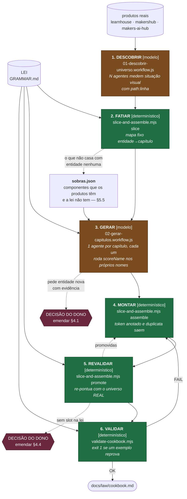

# O algoritmo do cookbook

> **A pergunta que criou este diretório** (dono, 2026-08-01): *"qual foi o
> algoritmo que você rodou para montar o cookbook? está mapeado em um agente no
> repositório, exatamente a heurística do graph loop que você usou com as funções
> determinísticas?"*
>
> **Resposta honesta na hora: NÃO estava.** Os dois fan-outs de agente existiam
> como script de workflow no diretório da sessão; a cola entre eles — fatiar,
> montar, revalidar, promover — era heredoc Python inline, no scratchpad, já
> perdido. O resultado era versionado; o método, não. Mesmo defeito de *"qual é
> o path disso aqui?"*, um nível acima. Este diretório é a correção.

## O loop, e por que ele alterna modelo e determinístico

**A regra estrutural:** nenhum passo de MODELO escreve no cookbook sem um passo
DETERMINÍSTICO depois. O agente propõe; a função dispõe. O passo 6 é o portão —
`exit 1` se um único exemplo reprova.

## Os quatro achados que o loop produziu, e que justificam cada passo

**Passo 2 existe porque 8 agentes travaram.** Apontados para um JSON de 350 KB
com ordem de serem exaustivos, queimaram contexto e não devolveram nada — 29
minutos sem progresso, transcripts de 450 KB cada. Fatiado em 13-48 KB por
capítulo, a mesma rodada fechou. **O fatiamento não é otimização; é a diferença
entre o loop terminar e não terminar.**

**Passo 5 existe porque 69 linhas boas estavam no lixo.** Cada agente do passo 3
só enxergava os próprios nomes, então o critério `state-with-base` reprovava um
`.hover` cujo par base fora escrito por outro agente. Re-pontuadas contra o
cookbook inteiro: de 85 exceções, **69 pontuavam 100**. Sem o passo 5, um quinto
do cookbook seria descartado por um artefato de particionamento.

**O balde `sobras` é o produto mais valioso do passo 2.** 91 das 598 situações
não casaram com nenhuma das 42 entidades — a lista concreta de componentes que
os produtos têm e a lei não tem, que a §5.5 exige com evidência.

**O passo 6 pegou o cookbook ensinando errado.** Ele listava
`menu.row.background-color.hover` e `.focus` sem o par base: tabela com estado e
sem repouso é tabela incompleta, e o leitor não tem para onde ir no `default`.

## Por que isto NÃO é uma fase do `tokenize.mjs`

O pipeline de 17 fases governa a **migração de um alvo** — inventariar,
classificar, aplicar codemod, provar pixel. Ele muta código. O cookbook é outra
coisa: um **documento derivado** da lei mais a medição, que não muta nada.
Misturá-los faria a geração de doc herdar o contrato de evidência visual, que
não se aplica. Ficam separados de propósito, e esta é a decisão registrada.

## Arquivos

| arquivo | passo | tipo |
|---|---|---|
| `01-descobrir-universo.workflow.js` | 1 | modelo (fan-out) |
| `slice-and-assemble.mjs` | 2, 4, 5 | determinístico |
| `02-gerar-capitulos.workflow.js` | 3 | modelo (fan-out) |
| [`../validate-cookbook.mjs`](../validate-cookbook.mjs) | 6 | determinístico · roda no teste e no pre-commit |
| [`../test/cookbook.test.mjs`](../test/cookbook.test.mjs) | — | a bateria que prova que o passo 6 reprova de verdade |
