# ui-tokenizer

Processo executável para tokenizar o design system de um frontend artesanal —
daqueles em que a cor e o espaçamento foram escritos à mão, cada tela do seu
jeito, e ninguém sabe qual valor é intencional.

Não é um gerador de tokens. É a **máquina de decidir**: que token deve existir,
que nome ele carrega, onde ele se aplica, e a prova de que a migração não mexeu
num pixel que não devia.

Extraído de duas execuções reais (`learnhouse` e `makers-ai-hub`). O que está
aqui rodou contra código de produção; os números deste README são medidos, não
estimados.

---

> **Estado atual da empreitada:** [`docs/ESTADO.md`](docs/ESTADO.md) — objetivo,
> o que está validado com evidência, o que falta, retratações e risco declarado.
> Plano vigente: [`docs/plans/2026-07-30-v2-upstream-como-oraculo-rev2.md`](docs/plans/2026-07-30-v2-upstream-como-oraculo-rev2.md).

## Um comando

```bash
node .claude/skills/tokenize-design-system/scripts/tokenize.mjs --root <app>
```

Esse é o **único** entrypoint. Ele roda o loop inteiro e imprime o que cada fase
decidiu:

```
PREFLIGHT   compilador e lib de cor resolvem, ou o loop para
EXTRACT     censo das ocorrências que violam a lei
CLUSTER     agrupa por CONTEXTO semântico e deriva o nome
CONVERGE    itera até duas rodadas consecutivas não mudarem nada
REPORT      3 capítulos: decidido sozinho / exposto / precisa do dono
DECIDE      só o que passou do corte de incerteza          [HUMANO]
APPLY       declarado, NÃO implementado
```

Flags: `--until <FASE>` para cedo, `--max-uncertainty <n>` move o corte humano,
`--json` para saída legível por máquina.

Medido no `makers-ai-hub` em **2026-07-31**, uma corrida completa: **480
ocorrências → 293 clusters → 40 contratos** em 4 iterações, **192 fusões**
automáticas (179 por confiança, 13 por outlier), e **9 ocorrências em 8 pares**
sobrando para decisão humana. O alvo está sendo migrado enquanto medimos, então
todo número desta página vem com a data e o comando; a deriva contra a medição
anterior está tabelada em [`docs/log.md`](docs/log.md).

**O loop falha fechado em toda fase.** Faltando compilador, lib de cor ou
arquivo de token, ele para em vez de seguir com um sinal desligado — uma corrida
já reportou *"0 fusões, 400 na fila"* só porque a lib de cor não resolveu, e
aquele número parecia resultado.

**`tokenize.mjs` não muta o alvo.** Ele entrega proposta e prova.

## O problema que ele resolve

Design artesanal falha de quatro maneiras que ferramenta comum não pega:

1. **A mesma coisa escrita de formas diferentes.** `gap-2 px-2 mb-3` e
   `px-2 gap-2 mb-3` são idênticos e comparação por string não acusa. Pior:
   `p-2 px-1` é equivalente a `py-2 px-1` por sobreposição de cascata.
2. **Nome de token que não diz nada.** `surface-canvas`, `semantic-color-deep`.
   Medido no `makers-ai-hub` em 2026-07-31: de **97 nomes**, **41 reprovaram** um
   oráculo determinístico (média 68,9, corte 70), e **3.902 usos** têm nome que
   não declara dono nem propriedade — `score-naming.mjs --root .`.
3. **Classe que não existe.** Classe desconhecida no Tailwind emite **zero CSS,
   sem erro nenhum**. O build passa verde e a tela fica sem estilo.
4. **Report sem pixel.** Ler o diff e declarar "limpo" — com 42 pontos fora da
   tela. Aconteceu três vezes antes de virar gate.

---

## O processo inteiro

```mermaid
flowchart TD
    START([preciso mudar cor/token/UI]) --> Q{"o NOME do token<br/>já está decidido?"}

    subgraph A["ETAPA A — decidir o nome (CLUSTER + CONVERGE)"]
        Q -->|não| A0{"PREFLIGHT: arquivo DTCG, lib de cor<br/>e compilador do alvo vivos?"}
        A0 -->|não| STOP(["PARA — falha fechada:<br/>sinal desligado nunca continua"])
        A0 -->|sim| A1["censo: o que existe e por<br/>quantas vias é consumido"]
        A1 --> A1B{"varreu ≥80% dos<br/>arquivos elegíveis?"}
        A1B -->|não| STOP
        A1B -->|sim| A2["nota do NOME e da APLICAÇÃO<br/>corte 70/100"]
        A2 --> A3{"nota ≥ 70?"}
        A3 -->|não| A4["fila de revisão"]
        A4 --> A5["achar o owner pelo<br/>CONTEXTO RENDERIZADO"]
        A5 --> A6{"owner achado?"}
        A6 -->|não| A6B{"a lei tem slot §4.3 para<br/>esta propriedade?"}
        A6B -->|não| A6C["LAW GAP: emendar a lei —<br/>sem slot não existe nome"]
        A6C --> A5
        A6B -->|sim| A7["clusterizar por (token, tag)"]
        A7 --> A8["decisão HUMANA:<br/>owner novo ou cluster"]
        A8 --> A9
        A6 -->|sim| A9["derivar o token específico<br/>HERDANDO o valor atual"]
        A3 -->|sim| A9
        A9 --> A9B{"convergiu? duas rodadas<br/>seguidas sem fusão"}
        A9B -->|ainda funde| A9
        A9B -->|não converge| STOP
        A9B -->|sim| A10["escrever no JSON, tier component<br/><b>NAO IMPLEMENTADO</b>"]
        A10 --> A11["rodar TODOS os emissores"]
        A11 --> A12{"classe existe no<br/>CSS BUILDADO?"}
        A12 -->|não| A13["classe desconhecida emite<br/>ZERO CSS sem erro"]
        A13 --> A10
        A12 -->|sim| A14["prova: TODAS as vars nos 2 temas"]
        A14 --> A15{"algum valor mudou?"}
        A15 -->|sim, sem intenção| A10
    end

    Q -->|sim| H
    A15 -->|não| H([HANDOFF: token pronto,<br/>agora aplicar no código])

    subgraph B["ETAPA B — provar o pixel · MOTOR NO REPO, FORA DO tokenize.mjs"]
        H --> B1["que TELAS o diff afeta<br/>BFS de import reverso"]
        B1 --> B2{"sobrou rota :param<br/>sem fixture?"}
        B2 -->|sim| B3["materializar com dado REAL"]
        B3 --> B2
        B2 -->|não| B4["capturar o ANTES imutável"]
        B4 --> B5["migrar, SEQUENCIAL,<br/>um padrão por vez"]
        B5 --> B6["capturar o DEPOIS<br/>+ estados: modal, popover,<br/>hover real, foco, drawer"]
        B6 --> B6B{"o par amarra a MESMA matriz,<br/>toolchain, rota e fixture?"}
        B6B -->|só o fingerprint de fixture| B6C["prova por AST: o delta é só valor de<br/>className + import de entidade"]
        B6C -->|PASS fixado a ESTE par| B7
        B6C -->|qualquer outro veredito| B6
        B6B -->|qualquer outro campo| B6
        B6B -->|sim| B7["parear e comparar pixel"]
        B7 --> B8{"erro de console novo,<br/>par que sumiu, ou<br/>IDÊNTICO onde devia mudar?"}
        B8 -->|sim| B5
        B8 -->|não| B9["a LLM OLHA cada PNG<br/>antes E depois"]
        B9 --> B10{"a imagem mostra<br/>a mudança pretendida?"}
        B10 -->|não| B5
    end

    B10 -->|sim| ADV["review adversarial<br/>SUBAGENT isolado, nunca inline"]
    ADV --> V{"veredito"}
    V -->|CORRIGIR| B5
    V -->|BLOQUEADO| BLOCK([bloqueio declarado])
    V -->|SATISFEITO| REP["relatório com assets versionados"]
    REP --> GATE["prova de conclusão<br/>evidência bruta por item"]
    GATE --> DONE([pronto])

    style A10 fill:#f3f4f6,stroke:#6b7280,stroke-dasharray:5 3,color:#374151
    style A14 fill:#f3f4f6,stroke:#6b7280,stroke-dasharray:5 3,color:#374151
    style A13 fill:#c22929,color:#fff
    style A8 fill:#b05108,color:#fff
    style A6C fill:#b05108,color:#fff
    style STOP fill:#fee2e2,stroke:#b91c1c,color:#111827
    style ADV fill:#fee2e2,stroke:#b91c1c,color:#111827
    style DONE fill:#dcfce7,stroke:#15803d,color:#111827
    style BLOCK fill:#fee2e2,stroke:#b91c1c,color:#111827
```



> **Tracejado cinza = não implementado.** O que `tokenize.mjs` roda hoje vai do
> censo até *derivar o token herdando o valor*. Tudo a partir de **escrever no
> JSON** — emissores, prova de que a classe existe no CSS buildado, prova das
> vars nos 2 temas — é a fase `APPLY`, **declarada e não construída**. A ETAPA B
> inteira é protocolo escrito (`reference/visual-evidence.md`), não código que
> este comando execute. O diagrama é o processo pretendido; a metade sólida é o
> que existe.

**Os 5 loops de volta são o produto.** Eles são o que impede um report falso:
classe sem CSS, valor que mudou sem intenção, regressão detectada por máquina,
imagem mostrando o que não devia, e review adversarial reprovando.

---

## Uma skill, um loop

`tokenize-design-system` é a **única** skill. Ela contém as duas etapas do
diagrama, porque são o mesmo loop: a etapa A decide o nome, a etapa B prova o
pixel, e a etapa B realimenta a A quando a imagem mostra o que não devia.

| parte | responde | portátil? |
|---|---|---|
| `scripts/tokenize.mjs` + `reference/` | *que nome o token deve ter?* | **sim** — roda contra qualquer repo com `--root` |
| `reference/visual-evidence.md` | *o que mudou de fato na tela?* | o **protocolo** viaja; o motor não |

A assimetria não é descuido. Decidir nome é problema de texto, portátil. Provar
pixel exige o app no ar com sessão autenticada, e app rodando não cabe dentro de
uma skill — por isso o inventário das dependências que ficam no repo-alvo está
em [`visual-evidence-engine.md`](.claude/skills/tokenize-design-system/reference/visual-evidence-engine.md).

Antes existiam duas skills irmãs. Era erro de recorte: quem chegava não sabia
por onde começar, e o loop de volta B→A atravessava uma fronteira que não devia
existir.

---

## A lei de naming

```
owner . anatomia . propriedade [ . variante ] [ . estado ]
```

`tier`, `domain` e `layer` são **metadados centralizados** — nunca aparecem no
identificador público. Consequência direta: **três palavras estão banidas** do
nome público — `surface`, `semantic` e `content`. Não existe token `semantic-*`,
`surface` não é grupo válido, e `content-*` caiu em 2026-07-31 (§3.1 da lei).
A lista é executável, não prosa: `FORBIDDEN` em `tools/gates/ds-naming-law.py`
**Linha 121**.

A propriedade de texto se chama **`foreground-color`**, não `color`: `card.color`
não diz se é o texto ou o preenchimento do card. Material 3 desambigua pela
anatomia, Primer cunhando a propriedade, shadcn/ui anexando o papel — a §4.3
toma a mesma decisão, escrita por extenso. Abreviar para `fg` foi medido e
rejeitado.

**O princípio, mecânico:** uma palavra tem valor semântico **se, e somente se,
removê-la perde informação.** Três testes, nenhum opinativo — colisão,
dedutibilidade, e a pergunta do slot.

| slot | pergunta |
|---|---|
| owner | de **QUEM**? |
| anatomia | **QUE PARTE**? |
| propriedade | **O QUE** pinta? |
| variante | **QUAL VERSÃO**? |
| estado | **QUANDO**? |

`surface` responde *"onde na pilha"* — pergunta que **nenhum slot faz**. Por isso
está proibido. `content` é pior: mistura dois eixos — papel de texto e intenção
semântica — sem dizer qual, de modo que `content-secondary` e `content-danger`
parecem irmãos e não são. `container` responde "que parte" com "a parte que é o
todo" = ausência de parte, que o slot vazio já expressa. Re-medido em 2026-07-31
no `color.tokens.json` do alvo: **429 nomes públicos distintos**, **23** com a
anatomia `container`, e removendo `container` de todos os 23 **0 colidem**. (A
contagem que este README trazia, 33, era de antes da migração; o **0 colidem** é
o que importa e reproduz.)

Lei completa em [`docs/law/GRAMMAR.md`](docs/law/GRAMMAR.md), e a cópia que os
scripts realmente leem em
[`.claude/skills/tokenize-design-system/reference/law.md`](.claude/skills/tokenize-design-system/reference/law.md).

---

## Instalar num repo alvo

```bash
# 1. as skills
cp -r .claude/skills/tokenize-design-system   <alvo>/.claude/skills/
# Codex: espelhar em .agents/skills/ por symlink

# 2. os oráculos rodam de qualquer lugar
node <alvo>/.claude/skills/tokenize-design-system/scripts/score-naming.mjs --root <alvo>/frontend
# ou: export TOKENIZE_ROOT=<alvo>/frontend

# 3. os gates e o motor visual precisam de fiação no alvo
cp tools/gates/*   <alvo>/…      # ratchets; baseline só encolhe
cp -r scripts tests <alvo>/…      # precisa de @playwright/test e app no ar
cp tools/hooks/ui-evidence-gate.sh <alvo>/…   # registrar como Stop hook
```

`tests/visual/routes.json.example` mostra o formato esperado de rotas.

---

## O que tem aqui

| pasta | conteúdo |
|---|---|
| `.claude/skills/tokenize-design-system/` | a skill auto-contida: `SKILL.md`, **12** arquivos de `reference/` (+ `artifact-schemas.json`), **29** scripts em `scripts/` + **17** módulos em `scripts/lib/` + **16** arquivos de teste em `scripts/test/` |
| `tools/gates/`, `tools/hooks/` | guards determinísticos + Stop hooks (`ds-*`, `docs_wiki_lint`, `ref_integrity`, `clarification-gate`, `ui-evidence-gate`) |
| `tools/gates/` | ratchets: lei de naming (3 camadas), coesão (5 eixos), anti-hardcode, variedade, classes mortas, avaliador de contraste ΔE, lint de wiki |
| `scripts/` e `scripts/lib/` | impacto de rota por import reverso, manifest de evidência, comparação de pixel, relatório antes/depois, contrato visual v2 + teste |
| `tests/visual/` | motor de captura, config de projetos, mapa de temas |
| `tools/mining/` | miner AST de `className` (n-grams por economia, com contexto estrutural) |
| `tools/hooks/` | Stop hook que bloqueia fim de turno com UI alterada sem evidência |
| `docs/law/` | a gramática de naming |
| `docs/case-study/` | as **medições reais** do `makers-ai-hub`: veredito de naming, fila de revisão, inventário, clusters, **68 PNGs** de evidência (`git ls-files 'docs/case-study/**/*.png' \| wc -l`) |
| `docs/SCHEMA.md` | constituição da wiki: naming de doc, status, indexação temporal |

---

## Os oráculos, em ordem de uso

```bash
cd <raiz-do-app>
yarn classname:mine                    # 0. o que se repete merece abstração?
node …/scripts/inventory-surface.mjs   # 1. o que existe, consumo nas 3 vias
node …/scripts/score-naming.mjs        # 2. quanto disso presta (corte 70)
node …/scripts/find-owner.mjs          # 3. de quem é o que não tem owner
node …/scripts/cluster-leftovers.mjs   # 4. o que sobrou, por (token, tag)
node …/scripts/derive-tokens.mjs --dtcg # 5. o token específico, herdando o valor
node …/scripts/validate-token-build.mjs # 6. o pixel não mudou
```

Contrato de cada um em
[`reference/script-contracts.md`](.claude/skills/tokenize-design-system/reference/script-contracts.md).
Workflow completo, 22 seções e grafo de 49 nós (30 `[D]`, 3 `[H]`), em
[`reference/end-to-end-workflow.md`](.claude/skills/tokenize-design-system/reference/end-to-end-workflow.md).

---

## As armadilhas que custaram mais caro

Cada uma aconteceu de verdade. Detalhe em
[`reference/pitfalls.md`](.claude/skills/tokenize-design-system/reference/pitfalls.md).

1. **Medir consumo por uma via só** — reincidiu 4 vezes. Token vivo se consome
   por **três**: classe Tailwind, `var()` em CSS *e em JS*, e alias no JSON.
   Contar duas quase apagou 3 tokens vivos.
2. **`$root` tratado como metadado** — é **token** no DTCG 2025.10. Filtrar
   `startsWith("$")` pula 15 deles, e o total sai 70 em vez de 85.
3. **Casar por substring** — `"EmbeddingSelection".includes("select")` é `true`.
   262 de 418 usos foram atribuídos ao owner errado por isso.
4. **Casar token por VALOR de pixel** — 531 ocorrências marcadas, **2** reais.
   99,6% de ruído, porque dois tokens compartilham o mesmo hex num tema.
5. **`grep` no fonte em vez do CSS buildado** — classe desconhecida emite zero
   CSS sem erro.
6. **Comparar conjuntos vazios** — `--compare` com exit 0 e nada provado.
   Guardas obrigatórias: snapshot vazio → exit 1; contagem divergente → exit 1.
7. **Gate verde ≠ canonizado** — o anti-hardcode mede **hex cravado**; não vê
   `bg-theme-*` apontando para valor divergente.

---

## Estado honesto

O que está **provado** com comando rodado — tudo re-medido em **2026-07-31**:

- oráculo de naming: **97 nomes**, média **68,9**, corte 70, **41 em revisão**
  (`score-naming.mjs --root .`)
- normalização de ordem: 3 fingerprints paralelos (ordem, multiset, set)
- equivalência por sobreposição: `p-2 px-1` ≡ `py-2 px-1`, provado contra o
  compilador Tailwind real
- a suíte: `npm test` = **125 testes, 118 pass, 4 fail, 3 skip**; com
  `TOKENIZE_TEST_ROOT=<alvo>` = **125, 122 pass, 2 fail, 1 skip**. As 2 falhas
  restantes falham **fechadas**, com *"No source root found under …"* — exigem um
  alvo com `sourceRoots` e recusam aprovar sem ele
- ponte fase→executor: **15 fases executáveis** (10 determinísticas, 2 model,
  3 human) + 2 estados não-executáveis (`PENDING`, `BLOCKED`), 0 problemas na
  auditoria contra o contrato
- guard da lei: `TOKENIZE_APP_ROOT=<alvo> python3 tools/gates/ds-naming-law.py`
  → *"LEI DE NAMING OK"*, exit 0, com validação **positiva** de gramática
  (`violations_grammar`, Linha 235) e checagem prefixo × propriedade
  (`violations_prefix_property`, Linha 312)

> **Retratação.** Este bloco dizia *"média 58,4, 78 em revisão"* e
> *"45/45 testes fail-closed"*. O primeiro é deriva de alvo; o segundo **não
> reproduz em nenhuma configuração** e foi substituído pela contagem real.

O que está **aberto**:

- a migração completa do app de referência (o ratchet de classe consumida está em
  **3.381**, não nos 503 que este README trazia — a lei cresceu, `content` entrou
  na lista de banidas e o ratchet passou a enxergar `content-*`; control plane
  pronto ≠ design tokenizado)
- normalização de fonte além de padding/margin: `inset`, `gap`, `border-width`,
  `rounded`, `space`, `divide`, `scroll-*` — medido, **25 pares simétricos** e
  **72 sobreposições** restantes
- enriquecimento semântico HTML5 está especificado e **não** implementado
- relatório de divergência contextual em múltiplas resoluções: especificado,
  não gerado

Aviso de honestidade: as duas últimas medições de espaçamento saíram de um
detector regex com falsos positivos conhecidos (valores de ramos diferentes de
ternário, e `border-t-<cor>` confundido com largura). O número é direcional; a
medição correta é com `extract-design-occurrences.mjs`.

---

## Referências

### Padrões de Design Tokens

- **[W3C Design Tokens Community Group (DTCG)](https://designtokens.org/)** — especificação oficial de **formato** de tokens, vendor-neutral. Este projeto adota o DTCG como autoridade de formato (`$type`, `$value`, referências `{...}`, estrutura de arquivo).
  > **Ressalva medida (2026-07-31):** o DTCG **não** decide convenção de nome. A spec diz, verbatim: *"Groups are arbitrary and tools SHOULD NOT use them to infer the type or purpose of design tokens."* As únicas regras de nome são técnicas — não começar com `$`, não usar `{`, `}` ou `.`. A ordem `owner.anatomia.propriedade` deste projeto vem de Material Design 3, GitHub Primer e shadcn/ui, que a declaram e praticam. Evidência com citação literal em [`docs/law/2026-07-31-ordem-do-nome-evidencias.md`](docs/law/2026-07-31-ordem-do-nome-evidencias.md).
- **[Design Tokens Format Module](https://tr.designtokens.org/format/)** — W3C spec de formato (`designtokens.org`); integrado em `docs/law/GRAMMAR.md`.

### Implementação de Nomes e Semântica

- **Descriptive compound identifier names improve code comprehension** — ICPC 2018. Palavras completas (como `foreground` vs `fg`) aumentam velocidade de compreensão por ~19% e reduzem tempo de detecção de defeito em ~14%.
- **When Names Disappear: What LLMs Actually Understand About Code** — Pesquisa sobre compreensão de LLMs em código. Remover o canal de nomes semânticos degrada severamente tarefas de intenção; modelos são dominados por atribuição via identificador.
- **Variable Naming Impact on AI Code Completion** — Nomeação afeta medivelmente qualidade de sugestões de IA e completude.

### Referência de Stack (shadcn/ui)

- **[shadcn/ui](https://ui.shadcn.com/)** — componentes Radix + Tailwind. Padrão de nomes semânticos canônico para este projeto: `--foreground`, `--muted-foreground`, `--primary-foreground` etc. Utility `text-foreground` para aplicação.
- **[shadcn/ui Theming](https://ui.shadcn.com/docs/theming)** — convenção de theming com `@theme` inline, split por modo claro/escuro. O path `apps/web/styles/globals.css`, citado aqui antes, é do **outro** repo de onde o processo foi extraído (`learnhouse`); não existe aqui.

### Auditorias e Evidência Visual

Este projeto exige evidência visual (PNG renderizado) para validar mudanças de token. Referências para captura e comparação:

- **[Playwright Test](https://playwright.dev/)** — motor de captura de screenshots. Neste repo ele vive em [`tests/visual/`](tests/visual/) (specs, registry, mapa de temas) com a config em [`playwright.visual.config.ts`](playwright.visual.config.ts). Os paths `tools/visual/` e `tools/playwright/`, citados aqui antes, **nunca existiram** neste repositório.
- **[ui-evidence skill](https://github.com/gutocarollo/learnhouse/tree/main/.claude/skills/ui-evidence)** — implementação produção de captura antes/depois com temas múltiplos (light, dark, dracula, alucard) e análise de erros de console.

### Governança de Repositório

- **[docs/law/GRAMMAR.md](docs/law/GRAMMAR.md)** — a lei de naming: `owner . anatomia . propriedade [ . variante ] [ . estado ]`. Teste mecânico de semântica por remoção de palavra (colisão, dedutibilidade, pergunta do slot).
- **[docs/SCHEMA.md](docs/SCHEMA.md)** — constituição da wiki: padrão de naming de doc (kebab-case + classe temporal: living/event/sequenced), status, indexação, política "git é o arquivo".
