# Relatório — os 10 valores de superfície, componente a componente

> Classe `event` (`docs/SCHEMA.md` §2). Origem: pedido do dono em 2026-07-28 —
> *"quais são os 10? faça um relatório completo com os prints de toda as
> ocorrências de todos os componentes e páginas usando playwright. para cada
> componente que se encaixa nesses 10 me escreva a história dele, do container,
> da página onde ele está e qual a função dele."*

## Índice

| seção | o quê |
|---|---|
| [1. Nível de confiança](#1-nível-de-confiança-deste-relatório--leia-antes) | o que foi refutado — leia antes |
| [2. Os 10 valores](#2-os-10-valores-vivos-4-tints) | a tabela + a colisão de valores |
| **[3. Prints + RETRATAÇÃO](#3-prints--e-a-correção-do-que-eles-provam)** | **2 de 531 ocorrências têm consumo provado — leia antes de olhar as imagens** |
| [4. Método](#4-método) | como foi medido |
| [5. As histórias](#5-as-histórias-por-grupo-de-token) | 90 componentes: container, página, função, papel real |
| [6. Achados](#6-achados--onde-o-mesmo-token-cumpre-papéis-incompatíveis) | 87 casos de token servindo papéis incompatíveis |
| [7. O que significa para nomear](#7-o-que-isto-significa-para-nomear-os-papéis) | o insumo da decisão |
| [8. Reprodutibilidade](#8-reprodutibilidade) | os comandos |

## 1. Nível de confiança deste relatório — leia antes

As histórias foram escritas por 7 agentes lendo o código, e **cada uma foi
refutada por um segundo agente** que reabriu os arquivos. Resultado da refutação:

| | |
|---|---:|
| afirmações **confirmadas** | 356 |
| afirmações **refutadas** | 68 |
| consumos **omitidos** | 43 |
| grupos com veredito `CORRIGIR` | 7 de 7 |

**Os 7 grupos voltaram `CORRIGIR`.** Erros típicos que a refutação pegou:
números inventados (389 usos onde o grep dá 470), rotas que não existem
(`/settings/embed-chats` — a real é `/settings/embed-chat-widgets`), commit
atribuído errado, e razão de contraste calculada com branco puro em vez do par
declarado (15,39:1 onde é 14,37:1).

Por isso cada seção abaixo traz a lista do que foi refutado nela. **Trate a
história como hipótese ancorada, não como fato provado** — o que está provado
são os valores, as contagens da ferramenta versionada e as ocorrências
renderizadas.

## 2. Os 10 valores vivos (+4 tints)

Fonte: `cd frontend && node tokens/inventory-surface.mjs`

| # | token(s) | light | dark | classe | `var()` | consumos |
|---:|---|---|---|---:|---:|---:|
| 1 | `hover` | `#EDECE8` | `#2E3238` | 337 | 0 | 337 |
| 2 | `panel` == `elevated` | `#FCFCFB` | `#21252B` | 95 | 17 | 112 |
| tint | `destructive-tint` | `#F6DFDF` | `#3A2226` | 26 | 4 | 30 |
| 3 | `canvas` | `#F9F9F7` | `#17191C` | 15 | 8 | 23 |
| 4 | `sunken` | `#F7F7F7` | `#2A2C32` | 0 | 22 | 22 |
| 5 | `selected` | `#E5E4E0` | `#3A3E44` | 14 | 0 | 14 |
| 6 | `selected-foreground` | `#F7F7F7` | `#21252B` | 8 | 0 | 8 |
| tint | `success-tint` | `#DDEBE4` | `#1C2F26` | 1 | 4 | 5 |
| 7 | `inset-inverse` | `#F7F7F7` | `#FFFFFF` | 4 | 0 | 4 |
| 8 | `deep` | `#F7F7F7` | `#0C0F14` | 0 | 3 | 3 |
| tint | `warning-tint` | `#FEF0DA` | `#3A3226` | 1 | 2 | 3 |
| 9 | `raised` | `#FFFFFF` | `#282C32` | 0 | 2 | 2 |
| 10 | `emphasis` | `#E4E4E4` | `#27272A` | 0 | 2 | 2 |
| tint | `info-tint` | `#DEE8FC` | `#1F2A3D` | 1 | 0 | 1 |

### 2.1 O achado que só a tela produziu: quatro tokens são o mesmo pixel

| tema | valores distintos | para 15 tokens |
|---|---:|---|
| **claro** | **11** | `sunken` = `selected-foreground` = `inset-inverse` = `deep` = **`#F7F7F7`** |
| escuro | 13 | `panel` = `elevated` = `selected-foreground` = `#21252B` |

No tema claro, um campo rebaixado, um rótulo de seleção, uma superfície
invertida e um backdrop profundo **renderizam a mesma cor**. Quatro nomes
prometendo quatro coisas, entregando uma. Só divergem no escuro.

## 3. Prints — e a correção do que eles provam

> **RETRATAÇÃO.** A v1 desta seção afirmou **531 ocorrências** dos tokens de
> superfície nas 17 rotas. O número é real como *casamento de valor computado*, e
> **falso como evidência de consumo**. Reclassificado com prova:

| classificação | quantidade | o que é |
|---|---:|---|
| **`direto`** | **2** | o elemento tem classe/estilo que **nomeia** o token de superfície |
| `outra-fonte-mesmo-valor` | 403 | tem cor declarada, mas de outra fonte que **por acaso** tem o mesmo valor |
| `coincidencia` | 126 | não tem declaração de cor nenhuma — puro acaso |

**2 de 531.** A seção visual era 99,6% ruído.

### 3.1 Como o erro aconteceu

`raised` vale `#FFFFFF` no tema claro e `inset-inverse` vale `#FFFFFF` no escuro.
Logo **qualquer texto branco do app casa com eles**. A tela de login foi o caso
que expôs isso — o dono perguntou "não entendi, não há cor alguma ali", e estava
certo:

| marca na imagem | classes reais do elemento | o que era |
|---|---|---|
| `<span>` "MakersAI" | **nenhuma** | texto branco da cena portada, com hex cravado inline |
| `<button>` "Sign in with Microsoft" | `cursor-pointer` | idem — nenhuma classe de cor |
| `<html>` / `<body>` | nenhuma / `light` | fundo do tema, invisível sob a cena escura |

**7 de 7 marcas do login eram ruído.** Nenhuma consumia token de superfície.

### 3.2 O que o DOM realmente contém

Medido varrendo o `className` de todos os elementos das 17 rotas × 2 temas:

| ocorrências | classe | visível em repouso? |
|---:|---|---|
| 182 | `hover:bg-surface-hover` | **não** — só com o cursor sobre o elemento |
| 44 | `hover:bg-surface-destructive-tint` | **não** |
| **2** | `bg-surface-elevated` | **sim** |

Ou seja: nas rotas capturadas, **o único token de superfície visível em repouso é
`surface-elevated`, em 2 elementos**. Os demais consumos vivem atrás de `hover:`
ou dentro de modal/dropdown fechado, que a captura em repouso não alcança.

### 3.3 O que as imagens são, então

Continuam sendo as telas reais, e agora **só o consumo provado é contornado** —
por isso quase nada aparece marcado. Servem como registro do estado da UI nas 17
rotas, nos 2 temas, não como prova de onde os tokens aparecem.

**Para fotografar os 337 consumos de `hover:` de verdade seria preciso** disparar
hover elemento a elemento, abrir cada modal e dropdown, e provocar os estados de
erro/sucesso/aviso das tints. Não foi feito. O consumo com proveniência está no
§2, medido estaticamente pela ferramenta versionada.

### 3.4 As telas

#### `login` — `/login`


**Tema claro**

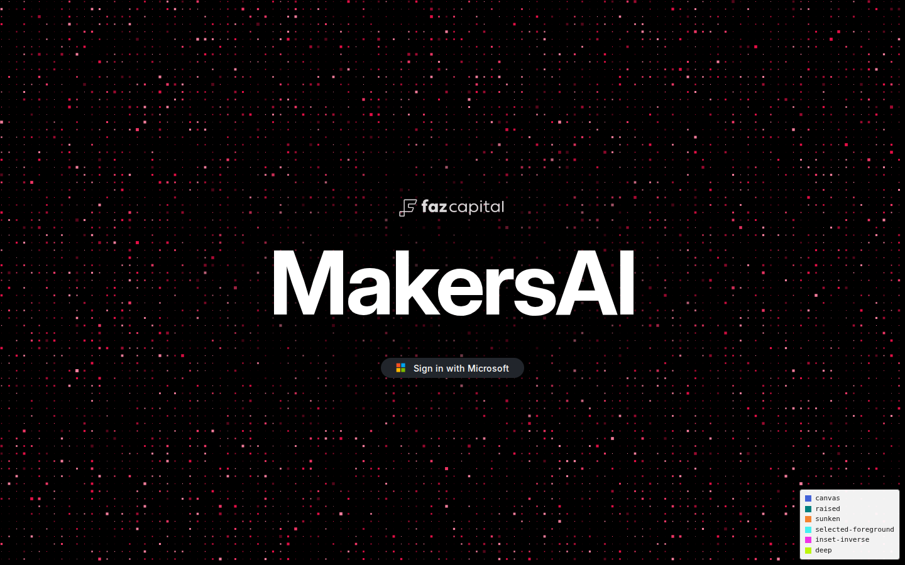

**Tema escuro**

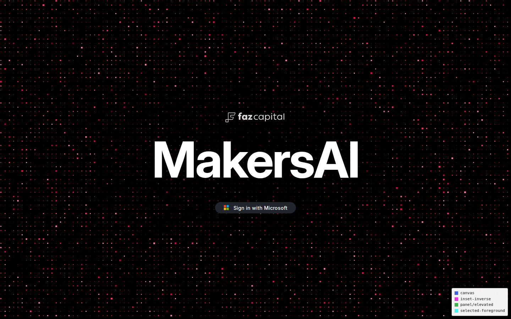

**6 elementos** marcados (claro 3 · escuro 3) — **2 em colisão** (tracejado): mais de um token no mesmo pixel.

<details><summary>o que está marcado no tema claro (3)</summary>

| posição na imagem | elemento | token(s) | propriedade |
|---|---|---|---|
| x0 y0 · 1440×900 | `<html>` "import { injectIntoGlobalHook } from "/@" | `canvas` | background |
| x428 y345 · 583×210 | `<span>` "MakersAI" | `raised` | texto |
| x606 y570 · 228×32 | `<button>` "Sign in with Microsoft" · `cursor-pointer` | **colisão:** `sunken` + `selected-foreground` + `inset-inverse` + `deep` | texto |

</details>

<details><summary>o que está marcado no tema escuro (3)</summary>

| posição na imagem | elemento | token(s) | propriedade |
|---|---|---|---|
| x0 y0 · 1440×900 | `<html>` "import { injectIntoGlobalHook } from "/@" | `canvas` | background |
| x428 y345 · 583×210 | `<span>` "MakersAI" | `inset-inverse` | texto |
| x606 y570 · 228×32 | `<button>` "Sign in with Microsoft" · `cursor-pointer` | **colisão:** `panel/elevated` + `selected-foreground` | background |

</details>


#### `home` — `/`


**Tema claro**

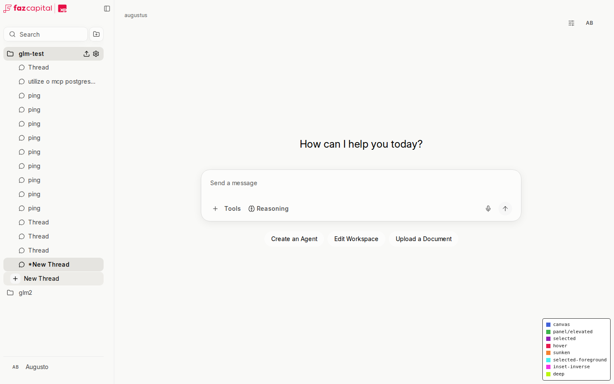

**Tema escuro**

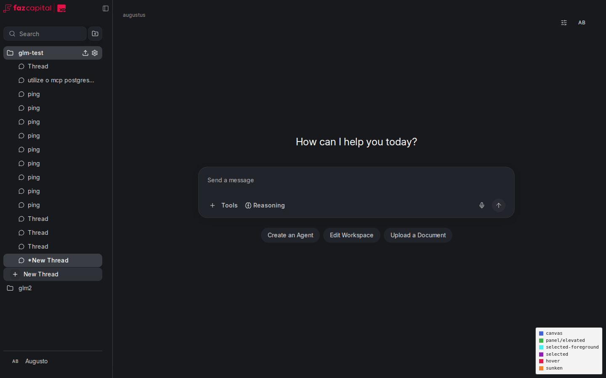

**30 elementos** marcados (claro 15 · escuro 15) — **9 em colisão** (tracejado): mais de um token no mesmo pixel.

<details><summary>o que está marcado no tema claro (15)</summary>

| posição na imagem | elemento | token(s) | propriedade |
|---|---|---|---|
| x0 y0 · 1440×900 | `<html>` "import { injectIntoGlobalHook } from "/@" | `canvas` | background |
| x270 y16 · 1154×868 | `<main>` "augustusAdd anythingDrop a file or image" · `bg-chatarea-bg flex-1 min-w-0 transition-all duration-slow r` | `canvas` | background |
| x0 y48 · 251×836 | `<nav>` "glm-testThread utilize o mcp postgres… p" · `relative mr-content my-content bg-sidebar-bg min-w-[250px] p` | `canvas` | background |
| x9 y64 · 196×32 | `<input>` · `prompt-box w-full h-full rounded-lg bg-sidebar-field-bg pl-9` | `panel/elevated` | background |
| x210 y64 · 32×32 | `<button>` · `prompt-box flex h-8 w-8 flex-none box-border items-center ju` | `panel/elevated` | background |
| x8 y110 · 235×32 | `<a>` "glm-test" · `nav-row grow w-[75%] justify-start nav-row-selected` | `selected` | background |
| x472 y398 · 750×120 | `<div>` "ToolsReasoningSend prompt message to wor" · `bg-prompt-bg prompt-box rounded-bubble pwa:rounded-3xl flex ` | `panel/elevated` | background |
| x1169 y473 · 32×32 | `<button>` "Send prompt message to workspace" · `border-none flex justify-center items-center rounded-full w-` | **colisão:** `sunken` + `selected-foreground` + `inset-inverse` + `deep` | background |
| x620 y542 · 140×36 | `<button>` "Create an Agent" · `px-4 py-2 rounded-full bg-theme-bg-chat-input text-static-wh` | `panel/elevated` | background |
| x768 y542 · 136×36 | `<button>` "Edit Workspace" · `px-4 py-2 rounded-full bg-theme-bg-chat-input text-static-wh` | `panel/elevated` | background |
| x912 y542 · 163×36 | `<button>` "Upload a Document" · `px-4 py-2 rounded-full bg-theme-bg-chat-input text-static-wh` | `panel/elevated` | background |
| x8 y604 · 235×32 | `<div>` "*New Thread" · `nav-row nav-row-child w-full justify-between pr-2 group/thre` | `selected` | background |
| x8 y637 · 235×32 | `<button>` "New Thread" · `w-full relative flex h-8 items-center border-none bg-sidebar` | `hover` | background |
| x24 y641 · 24×24 | `<div>` · `bg-button-icon-background-color p-2 rounded-lg h-[24px] w-[2` | **colisão:** `sunken` + `selected-foreground` + `inset-inverse` + `deep` | background |
| x8 y835 · 235×41 | `<div>` "ABAugusto" · `shrink-0 rounded-b-overlay bg-sidebar-bg` | `canvas` | background |

</details>

<details><summary>o que está marcado no tema escuro (15)</summary>

| posição na imagem | elemento | token(s) | propriedade |
|---|---|---|---|
| x0 y0 · 1440×900 | `<html>` "import { injectIntoGlobalHook } from "/@" | `canvas` | background |
| x270 y16 · 1154×868 | `<main>` "augustusAdd anythingDrop a file or image" · `bg-chatarea-bg flex-1 min-w-0 transition-all duration-slow r` | `canvas` | background |
| x0 y48 · 251×836 | `<nav>` "glm-testThread utilize o mcp postgres… p" · `relative mr-content my-content bg-sidebar-bg min-w-[250px] p` | `canvas` | background |
| x9 y64 · 196×32 | `<input>` · `prompt-box w-full h-full rounded-lg bg-sidebar-field-bg pl-9` | **colisão:** `panel/elevated` + `selected-foreground` | background |
| x210 y64 · 32×32 | `<button>` · `prompt-box flex h-8 w-8 flex-none box-border items-center ju` | **colisão:** `panel/elevated` + `selected-foreground` | background |
| x8 y110 · 235×32 | `<a>` "glm-test" · `nav-row grow w-[75%] justify-start nav-row-selected` | `selected` | background |
| x472 y398 · 750×120 | `<div>` "ToolsReasoningSend prompt message to wor" · `bg-prompt-bg prompt-box rounded-bubble pwa:rounded-3xl flex ` | **colisão:** `panel/elevated` + `selected-foreground` | background |
| x1169 y473 · 32×32 | `<button>` "Send prompt message to workspace" · `border-none flex justify-center items-center rounded-full w-` | `sunken` | background |
| x620 y542 · 140×36 | `<button>` "Create an Agent" · `px-4 py-2 rounded-full bg-theme-bg-chat-input text-static-wh` | **colisão:** `panel/elevated` + `selected-foreground` | background |
| x768 y542 · 136×36 | `<button>` "Edit Workspace" · `px-4 py-2 rounded-full bg-theme-bg-chat-input text-static-wh` | **colisão:** `panel/elevated` + `selected-foreground` | background |
| x912 y542 · 163×36 | `<button>` "Upload a Document" · `px-4 py-2 rounded-full bg-theme-bg-chat-input text-static-wh` | **colisão:** `panel/elevated` + `selected-foreground` | background |
| x8 y604 · 235×32 | `<div>` "*New Thread" · `nav-row nav-row-child w-full justify-between pr-2 group/thre` | `selected` | background |
| x8 y637 · 235×32 | `<button>` "New Thread" · `w-full relative flex h-8 items-center border-none bg-sidebar` | `hover` | background |
| x24 y641 · 24×24 | `<div>` · `bg-button-icon-background-color p-2 rounded-lg h-[24px] w-[2` | `sunken` | background |
| x8 y835 · 235×41 | `<div>` "ABAugusto" · `shrink-0 rounded-b-overlay bg-sidebar-bg` | **colisão:** `canvas` + `selected` | background, borda |

</details>


#### `settings_llm` — `/settings/llm-preference`


**Tema claro**

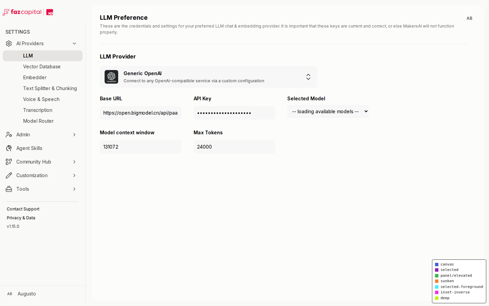

**Tema escuro**

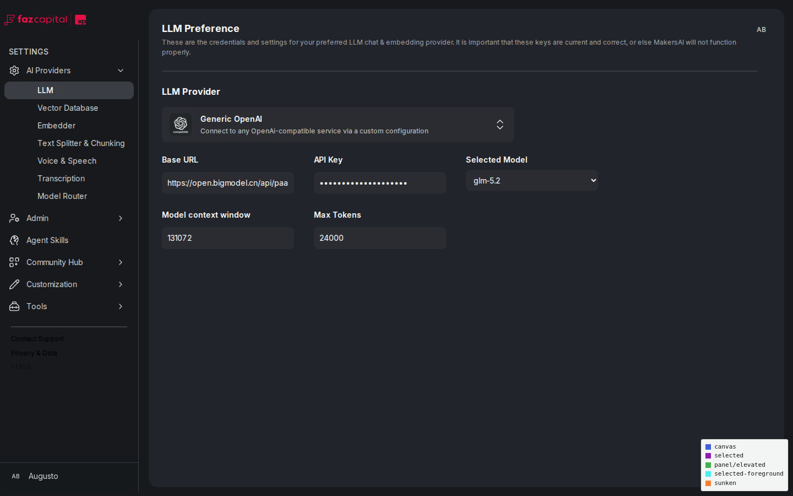

**21 elementos** marcados (claro 10 · escuro 11) — **7 em colisão** (tracejado): mais de um token no mesmo pixel.

<details><summary>o que está marcado no tema claro (10)</summary>

| posição na imagem | elemento | token(s) | propriedade |
|---|---|---|---|
| x0 y0 · 1440×900 | `<html>` "import { injectIntoGlobalHook } from "/@" | `canvas` | background |
| x270 y16 · 1154×868 | `<main>` "LLM PreferenceThese are the credentials " · `relative md:ml-s2 md:mr-content md:my-content md:rounded-ove` | `panel/elevated` | background |
| x0 y72 · 252×820 | `<nav>` "SettingsAI ProvidersLLMVector DatabaseEm" · `transition-all duration-slow relative mr-content my-content ` | `canvas` | background |
| x8 y148 · 235×32 | `<div>` "LLM" · `nav-row w-full justify-between nav-row-child nav-row-selecte` | `selected` | background |
| x294 y194 · 640×64 | `<button>` "Generic OpenAIConnect to any OpenAi-comp" · `w-full max-w-[640px] h-[64px] bg-theme-settings-input-bg rou` | **colisão:** `sunken` + `selected-foreground` + `inset-inverse` + `deep` | background |
| x846 y308 · 240×39 | `<select>` "glm-4.5glm-4.5-airglm-4.6glm-4.7glm-5glm" · `border-none bg-theme-settings-input-bg text-content-primary ` | **colisão:** `sunken` + `selected-foreground` + `inset-inverse` + `deep` | background |
| x294 y312 · 240×40 | `<input>` · `border-none bg-theme-settings-input-bg text-content-primary ` | **colisão:** `sunken` + `selected-foreground` + `inset-inverse` + `deep` | background |
| x570 y312 · 240×40 | `<input>` · `border-none bg-theme-settings-input-bg text-content-primary ` | **colisão:** `sunken` + `selected-foreground` + `inset-inverse` + `deep` | background |
| x294 y412 · 240×40 | `<input>` · `border-none bg-theme-settings-input-bg text-content-primary ` | **colisão:** `sunken` + `selected-foreground` + `inset-inverse` + `deep` | background |
| x570 y412 · 240×40 | `<input>` · `border-none bg-theme-settings-input-bg text-content-primary ` | **colisão:** `sunken` + `selected-foreground` + `inset-inverse` + `deep` | background |

</details>

<details><summary>o que está marcado no tema escuro (11)</summary>

| posição na imagem | elemento | token(s) | propriedade |
|---|---|---|---|
| x0 y0 · 1440×900 | `<html>` "import { injectIntoGlobalHook } from "/@" | `canvas` | background |
| x270 y16 · 1154×868 | `<main>` "LLM PreferenceThese are the credentials " · `relative md:ml-s2 md:mr-content md:my-content md:rounded-ove` | **colisão:** `panel/elevated` + `selected-foreground` | background |
| x0 y72 · 252×820 | `<nav>` "SettingsAI ProvidersLLMVector DatabaseEm" · `transition-all duration-slow relative mr-content my-content ` | `canvas` | background |
| x8 y148 · 235×32 | `<div>` "LLM" · `nav-row w-full justify-between nav-row-child nav-row-selecte` | `selected` | background |
| x294 y194 · 640×64 | `<button>` "Generic OpenAIConnect to any OpenAi-comp" · `w-full max-w-[640px] h-[64px] bg-theme-settings-input-bg rou` | `sunken` | background |
| x846 y308 · 240×39 | `<select>` "glm-4.5glm-4.5-airglm-4.6glm-4.7glm-5glm" · `border-none bg-theme-settings-input-bg text-content-primary ` | `sunken` | background |
| x294 y312 · 240×40 | `<input>` · `border-none bg-theme-settings-input-bg text-content-primary ` | `sunken` | background |
| x570 y312 · 240×40 | `<input>` · `border-none bg-theme-settings-input-bg text-content-primary ` | `sunken` | background |
| x294 y412 · 240×40 | `<input>` · `border-none bg-theme-settings-input-bg text-content-primary ` | `sunken` | background |
| x570 y412 · 240×40 | `<input>` · `border-none bg-theme-settings-input-bg text-content-primary ` | `sunken` | background |
| x0 y839 · 251×41 | `<div>` "ABAugusto" · `relative px-s8 pt-s8 border-t border-sidebar-divider` | `selected` | borda |

</details>


#### `settings_interface` — `/settings/interface`


**Tema claro**

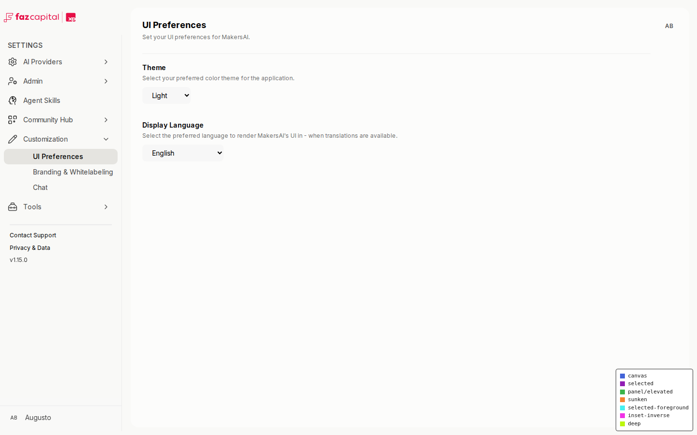

**Tema escuro**

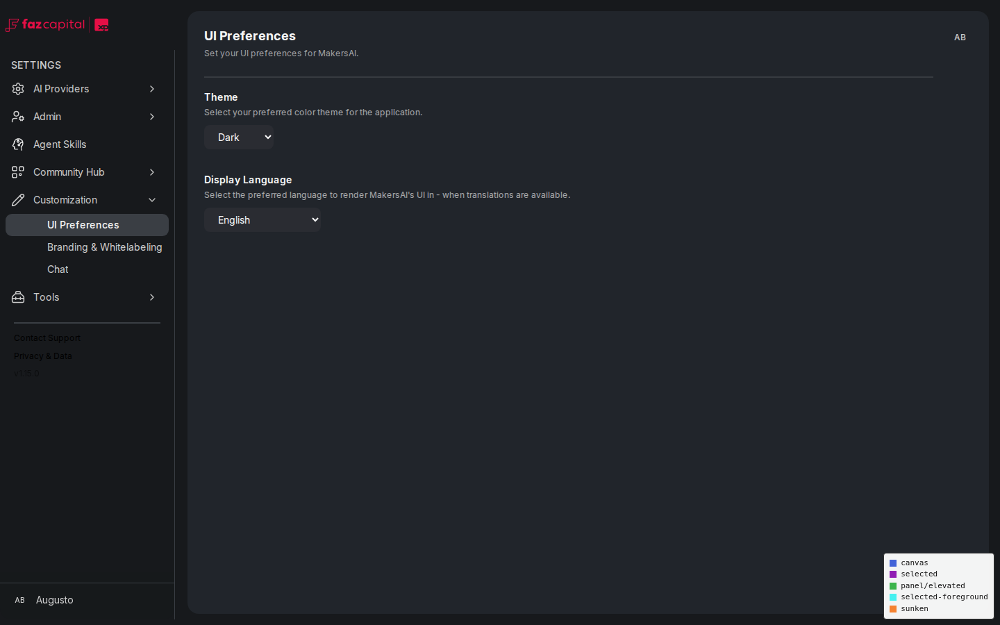

**13 elementos** marcados (claro 6 · escuro 7) — **3 em colisão** (tracejado): mais de um token no mesmo pixel.

<details><summary>o que está marcado no tema claro (6)</summary>

| posição na imagem | elemento | token(s) | propriedade |
|---|---|---|---|
| x0 y0 · 1440×900 | `<html>` "import { injectIntoGlobalHook } from "/@" | `canvas` | background |
| x270 y16 · 1154×868 | `<main>` "UI PreferencesSet your UI preferences fo" · `relative md:ml-s2 md:mr-content md:my-content md:rounded-ove` | `panel/elevated` | background |
| x0 y72 · 252×820 | `<nav>` "SettingsAI ProvidersLLMVector DatabaseEm" · `transition-all duration-slow relative mr-content my-content ` | `canvas` | background |
| x294 y180 · 100×35 | `<select>` "SystemLightDark" · `border-none bg-theme-settings-input-bg mt-2 text-content-pri` | **colisão:** `sunken` + `selected-foreground` + `inset-inverse` + `deep` | background |
| x294 y299 · 168×35 | `<select>` "EnglishChineseChinese (Taiwan)SpanishGer" · `border-none bg-theme-settings-input-bg mt-2 text-content-pri` | **colisão:** `sunken` + `selected-foreground` + `inset-inverse` + `deep` | background |
| x8 y308 · 235×32 | `<div>` "UI Preferences" · `nav-row w-full justify-between nav-row-child nav-row-selecte` | `selected` | background |

</details>

<details><summary>o que está marcado no tema escuro (7)</summary>

| posição na imagem | elemento | token(s) | propriedade |
|---|---|---|---|
| x0 y0 · 1440×900 | `<html>` "import { injectIntoGlobalHook } from "/@" | `canvas` | background |
| x270 y16 · 1154×868 | `<main>` "UI PreferencesSet your UI preferences fo" · `relative md:ml-s2 md:mr-content md:my-content md:rounded-ove` | **colisão:** `panel/elevated` + `selected-foreground` | background |
| x0 y72 · 252×820 | `<nav>` "SettingsAI ProvidersLLMVector DatabaseEm" · `transition-all duration-slow relative mr-content my-content ` | `canvas` | background |
| x294 y180 · 100×35 | `<select>` "SystemLightDark" · `border-none bg-theme-settings-input-bg mt-2 text-content-pri` | `sunken` | background |
| x294 y299 · 168×35 | `<select>` "EnglishChineseChinese (Taiwan)SpanishGer" · `border-none bg-theme-settings-input-bg mt-2 text-content-pri` | `sunken` | background |
| x8 y308 · 235×32 | `<div>` "UI Preferences" · `nav-row w-full justify-between nav-row-child nav-row-selecte` | `selected` | background |
| x0 y839 · 251×41 | `<div>` "ABAugusto" · `relative px-s8 pt-s8 border-t border-sidebar-divider` | `selected` | borda |

</details>


#### `settings_agents` — `/settings/agents`


**Tema claro**

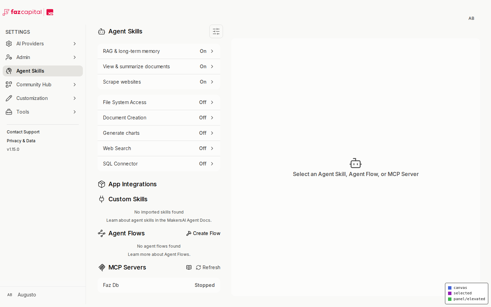

**Tema escuro**

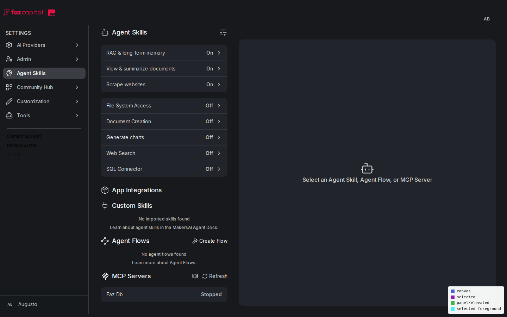

**15 elementos** marcados (claro 7 · escuro 8) — **4 em colisão** (tracejado): mais de um token no mesmo pixel.

<details><summary>o que está marcado no tema claro (7)</summary>

| posição na imagem | elemento | token(s) | propriedade |
|---|---|---|---|
| x0 y0 · 1440×900 | `<html>` "import { injectIntoGlobalHook } from "/@" | `canvas` | background |
| x0 y72 · 252×820 | `<nav>` "SettingsAI ProvidersLLMVector DatabaseEm" · `transition-all duration-slow relative mr-content my-content ` | `canvas` | background |
| x678 y112 · 730×756 | `<div>` "Select an Agent Skill, Agent Flow, or MC" · `bg-theme-bg-secondary text-content-primary rounded-xl flex-1` | `panel/elevated` | background |
| x286 y128 · 360×134 | `<div>` "RAG & long-term memoryOnView & summarize" · `bg-theme-bg-secondary text-content-primary rounded-xl min-w-` | `panel/elevated` | background |
| x8 y192 · 235×32 | `<div>` "Agent Skills" · `nav-row w-full justify-between  nav-row-selected` | `selected` | background |
| x286 y278 · 360×224 | `<div>` "File System AccessOffDocument CreationOf" · `bg-theme-bg-secondary text-content-primary rounded-xl min-w-` | `panel/elevated` | background |
| x286 y814 · 360×44 | `<div>` "Faz DbStopped" · `bg-theme-bg-secondary text-content-primary rounded-xl w-full` | `panel/elevated` | background |

</details>

<details><summary>o que está marcado no tema escuro (8)</summary>

| posição na imagem | elemento | token(s) | propriedade |
|---|---|---|---|
| x0 y0 · 1440×900 | `<html>` "import { injectIntoGlobalHook } from "/@" | `canvas` | background |
| x0 y72 · 252×820 | `<nav>` "SettingsAI ProvidersLLMVector DatabaseEm" · `transition-all duration-slow relative mr-content my-content ` | `canvas` | background |
| x678 y112 · 730×756 | `<div>` "Select an Agent Skill, Agent Flow, or MC" · `bg-theme-bg-secondary text-content-primary rounded-xl flex-1` | **colisão:** `panel/elevated` + `selected-foreground` | background |
| x286 y128 · 360×134 | `<div>` "RAG & long-term memoryOnView & summarize" · `bg-theme-bg-secondary text-content-primary rounded-xl min-w-` | **colisão:** `panel/elevated` + `selected-foreground` | background |
| x8 y192 · 235×32 | `<div>` "Agent Skills" · `nav-row w-full justify-between  nav-row-selected` | `selected` | background |
| x286 y278 · 360×224 | `<div>` "File System AccessOffDocument CreationOf" · `bg-theme-bg-secondary text-content-primary rounded-xl min-w-` | **colisão:** `panel/elevated` + `selected-foreground` | background |
| x286 y814 · 360×44 | `<div>` "Faz DbStopped" · `bg-theme-bg-secondary text-content-primary rounded-xl w-full` | **colisão:** `panel/elevated` + `selected-foreground` | background |
| x0 y839 · 251×41 | `<div>` "ABAugusto" · `relative px-s8 pt-s8 border-t border-sidebar-divider` | `selected` | borda |

</details>


#### `settings_routers` — `/settings/model-routers`


**Tema claro**

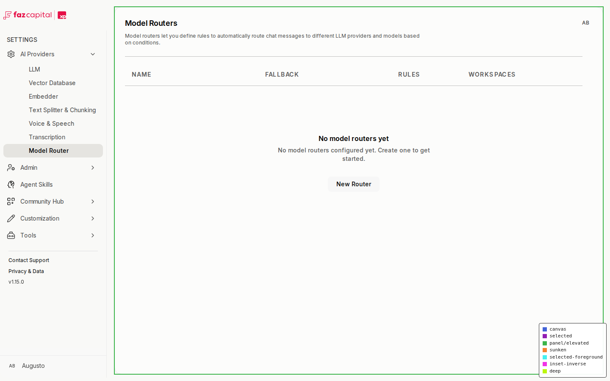

**Tema escuro**

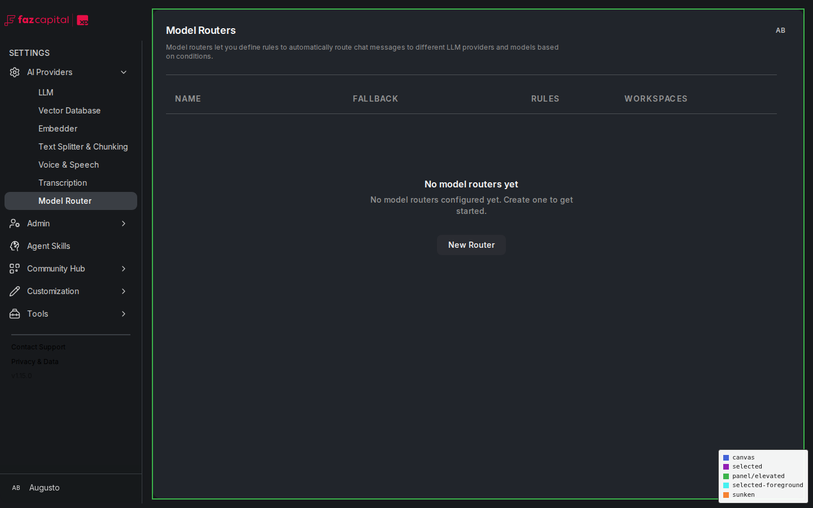

**11 elementos** marcados (claro 5 · escuro 6) — **2 em colisão** (tracejado): mais de um token no mesmo pixel.

<details><summary>o que está marcado no tema claro (5)</summary>

| posição na imagem | elemento | token(s) | propriedade |
|---|---|---|---|
| x0 y0 · 1440×900 | `<html>` "import { injectIntoGlobalHook } from "/@" | `canvas` | background |
| x270 y16 · 1154×868 | `<main>` "Model RoutersModel routers let you defin" · `relative md:ml-s2 md:mr-content md:my-content md:rounded-2xl` | `panel/elevated` | background |
| x0 y72 · 252×820 | `<nav>` "SettingsAI ProvidersLLMVector DatabaseEm" · `transition-all duration-slow relative mr-content my-content ` | `canvas` | background |
| x8 y340 · 235×32 | `<div>` "Model Router" · `nav-row w-full justify-between nav-row-child nav-row-selecte` | `selected` | background |
| x774 y417 · 122×36 | `<button>` "New Router" · `border-none flex items-center justify-center h-9 px-5 py-2.5` | **colisão:** `sunken` + `selected-foreground` + `inset-inverse` + `deep` | background |

</details>

<details><summary>o que está marcado no tema escuro (6)</summary>

| posição na imagem | elemento | token(s) | propriedade |
|---|---|---|---|
| x0 y0 · 1440×900 | `<html>` "import { injectIntoGlobalHook } from "/@" | `canvas` | background |
| x270 y16 · 1154×868 | `<main>` "Model RoutersModel routers let you defin" · `relative md:ml-s2 md:mr-content md:my-content md:rounded-2xl` | **colisão:** `panel/elevated` + `selected-foreground` | background |
| x0 y72 · 252×820 | `<nav>` "SettingsAI ProvidersLLMVector DatabaseEm" · `transition-all duration-slow relative mr-content my-content ` | `canvas` | background |
| x8 y340 · 235×32 | `<div>` "Model Router" · `nav-row w-full justify-between nav-row-child nav-row-selecte` | `selected` | background |
| x774 y416 · 122×36 | `<button>` "New Router" · `border-none flex items-center justify-center h-9 px-5 py-2.5` | `sunken` | background |
| x0 y839 · 251×41 | `<div>` "ABAugusto" · `relative px-s8 pt-s8 border-t border-sidebar-divider` | `selected` | borda |

</details>


#### `settings_branding` — `/settings/branding`


**Tema claro**

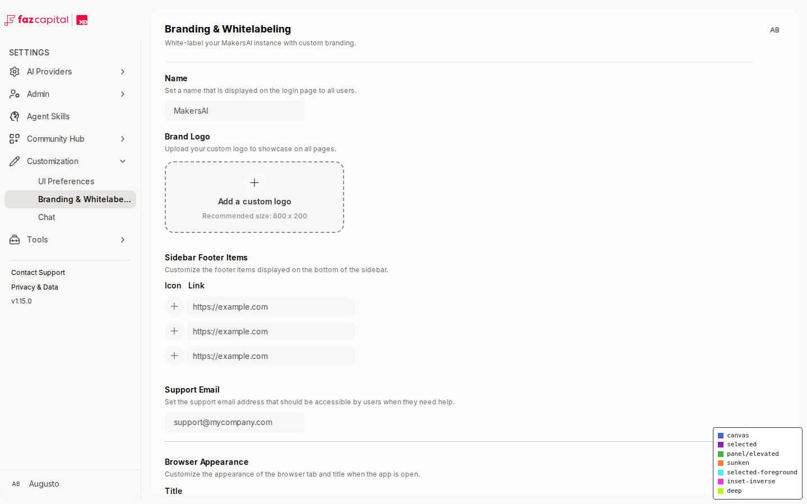

**Tema escuro**

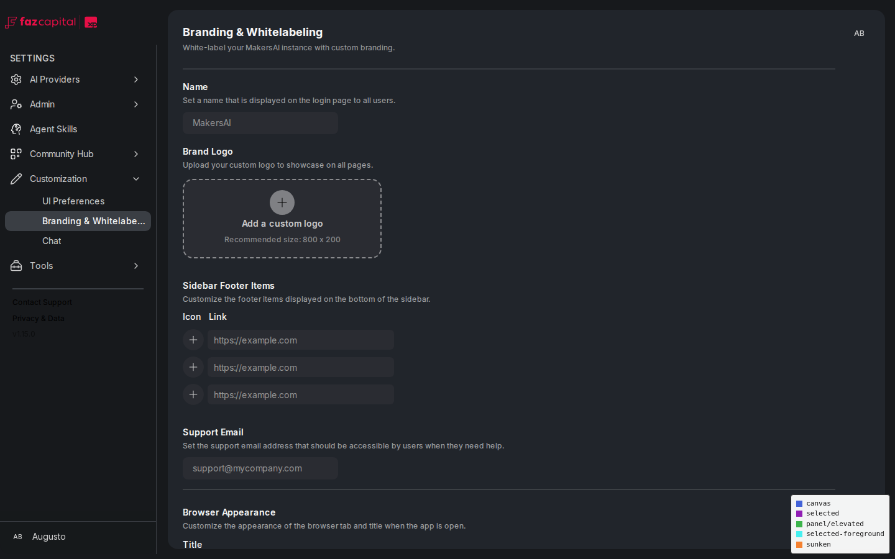

**31 elementos** marcados (claro 15 · escuro 16) — **12 em colisão** (tracejado): mais de um token no mesmo pixel.

<details><summary>o que está marcado no tema claro (15)</summary>

| posição na imagem | elemento | token(s) | propriedade |
|---|---|---|---|
| x0 y0 · 1440×900 | `<html>` "import { injectIntoGlobalHook } from "/@" | `canvas` | background |
| x270 y16 · 1154×868 | `<main>` "Branding & WhitelabelingWhite-label your" · `relative md:ml-s2 md:mr-content md:my-content md:rounded-ove` | `panel/elevated` | background |
| x0 y72 · 252×820 | `<nav>` "SettingsAI ProvidersLLMVector DatabaseEm" · `transition-all duration-slow relative mr-content my-content ` | `canvas` | background |
| x294 y180 · 250×36 | `<input>` · `border-none bg-theme-settings-input-bg mt-2 text-content-pri` | **colisão:** `sunken` + `selected-foreground` + `inset-inverse` + `deep` | background |
| x294 y288 · 320×128 | `<div>` "Add a custom logoRecommended size: 800 x" · `w-80 py-4 bg-theme-settings-input-bg rounded-2xl border-2 bo` | **colisão:** `sunken` + `selected-foreground` + `inset-inverse` + `deep` | background |
| x8 y340 · 235×32 | `<div>` "Branding & Whitelabeling" · `nav-row w-full justify-between nav-row-child nav-row-selecte` | `selected` | background |
| x294 y530 · 34×34 | `<div>` · `h-[34px] w-[34px] bg-theme-settings-input-bg rounded-full fl` | **colisão:** `sunken` + `selected-foreground` + `inset-inverse` + `deep` | background |
| x334 y531 · 300×32 | `<input>` · `border-none bg-theme-settings-input-bg text-content-primary ` | **colisão:** `sunken` + `selected-foreground` + `inset-inverse` + `deep` | background |
| x294 y574 · 34×34 | `<div>` · `h-[34px] w-[34px] bg-theme-settings-input-bg rounded-full fl` | **colisão:** `sunken` + `selected-foreground` + `inset-inverse` + `deep` | background |
| x334 y575 · 300×32 | `<input>` · `border-none bg-theme-settings-input-bg text-content-primary ` | **colisão:** `sunken` + `selected-foreground` + `inset-inverse` + `deep` | background |
| x294 y618 · 34×34 | `<div>` · `h-[34px] w-[34px] bg-theme-settings-input-bg rounded-full fl` | **colisão:** `sunken` + `selected-foreground` + `inset-inverse` + `deep` | background |
| x334 y619 · 300×32 | `<input>` · `border-none bg-theme-settings-input-bg text-content-primary ` | **colisão:** `sunken` + `selected-foreground` + `inset-inverse` + `deep` | background |
| x294 y736 · 250×36 | `<input>` · `border-none bg-theme-settings-input-bg mt-2 text-content-pri` | **colisão:** `sunken` + `selected-foreground` + `inset-inverse` + `deep` | background |
| x294 y913 · 250×36 | `<input>` · `border-none bg-theme-settings-input-bg mt-2 text-content-pri` | **colisão:** `sunken` + `selected-foreground` + `inset-inverse` + `deep` | background |
| x342 y1009 · 250×36 | `<input>` · `border-none bg-theme-settings-input-bg mt-2 text-content-pri` | **colisão:** `sunken` + `selected-foreground` + `inset-inverse` + `deep` | background |

</details>

<details><summary>o que está marcado no tema escuro (16)</summary>

| posição na imagem | elemento | token(s) | propriedade |
|---|---|---|---|
| x0 y0 · 1440×900 | `<html>` "import { injectIntoGlobalHook } from "/@" | `canvas` | background |
| x270 y16 · 1154×868 | `<main>` "Branding & WhitelabelingWhite-label your" · `relative md:ml-s2 md:mr-content md:my-content md:rounded-ove` | **colisão:** `panel/elevated` + `selected-foreground` | background |
| x0 y72 · 252×820 | `<nav>` "SettingsAI ProvidersLLMVector DatabaseEm" · `transition-all duration-slow relative mr-content my-content ` | `canvas` | background |
| x294 y180 · 250×36 | `<input>` · `border-none bg-theme-settings-input-bg mt-2 text-content-pri` | `sunken` | background |
| x294 y288 · 320×128 | `<div>` "Add a custom logoRecommended size: 800 x" · `w-80 py-4 bg-theme-settings-input-bg rounded-2xl border-2 bo` | `sunken` | background |
| x8 y340 · 235×32 | `<div>` "Branding & Whitelabeling" · `nav-row w-full justify-between nav-row-child nav-row-selecte` | `selected` | background |
| x294 y530 · 34×34 | `<div>` · `h-[34px] w-[34px] bg-theme-settings-input-bg rounded-full fl` | `sunken` | background |
| x334 y531 · 300×32 | `<input>` · `border-none bg-theme-settings-input-bg text-content-primary ` | `sunken` | background |
| x294 y574 · 34×34 | `<div>` · `h-[34px] w-[34px] bg-theme-settings-input-bg rounded-full fl` | `sunken` | background |
| x334 y575 · 300×32 | `<input>` · `border-none bg-theme-settings-input-bg text-content-primary ` | `sunken` | background |
| x294 y618 · 34×34 | `<div>` · `h-[34px] w-[34px] bg-theme-settings-input-bg rounded-full fl` | `sunken` | background |
| x334 y619 · 300×32 | `<input>` · `border-none bg-theme-settings-input-bg text-content-primary ` | `sunken` | background |
| x294 y736 · 250×36 | `<input>` · `border-none bg-theme-settings-input-bg mt-2 text-content-pri` | `sunken` | background |
| x0 y839 · 251×41 | `<div>` "ABAugusto" · `relative px-s8 pt-s8 border-t border-sidebar-divider` | `selected` | borda |
| x294 y913 · 250×36 | `<input>` · `border-none bg-theme-settings-input-bg mt-2 text-content-pri` | `sunken` | background |
| x342 y1009 · 250×36 | `<input>` · `border-none bg-theme-settings-input-bg mt-2 text-content-pri` | `sunken` | background |

</details>


#### `settings_security` — `/settings/security`


**Tema claro**

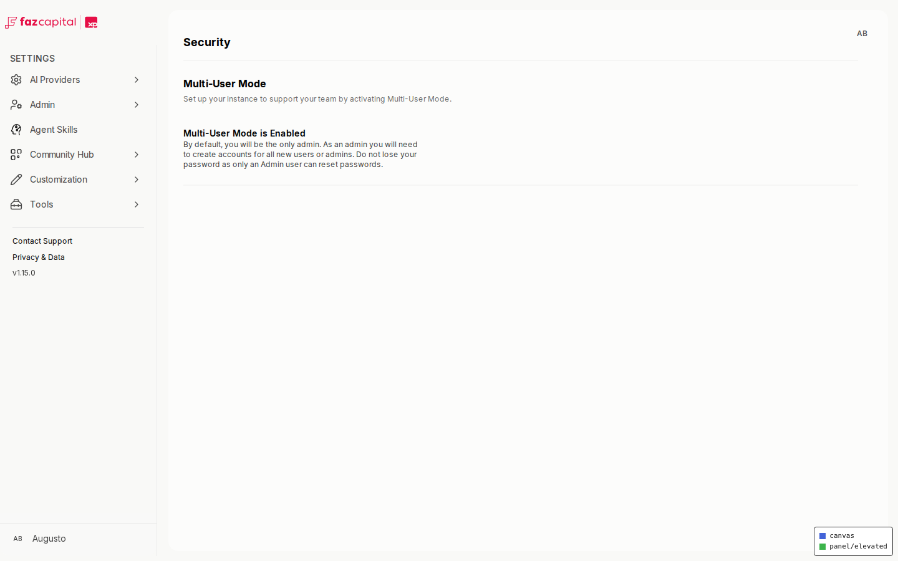

**Tema escuro**

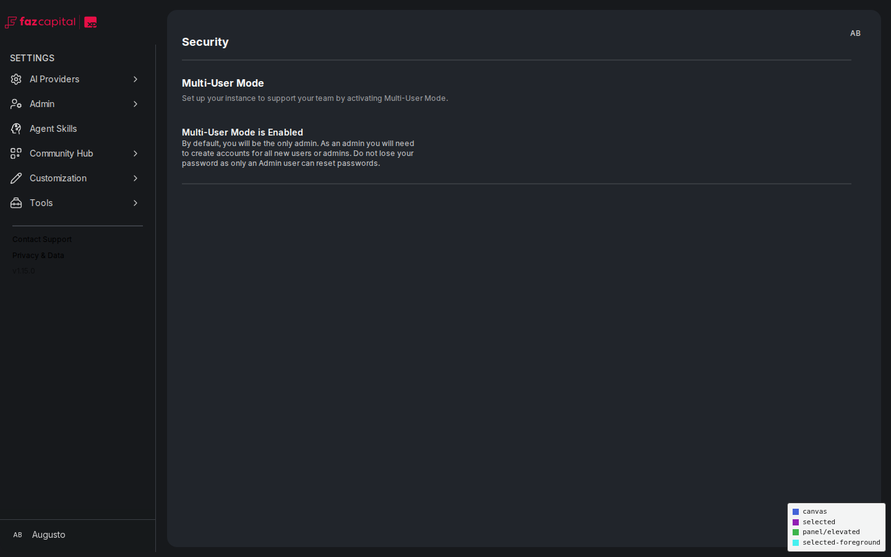

**7 elementos** marcados (claro 3 · escuro 4) — **1 em colisão** (tracejado): mais de um token no mesmo pixel.

<details><summary>o que está marcado no tema claro (3)</summary>

| posição na imagem | elemento | token(s) | propriedade |
|---|---|---|---|
| x0 y0 · 1440×900 | `<html>` "import { injectIntoGlobalHook } from "/@" | `canvas` | background |
| x270 y16 · 1154×868 | `<main>` "SecurityMulti-User ModeSet up your insta" · `relative md:ml-s2 md:mr-content md:my-content md:rounded-ove` | `panel/elevated` | background |
| x0 y72 · 252×820 | `<nav>` "SettingsAI ProvidersLLMVector DatabaseEm" · `transition-all duration-slow relative mr-content my-content ` | `canvas` | background |

</details>

<details><summary>o que está marcado no tema escuro (4)</summary>

| posição na imagem | elemento | token(s) | propriedade |
|---|---|---|---|
| x0 y0 · 1440×900 | `<html>` "import { injectIntoGlobalHook } from "/@" | `canvas` | background |
| x270 y16 · 1154×868 | `<main>` "SecurityMulti-User ModeSet up your insta" · `relative md:ml-s2 md:mr-content md:my-content md:rounded-ove` | **colisão:** `panel/elevated` + `selected-foreground` | background |
| x0 y72 · 252×820 | `<nav>` "SettingsAI ProvidersLLMVector DatabaseEm" · `transition-all duration-slow relative mr-content my-content ` | `canvas` | background |
| x0 y839 · 251×41 | `<div>` "ABAugusto" · `relative px-s8 pt-s8 border-t border-sidebar-divider` | `selected` | borda |

</details>


#### `settings_api_keys` — `/settings/api-keys`


**Tema claro**

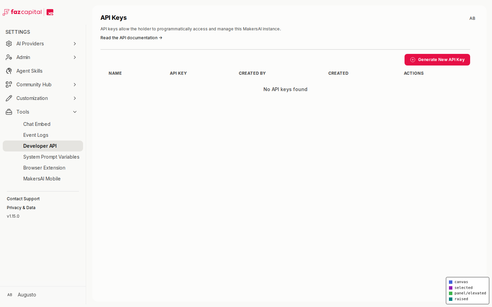

**Tema escuro**

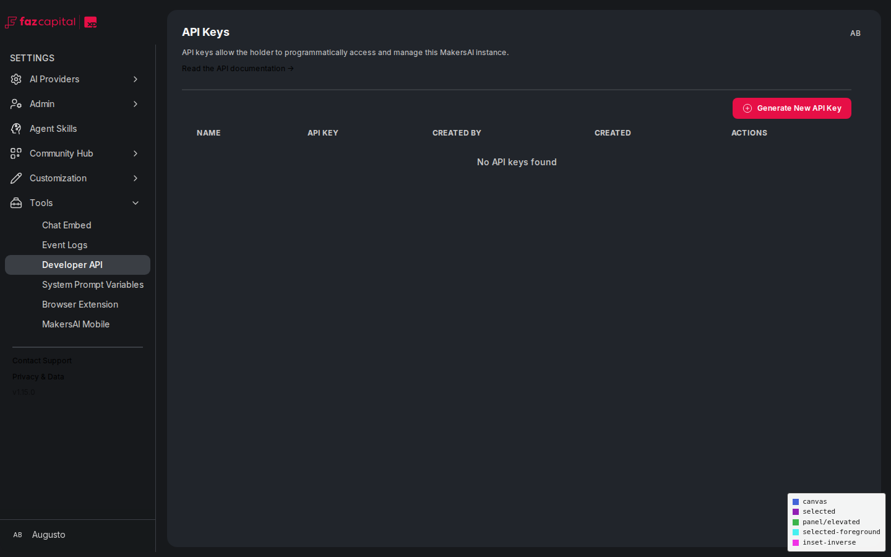

**13 elementos** marcados (claro 6 · escuro 7) — **1 em colisão** (tracejado): mais de um token no mesmo pixel.

<details><summary>o que está marcado no tema claro (6)</summary>

| posição na imagem | elemento | token(s) | propriedade |
|---|---|---|---|
| x0 y0 · 1440×900 | `<html>` "import { injectIntoGlobalHook } from "/@" | `canvas` | background |
| x270 y16 · 1154×868 | `<main>` "API KeysAPI keys allow the holder to pro" · `relative md:ml-s2 md:mr-content md:my-content md:rounded-ove` | `panel/elevated` | background |
| x0 y72 · 252×820 | `<nav>` "SettingsAI ProvidersLLMVector DatabaseEm" · `transition-all duration-slow relative mr-content my-content ` | `canvas` | background |
| x1184 y158 · 192×34 | `<button>` "Generate New API Key" · `border-none text-xs px-4 py-1 font-semibold rounded-lg bg-pr` | `raised` | texto |
| x1200 y167 · 160×16 | `<div>` "Generate New API Key" · `flex items-center justify-center gap-2` | `raised` | texto |
| x8 y412 · 235×32 | `<div>` "Developer API" · `nav-row w-full justify-between nav-row-child nav-row-selecte` | `selected` | background |

</details>

<details><summary>o que está marcado no tema escuro (7)</summary>

| posição na imagem | elemento | token(s) | propriedade |
|---|---|---|---|
| x0 y0 · 1440×900 | `<html>` "import { injectIntoGlobalHook } from "/@" | `canvas` | background |
| x270 y16 · 1154×868 | `<main>` "API KeysAPI keys allow the holder to pro" · `relative md:ml-s2 md:mr-content md:my-content md:rounded-ove` | **colisão:** `panel/elevated` + `selected-foreground` | background |
| x0 y72 · 252×820 | `<nav>` "SettingsAI ProvidersLLMVector DatabaseEm" · `transition-all duration-slow relative mr-content my-content ` | `canvas` | background |
| x1184 y158 · 192×34 | `<button>` "Generate New API Key" · `border-none text-xs px-4 py-1 font-semibold rounded-lg bg-pr` | `inset-inverse` | texto |
| x1200 y167 · 160×16 | `<div>` "Generate New API Key" · `flex items-center justify-center gap-2` | `inset-inverse` | texto |
| x8 y412 · 235×32 | `<div>` "Developer API" · `nav-row w-full justify-between nav-row-child nav-row-selecte` | `selected` | background |
| x0 y839 · 251×41 | `<div>` "ABAugusto" · `relative px-s8 pt-s8 border-t border-sidebar-divider` | `selected` | borda |

</details>


#### `settings_beta_features` — `/settings/beta-features`


**Tema claro**

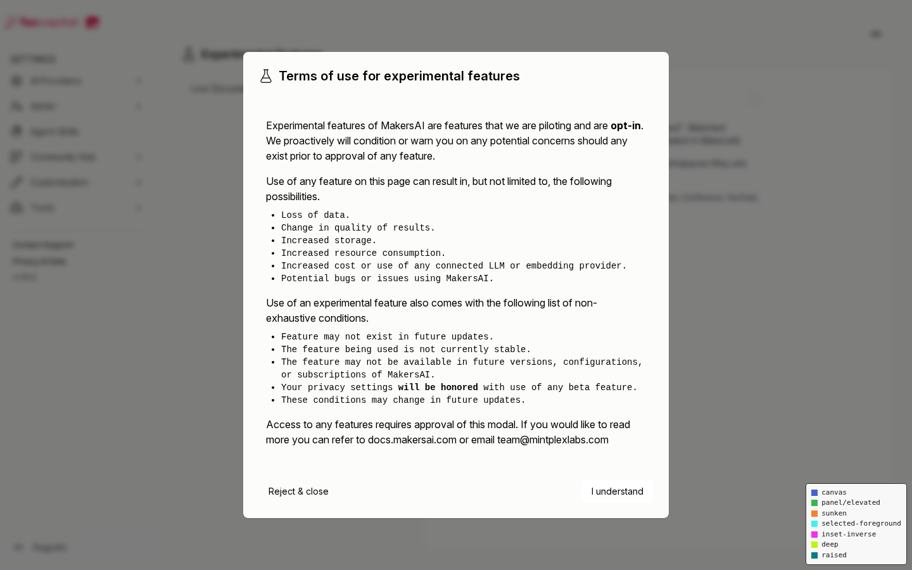

**Tema escuro**

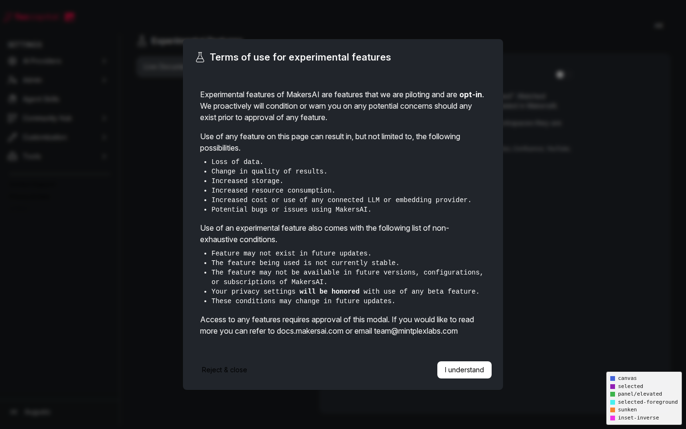

**15 elementos** marcados (claro 7 · escuro 8) — **5 em colisão** (tracejado): mais de um token no mesmo pixel.

<details><summary>o que está marcado no tema claro (7)</summary>

| posição na imagem | elemento | token(s) | propriedade |
|---|---|---|---|
| x0 y0 · 1440×900 | `<html>` "import { injectIntoGlobalHook } from "/@" | `canvas` | background |
| x0 y72 · 252×820 | `<nav>` "SettingsAI ProvidersLLMVector DatabaseEm" · `transition-all duration-slow relative mr-content my-content ` | `canvas` | background |
| x384 y82 · 672×736 | `<div>` "Terms of use for experimental featuresEx" · `w-full max-w-2xl bg-theme-bg-secondary rounded-lg shadow ove` | `panel/elevated` | background |
| x670 y112 · 738×756 | `<div>` "Automatic Document Content SyncEnable th" · `bg-theme-bg-secondary text-content-primary rounded-xl flex-1` | `panel/elevated` | background |
| x286 y118 · 360×44 | `<div>` "Live Document SyncOff" · `bg-theme-bg-secondary text-content-primary rounded-xl min-w-` | **colisão:** `panel/elevated` + `canvas` | background |
| x1166 y147 · 36×19 | `<div>` · `
 relative shrink-0 peer pointer-events-none rounded-full
 h` | **colisão:** `sunken` + `selected-foreground` + `inset-inverse` + `deep` | background |
| x918 y758 · 114×36 | `<button>` "I understand" · `px-4 py-2 rounded-lg text-sm bg-static-white text-static-bla` | `raised` | background |

</details>

<details><summary>o que está marcado no tema escuro (8)</summary>

| posição na imagem | elemento | token(s) | propriedade |
|---|---|---|---|
| x0 y0 · 1440×900 | `<html>` "import { injectIntoGlobalHook } from "/@" | `canvas` | background |
| x0 y72 · 252×820 | `<nav>` "SettingsAI ProvidersLLMVector DatabaseEm" · `transition-all duration-slow relative mr-content my-content ` | `canvas` | background |
| x384 y82 · 672×736 | `<div>` "Terms of use for experimental featuresEx" · `w-full max-w-2xl bg-theme-bg-secondary rounded-lg shadow ove` | **colisão:** `panel/elevated` + `selected-foreground` | background |
| x670 y112 · 738×756 | `<div>` "Automatic Document Content SyncEnable th" · `bg-theme-bg-secondary text-content-primary rounded-xl flex-1` | **colisão:** `panel/elevated` + `selected-foreground` | background |
| x286 y118 · 360×44 | `<div>` "Live Document SyncOff" · `bg-theme-bg-secondary text-content-primary rounded-xl min-w-` | **colisão:** `panel/elevated` + `selected-foreground` | background |
| x1166 y147 · 36×19 | `<div>` · `
 relative shrink-0 peer pointer-events-none rounded-full
 h` | `sunken` | background |
| x918 y758 · 114×36 | `<button>` "I understand" · `px-4 py-2 rounded-lg text-sm bg-static-white text-static-bla` | `inset-inverse` | background |
| x0 y839 · 251×41 | `<div>` "ABAugusto" · `relative px-s8 pt-s8 border-t border-sidebar-divider` | `selected` | borda |

</details>


#### `settings_system_prompt_vars` — `/settings/system-prompt-variables`


**Tema claro**

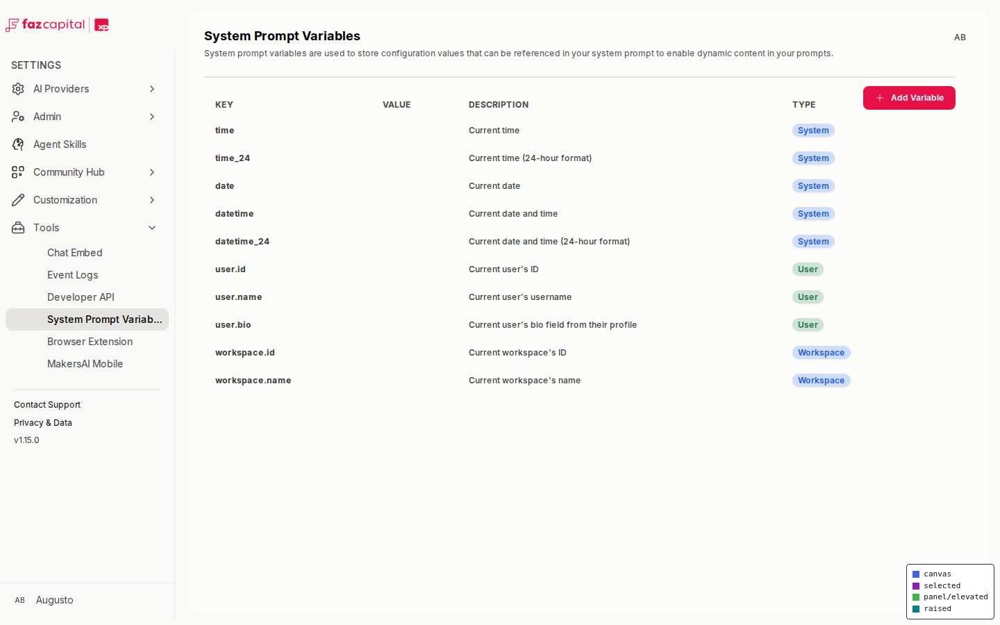

**Tema escuro**

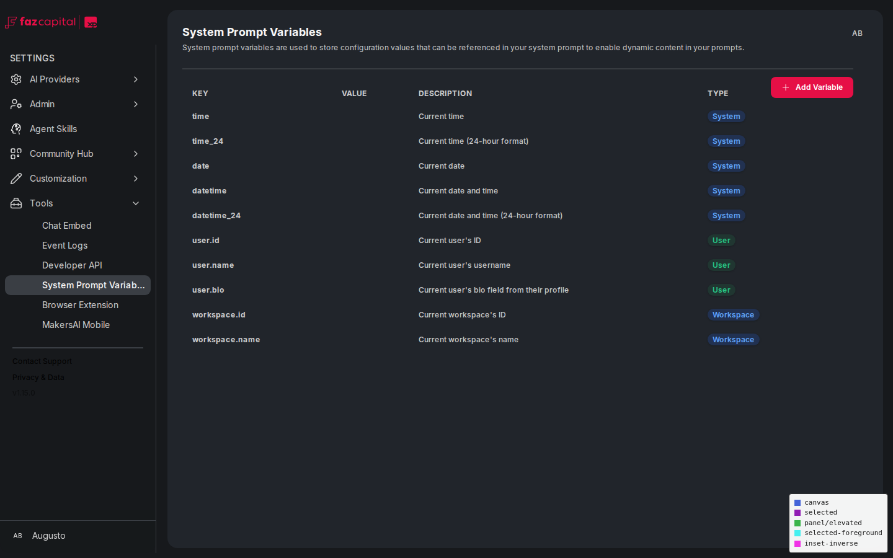

**13 elementos** marcados (claro 6 · escuro 7) — **1 em colisão** (tracejado): mais de um token no mesmo pixel.

<details><summary>o que está marcado no tema claro (6)</summary>

| posição na imagem | elemento | token(s) | propriedade |
|---|---|---|---|
| x0 y0 · 1440×900 | `<html>` "import { injectIntoGlobalHook } from "/@" | `canvas` | background |
| x270 y16 · 1154×868 | `<main>` "System Prompt VariablesSystem prompt var" · `relative md:ml-s2 md:mr-content md:my-content md:rounded-ove` | `panel/elevated` | background |
| x0 y72 · 252×820 | `<nav>` "SettingsAI ProvidersLLMVector DatabaseEm" · `transition-all duration-slow relative mr-content my-content ` | `canvas` | background |
| x1243 y124 · 133×34 | `<button>` "Add Variable" · `border-none text-xs px-4 py-1 font-semibold rounded-lg bg-pr` | `raised` | texto |
| x1259 y133 · 101×16 | `<div>` "Add Variable" · `flex items-center justify-center gap-2` | `raised` | texto |
| x8 y444 · 235×32 | `<div>` "System Prompt Variables" · `nav-row w-full justify-between nav-row-child nav-row-selecte` | `selected` | background |

</details>

<details><summary>o que está marcado no tema escuro (7)</summary>

| posição na imagem | elemento | token(s) | propriedade |
|---|---|---|---|
| x0 y0 · 1440×900 | `<html>` "import { injectIntoGlobalHook } from "/@" | `canvas` | background |
| x270 y16 · 1154×868 | `<main>` "System Prompt VariablesSystem prompt var" · `relative md:ml-s2 md:mr-content md:my-content md:rounded-ove` | **colisão:** `panel/elevated` + `selected-foreground` | background |
| x0 y72 · 252×820 | `<nav>` "SettingsAI ProvidersLLMVector DatabaseEm" · `transition-all duration-slow relative mr-content my-content ` | `canvas` | background |
| x1243 y124 · 133×34 | `<button>` "Add Variable" · `border-none text-xs px-4 py-1 font-semibold rounded-lg bg-pr` | `inset-inverse` | texto |
| x1259 y133 · 101×16 | `<div>` "Add Variable" · `flex items-center justify-center gap-2` | `inset-inverse` | texto |
| x8 y444 · 235×32 | `<div>` "System Prompt Variables" · `nav-row w-full justify-between nav-row-child nav-row-selecte` | `selected` | background |
| x0 y839 · 251×41 | `<div>` "ABAugusto" · `relative px-s8 pt-s8 border-t border-sidebar-divider` | `selected` | borda |

</details>


#### `settings_workspace_chats` — `/settings/workspace-chats`


**Tema claro**

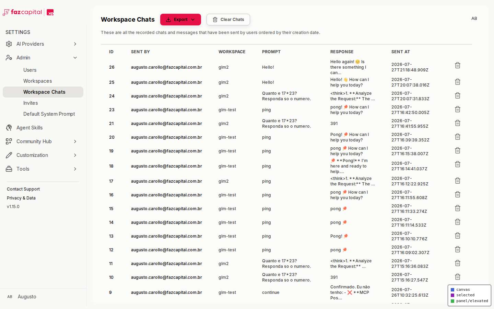

**Tema escuro**

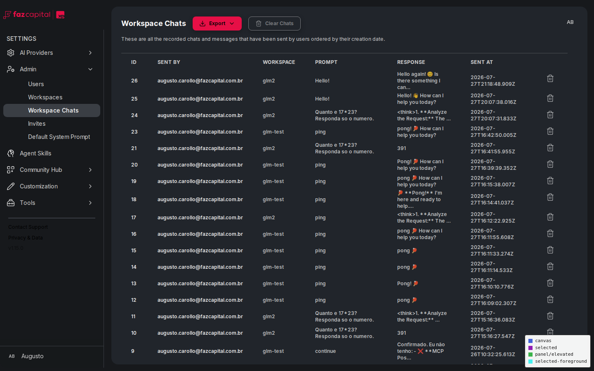

**9 elementos** marcados (claro 4 · escuro 5) — **1 em colisão** (tracejado): mais de um token no mesmo pixel.

<details><summary>o que está marcado no tema claro (4)</summary>

| posição na imagem | elemento | token(s) | propriedade |
|---|---|---|---|
| x0 y0 · 1440×900 | `<html>` "import { injectIntoGlobalHook } from "/@" | `canvas` | background |
| x270 y16 · 1154×868 | `<main>` "Workspace ChatsExportCSVJSONJSONLJSON (A" · `relative md:ml-s2 md:mr-content md:my-content md:rounded-ove` | `panel/elevated` | background |
| x0 y72 · 252×820 | `<nav>` "SettingsAI ProvidersLLMVector DatabaseEm" · `transition-all duration-slow relative mr-content my-content ` | `canvas` | background |
| x8 y252 · 235×32 | `<div>` "Workspace Chats" · `nav-row w-full justify-between nav-row-child nav-row-selecte` | `selected` | background |

</details>

<details><summary>o que está marcado no tema escuro (5)</summary>

| posição na imagem | elemento | token(s) | propriedade |
|---|---|---|---|
| x0 y0 · 1440×900 | `<html>` "import { injectIntoGlobalHook } from "/@" | `canvas` | background |
| x270 y16 · 1154×868 | `<main>` "Workspace ChatsExportCSVJSONJSONLJSON (A" · `relative md:ml-s2 md:mr-content md:my-content md:rounded-ove` | **colisão:** `panel/elevated` + `selected-foreground` | background |
| x0 y72 · 252×820 | `<nav>` "SettingsAI ProvidersLLMVector DatabaseEm" · `transition-all duration-slow relative mr-content my-content ` | `canvas` | background |
| x8 y252 · 235×32 | `<div>` "Workspace Chats" · `nav-row w-full justify-between nav-row-child nav-row-selecte` | `selected` | background |
| x0 y839 · 251×41 | `<div>` "ABAugusto" · `relative px-s8 pt-s8 border-t border-sidebar-divider` | `selected` | borda |

</details>


#### `settings_transcription` — `/settings/transcription-preference`


**Tema claro**

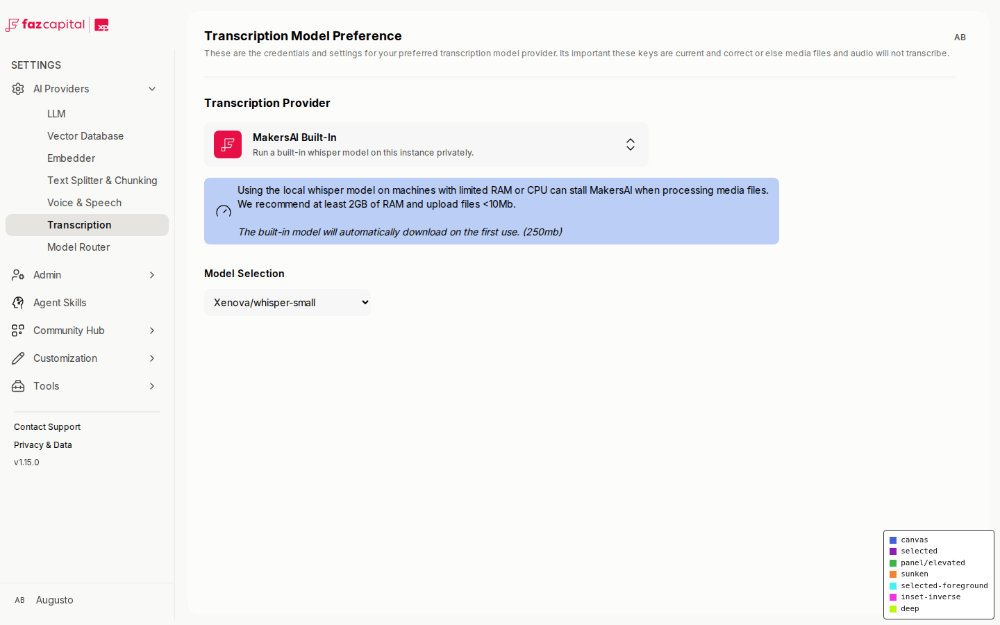

**Tema escuro**

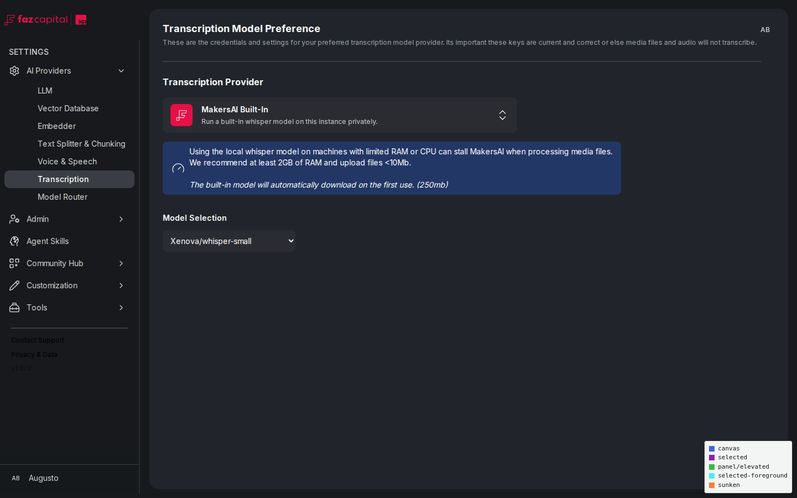

**13 elementos** marcados (claro 6 · escuro 7) — **3 em colisão** (tracejado): mais de um token no mesmo pixel.

<details><summary>o que está marcado no tema claro (6)</summary>

| posição na imagem | elemento | token(s) | propriedade |
|---|---|---|---|
| x0 y0 · 1440×900 | `<html>` "import { injectIntoGlobalHook } from "/@" | `canvas` | background |
| x270 y16 · 1154×868 | `<main>` "Transcription Model PreferenceThese are " · `relative md:ml-s2 md:mr-content md:my-content md:rounded-ove` | `panel/elevated` | background |
| x0 y72 · 252×820 | `<nav>` "SettingsAI ProvidersLLMVector DatabaseEm" · `transition-all duration-slow relative mr-content my-content ` | `canvas` | background |
| x294 y176 · 640×64 | `<button>` "MakersAI Built-InRun a built-in whisper " · `w-full max-w-[640px] h-[64px] bg-theme-settings-input-bg rou` | **colisão:** `sunken` + `selected-foreground` + `inset-inverse` + `deep` | background |
| x8 y308 · 235×32 | `<div>` "Transcription" · `nav-row w-full justify-between nav-row-child nav-row-selecte` | `selected` | background |
| x294 y416 · 240×39 | `<select>` "Xenova/whisper-smallXenova/whisper-large" · `border-none bg-theme-settings-input-bg text-content-primary ` | **colisão:** `sunken` + `selected-foreground` + `inset-inverse` + `deep` | background |

</details>

<details><summary>o que está marcado no tema escuro (7)</summary>

| posição na imagem | elemento | token(s) | propriedade |
|---|---|---|---|
| x0 y0 · 1440×900 | `<html>` "import { injectIntoGlobalHook } from "/@" | `canvas` | background |
| x270 y16 · 1154×868 | `<main>` "Transcription Model PreferenceThese are " · `relative md:ml-s2 md:mr-content md:my-content md:rounded-ove` | **colisão:** `panel/elevated` + `selected-foreground` | background |
| x0 y72 · 252×820 | `<nav>` "SettingsAI ProvidersLLMVector DatabaseEm" · `transition-all duration-slow relative mr-content my-content ` | `canvas` | background |
| x294 y176 · 640×64 | `<button>` "MakersAI Built-InRun a built-in whisper " · `w-full max-w-[640px] h-[64px] bg-theme-settings-input-bg rou` | `sunken` | background |
| x8 y308 · 235×32 | `<div>` "Transcription" · `nav-row w-full justify-between nav-row-child nav-row-selecte` | `selected` | background |
| x294 y416 · 240×39 | `<select>` "Xenova/whisper-smallXenova/whisper-large" · `border-none bg-theme-settings-input-bg text-content-primary ` | `sunken` | background |
| x0 y839 · 251×41 | `<div>` "ABAugusto" · `relative px-s8 pt-s8 border-t border-sidebar-divider` | `selected` | borda |

</details>


#### `settings_mobile_connections` — `/settings/mobile-connections`


**Tema claro**

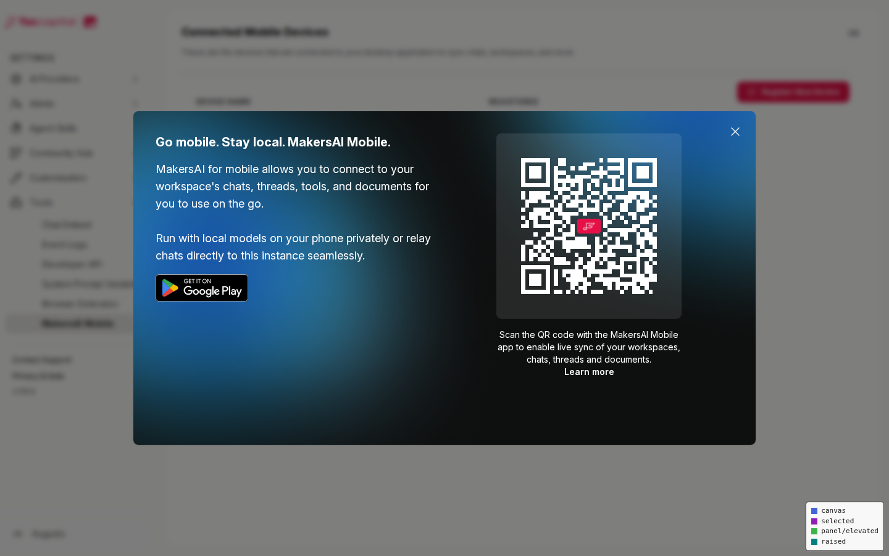

**Tema escuro**

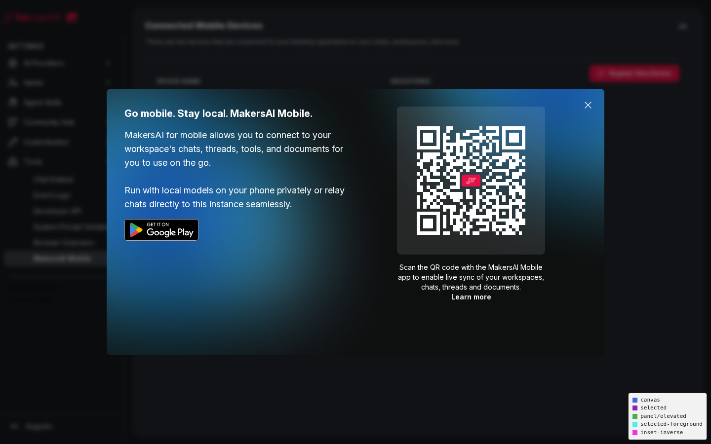

**21 elementos** marcados (claro 10 · escuro 11) — **1 em colisão** (tracejado): mais de um token no mesmo pixel.

<details><summary>o que está marcado no tema claro (10)</summary>

| posição na imagem | elemento | token(s) | propriedade |
|---|---|---|---|
| x0 y0 · 1440×900 | `<html>` "import { injectIntoGlobalHook } from "/@" | `canvas` | background |
| x270 y16 · 1154×868 | `<main>` "Connected Mobile DevicesThese are the de" · `relative md:ml-s2 md:mr-content md:my-content md:rounded-ove` | `panel/elevated` | background |
| x0 y72 · 252×820 | `<nav>` "SettingsAI ProvidersLLMVector DatabaseEm" · `transition-all duration-slow relative mr-content my-content ` | `canvas` | background |
| x1194 y132 · 182×34 | `<button>` "Register New Device" · `border-none text-xs px-4 py-1 font-semibold rounded-lg bg-pr` | `raised` | texto |
| x1210 y141 · 150×16 | `<div>` "Register New Device" · `flex items-center justify-center gap-2` | `raised` | texto |
| x252 y216 · 468×28 | `<p>` "Go mobile. Stay local. MakersAI Mobile." · `text-static-white text-xl font-bold` | `raised` | texto |
| x252 y260 · 468×168 | `<p>` "MakersAI for mobile allows you to connec" · `text-static-white text-lg` | `raised` | texto |
| x8 y508 · 235×32 | `<div>` "MakersAI Mobile" · `nav-row w-full justify-between nav-row-child nav-row-selecte` | `selected` | background |
| x804 y532 · 300×80 | `<p>` "Scan the QR code with the MakersAI Mobil" · `text-static-white text-sm w-[300px] text-center` | `raised` | texto |
| x914 y593 · 81×17 | `<a>` "Learn more" · `text-cta-button font-semibold` | `raised` | texto |

</details>

<details><summary>o que está marcado no tema escuro (11)</summary>

| posição na imagem | elemento | token(s) | propriedade |
|---|---|---|---|
| x0 y0 · 1440×900 | `<html>` "import { injectIntoGlobalHook } from "/@" | `canvas` | background |
| x270 y16 · 1154×868 | `<main>` "Connected Mobile DevicesThese are the de" · `relative md:ml-s2 md:mr-content md:my-content md:rounded-ove` | **colisão:** `panel/elevated` + `selected-foreground` | background |
| x0 y72 · 252×820 | `<nav>` "SettingsAI ProvidersLLMVector DatabaseEm" · `transition-all duration-slow relative mr-content my-content ` | `canvas` | background |
| x1194 y132 · 182×34 | `<button>` "Register New Device" · `border-none text-xs px-4 py-1 font-semibold rounded-lg bg-pr` | `inset-inverse` | texto |
| x1210 y141 · 150×16 | `<div>` "Register New Device" · `flex items-center justify-center gap-2` | `inset-inverse` | texto |
| x252 y216 · 468×28 | `<p>` "Go mobile. Stay local. MakersAI Mobile." · `text-static-white text-xl font-bold` | `inset-inverse` | texto |
| x252 y260 · 468×168 | `<p>` "MakersAI for mobile allows you to connec" · `text-static-white text-lg` | `inset-inverse` | texto |
| x8 y508 · 235×32 | `<div>` "MakersAI Mobile" · `nav-row w-full justify-between nav-row-child nav-row-selecte` | `selected` | background |
| x804 y532 · 300×80 | `<p>` "Scan the QR code with the MakersAI Mobil" · `text-static-white text-sm w-[300px] text-center` | `inset-inverse` | texto |
| x914 y593 · 81×17 | `<a>` "Learn more" · `text-cta-button font-semibold` | `inset-inverse` | texto |
| x0 y839 · 251×41 | `<div>` "ABAugusto" · `relative px-s8 pt-s8 border-t border-sidebar-divider` | `selected` | borda |

</details>


#### `ws_general_appearance` — `/workspace/glm-test/settings/general-appearance`


**Tema claro**

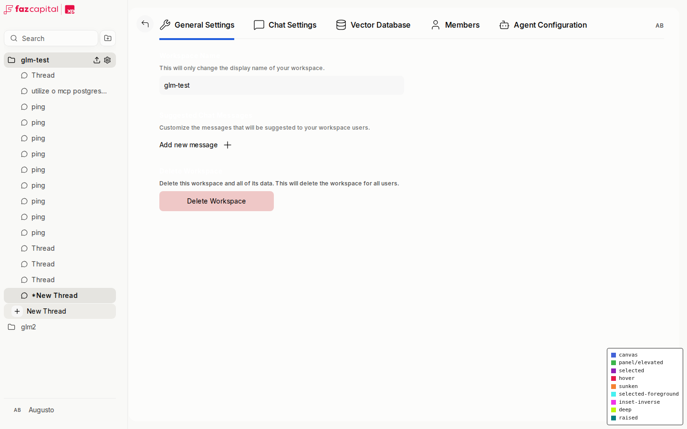

**Tema escuro**

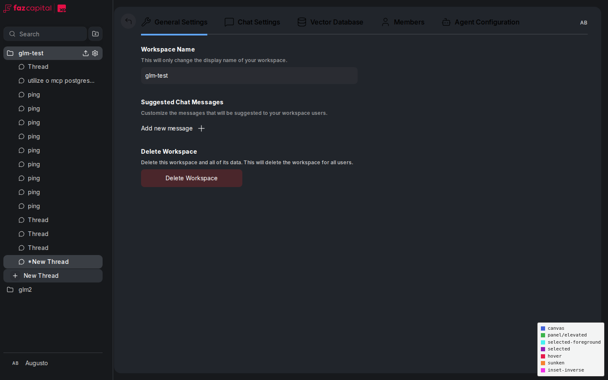

**30 elementos** marcados (claro 15 · escuro 15) — **7 em colisão** (tracejado): mais de um token no mesmo pixel.

<details><summary>o que está marcado no tema claro (15)</summary>

| posição na imagem | elemento | token(s) | propriedade |
|---|---|---|---|
| x0 y0 · 1440×900 | `<html>` "import { injectIntoGlobalHook } from "/@" | `canvas` | background |
| x270 y16 · 1154×868 | `<main>` "General SettingsChat SettingsVector Data" · `transition-all duration-slow relative md:ml-s2 md:mr-content` | `panel/elevated` | background |
| x286 y32 · 36×36 | `<a>` · `absolute top-2 left-2 md:top-4 md:left-4 transition-all dura` | **colisão:** `sunken` + `selected-foreground` + `inset-inverse` + `deep` | background |
| x0 y48 · 251×836 | `<nav>` "glm-testThread utilize o mcp postgres… p" · `relative mr-content my-content bg-sidebar-bg min-w-[250px] p` | `canvas` | background |
| x9 y64 · 196×32 | `<input>` · `prompt-box w-full h-full rounded-lg bg-sidebar-field-bg pl-9` | `panel/elevated` | background |
| x210 y64 · 32×32 | `<button>` · `prompt-box flex h-8 w-8 flex-none box-border items-center ju` | `panel/elevated` | background |
| x334 y106 · 513×21 | `<label>` "Workspace Name" · `block input-label` | `raised` | texto |
| x8 y110 · 235×32 | `<a>` "glm-test" · `nav-row grow w-[75%] justify-start nav-row-selected` | `selected` | background |
| x334 y159 · 513×40 | `<input>` · `border-none bg-theme-settings-input-bg text-content-primary ` | **colisão:** `sunken` + `selected-foreground` + `inset-inverse` + `deep` | background |
| x334 y231 · 1026×21 | `<label>` "Suggested Chat Messages" · `block input-label` | `raised` | texto |
| x334 y348 · 1026×21 | `<label>` "Delete Workspace" · `block input-label` | `raised` | texto |
| x8 y604 · 235×32 | `<div>` "*New Thread" · `nav-row nav-row-child w-full justify-between pr-2 group/thre` | `selected` | background |
| x8 y637 · 235×32 | `<button>` "New Thread" · `w-full relative flex h-8 items-center border-none bg-sidebar` | `hover` | background |
| x24 y641 · 24×24 | `<div>` · `bg-button-icon-background-color p-2 rounded-lg h-[24px] w-[2` | **colisão:** `sunken` + `selected-foreground` + `inset-inverse` + `deep` | background |
| x8 y835 · 235×41 | `<div>` "ABAugusto" · `shrink-0 rounded-b-overlay bg-sidebar-bg` | `canvas` | background |

</details>

<details><summary>o que está marcado no tema escuro (15)</summary>

| posição na imagem | elemento | token(s) | propriedade |
|---|---|---|---|
| x0 y0 · 1440×900 | `<html>` "import { injectIntoGlobalHook } from "/@" | `canvas` | background |
| x270 y16 · 1154×868 | `<main>` "General SettingsChat SettingsVector Data" · `transition-all duration-slow relative md:ml-s2 md:mr-content` | **colisão:** `panel/elevated` + `selected-foreground` | background |
| x286 y32 · 36×36 | `<a>` · `absolute top-2 left-2 md:top-4 md:left-4 transition-all dura` | `sunken` | background |
| x0 y48 · 251×836 | `<nav>` "glm-testThread utilize o mcp postgres… p" · `relative mr-content my-content bg-sidebar-bg min-w-[250px] p` | `canvas` | background |
| x9 y64 · 196×32 | `<input>` · `prompt-box w-full h-full rounded-lg bg-sidebar-field-bg pl-9` | **colisão:** `panel/elevated` + `selected-foreground` | background |
| x210 y64 · 32×32 | `<button>` · `prompt-box flex h-8 w-8 flex-none box-border items-center ju` | **colisão:** `panel/elevated` + `selected-foreground` | background |
| x334 y106 · 513×21 | `<label>` "Workspace Name" · `block input-label` | `inset-inverse` | texto |
| x8 y110 · 235×32 | `<a>` "glm-test" · `nav-row grow w-[75%] justify-start nav-row-selected` | `selected` | background |
| x334 y159 · 513×40 | `<input>` · `border-none bg-theme-settings-input-bg text-content-primary ` | `sunken` | background |
| x334 y231 · 1026×21 | `<label>` "Suggested Chat Messages" · `block input-label` | `inset-inverse` | texto |
| x334 y348 · 1026×21 | `<label>` "Delete Workspace" · `block input-label` | `inset-inverse` | texto |
| x8 y604 · 235×32 | `<div>` "*New Thread" · `nav-row nav-row-child w-full justify-between pr-2 group/thre` | `selected` | background |
| x8 y637 · 235×32 | `<button>` "New Thread" · `w-full relative flex h-8 items-center border-none bg-sidebar` | `hover` | background |
| x24 y641 · 24×24 | `<div>` · `bg-button-icon-background-color p-2 rounded-lg h-[24px] w-[2` | `sunken` | background |
| x8 y835 · 235×41 | `<div>` "ABAugusto" · `shrink-0 rounded-b-overlay bg-sidebar-bg` | **colisão:** `canvas` + `selected` | background, borda |

</details>


#### `ws_vector_database` — `/workspace/glm-test/settings/vector-database`


**Tema claro**

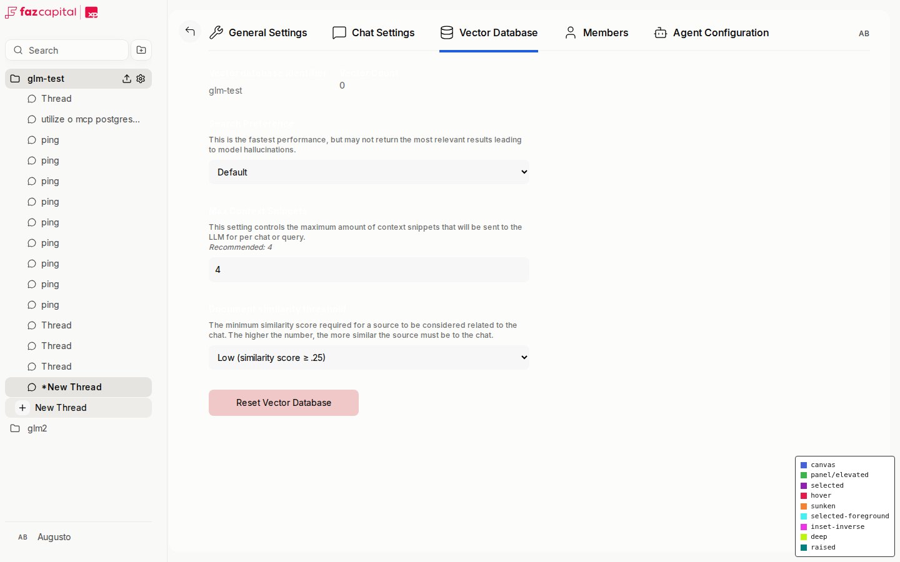

**Tema escuro**

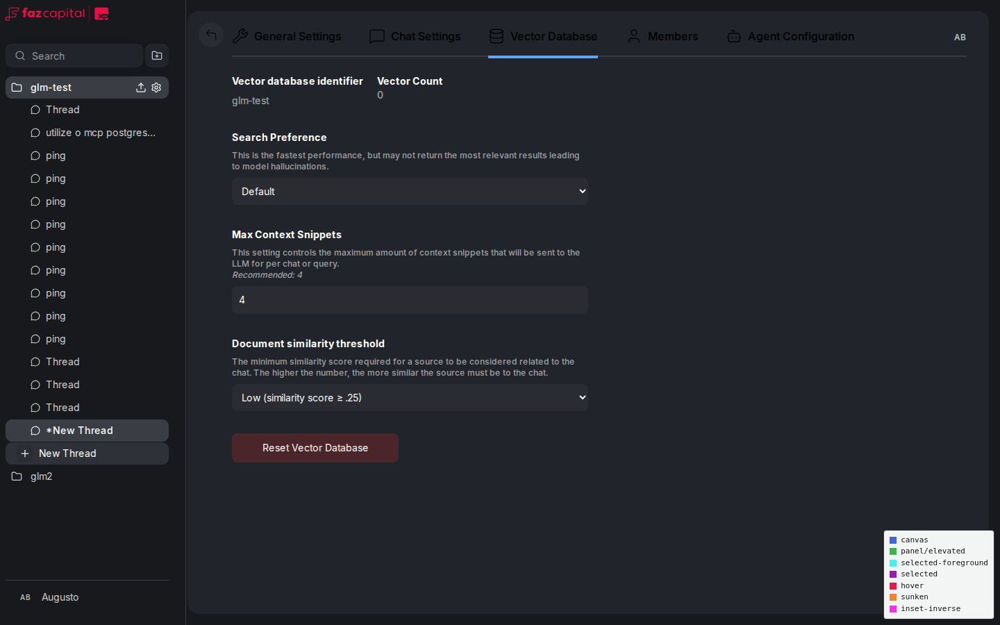

**38 elementos** marcados (claro 19 · escuro 19) — **9 em colisão** (tracejado): mais de um token no mesmo pixel.

<details><summary>o que está marcado no tema claro (19)</summary>

| posição na imagem | elemento | token(s) | propriedade |
|---|---|---|---|
| x0 y0 · 1440×900 | `<html>` "import { injectIntoGlobalHook } from "/@" | `canvas` | background |
| x270 y16 · 1154×868 | `<main>` "General SettingsChat SettingsVector Data" · `transition-all duration-slow relative md:ml-s2 md:mr-content` | `panel/elevated` | background |
| x286 y32 · 36×36 | `<a>` · `absolute top-2 left-2 md:top-4 md:left-4 transition-all dura` | **colisão:** `sunken` + `selected-foreground` + `inset-inverse` + `deep` | background |
| x0 y48 · 251×836 | `<nav>` "glm-testThread utilize o mcp postgres… p" · `relative mr-content my-content bg-sidebar-bg min-w-[250px] p` | `canvas` | background |
| x9 y64 · 196×32 | `<input>` · `prompt-box w-full h-full rounded-lg bg-sidebar-field-bg pl-9` | `panel/elevated` | background |
| x210 y64 · 32×32 | `<button>` · `prompt-box flex h-8 w-8 flex-none box-border items-center ju` | `panel/elevated` | background |
| x334 y106 · 189×21 | `<h3>` "Vector database identifier" · `input-label` | `raised` | texto |
| x543 y106 · 95×21 | `<h3>` "Vector Count" · `input-label` | `raised` | texto |
| x8 y110 · 235×32 | `<a>` "glm-test" · `nav-row grow w-[75%] justify-start nav-row-selected` | `selected` | background |
| x334 y187 · 513×21 | `<label>` "Search Preference" · `block input-label` | `raised` | texto |
| x334 y256 · 513×39 | `<select>` "DefaultAccuracy Optimized" · `border-none bg-theme-settings-input-bg text-content-primary ` | **colisão:** `sunken` + `selected-foreground` + `inset-inverse` + `deep` | background |
| x334 y327 · 513×21 | `<label>` "Max Context Snippets" · `block input-label` | `raised` | texto |
| x334 y412 · 513×40 | `<input>` · `border-none bg-theme-settings-input-bg text-content-primary ` | **colisão:** `sunken` + `selected-foreground` + `inset-inverse` + `deep` | background |
| x334 y484 · 513×21 | `<label>` "Document similarity threshold" · `block input-label` | `raised` | texto |
| x334 y553 · 513×39 | `<select>` "No restrictionLow (similarity score ≥ .2" · `border-none bg-theme-settings-input-bg text-content-primary ` | **colisão:** `sunken` + `selected-foreground` + `inset-inverse` + `deep` | background |
| x8 y604 · 235×32 | `<div>` "*New Thread" · `nav-row nav-row-child w-full justify-between pr-2 group/thre` | `selected` | background |
| x8 y637 · 235×32 | `<button>` "New Thread" · `w-full relative flex h-8 items-center border-none bg-sidebar` | `hover` | background |
| x24 y641 · 24×24 | `<div>` · `bg-button-icon-background-color p-2 rounded-lg h-[24px] w-[2` | **colisão:** `sunken` + `selected-foreground` + `inset-inverse` + `deep` | background |
| x8 y835 · 235×41 | `<div>` "ABAugusto" · `shrink-0 rounded-b-overlay bg-sidebar-bg` | `canvas` | background |

</details>

<details><summary>o que está marcado no tema escuro (19)</summary>

| posição na imagem | elemento | token(s) | propriedade |
|---|---|---|---|
| x0 y0 · 1440×900 | `<html>` "import { injectIntoGlobalHook } from "/@" | `canvas` | background |
| x270 y16 · 1154×868 | `<main>` "General SettingsChat SettingsVector Data" · `transition-all duration-slow relative md:ml-s2 md:mr-content` | **colisão:** `panel/elevated` + `selected-foreground` | background |
| x286 y32 · 36×36 | `<a>` · `absolute top-2 left-2 md:top-4 md:left-4 transition-all dura` | `sunken` | background |
| x0 y48 · 251×836 | `<nav>` "glm-testThread utilize o mcp postgres… p" · `relative mr-content my-content bg-sidebar-bg min-w-[250px] p` | `canvas` | background |
| x9 y64 · 196×32 | `<input>` · `prompt-box w-full h-full rounded-lg bg-sidebar-field-bg pl-9` | **colisão:** `panel/elevated` + `selected-foreground` | background |
| x210 y64 · 32×32 | `<button>` · `prompt-box flex h-8 w-8 flex-none box-border items-center ju` | **colisão:** `panel/elevated` + `selected-foreground` | background |
| x334 y106 · 189×21 | `<h3>` "Vector database identifier" · `input-label` | `inset-inverse` | texto |
| x543 y106 · 95×21 | `<h3>` "Vector Count" · `input-label` | `inset-inverse` | texto |
| x8 y110 · 235×32 | `<a>` "glm-test" · `nav-row grow w-[75%] justify-start nav-row-selected` | `selected` | background |
| x334 y187 · 513×21 | `<label>` "Search Preference" · `block input-label` | `inset-inverse` | texto |
| x334 y256 · 513×39 | `<select>` "DefaultAccuracy Optimized" · `border-none bg-theme-settings-input-bg text-content-primary ` | `sunken` | background |
| x334 y327 · 513×21 | `<label>` "Max Context Snippets" · `block input-label` | `inset-inverse` | texto |
| x334 y412 · 513×40 | `<input>` · `border-none bg-theme-settings-input-bg text-content-primary ` | `sunken` | background |
| x334 y484 · 513×21 | `<label>` "Document similarity threshold" · `block input-label` | `inset-inverse` | texto |
| x334 y553 · 513×39 | `<select>` "No restrictionLow (similarity score ≥ .2" · `border-none bg-theme-settings-input-bg text-content-primary ` | `sunken` | background |
| x8 y604 · 235×32 | `<div>` "*New Thread" · `nav-row nav-row-child w-full justify-between pr-2 group/thre` | `selected` | background |
| x8 y637 · 235×32 | `<button>` "New Thread" · `w-full relative flex h-8 items-center border-none bg-sidebar` | `hover` | background |
| x24 y641 · 24×24 | `<div>` · `bg-button-icon-background-color p-2 rounded-lg h-[24px] w-[2` | `sunken` | background |
| x8 y835 · 235×41 | `<div>` "ABAugusto" · `shrink-0 rounded-b-overlay bg-sidebar-bg` | **colisão:** `canvas` + `selected` | background, borda |

</details>


#### `ws_thread_ativa` — `/workspace/glm-test/t/5ee546b3-f567-41be-b8a9-5e3b52df6d5a`


**Tema claro**

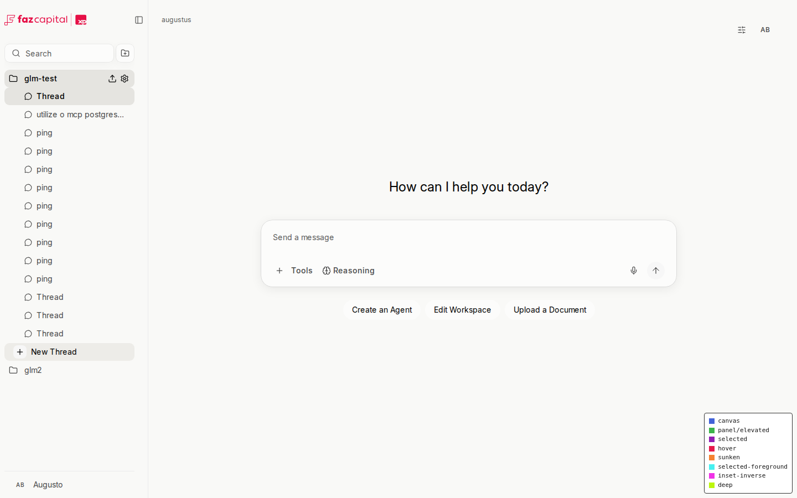

**Tema escuro**

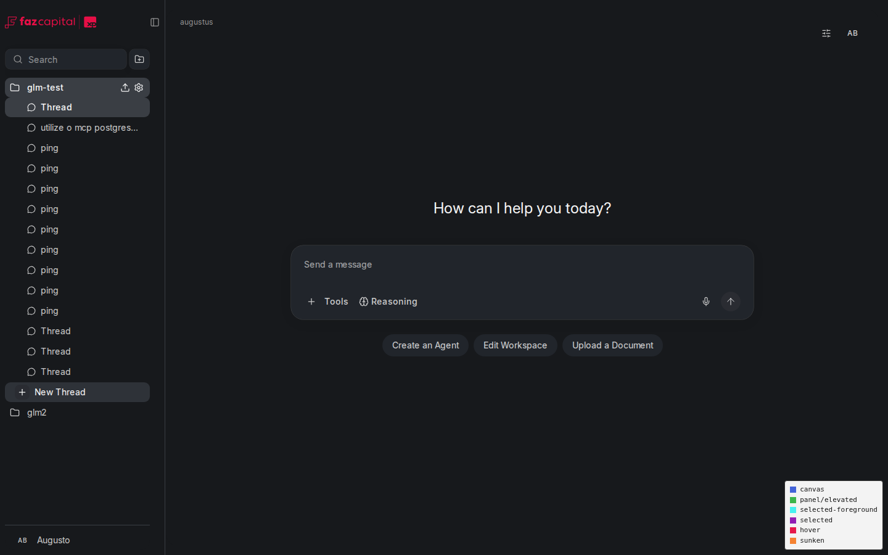

**30 elementos** marcados (claro 15 · escuro 15) — **9 em colisão** (tracejado): mais de um token no mesmo pixel.

<details><summary>o que está marcado no tema claro (15)</summary>

| posição na imagem | elemento | token(s) | propriedade |
|---|---|---|---|
| x0 y0 · 1440×900 | `<html>` "import { injectIntoGlobalHook } from "/@" | `canvas` | background |
| x270 y16 · 1154×868 | `<main>` "augustusAdd anythingDrop a file or image" · `bg-chatarea-bg flex-1 min-w-0 relative md:rounded-overlay w-` | `canvas` | background |
| x0 y64 · 251×836 | `<nav>` "glm-testThread utilize o mcp postgres… p" · `relative mr-content my-content bg-sidebar-bg min-w-[250px] p` | `canvas` | background |
| x9 y80 · 196×32 | `<input>` · `prompt-box w-full h-full rounded-lg bg-sidebar-field-bg pl-9` | `panel/elevated` | background |
| x210 y80 · 32×32 | `<button>` · `prompt-box flex h-8 w-8 flex-none box-border items-center ju` | `panel/elevated` | background |
| x8 y126 · 235×32 | `<a>` "glm-test" · `nav-row grow w-[75%] justify-start nav-row-selected` | `selected` | background |
| x8 y158 · 235×32 | `<div>` "Thread" · `nav-row nav-row-child w-full justify-between pr-2 group/thre` | `selected` | background |
| x472 y398 · 750×120 | `<div>` "ToolsReasoningSend prompt message to wor" · `bg-prompt-bg prompt-box rounded-bubble pwa:rounded-3xl flex ` | `panel/elevated` | background |
| x1169 y473 · 32×32 | `<button>` "Send prompt message to workspace" · `border-none flex justify-center items-center rounded-full w-` | **colisão:** `sunken` + `selected-foreground` + `inset-inverse` + `deep` | background |
| x620 y542 · 140×36 | `<button>` "Create an Agent" · `px-4 py-2 rounded-full bg-theme-bg-chat-input text-static-wh` | `panel/elevated` | background |
| x768 y542 · 136×36 | `<button>` "Edit Workspace" · `px-4 py-2 rounded-full bg-theme-bg-chat-input text-static-wh` | `panel/elevated` | background |
| x912 y542 · 163×36 | `<button>` "Upload a Document" · `px-4 py-2 rounded-full bg-theme-bg-chat-input text-static-wh` | `panel/elevated` | background |
| x8 y620 · 235×32 | `<button>` "New Thread" · `w-full relative flex h-8 items-center border-none bg-sidebar` | `hover` | background |
| x24 y624 · 24×24 | `<div>` · `bg-button-icon-background-color p-2 rounded-lg h-[24px] w-[2` | **colisão:** `sunken` + `selected-foreground` + `inset-inverse` + `deep` | background |
| x8 y851 · 235×41 | `<div>` "ABAugusto" · `shrink-0 rounded-b-overlay bg-sidebar-bg` | `canvas` | background |

</details>

<details><summary>o que está marcado no tema escuro (15)</summary>

| posição na imagem | elemento | token(s) | propriedade |
|---|---|---|---|
| x0 y0 · 1440×900 | `<html>` "import { injectIntoGlobalHook } from "/@" | `canvas` | background |
| x270 y16 · 1154×868 | `<main>` "augustusAdd anythingDrop a file or image" · `bg-chatarea-bg flex-1 min-w-0 relative md:rounded-overlay w-` | `canvas` | background |
| x0 y64 · 251×836 | `<nav>` "glm-testThread utilize o mcp postgres… p" · `relative mr-content my-content bg-sidebar-bg min-w-[250px] p` | `canvas` | background |
| x9 y80 · 196×32 | `<input>` · `prompt-box w-full h-full rounded-lg bg-sidebar-field-bg pl-9` | **colisão:** `panel/elevated` + `selected-foreground` | background |
| x210 y80 · 32×32 | `<button>` · `prompt-box flex h-8 w-8 flex-none box-border items-center ju` | **colisão:** `panel/elevated` + `selected-foreground` | background |
| x8 y126 · 235×32 | `<a>` "glm-test" · `nav-row grow w-[75%] justify-start nav-row-selected` | `selected` | background |
| x8 y158 · 235×32 | `<div>` "Thread" · `nav-row nav-row-child w-full justify-between pr-2 group/thre` | `selected` | background |
| x472 y398 · 750×120 | `<div>` "ToolsReasoningSend prompt message to wor" · `bg-prompt-bg prompt-box rounded-bubble pwa:rounded-3xl flex ` | **colisão:** `panel/elevated` + `selected-foreground` | background |
| x1169 y473 · 32×32 | `<button>` "Send prompt message to workspace" · `border-none flex justify-center items-center rounded-full w-` | `sunken` | background |
| x620 y542 · 140×36 | `<button>` "Create an Agent" · `px-4 py-2 rounded-full bg-theme-bg-chat-input text-static-wh` | **colisão:** `panel/elevated` + `selected-foreground` | background |
| x768 y542 · 136×36 | `<button>` "Edit Workspace" · `px-4 py-2 rounded-full bg-theme-bg-chat-input text-static-wh` | **colisão:** `panel/elevated` + `selected-foreground` | background |
| x912 y542 · 163×36 | `<button>` "Upload a Document" · `px-4 py-2 rounded-full bg-theme-bg-chat-input text-static-wh` | **colisão:** `panel/elevated` + `selected-foreground` | background |
| x8 y620 · 235×32 | `<button>` "New Thread" · `w-full relative flex h-8 items-center border-none bg-sidebar` | `hover` | background |
| x24 y624 · 24×24 | `<div>` · `bg-button-icon-background-color p-2 rounded-lg h-[24px] w-[2` | `sunken` | background |
| x8 y851 · 235×41 | `<div>` "ABAugusto" · `shrink-0 rounded-b-overlay bg-sidebar-bg` | **colisão:** `canvas` + `selected` | background, borda |

</details>


**Cobertura que faltou, declarada.** Os prints retratam o estado de REPOUSO.
`surface.hover` tem 337 consumos estáticos e apenas 8 ocorrências renderizadas,
porque a cor só existe com o cursor sobre o elemento — capturar os 337 exige
disparar hover elemento a elemento, o que não foi feito. As 4 tints também não
aparecem: são estados de erro/sucesso/aviso que exigem provocar a condição.

## 4. Método

**Estático** — `frontend/tokens/inventory-surface.mjs`, versionado, conta as três
vias: classe Tailwind, `var()` em CSS e props JS, alias no JSON (tratando `$root`
como token, que foi o 4º ponto cego desta sessão).

**Renderizado** — `frontend/tests/visual/capture-surface-occurrences.mjs` carrega
**17 rotas × 2 temas** e busca cada token pelo **valor computado no DOM vivo**,
não por nome de classe. Isso pega o consumo via `var()` em `style={{}}`, que
nenhum grep de className encontra. Marca cada ocorrência com contorno num overlay
separado — desenhar no próprio elemento mudaria o layout e a foto deixaria de
retratar a tela real.

**531 ocorrências** registradas. Prints em
`docs/design-system/assets/2026-07-28-superficies/` (um PNG por rota × tema,
versionados junto com este doc) e dados em `findings.json` ao lado.

| rota | claro | escuro |
|---|---:|---:|
| `login` | 7 | 5 |
| `home` | 23 | 24 |
| `settings_llm` | 30 | 14 |
| `settings_interface` | 14 | 10 |
| `settings_agents` | 9 | 14 |
| `settings_routers` | 10 | 9 |
| `settings_branding` | 50 | 19 |
| `settings_security` | 5 | 7 |
| `settings_api_keys` | 8 | 10 |
| `settings_beta_features` | 13 | 13 |
| `settings_system_prompt_vars` | 8 | 10 |
| `settings_workspace_chats` | 6 | 8 |
| `settings_transcription` | 14 | 10 |
| `settings_mobile_connections` | 12 | 14 |
| `ws_general_appearance` | 26 | 21 |
| `ws_vector_database` | 36 | 25 |
| `ws_thread_ativa` | 23 | 24 |
## 5. As histórias, por grupo de token

Cada entrada: **componente** · arquivo:linha · **container** (pai imediato e painel
onde vive) · **páginas** · **função** (o que faz na interface) · **história** (de onde
a cor veio, o que quebra se mudar) · **papel real** — que é o insumo para nomear.

### 5.1 raised + emphasis

> **Refutação:** `CORRIGIR` — 28 confirmadas, 5 refutadas, 4 omitidas.

#### nenhum — regra CSS global orfa (.login-input-gradient)

- **arquivo:** `frontend/src/index.css`
- **linhas:** 632-639 (o token esta na linha 636)
- **token:** `surface.raised` · **propriedade:** background
- **container:** Nenhum hoje: nenhum elemento do repo aplica a classe `login-input-gradient` (grep repo-wide, excluindo node_modules, retorna SO a definicao em frontend/src/index.css:632). O ultimo container foi o CARD do login — `<div className="flex flex-col justify-center items-center relative rounded-2xl shadow border-2 border-slate-300 border-opacity-20 w-[400px] login-input-gradient">` — deletado pelo upstream em 11f6419c (2024-04-25).
- **páginas:** 
- **função:** Pintava o degrade de fundo do cartao de 400px que embrulhava usuario/senha na tela de login (apesar do nome, nunca foi o input e sim o card).

**História.** Veio inteira do upstream AnythingLLM: commit 708068a0 "AnythingLLM UI overhaul (#278)" (2023-10-23) escreveu `linear-gradient(180deg, rgba(61,65,71,.3) 0%, rgba(44,47,53,.3) 100%)` com hex cru. O upstream reescreveu a tela em 11f6419c (2024-04-25) e removeu a classe dos dois divs do card, deixando a regra orfa por ~2 anos. Em 2026-07-26 o nosso ratchet anti-hardcode (372f827f, "zera o ratchet de hardcode (943 -> 0)") tokenizou a regra MORTA escolhendo token por proximidade de hex, nao por papel: rgba(44,47,53)=#2C2F35 virou `--color-surface-raised-rgb` (#282C32 no dark) e rgba(61,65,71)=#3D4147 virou `--color-border-strong-rgb` (#48515E) — nenhum dos dois pares e igual. Se surface.raised mudar de valor, nada quebra: o seletor nunca casa.

**Papel real:** *Nenhum papel vivo — e lastro. O papel historico era 'stop inferior de degrade de cartao de autenticacao sobre fundo escuro', que nao tem relacao com 'menus, popovers, flutuantes' (a descricao do token em frontend/tokens/VOCABULARY.md:17).*

#### ReasoningEffortButton (prop `arrowColor` do `<Tooltip>` do react-tooltip que hospeda o ReasoningEffortMenu)

- **arquivo:** `frontend/src/components/WorkspaceChat/ChatContainer/PromptInput/ReasoningEffort/index.jsx`
- **linhas:** 216-220 (o token esta na linha 219)
- **token:** `surface.raised` · **propriedade:** background
- **container:** Prop `arrowColor` do `<Tooltip id="tooltip-reasoning-effort-btn" place="top" className="z-tooltip w-[210px]! bg-popover-bg! p-0! rounded-lg! ... popover-ring">` (linhas 208-222). O tooltip e portalizado para o body e ancora no botao `#reasoning-effort-btn` (icone Brain + rotulo "Raciocinio"), que vive na barra de acoes do prompt: `div.flex.justify-between.items-center.pt-3.5.pb-3` > `div.flex.items-center.gap-x-0.25`, dentro do `.prompt-box` no rodape do chat (frontend/src/components/WorkspaceChat/ChatContainer/PromptInput/index.jsx:369-394).
- **páginas:** `/` · `/workspace/:slug` · `/workspace/:slug/t/:threadSlug`
- **função:** Pinta o bico (triangulo) que gruda o menu de esforco de raciocinio no botao que o abriu.

**História.** Este bloco foi escrito a mao quando o menu saiu do vocabulario legado do fork — o comentario das linhas 190-207 documenta que o padrao anterior (`bg-theme-bg-primary` + borda de 2px, copiado do TextSizeMenu vizinho) foi descartado. O corpo do popover ficou em `bg-popover-bg` (#21252B dark / #FCFCFB light) e o anel de 0,5px em `--color-popover-border` via `.popover-ring` (frontend/src/index.css:1476-1482). O bico, porem, nao repetiu nenhum dos dois: no ramo escuro pegou `--color-surface-raised` (#282C32), que nao e nem o fundo nem a borda do popover. So renderiza quando o servidor confirma que o modelo do workspace aceita `reasoning_effort` (guarda na linha 134) — por isso o dossie nao tem print dele. Mudar surface.raised muda a cor do bico e de mais nada.

**Papel real:** *'Preenchimento do bico/seta de um popover'. O papel exige que a cor seja identica a do FUNDO do popover ao qual o bico esta colado — ou seja, o token correto e `popover.bg`, nao uma superficie de elevacao generica.*

#### TruncatableContent (helper interno de HistoricalMessage)

- **arquivo:** `frontend/src/components/WorkspaceChat/ChatContainer/ChatHistory/HistoricalMessage/index.jsx`
- **linhas:** 272-278 (o token esta na linha 276)
- **token:** `surface.emphasis` · **propriedade:** background
- **container:** `<div className="absolute bottom-0 left-0 right-0 h-[36px] light:hidden pointer-events-none">` sobreposto ao `div.relative` que embrulha o conteudo truncado (linhas 263-267). Esse par vive DENTRO da bolha da mensagem do USUARIO: `div.bg-chat-message-container-background-color.rounded-bubble.rounded-br-none.px-4.py-3.5.max-w-[600px]` (linha 105), alinhada a direita na lista do ChatHistory. A variante `light:` e `.light &` (frontend/tailwind.config.js:275) e a classe `light` e posta no body por frontend/src/hooks/useTheme.js:53 — entao este div so pinta no tema ESCURO.
- **páginas:** `/workspace/:slug` · `/workspace/:slug/t/:threadSlug`
- **função:** E a mascara de esmaecimento que engole as ultimas linhas de uma mensagem longa do usuario, sinalizando 'tem mais texto' antes do botao 'Ver mais'.

**História.** Nasceu hardcoded no upstream: 21ac874c "Implement v2 chat layout designs (#5074)" (2026-03-10) escreveu `linear-gradient(180deg, rgba(39,39,42,0) 0%, rgba(39,39,42,.65) 50%, #27272A 100%)`. Nosso ratchet 372f827f (2026-07-26) trocou os hex por tokens escolhidos pelo VALOR: os dois primeiros stops foram para `ui.fade-scrim` — token criado exatamente para isto, com $description "Cor do fade sobre mensagem longa" (frontend/tokens/color.tokens.json:4444) — e o terceiro caiu em `surface-emphasis` so porque ele vale exatamente #27272A no dark. Resultado: um gradiente, um papel, dois nomes de token. Como o div e `light:hidden`, o valor claro de surface-emphasis (#E4E4E4) nunca chega a pintar. So aparece quando a mensagem do usuario passa de 250px de altura (linha 255) — dai as 0 ocorrencias no print.

**Papel real:** *'Stop opaco de uma mascara de fade-out, obrigado a igualar o fundo do conteiner em que a mascara vive'. E o mesmo papel de `ui.fade-scrim`. Nao e 'superficie de estado selecionado/pressionado', que e como o token se descreve em frontend/tokens/color.tokens.json:3506/4620 e em frontend/tokens/VOCABULARY.md:19.*

#### nenhum — alias de cor no tema do Tailwind

- **arquivo:** `frontend/tailwind.config.js`
- **linhas:** 43
- **token:** `surface.emphasis` · **propriedade:** background
- **container:** Entrada de `theme.extend.colors` (bloco das cores hex-fixas herdadas do fork, linhas 39-62, logo depois do spread da ponte `...dsTokens.colors` na linha 38). Nao tem container de DOM: gera as utilities `bg-/text-/border-historical-msg-system`, e nenhum arquivo do repo usa qualquer uma delas (grep repo-wide por `historical-msg` retorna so as linhas 43-44 do config e uma linha de relatorio historico em .claude/reports/antes-depois/ANTES-list.txt:470).
- **páginas:** 
- **função:** Gerava a utility que, no AnythingLLM original, pintava o fundo da bolha de mensagem do assistente no historico do chat.

**História.** Alias legado do fork, originalmente com hex cru — o irmao `historical-msg-user` aparece como "#21252b" no relatorio de antes (.claude/reports/antes-depois/ANTES-list.txt:470). O upstream apagou os consumidores na reformulacao v2 do chat (21ac874c, o mesmo commit do fade acima: `git log -S "bg-historical-msg-system"` para nele). O alias sobreviveu e, na Fase 8 de tokens, foi religado a `var(--color-surface-emphasis)` junto com os outros aliases do bloco. Trocar surface.emphasis nao muda um pixel por este caminho.

**Papel real:** *Nenhum papel vivo. O papel historico era 'fundo da bolha de mensagem do assistente' — de novo, nada a ver com 'estado selecionado/pressionado'.*

<details><summary>O que a refutação derrubou nesta seção</summary>

- **historia #4 (tailwind.config.js:43) — "Alias legado do fork, originalmente com hex cru"**
  - erro: FALSO. O valor original do alias `historical-msg-system` NUNCA foi hex cru: era `rgba(255, 255, 255, 0.05);` — um WASH TRANSLUCIDO de branco a 5% (com ponto-e-virgula parasita dentro da string), nao uma cor opaca. O relatorio sustenta a afirmacao citando o valor do IRMAO (`historical-msg-user` = #21252b), nao o do token que descreve. A diferenca e material: um overlay de 5% de branco e uma cor OPACA #27272A sao papeis distintos, e isso muda a leitura do que o ratchet fez.
  - evidência: `git show 708068a0 -- frontend/tailwind.config.js → `+ 'historical-msg-system': 'rgba(255, 255, 255, 0.05);',`; git log -L 43,43:frontend/tailwind.config.js → linha anterior a 372f827f = `-        "historical-msg-system": "rgba(255, 255, 255, 0.05);",`; git show c6a4c989:frontend/tailwind.config.js:4`
- **historia #4 — "na Fase 8 de tokens, foi religado a `var(--color-surface-emphasis)` junto com os outros aliases do bloco"**
  - erro: FALSO. A Fase 8 (c6a4c989, "feat(tailwind): ponte dos tokens com canal de alpha, spacing/type/radius e z-index (Fase 8)") apenas adicionou o spread `...dsTokens.colors`; o alias continuou `rgba(255, 255, 255, 0.05);` DEPOIS dela. O religamento para `var(--color-surface-emphasis)` foi feito pelo proprio ratchet 372f827f — o MESMO commit que o relatorio acusa em todos os outros itens. O relatorio atribui a mesma mudanca a dois eventos diferentes e assim isenta o ratchet exatamente no caso em que ele foi mais agressivo.
  - evidência: `git show c6a4c989:frontend/tailwind.config.js Linha 40 (`"historical-msg-system": "rgba(255, 255, 255, 0.05);"`, ja com a ponte instalada); git log -S '"historical-msg-system": "var(--color-surface-emphasis)"' -- frontend/tailwind.config.js → retorna SO 372f827f`
- **funcao/papelReal/historia #4 — "pintava o fundo da bolha de mensagem do assistente" + "O upstream apagou os consumidores**
  - erro: PARCIALMENTE FALSO, e o commit esta trocado. O papel de fundo-de-bolha-do-assistente (`assistantBackgroundColor` / `AI_BACKGROUND_COLOR`) foi apagado por 727d8027 "Light/dark mode UI overhaul (#2629)", NAO por 21ac874c. O unico consumidor que 21ac874c removeu era um BOTAO (`px-2 py-1 bg-historical-msg-system text-white font-medium rounded-md hover:bg-historical-msg-user/90 ...`), introduzido por 26c22050 "[FEAT] Edit message button (#1392)". Ou seja: no momento da morte o alias pintava um botao, nao uma bolha — o `papelReal` declarado descreve um papel que ja estava morto ha ~1,5 ano.
  - evidência: `git show 727d8027 | grep historical-msg-system → `-  const assistantBackgroundColor = "bg-historical-msg-system";` e `-export const AI_BACKGROUND_COLOR = "bg-historical-msg-system";`; git show 21ac874c | grep historical-msg-system → unica linha removida = `-          className="border-none px-2 py-1`
- **achado 3 — "O RATCHET TOKENIZOU POR VALOR ... substituiu hex por token escolhendo o token cujo valor era o mais proximo"**
  - erro: O MECANISMO enunciado nao se sustenta como regra geral e e refutado pelo 4o consumo do proprio grupo. `rgba(255, 255, 255, 0.05)` -> `var(--color-surface-emphasis)` (#27272A dark / #E4E4E4 light) nao e proximidade de valor de forma alguma: e branco translucido virando cinza-escuro opaco. A tese "nao foi por papel" continua de pe, mas a causa declarada ("por proximidade de hex") esta errada em 1 dos 4 casos — e justamente no caso que o relatorio nao auditou (item #4).
  - evidência: `git log -L 43,43:frontend/tailwind.config.js (par antes/depois no commit 372f827f); frontend/src/styles/generated/color-tokens.css Linha 19 (#27272A) e Linha 380 (#E4E4E4)`
- **achado 4 — "a mascara clara termina 38 unidades de R mais escura do que a rampa que a precede E do que a bolha"**
  - erro: NUMERO ERRADO para uma das duas comparacoes. Contra a bolha (#F7F7F7 = R 247) o delta e 38. Contra a RAMPA que a precede (`--color-ui-fade-scrim` = #F1F5F9 = R 241) o delta e 32, nao 38. O relatorio funde os dois deltas num unico numero.
  - evidência: `frontend/src/styles/generated/color-tokens.css Linha 487 (--color-grey-lighter: #D1D5DB, R=209), Linha 610 (--color-ui-fade-scrim: #F1F5F9, R=241), Linha 658 (--color-chat-message-container-background-color: #F7F7F7, R=247). 241-209=32; 247-209=38`

</details>

### 5.2 selected + selected-foreground

> **Refutação:** `CORRIGIR` — 5 confirmadas, 12 refutadas, 13 omitidas.

#### Directory / WorkspaceDirectory (aba Documents do modal ManageWorkspace)

- **arquivo:** `frontend/src/components/Modals/ManageWorkspace/Documents/Directory/index.jsx`
- **linhas:** Directory/index.jsx:289; WorkspaceDirectory/index.jsx:277; WorkspaceDirectory/index.jsx:289
- **token:** `surface.selected (light:bg-) + surface.selected-foreground (text-)` · **propriedade:** background + texto (o par completo, no MESMO elemento)
- **container:** <button> dentro de <div class="mx-auto bg-static-white/40 rounded-lg py-1 px-2 light:shadow-lg">, que vive num <div class="absolute bottom-[12px] left-0 right-0 flex justify-center pointer-events-none"> — uma barra de acao FLUTUANTE ancorada no rodape da coluna de arquivos, dentro do modal ManageWorkspace (ModalWrapper sobre scrim).
- **páginas:** `/` · `/workspace/:slug` · `/workspace/:slug/t/:threadSlug`
- **função:** Sao os botoes de acao em massa que so aparecem quando ha arquivos marcados: "Select all/Deselect all", "Remove selected" (WorkspaceDirectory) e "Move to workspace" (Directory).

**História.** Este e o UNICO lugar dos 15 onde `selected` e `selected-foreground` sao usados como PAR, no mesmo elemento — e por isso e o unico que expoe a regressao. No HEAD commitado o par era neutro INVERTIDO e coerente: no claro fundo #21252B com rotulo #F7F7F7, no escuro fundo #F7F7F7 com rotulo #21252B, 15,39:1 nos dois (git show HEAD:frontend/src/styles/generated/color-tokens.css, Linhas 33-36 e 336-339). A arvore suja re-apontou SO o `selected` (light -> primitive.light.c-e5e4e0, dark -> primitive.dark.c-3a3e44) para atender um caso de uso diferente ("Fundo do item ATIVO", familia quente do #EDECE8 que o dono amostrou) e deixou o `selected-foreground` no valor invertido antigo. Resultado hoje no tema claro: rotulo #F7F7F7 sobre fundo #E5E4E0 = 1,19:1 — o texto do botao some, e so reaparece no hover, quando `hover:light:text-content-primary` (#000000) restaura 17,76:1. Se o dono mudar `selected` sem mudar `selected-foreground` junto, e exatamente aqui que quebra.

**Papel real:** *par fundo+rotulo de botao de acao numa barra flutuante de selecao em massa — NAO e "fundo de item selecionado". O que esta selecionado sao os ARQUIVOS na lista; este botao e a acao que se aplica a eles.*

#### Directory (aba Documents do modal ManageWorkspace)

- **arquivo:** `frontend/src/components/Modals/ManageWorkspace/Documents/Directory/index.jsx`
- **linhas:** 289 (botao rotulado, ja coberto acima), 298, 300, 314
- **token:** `surface.selected (light:bg-) + surface.selected-foreground (text-)` · **propriedade:** background + texto (icone)
- **container:** dois <button> quadrados h-[32px] w-[32px] irmaos do botao rotulado, na mesma <div class="flex flex-row items-center gap-x-2"> da barra flutuante; o 298 tem um <div class="relative"> extra porque ancora o FolderSelectionPopup.
- **páginas:** `/` · `/workspace/:slug` · `/workspace/:slug/t/:threadSlug`
- **função:** Botoes icon-only da mesma barra: mover os arquivos marcados para uma pasta (MoveToFolderIcon, abre popup) e deletar os arquivos marcados (Trash2).

**História.** Mesma barra e mesma cor do arquetipo anterior, mas aqui o alvo do `selected-foreground` e um ICONE, nao texto — e o copy-paste deixou rastro. A Linha 298 (e a 314) carrega `text-surface-selected-foreground` DUAS VEZES na mesma string de className. Pior: a Linha 300 poe `text-dark-text` e `text-surface-selected-foreground` no MESMO elemento — duas utilities da propriedade `color` competindo, decididas por ordem de fonte do CSS e nao por ordem da classe. No tema claro as duas resolvem para quase-branco (`dark-text` = --color-surface-canvas = #F9F9F7; `selected-foreground` = #F7F7F7), entao o icone da 1,21:1 sobre o fundo #E5E4E0 qualquer que ganhe. O icone de deletar (314) esta invisivel no claro ate o mouse passar.

**Papel real:** *icone de acao sobre pilula de barra flutuante — mesmo papel do anterior, com a agravante de que o autor nao sabia qual token de cor de icone usar e empilhou dois.*

#### UploadFile (dropzone do ManageWorkspace) + AccountModal (avatar do usuario)

- **arquivo:** `frontend/src/components/Modals/ManageWorkspace/Documents/UploadFile/index.jsx`
- **linhas:** UploadFile/index.jsx:91; src/components/UserMenu/AccountModal/index.jsx:103
- **token:** `surface.selected` · **propriedade:** background (somente no tema claro, via variante light:)
- **container:** UploadFile: <div class="w-[560px] border-dashed light:border-content-disabled rounded-2xl bg-theme-bg-primary p-3"> — a caixa de arrastar-e-soltar sob a lista de arquivos do modal ManageWorkspace. AccountModal: <label class="group w-48 h-48 rounded-full border-2 border-dashed"> dentro de <div class="flex flex-col items-center">, no cabecalho do modal "Edit Account".
- **páginas:** `/` · `/workspace/:slug` · `/workspace/:slug/t/:threadSlug` · `/settings/llm-preference` · `/settings/interface` · `/settings/agents` · `/settings/branding` · `/settings/security` · `/settings/api-keys` · `/settings/invites` · `/settings/workspace-chats` · `/settings/model-routers` · `/settings/mobile-connections` · `/workspace/:slug/settings/:tab`
- **função:** Sao os dois alvos de UPLOAD vazios do produto: a area onde se solta arquivos para embedar no workspace, e o circulo tracejado onde se clica para escolher a foto de perfil.

**História.** Aqui `surface.selected` nao tem nada a ver com selecao — e um preenchimento de tema CLARO para o alvo tracejado nao sumir contra o painel branco (#FCFCFB). No escuro os dois elementos usam `bg-theme-bg-primary` (#17191C) e a variante `light:bg-surface-selected` nem entra; no claro ela pinta #E5E4E0 e da o unico contorno de superficie que o elemento tem. A prova de que o papel e outro esta no hover: os dois usam `hover:light:bg-transparent`, ou seja, apontar o mouse REMOVE o preenchimento em vez de intensifica-lo — o inverso da convencao que todos os vizinhos seguem com `hover:bg-surface-hover`. E o padrao de um par de `surface.sunken`/`field` (fundo de campo) que foi parar no nome errado. AccountModal:103 e literalmente a mesma string de className do UploadFile adaptada para circulo. Se `selected` mudar de luminancia, esses dois alvos de upload mudam junto sem que ninguem tenha selecionado coisa alguma.

**Papel real:** *preenchimento de alvo de upload vazio (drop target) no tema claro — papel de campo/superficie rebaixada, nao de estado selecionado.*

#### Survey (onboarding), ChatModeSelection (NewEmbedModal + EditEmbedModal), WorkspaceOption (NewInviteModal)

- **arquivo:** `frontend/src/pages/OnboardingFlow/Steps/Survey/index.jsx`
- **linhas:** Survey/index.jsx:173, 199, 225; GeneralSettings/ChatEmbedWidgets/EmbedConfigs/NewEmbedModal/index.jsx:199, 225; Admin/Invitations/NewInviteModal/index.jsx:190
- **token:** `surface.selected` · **propriedade:** borda
- **container:** Survey: <label class="w-full h-11 rounded-lg flex items-center border"> dentro de <div class="mt-2 gap-y-3 flex flex-col">, no formulario da etapa de pesquisa do onboarding. NewEmbedModal: mesmo <label> dentro do bloco ChatModeSelection do modal "New embed" (e reusado dentro do modal "Edit embed"). NewInviteModal: um <button> com a mesma anatomia, na lista de workspaces do modal "New invite".
- **páginas:** `/onboarding/:step` · `/settings/embed-chat-widgets` · `/settings/invites`
- **função:** Sao cartoes de radio: o usuario escolhe uma opcao entre varias (uso pessoal/trabalho/outro; modo chat vs query; a quais workspaces o convidado tera acesso) e o cartao escolhido precisa se diferenciar dos irmaos.

**História.** Sao os 6 pontos que a EXCEPTIONS.json cita nominalmente como motivo de o token ter sido criado em 2026-07-27: `border-surface-selected` existia no codigo mas emitia ZERO CSS, entao escolher uma opcao nao mudava nada visualmente. O token foi adicionado e o CSS voltou — mas com o valor errado. Hoje a borda do cartao SELECIONADO da 1,24:1 contra o painel no claro e 1,43:1 no escuro, enquanto a borda do cartao NAO-selecionado (`border-theme-sidebar-border` = --color-border-default) da 1,81:1 e 2,45:1. Escolher a opcao APAGA a borda em vez de acender: a afordancia esta invertida nos dois temas. O unico sinal de selecao que sobra e a bolinha interna, que usa outro token (`bg-(--theme-sidebar-item-workspace-active)`), e o `bg-theme-bg-secondary` que troca o fundo do cartao. Se o dono aumentar a luminancia de `selected` para consertar isto, quebra o arquetipo do dropzone (que precisa do tom baixo) — os dois papeis estao acoplados no mesmo nome.

**Papel real:** *contorno de cartao de opcao selecionada (radio card) — precisa de CONTRASTE contra o painel, o oposto do que os outros consumidores pedem, que e um tint discreto.*

#### SuggestedChatMessages (aba General & Appearance das configuracoes do workspace)

- **arquivo:** `frontend/src/pages/WorkspaceSettings/GeneralAppearance/SuggestedChatMessages/index.jsx`
- **linhas:** 149
- **token:** `surface.selected` · **propriedade:** background (estado hover)
- **container:** <button class="text-left p-2.5 border rounded-xl w-full border-static-white/20 bg-theme-settings-input-bg"> dentro de <div class="relative w-full">, numa grade <div class="grid grid-cols-1 md:grid-cols-2 gap-6 max-w-[600px]"> no corpo da pagina de settings do workspace.
- **páginas:** `/workspace/:slug/settings/general-appearance`
- **função:** E o cartao clicavel de cada mensagem sugerida ja cadastrada; clicar abre o campo de edicao daquela mensagem abaixo da grade.

**História.** Uso mais claramente acidental do grupo: e um estado de HOVER pintado com o token de SELECAO. O irmao imediato — o botao X de remover, Linha 137, dentro do mesmo <div class="relative w-full"> — usa `hover:bg-surface-hover`, que e o token certo. A selecao real deste cartao nem usa cor de fundo: quando `editingIndex === index` o codigo troca a BORDA para `border-content-info` (Linha 150). Entao o token chamado "selected" faz hover e o token que faz selecao e outro. No claro isso e quase invisivel de qualquer jeito: `surface-hover` (#EDECE8) e `surface-selected` (#E5E4E0) estao a dE76 = 2,81, praticamente no limiar de percepcao (JND ~2,3) — trocar um pelo outro nao muda nada na tela, e por isso o erro nunca foi notado.

**Papel real:** *realce de hover de cartao editavel — deveria ser surface.hover; esta aqui por escolha errada de nome, nao por necessidade de tom.*

<details><summary>O que a refutação derrubou nesta seção</summary>

- **1 — Campo de formulário de Settings: contagem "389 usos downstream" / "389 linhas de JSX mudam" e "~130 componentes"**
  - erro: Número inventado. Nenhuma forma de contar produz 389. O real é 467 linhas / 470 ocorrências de `bg-theme-settings-input-bg` em src/, em 158 arquivos (não ~130). Os subconjuntos plausíveis também não batem: o padrão literal citado `rounded-lg block w-full p-2.5` dá 108 e `block w-full p-2.5` dá 360. O blast radius que a história vende está subestimado em ~17%.
  - evidência: `grep -ro "bg-theme-settings-input-bg" /home/augusto/code/makers-ai-hub/frontend/src/ | wc -l => 470; grep -rn => 467 linhas; grep -rl => 158 arquivos; filtro "rounded-lg block w-full p-2.5" => 108`
- **1 — rota `/settings/chat` na lista `paginas`**
  - erro: Rota FALSA. /settings/chat não renderiza um único `bg-theme-settings-input-bg`. A página monta apenas AutoSubmit, AutoSpeak, SpellCheck, ShowScrollbar e ChatRenderHTML, e nenhum dos cinco contém a string `settings-input`. O componente descrito não existe nessa rota.
  - evidência: `/home/augusto/code/makers-ai-hub/frontend/src/pages/GeneralSettings/Settings/Chat/index.jsx:31-35; grep -rln "settings-input" nos 5 diretórios de componentes => exit 1 (zero arquivos)`
- **1 — "surface.panel FCFCFB vs sunken F7F7F7 — já são só 1,02:1 de diferença"**
  - erro: Número de contraste errado. Com os hex corretos (que a história acerta), a razão WCAG é 1,04:1, não 1,02:1. L(FCFCFB)=0,9728 e L(F7F7F7)=0,9301 → (0,9728+0,05)/(0,9301+0,05)=1,0435. O valor é apresentado como medição precisa para sustentar o argumento de risco.
  - evidência: `/home/augusto/code/makers-ai-hub/frontend/src/styles/generated/color-tokens.css:372 (--color-surface-panel: #FCFCFB) e :374 (--color-surface-sunken: #F7F7F7)`
- **2 — Gatilho de combobox: citação `Admin/Agents/WebSearchSelection/index.jsx:230`**
  - erro: Linha errada e arquétipo trocado. A linha 230 NÃO é o botão-card 640×64; é o cabeçalho sticky de busca do painel ABERTO, isto é, o arquétipo 3 do próprio relatório — que cita a MESMA linha 230. O gatilho real (`w-full max-w-[640px] h-[64px] bg-theme-settings-input-bg`) está na linha 269.
  - evidência: `/home/augusto/code/makers-ai-hub/frontend/src/pages/Admin/Agents/WebSearchSelection/index.jsx:230 (sticky header) vs :269 (botão 640×64)`
- **2 — "(19 linhas com `max-w-[640px] h-[64px]`)"**
  - erro: Contagem errada por fator ~2. Existem 9 ocorrências de `max-w-[640px] h-[64px]` em src/, exatamente uma por arquivo nos 9 arquivos que a própria história enumera. Não há 19.
  - evidência: `grep -rn "max-w-\[640px\] h-\[64px\]" /home/augusto/code/makers-ai-hub/frontend/src/ | wc -l => 9 (LLMPreference, EmbeddingPreference, TranscriptionPreference, tts, stt, VectorDatabase, WebSearchSelection, WorkspaceLLMSelection, AgentLLMSelection)`
- **3 — Painel flutuante/dropdown: citação `Admin/AgentBuilder/HeaderMenu/index.jsx:38`**
  - erro: Elemento não é painel flutuante. A linha 38 é a BARRA de toolbar estática do cabeçalho do AgentBuilder (`flex items-center bg-theme-settings-input-bg rounded-md border border-content-inverse/10 pointer-events-auto`), cujo pai imediato é `div.flex.items-center.gap-x-2` — não `div.absolute` nem `div.sticky.top-0.z-internal` como o campo `container` afirma, e não há scrim. Só a linha 82 é dropdown de verdade. O mesmo arquivo ainda tem input-bg nas linhas 33 (botão circular de voltar) e 109 (botão "New Flow"), papel de BOTÃO que nenhuma das 13 histórias cobre.
  - evidência: `/home/augusto/code/makers-ai-hub/frontend/src/pages/Admin/AgentBuilder/HeaderMenu/index.jsx:37-39, :33, :82, :109`
- **5 — Painel de lista de documentos: citação `Directory/index.jsx:216` sob papelReal "list container — não é campo de entr**
  - erro: Auto-contradição verificável. A linha 216 é um `<input>` de busca (`search-input bg-theme-settings-input-bg ... pl-9 pr-2.5 py-2 w-[250px] h-[32px]`), ou seja, exatamente o arquétipo 1. Foi agrupada num item cujo papelReal declara literalmente "não é campo de entrada": elemento incompatível dentro do mesmo papelReal.
  - evidência: `/home/augusto/code/makers-ai-hub/frontend/src/components/Modals/ManageWorkspace/Documents/Directory/index.jsx:216`
- **5 — "É a caixa de 560×445 ... e a coluna irmã"**
  - erro: Dimensão generalizada indevidamente. Só WorkspaceDirectory:113 e :133 são 560×445 — e ambas pertencem aos estados de loading/embedding. A coluna irmã (Directory:234) é `w-[560px] h-[310px]` e o painel do fluxo normal (WorkspaceDirectory:195) é `w-full h-full`. A `funcao` descreve uma caixa que quase nunca é a renderizada.
  - evidência: `/home/augusto/code/makers-ai-hub/frontend/src/components/Modals/ManageWorkspace/Documents/Directory/index.jsx:234; .../WorkspaceDirectory/index.jsx:113,133,187,195`
- **5 e 10 — `paginas` restritas a /workspace/:slug e /workspace/:slug/t/:threadSlug**
  - erro: Rotas faltando. O modal ManageWorkspace também é aberto pela engrenagem da SIDEBAR (ActiveWorkspaces chama showModal na linha 194 e monta o modal na 277), e `<Sidebar />` renderiza na home `/`, em `/workspace/:slug/settings/:tab` e em ~18 páginas `/settings/*`. Logo o painel de lista (item 5) e as pílulas Pinned/Cached (item 10) renderizam em muito mais rotas do que as 2 declaradas.
  - evidência: `/home/augusto/code/makers-ai-hub/frontend/src/components/Sidebar/ActiveWorkspaces/index.jsx:194,277; /home/augusto/code/makers-ai-hub/frontend/src/pages/Main/index.jsx:17; /home/augusto/code/makers-ai-hub/frontend/src/pages/WorkspaceSettings/index.jsx:82; /home/augusto/code/makers-ai-hub/frontend/sr`
- **6 — `funcao` dos chips de código: "destaca o nome literal de uma variável de prompt (ex.: {query})"**
  - erro: Descreve corretamente só 2 das 4 citações. Em ChatQueryRefusalResponse:13 o `<code>` envolve `t("chat.refusal.query")` — o NOME DO MODO de chat, não uma variável de prompt. Em EditEmbedModal:110 o `<code />` é auto-fechado e injetado como componente do `<Trans i18nKey="embeddable.new_modal.script_notice">`, marcando trecho do script de embed. A função foi inferida do primeiro caso e estendida aos demais.
  - evidência: `/home/augusto/code/makers-ai-hub/frontend/src/pages/WorkspaceSettings/ChatSettings/ChatQueryRefusalResponse/index.jsx:13-15; /home/augusto/code/makers-ai-hub/frontend/src/pages/GeneralSettings/ChatEmbedWidgets/EmbedConfigs/EmbedRow/EditEmbedModal/index.jsx:106-112`
- **8 — "pareado com o `<input type=url>` da linha 84"**
  - erro: Linha errada. O `<input type="url">` com `bg-theme-settings-input-bg` está na linha 86 (a 84 é `value={selectedUrl}`). As linhas 53 e 63 da mesma história estão corretas, assim como a acusação da borda `border-static-white/20` (static-white é #FFFFFF invariante nos 3 blocos de tema).
  - evidência: `/home/augusto/code/makers-ai-hub/frontend/src/pages/GeneralSettings/Settings/components/FooterCustomization/NewIconForm/index.jsx:86; color-tokens.css:195,556,917`
- **11 — "A Fase 10 E O COMMIT 6261447a colapsaram ambos em surface.sunken"**
  - erro: Atribuição histórica falsa. O commit 6261447a NÃO tocou em nenhuma variável `--theme-settings-input-*`: no diff dele essas linhas aparecem como contexto, sem `+`/`-`. O colapso foi 100% do 5bcadea1, que trocou `--theme-settings-input-bg: #17191c`/`#f1f1f1` e `--theme-settings-input-active: rgb(255 255 255 / 0.2)`/`rgb(0 0 0 / 0.2)` por `var(--color-surface-sunken)` nos dois blocos. E 6261447a é titulado "reverte o achatamento das --theme-*", o oposto de colapsar.
  - evidência: `git show 5bcadea1 -- frontend/src/index.css | grep -E "^[+-].*settings-input" => 8 linhas; git show 6261447a -- frontend/src/index.css | grep -E "^[+-].*settings-input" => 0 linhas`

</details>

### 5.3 g4 — surface.sunken + surface.inset-inverse (26 consumos estáticos)

> **Refutação:** `CORRIGIR` — 40 confirmadas, 13 refutadas, 5 omitidas.

#### Campo de formulário de Settings (input/select/textarea) — arquétipo replicado em ~130 componentes de opções: LLMSelection/*, EmbeddingSelection/*, VectorDBSelection/*, TextToSpeech/*, SpeechToText/*, TranscriptionSelection/*, Admin/*, WorkspaceSettings/*

- **arquivo:** `frontend/src/index.css`
- **linhas:** 64 e 178 (definição do alias --theme-settings-input-bg → surface.sunken). 389 usos downstream do padrão `bg-theme-settings-input-bg ... rounded-lg block w-full p-2.5`, ex.: frontend/src/components/LLMSelection/OpenAiOptions/index.jsx:17,69,87 · frontend/src/pages/GeneralSettings/Settings/components/ThemePreference/index.jsx:20 · frontend/src/pages/WorkspaceSettings/GeneralAppearance/WorkspaceName/index.jsx · frontend/src/pages/Admin/AgentBuilder/nodes/StartNode/index.jsx:67,80
- **token:** `surface.sunken (via --theme-settings-input-bg)` · **propriedade:** background
- **container:** Elemento pai imediato = `div.flex.flex-col` de um par label+campo; o painel é o `main#main-content` com `bg-theme-bg-secondary` das páginas de Settings, ou o corpo de um modal (`div.w-full.max-w-2xl.bg-theme-bg-secondary` sob o `div.modal-scrim`)
- **páginas:** `/settings/llm-preference` · `/settings/embedding-preference` · `/settings/vector-database` · `/settings/transcription-preference` · `/settings/audio-preference` · `/settings/text-splitter-preference` · `/settings/interface` · `/settings/branding` · `/settings/security` · `/settings/chat` · `/settings/api-keys` · `/settings/users` · `/settings/invites` · `/settings/workspaces` · `/settings/agents` · `/settings/agents/builder` · `/settings/agents/builder/:flowId` · `/settings/scheduled-jobs` · `/settings/embed-chat-widgets` · `/settings/system-prompt-variables` · `/settings/default-system-prompt` · `/settings/community-hub/authentication` · `/workspace/:slug/settings/:tab` · `/onboarding/:ste
- **função:** É a caixa onde o usuário digita ou escolhe o valor de uma configuração — chave de API, Base URL, nome do modelo, temperatura, idioma, tema, nome do workspace.

**História.** A cor está aí porque o alias --theme-settings-input-bg veio inteiro do upstream AnythingLLM (commit 727d8027, "Light/dark mode UI overhaul #2629") com hex cravado, e em 2026-07-26 o commit 5bcadea1 ("Fase 10 — re-aponta os --theme-* para o vocabulário por papel") o apontou para var(--color-surface-sunken). O contrato dessa migração, frontend/tokens/theme-map.json, registra exatamente `--theme-settings-input-bg -> color-surface-sunken` — ou seja, este é um dos 3 casos em que sunken foi escolha DELIBERADA, não deriva. Se mudar, 389 linhas de JSX mudam de uma vez sem tocar em nenhum .jsx; o risco é que o campo perca a diferença contra o painel (`surface.panel` = FCFCFB no light vs sunken F7F7F7 — já são só 1,02:1 de diferença) e a affordance de "aqui se digita" desapareça.

**Papel real:** *Fundo de campo de entrada (form field fill) — o papel canônico e majoritário deste token*

#### Gatilho de combobox de seleção de provedor (botão-card 640×64 com logo + nome + descrição)

- **arquivo:** `frontend/src/pages/GeneralSettings/LLMPreference/index.jsx`
- **linhas:** 685. Mesmo arquétipo em: frontend/src/pages/GeneralSettings/EmbeddingPreference/index.jsx · frontend/src/pages/GeneralSettings/VectorDatabase/index.jsx · frontend/src/pages/GeneralSettings/TranscriptionPreference/index.jsx · frontend/src/pages/GeneralSettings/AudioPreference/tts.jsx e stt.jsx · frontend/src/pages/Admin/Agents/WebSearchSelection/index.jsx:230 · frontend/src/pages/WorkspaceSettings/ChatSettings/WorkspaceLLMSelection/index.jsx · frontend/src/pages/WorkspaceSettings/AgentConfig/AgentLLMSelection/index.jsx (19 linhas com `max-w-[640px] h-[64px]`)
- **token:** `surface.sunken (via --theme-settings-input-bg)` · **propriedade:** background
- **container:** Pai imediato = `div.relative` que também hospeda o menu de busca aberto; painel = `form.flex.w-full` dentro do `main#main-content` da página de Settings
- **páginas:** `/settings/llm-preference` · `/settings/embedding-preference` · `/settings/vector-database` · `/settings/transcription-preference` · `/settings/audio-preference` · `/settings/agents` · `/workspace/:slug/settings/:tab`
- **função:** É o botão que abre o seletor de provedor: mostra qual LLM/embedder/vector-DB está ativo e, ao clicar, troca-se pelo painel de busca com a lista completa.

**História.** É o mesmo alias do campo de texto reaproveitado num elemento que não é campo de texto: o autor upstream queria que o card lesse como "um input gigante que abre uma lista", e copiou `bg-theme-settings-input-bg` do input ao lado. A prova de que é combobox e não card decorativo está na linha 641 do mesmo arquivo: o estado aberto substitui o botão por um `div` com a MESMA cor, `border-2 border-primary-button` — botão e painel aberto são a mesma superfície contínua. Mudar o token muda os dois estados juntos, o que é desejável; mas se alguém redefinir sunken pensando só em "campo de texto", este card de 64px de altura muda junto sem ninguém prever.

**Papel real:** *Superfície de gatilho de combobox / seletor (mesma família visual do campo, mas em tamanho de card)*

#### Painel flutuante de busca e menus dropdown (cabeçalho sticky de busca + menus absolutos)

- **arquivo:** `frontend/src/pages/GeneralSettings/LLMPreference/index.jsx`
- **linhas:** 641 e 643. Mesmo arquétipo em: frontend/src/pages/GeneralSettings/EmbeddingPreference/index.jsx:336 · frontend/src/pages/GeneralSettings/TranscriptionPreference/index.jsx:164 · frontend/src/pages/GeneralSettings/AudioPreference/tts.jsx:158 e stt.jsx:166 · frontend/src/pages/GeneralSettings/VectorDatabase/index.jsx:268 · frontend/src/pages/Admin/Agents/WebSearchSelection/index.jsx:230 · frontend/src/pages/WorkspaceSettings/ChatSettings/WorkspaceLLMSelection/index.jsx:101 · frontend/src/pages/WorkspaceSettings/AgentConfig/AgentLLMSelection/index.jsx:144 · frontend/src/pages/Admin/AgentBuilder/HeaderMenu/index.jsx:38,82 · frontend/src/pages/Admin/AgentBuilder/nodes/ApiCallNode/index.jsx:86
- **token:** `surface.sunken (via --theme-settings-input-bg)` · **propriedade:** background
- **container:** Pai imediato = `div.absolute` ou `div.sticky.top-0.z-internal`; vive SOBRE o conteúdo da página, acima de um scrim `div.fixed.bg-static-black/70.backdrop-blur-xs` (LLMPreference:636)
- **páginas:** `/settings/llm-preference` · `/settings/embedding-preference` · `/settings/vector-database` · `/settings/transcription-preference` · `/settings/audio-preference` · `/settings/agents` · `/settings/agents/builder` · `/settings/agents/builder/:flowId` · `/workspace/:slug/settings/:tab`
- **função:** É a lista suspensa de provedores/modelos com campo de busca no topo, que flutua sobre a página escurecida enquanto o usuário procura.

**História.** Aqui a cor de campo virou cor de OVERLAY. Como o painel aberto ocupa o mesmo retângulo do gatilho (arquétipo anterior), o autor manteve a mesma variável para que a transição botão→painel não piscasse. O efeito colateral é que uma superfície que flutua sobre um scrim escuro herda o token de "fundo rebaixado": conceitualmente invertido — um popover deveria ser ELEVADO. Existe token próprio para isso no repo (`--color-popover-bg`, consumido por --theme-popup-menu-bg e --theme-action-menu-bg em index.css:50,62), e este caminho não o usa.

**Papel real:** *Superfície de popover/menu suspenso sobre scrim — papel INCOMPATÍVEL com "campo de entrada", cumprido pelo mesmo token*

#### Trilho de controle segmentado (ChatModeSelection, JobSchedule)

- **arquivo:** `frontend/src/pages/WorkspaceSettings/ChatSettings/ChatModeSelection/index.jsx`
- **linhas:** 17. Também frontend/src/pages/GeneralSettings/ScheduledJobs/JobFormModal/JobSchedule.jsx:32
- **token:** `surface.sunken (via --theme-settings-input-bg)` · **propriedade:** background
- **container:** Pai imediato = `div.flex.flex-col.gap-y-related` do bloco label+controle; painel = formulário de Chat Settings do workspace / corpo do modal de agendamento
- **páginas:** `/workspace/:slug/settings/:tab` · `/settings/scheduled-jobs`
- **função:** É a barra que agrupa os botões mutuamente exclusivos de modo de chat (Automatic / Chat / Query) — o retângulo por trás das opções, sobre o qual a opção ativa aparece destacada.

**História.** O trilho existe para dar o "sulco" onde o botão selecionado flutua: `p-1 rounded-lg bg-theme-settings-input-bg` com filhos `bg-transparent disabled:bg-grey-darker`. É o único lugar do grupo onde a semântica literal de "sunken" (rebaixado, recuado) é geometricamente correta: o trilho realmente é o nível de baixo e o chip ativo é o de cima. Mudar o token achata o controle — se o trilho ficar igual ao painel, as três opções viram três botões soltos e some a leitura de "escolha única entre estas".

**Papel real:** *Trilho de controle segmentado (track de toggle-group)*

#### Painel de lista de documentos do modal Manage Workspace (WorkspaceDirectory e Directory)

- **arquivo:** `frontend/src/components/Modals/ManageWorkspace/Documents/WorkspaceDirectory/index.jsx`
- **linhas:** 113, 133, 134, 195, 196. Também frontend/src/components/Modals/ManageWorkspace/Documents/Directory/index.jsx:216, 234, 235
- **token:** `surface.sunken (via --theme-settings-input-bg)` · **propriedade:** background
- **container:** Pai imediato = `div.px-8` da coluna do modal; painel = modal Manage Workspace, aberto de dentro do chat do workspace (ChatHistory/index.jsx:232) ou da sidebar (Sidebar/ActiveWorkspaces/index.jsx:277)
- **páginas:** `/workspace/:slug` · `/workspace/:slug/t/:threadSlug`
- **função:** É a caixa de 560×445 que lista os arquivos do workspace (e a coluna irmã que lista os arquivos disponíveis para embedar), com cabeçalho de colunas fixo e rolagem interna.

**História.** Duas caixas de arquivos lado a lado dentro de um modal precisavam de um fundo que as separasse do corpo do modal. Quem escreveu pegou `bg-theme-settings-input-bg` porque era a única variável "de caixa mais escura que o painel" disponível no vocabulário --theme-* do upstream — não porque isso seja um input. É copy-paste por escassez de vocabulário. Se mudar, as duas colunas do modal e o cabeçalho sticky mudam juntos (o cabeçalho repete a mesma classe nas linhas 134 e 196 justamente para não aparecer costura no scroll).

**Papel real:** *Superfície de painel de lista/tabela dentro de diálogo (list container) — não é campo de entrada*

#### Chip de código/variável inline (<code> e <span> de token)

- **arquivo:** `frontend/src/pages/WorkspaceSettings/ChatSettings/ChatPromptSettings/index.jsx`
- **linhas:** 142. Também frontend/src/pages/WorkspaceSettings/ChatSettings/ChatQueryRefusalResponse/index.jsx:13 · frontend/src/pages/Admin/DefaultSystemPrompt/index.jsx:188 · frontend/src/pages/GeneralSettings/ChatEmbedWidgets/EmbedConfigs/EmbedRow/EditEmbedModal/index.jsx:110
- **token:** `surface.sunken (via --theme-settings-input-bg)` · **propriedade:** background
- **container:** Pai imediato = parágrafo de texto de ajuda (`<p>`/`<Trans>`) logo abaixo do label do campo; painel = formulário de Chat Settings / Default System Prompt
- **páginas:** `/workspace/:slug/settings/:tab` · `/settings/default-system-prompt` · `/settings/embed-chat-widgets`
- **função:** É a marcação inline que destaca o nome literal de uma variável de prompt (ex.: {query}) dentro da frase explicativa.

**História.** O autor precisava de um `<code>` destacado e reusou o fundo do campo porque "código tem fundo cinza". É a mesma cor de um input de 40px de altura aplicada a um trecho de 4 caracteres com `px-1 py-0.5 rounded-sm` — a escala é incompatível: um fundo de campo é dimensionado para contrastar em áreas grandes, um chip inline precisa de mais contraste para se destacar dentro do fluxo de texto. Se sunken for clareado para melhorar campos, estes chips somem no parágrafo.

**Papel real:** *Fundo de chip de código inline (code token highlight)*

#### Zona de drop de upload do logo customizado (CustomLogo)

- **arquivo:** `frontend/src/pages/GeneralSettings/Settings/components/CustomLogo/index.jsx`
- **linhas:** 100
- **token:** `surface.sunken (via --theme-settings-input-bg)` · **propriedade:** background
- **container:** Pai imediato = `label.mt-3.transition-all.duration-surface.hover:opacity-60` (a label que dispara o `<input type=file>` escondido da linha 92); painel = seção Branding do main#main-content de Settings
- **páginas:** `/settings/branding`
- **função:** É a área tracejada "Add a custom logo / Recommended size: 800 x 200" onde o usuário clica ou arrasta o arquivo de imagem da marca.

**História.** Único dropzone do grupo. O fundo é o mesmo do campo de texto, e a distinção de "solte aqui" vem só da `border-2 border-dashed border-theme-text-secondary/60`. Isso é coerente com a intenção (um dropzone É um campo de entrada, só que de arquivo), mas o dropzone precisa também de estado de drag-over, que aqui não existe — a cor não muda em nenhum estado. Se sunken mudar, muda junto com os 389 inputs, o que neste caso é aceitável.

**Papel real:** *Fundo de campo de entrada de arquivo (dropzone) — mesma família do campo de texto*

#### Slot de ícone circular 34×34 + grade do seletor de ícones (FooterCustomization/NewIconForm)

- **arquivo:** `frontend/src/pages/GeneralSettings/Settings/components/FooterCustomization/NewIconForm/index.jsx`
- **linhas:** 53 (slot 34×34 rounded-full) e 63 (grade absoluta 150×78 do picker)
- **token:** `surface.sunken (via --theme-settings-input-bg)` · **propriedade:** background
- **container:** Pai imediato = `div.relative` (ref do dropdown); painel = `form.flex.items-center.gap-x-1.5` da customização de rodapé, dentro da seção Branding
- **páginas:** `/settings/branding`
- **função:** É o botão redondo que mostra o ícone escolhido para um link do rodapé e, ao clicar, abre a gradezinha com os ícones disponíveis; ao lado fica o campo de URL do link.

**História.** O slot de ícone usa o fundo do campo porque está visualmente pareado com o `<input type=url>` da linha 84, que usa a mesma classe — é um controle composto "[ícone][URL]" e o autor quis a mesma pele nos dois. Já a grade suspensa da linha 63 é outro popover herdando cor de campo (mesmo defeito do arquétipo 3), e tem `border border-static-white/20` — borda BRANCA fixa, que no tema light desenha uma borda branca sobre fundo quase-branco, ou seja, nada. Mudar sunken afeta os dois estados; a borda continua errada de qualquer jeito.

**Papel real:** *Fundo de gatilho de controle composto (icon slot) no caso da linha 53; superfície de popover no caso da linha 63 — dois papéis no mesmo arquivo*

#### Skeleton de carregamento — cor BASE (ModelTableLoadingSkeleton, HubItemCardSkeleton)

- **arquivo:** `frontend/src/components/lib/ModelTable/loading.jsx`
- **linhas:** 12 (`baseColor="var(--theme-settings-input-bg)"`). Também frontend/src/pages/GeneralSettings/CommunityHub/Trending/HubItems/index.jsx:102,110,122,130
- **token:** `surface.sunken (via --theme-settings-input-bg)` · **propriedade:** background
- **container:** Pai imediato = `div.flex.flex-col.w-full.gap-y-4.pt-4` que substitui a tabela de modelos enquanto ela carrega; painel = bloco de opções do provedor (Lemonade / Docker Model Runner) dentro do form de Settings, ou grade de cards do Community Hub
- **páginas:** `/settings/llm-preference` · `/settings/community-hub/trending`
- **função:** É o retângulo cinza pulsante que ocupa o lugar da tabela de modelos (ou dos cards do hub) enquanto a lista é buscada do backend.

**História.** O skeleton foi pintado com as duas variáveis de campo porque a tabela que ele substitui vive num contexto de formulário. O problema é que ele consome baseColor=--theme-settings-input-bg E highlightColor=--theme-settings-input-active — e ambos apontam para surface.sunken (index.css:64 e 66, e 178 e 180). Base e brilho são a MESMA cor, então a animação de shimmer roda mas não produz nenhuma diferença visível. Mudar sunken não conserta isso: enquanto os dois aliases apontarem para o mesmo valor, o skeleton fica estático nos 2 temas.

**Papel real:** *Cor base de placeholder de carregamento (skeleton) — precisa de um PAR (base + brilho) e hoje recebe o mesmo valor duas vezes*

#### Pílula de status de documento — "Pinned/Unpin" e "Cached"

- **arquivo:** `frontend/src/components/Modals/ManageWorkspace/Documents/WorkspaceDirectory/WorkspaceFileRow/index.jsx`
- **linhas:** 188. Também frontend/src/components/Modals/ManageWorkspace/Documents/Directory/FileRow/index.jsx:49
- **token:** `surface.sunken (via --theme-settings-input-active)` · **propriedade:** background
- **container:** Pai imediato = `div.group.flex.items-center.ml-2.cursor-pointer` (WorkspaceFileRow) / `div.col-span-2.flex.justify-end.items-center` de um `<tr>` (FileRow); painel = o painel de lista de documentos que é `bg-theme-settings-input-bg` (WorkspaceDirectory/index.jsx:195, Directory/index.jsx:234)
- **páginas:** `/workspace/:slug` · `/workspace/:slug/t/:threadSlug`
- **função:** É o selo à direita da linha do arquivo que informa que o documento está fixado no workspace (e vira "Unpin" em hover) ou que já tem cache de embedding.

**História.** O nome do alias é "input-active" — no upstream ele significava o estado ativo/preenchido de um campo, e alguém reusou como fundo de badge porque era a única cor tonal disponível. Depois da Fase 10 ele passou a apontar para surface.sunken, exatamente o mesmo valor de --theme-settings-input-bg. Resultado verificável: a pílula está DENTRO de um painel pintado com --theme-settings-input-bg, logo pílula e fundo têm o mesmo hex (F7F7F7 no light, 2A2C32 no dark) e o selo é invisível até o hover mudar a cor. Mudar sunken não resolve — os dois lados mudam juntos.

**Papel real:** *Fundo de badge/pílula de status dentro de linha de lista — papel INCOMPATÍVEL com o do container que o cerca, que usa o mesmo valor*

#### Skeleton de carregamento — cor de BRILHO (ModelTableLoadingSkeleton, HubItemCardSkeleton)

- **arquivo:** `frontend/src/components/lib/ModelTable/loading.jsx`
- **linhas:** 11 (`highlightColor="var(--theme-settings-input-active)"`). Também frontend/src/pages/GeneralSettings/CommunityHub/Trending/HubItems/index.jsx:101,109,121,129
- **token:** `surface.sunken (via --theme-settings-input-active)` · **propriedade:** background
- **container:** Mesmo container do arquétipo anterior de skeleton — `react-loading-skeleton` desenha o gradiente de brilho por cima da cor base
- **páginas:** `/settings/llm-preference` · `/settings/community-hub/trending`
- **função:** É a faixa clara que deveria varrer o retângulo cinza dando a sensação de "carregando".

**História.** Este consumo existe porque a lib react-loading-skeleton exige DOIS valores e o autor pegou os dois aliases de campo que tinha à mão, presumindo que "input-bg" e "input-active" fossem tons diferentes (no upstream eram). A Fase 10 e o commit 6261447a colapsaram ambos em surface.sunken. Se o dono renomear tokens por papel, este ponto exige um par explícito (ex.: skeleton-base / skeleton-shimmer) — não dá para consertar reapontando um token só.

**Papel real:** *Cor de brilho de placeholder de carregamento (shimmer) — hoje idêntica à base, portanto sem efeito*

#### NENHUM — alias sem consumidor (--theme-settings-input-text)

- **arquivo:** `frontend/src/index.css`
- **linhas:** 67 e 181. Exposto no Tailwind como `text-theme-settings-input-text` em frontend/tailwind.config.js:109
- **token:** `surface.sunken (via --theme-settings-input-text)` · **propriedade:** texto
- **container:** Não renderiza. `grep -rn "text-theme-settings-input-text" frontend/src/` retorna zero linhas.
- **páginas:** 
- **função:** Nada. O alias é declarado nos dois blocos de tema e mapeado no Tailwind, mas nenhum componente o consome.

**História.** É resíduo do upstream: o AnythingLLM tinha um par bg/text para o campo. Na Fase 10, o mapeamento de frontend/tokens/theme-map.json registrou `--theme-settings-input-text -> color-surface-sunken` — ou seja, uma cor de SUPERFÍCIE foi atribuída a um slot de TEXTO. Se alguém escrever `text-theme-settings-input-text` num input, o texto ficará F7F7F7 sobre um fundo F7F7F7 (o próprio --theme-settings-input-bg): 1,0:1, invisível. Está armado e nunca disparou porque ninguém usou. Deletar não quebra nada.

**Papel real:** *Nenhum — token morto e semanticamente inválido (superfície num slot de texto)*

#### SettingsButton (botão de ícone circular do cabeçalho da sidebar) e botão de voltar do WorkspaceSettings

- **arquivo:** `frontend/src/components/SettingsButton/index.jsx`
- **linhas:** 18 e 32. Também frontend/src/pages/WorkspaceSettings/index.jsx:91
- **token:** `surface.sunken (via --theme-sidebar-footer-icon)` · **propriedade:** background
- **container:** SettingsButton: pai imediato = `div.flex.w-fit` dentro de `div.flex.gap-x-2.items-center.text-content-tertiary` no CABEÇALHO da sidebar, ao lado do logo (frontend/src/components/Sidebar/index.jsx:188). WorkspaceSettings: `a.absolute.top-2.left-2` sobreposto ao `div.flex.gap-x-10.pt-6.pb-4` da barra de abas, dentro do `main#main-content`
- **páginas:** `/` · `/workspace/:slug` · `/workspace/:slug/t/:threadSlug` · `/workspace/:slug/settings/:tab` · `/settings/llm-preference` · `/settings/interface` · `/settings/branding` · `/settings/security` · `/settings/api-keys` · `/settings/users` · `/settings/agents` · `/settings/scheduled-jobs` · `/settings/*`
- **função:** É o botão redondo de ícone que leva às configurações (chave inglesa) ou volta para os workspaces (seta canto-superior-esquerdo) — em WorkspaceSettings é a seta de voltar para o chat.

**História.** O nome do alias mente sobre a posição: chama-se "sidebar-FOOTER-icon" mas o único consumidor vivo na sidebar renderiza no CABEÇALHO (Sidebar/index.jsx:188), e o outro é uma seta flutuante numa página de settings, fora da sidebar. O valor era surface.panel até 2026-07-27, quando o commit 6261447a ("reverte o achatamento das --theme-*") o moveu para surface.sunken buscando "o NÍVEL certo" — decisão por nível de profundidade, não por papel, que é precisamente a queixa do dono. Mudar afeta 3 pontos vivos e é o pill de fundo que dá o alvo de clique de 36px ao ícone; sem ele o ícone perde a área clicável perceptível.

**Papel real:** *Fundo de botão de ícone circular (icon-button fill) em estado de repouso — o par de hover é surface.hover*

#### Footer (rodapé legado com ícones GitHub / Docs / Discord) — CÓDIGO MORTO

- **arquivo:** `frontend/src/components/Footer/index.jsx`
- **linhas:** 59, 72, 85, 114
- **token:** `surface.sunken (via --theme-sidebar-footer-icon)` · **propriedade:** background
- **container:** `div.flex.w-fit` dentro de `div.flex.space-x-4` dentro de `div.flex.justify-center.mb-2` — nunca montado
- **páginas:** 
- **função:** Seriam os botões redondos de link externo (GitHub, documentação, Discord) do rodapé da sidebar do AnythingLLM original, mais os ícones customizáveis definidos em /settings/branding.

**História.** O export default `Footer` não é importado em lugar nenhum: `grep -rn "<Footer" frontend/src/` só acha o Footer local do ClarifyingQuestion, e a sidebar hoje monta `UserFooter` (frontend/src/components/Sidebar/index.jsx:9,94,205). O arquivo sobrevive só porque frontend/src/pages/GeneralSettings/Settings/components/FooterCustomization/NewIconForm/index.jsx:1 importa o export NOMEADO `ICON_COMPONENTS` dele. Ou seja: 4 dos 22 consumos de sunken deste dossiê não pintam pixel nenhum. Mudar o token não tem efeito visual aqui.

**Papel real:** *Nenhum — código órfão remanescente do fork AnythingLLM*

#### AttachmentItem — chip de arquivo anexado na barra de prompt

- **arquivo:** `frontend/src/components/WorkspaceChat/ChatContainer/PromptInput/Attachments/index.jsx`
- **linhas:** 61 (bg, estado in_progress), 63 (icon-spinner-bg), 158 (success-bg, imagem anexada), 194 (bg, arquivo embedado/contexto), 93/129/164/200 (border-theme-attachment-bg no botão X)
- **token:** `surface.sunken (via --theme-attachment-bg, --theme-attachment-success-bg, --theme-attachment-icon-spinner-bg)` · **propriedade:** background
- **container:** Pai imediato = `div.flex.flex-wrap.gap-2` da fila de anexos; painel = `div.bg-prompt-bg.prompt-box.rounded-bubble` — a caixa de prompt do chat, acima do textarea
- **páginas:** `/workspace/:slug` · `/workspace/:slug/t/:threadSlug`
- **função:** É o cartãozinho de 180px que representa cada arquivo que o usuário arrastou para o chat, mostrando nome, status ("uploading" / "embedded" / "attached") e um X para remover.

**História.** São TRÊS aliases distintos que o design original usava para diferenciar estados (neutro, sucesso, carregando) e que hoje apontam todos para surface.sunken — os commits 6261447a e 79610ac0 (2026-07-27) reapontaram os três de surface.panel para surface.sunken no mesmo lote. O efeito é que o estado "sucesso" (linha 158) e o estado "neutro" (linhas 61 e 194) ficaram visualmente idênticos; só o estado de erro continua diferente porque usa --theme-attachment-error-bg → surface.destructive-tint (index.css:120). Pior: na linha 63 o quadrado do spinner recebe a mesma cor do cartão que o contém, então o slot do ícone de carregamento não se destaca. Mudar sunken move os três estados juntos e não separa nada.

**Papel real:** *Fundo de cartão de anexo dentro da caixa de prompt — três papéis de ESTADO (neutro / sucesso / carregando) colapsados num valor só*

#### DefaultChatContainer — botão "Ir para workspace" da home — CÓDIGO MORTO

- **arquivo:** `frontend/src/components/DefaultChat/index.jsx`
- **linhas:** 93
- **token:** `surface.sunken (via --theme-home-button-secondary)` · **propriedade:** background
- **container:** `NavLink` dentro de `div.w-full.h-full.flex.flex-col.items-center.justify-center` dentro de `<Layout>` — nunca montado
- **páginas:** 
- **função:** Seria o botão secundário "Go to <workspace> →" na tela inicial, abaixo da saudação ao usuário.

**História.** `DefaultChatContainer` é exportado e nunca importado: `grep -rn "DefaultChat" frontend/src/` só retorna a própria declaração (linha 13). A rota `/` monta frontend/src/pages/Main/index.jsx → `Home`, não este componente. Como esta é a ÚNICA linha do repo que consome `bg-theme-home-button-secondary`, o alias --theme-home-button-secondary (index.css:94 e 208) está morto na prática, mesmo estando declarado, mapeado no Tailwind (tailwind.config.js:136) e apontando para sunken desde o commit 6261447a.

**Papel real:** *Nenhum — o único consumidor é um componente órfão do fork*

#### NENHUM — três aliases declarados sem qualquer consumidor

- **arquivo:** `frontend/src/index.css`
- **linhas:** --theme-file-row-odd: 82 e 196 · --theme-home-bg-button: 90 e 204 · --theme-checklist-item-bg: 102 e 216
- **token:** `surface.sunken (via --theme-file-row-odd, --theme-home-bg-button, --theme-checklist-item-bg)` · **propriedade:** background
- **container:** Não renderizam. `--theme-file-row-odd` nem sequer está mapeado no frontend/tailwind.config.js (não existe utilitário para ele); `--theme-home-bg-button` (tailwind.config.js:132) e `--theme-checklist-item-bg` (tailwind.config.js:147) têm utilitário mas zero uso em .jsx.
- **páginas:** 
- **função:** Seriam, respectivamente: a listra alternada das linhas ímpares de tabela de arquivos, o fundo dos botões de card da home, e o fundo do item da checklist de onboarding do AnythingLLM.

**História.** São fósseis do upstream. A checklist não existe mais: `grep -rli checklist frontend/src/` só encontra index.css (a família --theme-checklist-* tem 13 variáveis, nenhuma consumida) e uma menção não relacionada no PromptInput. As tabelas de arquivo reais (Directory/FileRow, WorkspaceDirectory/WorkspaceFileRow) não usam zebra: nenhuma delas referencia file-row-odd. Estas 6 linhas de CSS existem porque o commit 6261447a reapontou mecanicamente TODA declaração --theme-* de surface.panel para o nível "certo", sem checar se alguém consumia. Deletar não muda um pixel.

**Papel real:** *Nenhum — 6 dos 22 consumos de sunken deste dossiê são declarações órfãs*

#### SendPromptButton e botão Save do LLMSelector — pílula invertida com rótulo quebrado no dark

- **arquivo:** `frontend/src/components/WorkspaceChat/ChatContainer/PromptInput/index.jsx`
- **linhas:** 506 (SendPromptButton, estado habilitado) e frontend/src/components/WorkspaceChat/ChatContainer/PromptInput/LLMSelector/index.jsx:191 (botão Save)
- **token:** `surface.inset-inverse` · **propriedade:** background
- **container:** SendPromptButton: `div.flex.gap-x-2.items-center` < `div.flex.justify-between.items-center.pt-3.5` < `div.bg-prompt-bg.prompt-box.rounded-bubble` — canto inferior direito da caixa de prompt. LLMSelector Save: `div` do painel de configuração do provedor, dentro do popover do seletor de LLM da mesma caixa de prompt
- **páginas:** `/workspace/:slug` · `/workspace/:slug/t/:threadSlug`
- **função:** O primeiro é o botão circular de seta-para-cima que envia a mensagem quando há texto digitado; o segundo é o botão de salvar as credenciais do provedor escolhido no seletor de LLM.

**História.** `inset-inverse` vale #FFFFFF no dark e #F7F7F7 no light (frontend/src/styles/generated/color-tokens.css:21, 382, 743) — o "inverse" do nome significa que no tema escuro a pílula fica BRANCA, invertida em relação ao fundo. Isso obriga o conteúdo a ser escuro. Mas os dois consumidores pareiam com `text-content-primary`, que no dark vale #F7F7F7 (color-tokens.css:39, 761): branco sobre branco, 1,07:1. A seta de enviar e a palavra "Save" desaparecem no tema escuro sempre que o botão está ATIVO. No light funciona por acidente (content-primary = #000000). É o mesmo padrão de defeito que o commit 6261447a documentou para --theme-button-primary ("1.00:1 em 20 lugares"), aqui não corrigido.

**Papel real:** *Preenchimento de controle INVERTIDO (pílula clara sobre chrome escuro) — exige rótulo invertido, e 2 dos 4 consumos usam o rótulo normal*

#### StopGenerationButton — botão de parar geração

- **arquivo:** `frontend/src/components/WorkspaceChat/ChatContainer/PromptInput/StopGenerationButton/index.jsx`
- **linhas:** 18
- **token:** `surface.inset-inverse` · **propriedade:** background
- **container:** Renderizado no mesmo slot do SendPromptButton: `div.flex.gap-x-2.items-center` dentro da barra inferior da `div.bg-prompt-bg.prompt-box`
- **páginas:** `/workspace/:slug` · `/workspace/:slug/t/:threadSlug`
- **função:** É o botão circular que substitui o de enviar enquanto a resposta está sendo gerada — clicar aborta o stream.

**História.** Este é o consumidor que revela a intenção do token: círculo `bg-surface-inset-inverse` com um quadradinho interno `bg-surface-elevated` (linha 22). No dark isso é branco #FFFFFF com quadrado #21252B — desenho correto e legível. No light o círculo vira #F7F7F7 e o quadrado #FCFCFB: 1,02:1, o quadrado some e resta um círculo branco liso. Ou seja, o token foi desenhado para o tema escuro e o valor do light é um preenchimento arbitrário. Se o dono renomear inset-inverse por papel, este é o caso a usar como referência de PAR (fundo invertido + conteúdo invertido).

**Papel real:** *Preenchimento de controle invertido cujo conteúdo é uma FORMA (não texto) — o par correto é inset-inverse × surface.elevated, que só fecha no dark*

#### SourceTypeCircle — medalhão de tipo de fonte na citação

- **arquivo:** `frontend/src/components/WorkspaceChat/ChatContainer/ChatHistory/Citation/index.jsx`
- **linhas:** 85
- **token:** `surface.inset-inverse` · **propriedade:** background
- **container:** `div` de tamanho fixo (22px por padrão) dentro do bloco de citações da mensagem do assistente, no histórico do chat (`ChatHistory`)
- **páginas:** `/workspace/:slug` · `/workspace/:slug/t/:threadSlug`
- **função:** É o círculo que carrega o ícone (arquivo, link, favicon do domínio) identificando a origem de cada trecho citado pela resposta.

**História.** É o ÚNICO dos 4 consumos de inset-inverse que pareia corretamente: o ícone interno é `text-static-black` (linha 104), preto invariante, então funciona nos dois temas — branco+preto no dark, F7F7F7+preto no light. O ternário da linha 85 também mostra a regra de negócio: quando existe `customImage` a classe vira `bg-transparent border-none`, porque o medalhão só é fundo quando precisa segurar um ícone monocromático. Mudar o valor do token no dark quebraria o contraste do ícone preto; no light há folga.

**Papel real:** *Fundo de medalhão/avatar de ícone invertido — o único consumo que respeita o contrato do par invertido*

<details><summary>O que a refutação derrubou nesta seção</summary>

- **historia 1 + achado 1 — contraste do par no HEAD**
  - erro: 15,39:1 esta errado para o par declarado. #F7F7F7 x #21252B = 14,37:1 (WCAG 2.x). 15,39:1 e o valor de #FFFFFF x #21252B — o relatorio usou branco puro no lugar do #F7F7F7 que ele mesmo cita. Erro de 7%.
  - evidência: `frontend/src/styles/generated/color-tokens.css (git show HEAD) Linhas 33-36 e 336-339: selected=#F7F7F7/fg=#21252B e selected=#21252B/fg=#F7F7F7. Calculo WCAG rodado nesta sessao: cr('#F7F7F7','#21252B')=14.369; cr('#FFFFFF','#21252B')=15.39`
- **historia 1 — 'UNICO lugar dos 15 onde selected e selected-foreground sao usados como PAR, no mesmo elemento ... o unico **
  - erro: Falso, e contradito pela propria historia 2 do relatorio. CINCO elementos carregam os dois tokens na mesma string de className, nao tres. O achado 1 repete o subcontagem ('os 3 botoes rotulados').
  - evidência: `frontend/src/components/Modals/ManageWorkspace/Documents/Directory/index.jsx:289, :298 e :314 e WorkspaceDirectory/index.jsx:277 e :289 — todas com 'light:bg-surface-selected ... text-surface-selected-foreground'; alem do icone herdando em Directory/index.jsx:300`
- **historia 3 — 'da o unico contorno de superficie que o elemento tem' / 'alvo tracejado'**
  - erro: Falso nos dois sentidos. (a) AccountModal:103 TEM borda real: 'border-2 border-dashed border-static-white light:border-content-disabled' — o preenchimento nao e o unico contorno. (b) UploadFile:91 nao tem tracejado nenhum: o div so tem 'border-dashed' sem utility de LARGURA, e o preflight do Tailwind v4.3.3 zera border-width — o 'alvo tracejado' que o token supostamente protege nao renderiza ali.
  - evidência: `frontend/src/components/UserMenu/AccountModal/index.jsx:103; frontend/src/components/Modals/ManageWorkspace/Documents/UploadFile/index.jsx:89 (className sem 'border'/'border-2'); frontend/package.json:92 ("tailwindcss": "4.3.3") + frontend/src/index.css:1 (@import "tailwindcss")`
- **historia 3 — preenchimento do dropzone apresentado como incondicional**
  - erro: Omite a condicao. Em UploadFile o 'light:bg-surface-selected' so entra quando ready===true (System.checkDocumentProcessorOnline()). Com o collector offline a className vira 'cursor-not-allowed' e o token nao emite pixel nenhum — metade do arquetipo depende de estado de backend, fato ausente da historia.
  - evidência: `frontend/src/components/Modals/ManageWorkspace/Documents/UploadFile/index.jsx:90-92 (ternario ready ? ... : "cursor-not-allowed") e :74-79 (checkProcessorOnline)`
- **historia 3 — funcao 'Sao os dois alvos de UPLOAD vazios do produto'**
  - erro: Falso: existe um TERCEIRO alvo de upload vazio com borda tracejada, o CustomLogo de /settings/branding, que usa 'bg-theme-settings-input-bg' em vez de surface-selected. A exaustividade afirmada esconde justamente a inconsistencia que o relatorio deveria ter levantado (mesmo papel, token diferente).
  - evidência: `frontend/src/pages/GeneralSettings/Settings/components/CustomLogo/index.jsx:100 — 'w-80 py-4 bg-theme-settings-input-bg rounded-2xl border-2 border-dashed border-theme-text-secondary/60'`
- **historia 3 — 'AccountModal:103 e literalmente a mesma string de className do UploadFile adaptada para circulo'**
  - erro: Falso. As strings compartilham 3 tokens (bg-theme-bg-primary, light:bg-surface-selected, hover:light:bg-transparent) e divergem em tudo mais: AccountModal tem group/flex/justify-center/border-2/border-static-white/mt-8/hover:opacity-60/hover:bg-surface-hover incondicional; UploadFile tem w-[560px]/p-3 e bloco condicional. Proveniencia inventada.
  - evidência: `AccountModal/index.jsx:103 vs UploadFile/index.jsx:89-93 (comparacao literal das duas strings)`
- **historia 4 — 'Sao os 6 pontos que a EXCEPTIONS.json cita nominalmente'**
  - erro: Citacao incorreta da fonte. A EXCEPTIONS.json fala em '7 bordas de selecao' e nomeia QUATRO componentes, incluindo SuggestedChatMessages — que o relatorio classifica em outro arquetipo (historia 5). Logo a historia 4 cobre 6 dos 7 pontos citados, nao 'os 6 pontos'.
  - evidência: `frontend/tokens/EXCEPTIONS.json:290 — "7 bordas de selecao (Survey, NewEmbedModal, NewInviteModal, SuggestedChatMessages) emitiam ZERO CSS"`
- **historia 4 / papelReal — 'cartoes de radio ... escolhe uma opcao entre varias'**
  - erro: Errado para 1 dos 3 componentes. O WorkspaceOption do NewInviteModal e MULTI-selecao: handleWorkspaceSelection remove o id se ja estiver na lista e adiciona se nao estiver, entao N cartoes ficam selecionados ao mesmo tempo. O input type="radio" no DOM e o bug, nao a semantica. papelReal 'radio card' descreve mal o widget.
  - evidência: `frontend/src/pages/Admin/Invitations/NewInviteModal/index.jsx:43-50 (selectedWorkspaceIds.filter / [...selectedWorkspaceIds, workspaceId]) e :143-148`
- **paginas das historias 1 e 2 (Directory / WorkspaceDirectory)**
  - erro: Lista incompleta e auto-contraditoria. Falta /workspace/:slug/settings/:tab: essa rota monta <Sidebar/>, que monta ActiveWorkspaces, que abre o ManageWorkspace. O proprio relatorio lista essa rota na historia 3 para o UploadFile — que e FILHO do Directory, logo tem conjunto de rotas identico por construcao.
  - evidência: `frontend/src/pages/WorkspaceSettings/index.jsx:82 ({!isMobile && <Sidebar />}); frontend/src/components/Sidebar/ActiveWorkspaces/index.jsx:277 (<ManageWorkspace>); frontend/src/components/Modals/ManageWorkspace/Documents/Directory/index.jsx:323 (<UploadFile>)`
- **paginas da historia 3 (AccountModal) — 10 rotas /settings/***
  - erro: Subcontagem grosseira. O AccountModal sai do UserFooter, que o SettingsSidebar monta em 33 paginas de settings. Faltam pelo menos: /settings/embed-chat-widgets, /settings/transcription-preference, /settings/audio-preference, /settings/embedding-preference, /settings/text-splitter-preference, /settings/vector-database, /settings/event-logs, /settings/privacy, /settings/default-system-prompt, /settings/chat, /settings/beta-features, /settings/system-prompt-variables, /settings/browser-extension, /settings/users, /settings/workspaces, /settings/community-hub/*, /settings/scheduled-jobs*, /setting
  - evidência: `frontend/src/components/SettingsSidebar/index.jsx:19,129,187 (import e 2 usos de UserFooter); `grep -rln SettingsSidebar src/pages | wc -l` = 33 nesta sessao; frontend/src/main.jsx (tabela de rotas, 44 paths)`
- **achado 1 — 'PAR QUEBRADO NOS DOIS TEMAS ... regressao viva'**
  - erro: Overstatement no lado escuro. Os 1,43:1 do escuro nao renderizam em lugar nenhum: TODOS os 7 usos de fundo do token sao 'light:'-prefixados, entao no tema escuro o fundo desses botoes e bg-static-white (#FFFFFF) com rotulo #21252B = 15,39:1, legivel. A regressao renderizada e exclusivamente do tema claro — o relatorio diz isso na ultima frase mas o titulo do achado afirma o contrario.
  - evidência: `grep de light:bg-surface-selected: Directory 289/298/314, WorkspaceDirectory 277/289, UploadFile 91, AccountModal 103 — todos com prefixo light:; frontend/src/styles/generated/color-tokens.css:195 (--color-static-white: #FFFFFF)`
- **achado 5 — 'As 54 atribuidas a selected-foreground sao <main> com bg-theme-bg-secondary ... e inputs com bg-theme-settin**
  - erro: Enumeracao incompleta (a conclusao 'zero consomem o token' sobrevive, a lista nao). O dossie tambem traz bg-button-icon-background-color, bg-sidebar-field-bg, bg-prompt-bg, bg-theme-bg-chat-input, bg-surface-elevated e um hit de TEXTO no botao 'Sign in with Microsoft'.
  - evidência: `/tmp/claude-1000/report/dossies/g5-selected.txt Linhas 105, 107, 155, 157, 159, 161, 173`
- **achado 5 — 'nenhuma rota capturada os exercita'**
  - erro: Falso para 1 dos 15. A rota ws_general_appearance FOI capturada (aparece no dossie em light e dark); o que nao foi exercitado e o ESTADO de hover do SuggestedChatMessages:149. Diagnostico trocado: cobertura de estado, nao de rota.
  - evidência: `/tmp/claude-1000/report/dossies/g5-selected.txt Linhas 47-50 e 137-142 ([ws_general_appearance/light]); frontend/src/pages/WorkspaceSettings/GeneralAppearance/SuggestedChatMessages/index.jsx:149 (hover:bg-surface-selected)`

</details>

### 5.4 canvas + deep

> **Refutação:** `CORRIGIR` — 7 confirmadas, 5 refutadas, 5 omitidas.

#### (sem componente React) — ponte de tema global em index.css

- **arquivo:** `frontend/src/index.css`
- **linhas:** 30 e 139 (`--theme-bg-primary: var(--color-surface-canvas)`), nos blocos `:root` e `[data-theme="light"]`
- **token:** `surface.canvas` · **propriedade:** background
- **container:** Blocos `:root` (linha 27) e `[data-theme="light"]` (linha 137) do index.css. A variável é exposta ao Tailwind em frontend/tailwind.config.js:67 como `theme.bg.primary`, virando a classe `bg-theme-bg-primary`.
- **páginas:** `todas — é variável global; os 108 consumidores reais estão em /workspace/:slug (Chartable, DefaultChat, PromptInput/TextSizeMenu, PromptInput/LLMSelector, ParsedFilesMenu), /settings/community-hub (PublishEntityModal, UnauthenticatedHubModal), modais de ManageWorkspace (UploadFile) e UserMenu/AccountModal`
- **função:** É a cor de fundo que 108 call sites pintam com `bg-theme-bg-primary` — e esses call sites são, na esmagadora maioria, coisas que FLUTUAM sobre a página: o cartão do gráfico (Chartable/index.jsx:136,210,262,316,373,423,465,496,528,556), o corpo do popover de seleção de LLM (LLMSelector/action.jsx:122) e de tamanho de texto (TextSizeMenu/index.jsx:46), o painel de modais do CommunityHub (PublishEntityModal/index.jsx:35, UnauthenticatedHubModal/index.jsx:13), os blocos de skeleton do DefaultChat (index.jsx:60,62,64,65,67) e a dropzone de upload (UploadFile/index.jsx:89).

**História.** O nome do token diz "fundo do app" e o `$description` em tokens/color.tokens.json:3487 confirma: "Fundo do app". Mas o fundo de página real do produto é `--color-app-bg` (index.css:33 e 142, onde um comentário registra que `surface-sunken` foi removido dali por vazar um terceiro tom atrás da sidebar). Ou seja: `canvas` alimenta a variável cujo nome sugere fundo, enquanto o fundo verdadeiro é outro token. O que sobrou consumindo `--theme-bg-primary` é overlay, cartão e skeleton. Como `app-bg` e `canvas` têm o MESMO valor (#F9F9F7 claro / #17191C escuro, color-tokens.css:9,354,370,715), o modal fica exatamente da cor da página atrás dele: a separação depende só de `shadow`/`border`. Se alguém der a `canvas` um valor próprio de página (mais escuro/claro que o painel), 108 overlays mudam de cor junto e nenhum deles é página.

**Papel real:** *Superfície de overlay e de cartão: corpo de modal, corpo de popover, cartão de gráfico e bloco de skeleton. NÃO é fundo de página.*

#### (sem componente React) — ponte de tema global em index.css

- **arquivo:** `frontend/src/index.css`
- **linhas:** 39 e 150 (`--theme-bg-chat: var(--color-surface-canvas)`)
- **token:** `surface.canvas` · **propriedade:** texto
- **container:** Blocos `:root` (linha 27) e `[data-theme="light"]` (linha 137). Exposta em frontend/tailwind.config.js:71 como `theme.bg.chat`.
- **páginas:** `/settings/embed-chats (EmbedChats/index.jsx:133)` · `/settings/embed-config (EmbedConfigs/index.jsx:57)`
- **função:** Apesar do nome ("fundo do chat"), esta variável nunca pinta fundo nenhum: os dois únicos consumidores a usam como `text-theme-bg-chat`, ou seja, como a COR DA LETRA do botão "Export" (EmbedChats/index.jsx:133, sobre `bg-primary-button`) e do CTAButton "Create embed" (EmbedConfigs/index.jsx:57, sobre `bg-primary` #E60F46).

**História.** Grep estrito por `bg-theme-bg-chat` (sem sufixo) devolve ZERO ocorrências em src/. A área de conversa de fato é pintada por `bg-chatarea-bg` (component token, color-tokens.css:361/722), não por esta variável. Herança do fork AnythingLLM: a variável existia para o fundo do chat, o fundo migrou para um component token e sobraram duas classes de texto que ninguém removeu porque `text-theme-bg-chat` continua compilando. No escuro o valor #17191C sobre o rosa da marca funciona por acidente; no claro vira #F9F9F7 sobre #E60F46 = 4,41:1, abaixo de AA. Trocar o valor de `canvas` muda a cor de dois rótulos de botão, não de nenhum fundo.

**Papel real:** *Rótulo invertido sobre container colorido (papel de `*-foreground`), não superfície. A variável é lixo semântico: o nome promete fundo de chat e entrega cor de texto.*

#### (alias de cor do Tailwind, sem consumidor)

- **arquivo:** `frontend/tailwind.config.js`
- **linhas:** 39 (`"black-900": "var(--color-surface-canvas)"`)
- **token:** `surface.canvas` · **propriedade:** background
- **container:** Objeto `theme.extend.colors` do tailwind.config.js, no bloco de hex-fixos legados logo depois do spread `...dsTokens.colors` (linha 38).
- **páginas:** `nenhuma`
- **função:** Nada. Grep repo-wide por `black-900` (todos os arquivos, fora de node_modules) devolve exatamente uma linha: a própria definição em tailwind.config.js:39.

**História.** Código morto herdado do fork. No upstream AnythingLLM o valor era `'black-900': '#141414'`; virou `#17191c` e, no commit 372f827f ("zera o ratchet de hardcode 943 -> 0"), foi reescrito para `var(--color-surface-canvas)` porque o hex batia com o valor escuro de `canvas`. A troca foi por IGUALDADE DE HEX, não por papel — e o alias já não tinha consumidor nenhum na época. Apagar não quebra pixel algum; é o único consumo do grupo com risco zero.

**Papel real:** *Nenhum. Alias morto — infla a contagem de consumo de `canvas` sem pintar nada.*

#### (alias `sidebar`) — consumido por Sidebar/NewWorkspaceButton, Admin/Agents e ChatEmbedWidgets

- **arquivo:** `frontend/tailwind.config.js`
- **linhas:** 42 (`sidebar: "var(--color-surface-canvas)"`); consumidores: frontend/src/components/Sidebar/index.jsx:224 e 227 (`text-sidebar`), frontend/src/pages/Admin/Agents/index.jsx:466 e frontend/src/pages/GeneralSettings/ChatEmbedWidgets/index.jsx:34 (`bg-sidebar`)
- **token:** `surface.canvas` · **propriedade:** texto e background
- **container:** Dois containers incompatíveis: (a) `<button class="bg-static-white ...">` dentro do rodapé da `<nav>` da sidebar (Sidebar/index.jsx:222-230), com o `<p>` filho na linha 227; (b) `<div class="fixed top-0 left-0 w-full h-full bg-sidebar z-item-control">` — um scrim opaco de tela cheia, filho direto do container da página de Agents (linha 466) e da página de Embed Widgets (linha 34).
- **páginas:** `todas as rotas com sidebar (o botão "New Workspace" só some para `user.role === "default"`, Sidebar/index.jsx:218)` · `/settings/agents (modal fullscreen de skill)` · `/settings/embed-config (modal fullscreen de view)`
- **função:** (a) É a cor da letra e do ícone "+" do botão "New Workspace" no rodapé da sidebar, que tem fundo branco fixo. (b) É a cortina opaca de tela inteira que cobre a página quando um modal de skill de agente ou de configuração de embed abre.

**História.** O alias era `sidebar: "#17191c"` hardcoded e virou `var(--color-surface-canvas)` no commit 372f827f pelo mesmo casamento de hex dos outros três. Os dois papéis nunca foram reconciliados: `text-sidebar` precisa ser o CONTRÁRIO do branco, `bg-sidebar` precisa ser uma superfície opaca. No tema escuro os dois funcionam porque #17191C é escuro. No tema claro `canvas` vira #F9F9F7 e o rótulo "New Workspace" fica em 1,05:1 sobre `bg-static-white` #FFFFFF — invisível, e não há nenhum `light:` corrigindo isso nas linhas 224/227. Mudar `canvas` para consertar o scrim apaga (ou salva) o rótulo; são exigências opostas no mesmo token.

**Papel real:** *Dois papéis que não podem coexistir: (1) rótulo invertido sobre botão branco; (2) scrim/cortina opaca de modal fullscreen. Hoje o (1) está quebrado no tema claro.*

#### ContextualSaveBar

- **arquivo:** `frontend/tailwind.config.js`
- **linhas:** 49 (`"dark-input": "var(--color-surface-canvas)"`); único consumidor: frontend/src/components/ContextualSaveBar/index.jsx:13
- **token:** `surface.canvas` · **propriedade:** background
- **container:** `<div class="fixed top-0 left-0 right-0 h-14 bg-dark-input ... z-preview">` — barra fixa colada no topo do viewport, acima de tudo, renderizada condicionalmente por `showing` (linha 10). Dentro dela vivem o aviso `unsaved_changes` e os botões Cancel/Save.
- **páginas:** `/settings/community-hub/authentication (CommunityHub/Authentication/index.jsx:121)` · `/settings/agents (Admin/Agents/index.jsx:809)`
- **função:** É a faixa que desce no topo da tela avisando "você tem alterações não salvas" e oferecendo Cancelar/Salvar.

**História.** O nome do alias mente duas vezes: não é `dark` (muda com o tema) e não é `input` (não há campo nenhum aqui). Era `"dark-input": "#17191c"` hardcoded no upstream e foi religado a `var(--color-surface-canvas)` no commit 372f827f por igualdade de hex. Nenhum input do produto usa este alias — os inputs de settings usam `--theme-settings-input-bg`, que aponta para `surface.sunken` (index.css:64). Como a barra flutua sobre a página e usa a mesma cor da página, a única coisa que a separa do conteúdo é a `shadow` implícita e o `z-preview`. Se `canvas` mudar, esta barra muda junto com 108 overlays e 15 textos, sem relação entre eles.

**Papel real:** *Superfície de barra de sistema fixa (system bar / contextual save bar) sobreposta ao conteúdo — parente de toolbar, não de input nem de canvas.*

#### Button (variante `brandIcon`), CTAButton (6 telas do CommunityHub), Directory

- **arquivo:** `frontend/tailwind.config.js`
- **linhas:** 52 (`"dark-text": "var(--color-surface-canvas)"`); 11 consumidores: components/ui/Button/index.jsx:87; components/Modals/ManageWorkspace/Documents/Directory/index.jsx:300; pages/GeneralSettings/CommunityHub/ImportItem/Steps/{Completed:40, Introduction:71, PullAndReview/index:67, PullAndReview/HubItem/{AgentFlow:88, AgentSkill:119, SlashCommand:84, SystemPrompt:105, Unknown:28}}; (parts.tsx:178 é comentário, não consumo)
- **token:** `surface.canvas` · **propriedade:** texto
- **container:** Sempre dentro de um container COLORIDO: o `<button>` da variante `brandIcon` tem `bg-theme-home-button-primary` (= `--color-pink-medium` #E60F46) e vive no rodapé dos modais de DataConnector (Github, Gitlab, Confluence, Obsidian, Youtube, DrupalWiki, PaperlessNgx, WebsiteDepth) dentro de ManageWorkspace; o `CTAButton` tem `bg-primary` #E60F46 (CTAButton/index.jsx:11) e vive no rodapé de cada passo do fluxo de importação do CommunityHub; o Directory:300 é um `<svg>` dentro de um `<button class="bg-static-white light:bg-surface-selected">` na linha de arquivo do modal de documentos.
- **páginas:** `/workspace/:slug e qualquer rota com o modal ManageWorkspace aberto (8 conectores + Directory)` · `/settings/community-hub/import-item (todos os 4 passos)`
- **função:** É a cor da letra do botão de confirmação de marca — "Importar", "Continuar →", "Submit" — desenhada para ser lida SOBRE o rosa da marca. No Directory:300 é a cor do ícone "mover para pasta".

**História.** Um token de SUPERFÍCIE pintando TEXTO em 11 lugares. A origem é a mesma dos outros três aliases: era `"dark-text": "#17191c"` e virou `var(--color-surface-canvas)` no commit 372f827f porque o hex coincidia. O produto já tem o token correto para este papel — `--primary-foreground` (#FFFFFF invariante, color-tokens.css:173) — e o CTAButton já o aplica na sua classe base; os 6 call sites do CommunityHub o SOBRESCREVEM passando `className="text-dark-text ..."`, o que é pior: 4,64:1 vira 3,79:1 no escuro e 4,41:1 no claro — reprova AA nos dois temas. A variante `brandIcon` do Button precisou de um remendo `light:text-content-primary` (Button/index.jsx:87) exatamente porque o token de superfície inverte no tema claro. E em Directory:300 a className tem DUAS cores de texto no mesmo elemento (`text-dark-text text-surface-selected-foreground`), decidida pela ordem do stylesheet, não pela ordem escrita.

**Papel real:** *Rótulo invertido sobre container colorido — o papel de `*-foreground`. Está implementado com um token de superfície, o que obriga remendo `light:` e reprova AA.*

#### DesignSystem — VariantDetail, SpecCard, TokensSection; parts.tsx — TokenChip, VarChip

- **arquivo:** `frontend/src/pages/DesignSystem/index.tsx`
- **linhas:** index.tsx:62 (`<code>` do nome da variante), 92 (`<pre>` da className renderizada), 129 e 132 (pílulas de tipo e de classificação do SpecCard), 338 (`<code>` do nome do tier); parts.tsx:255 (TokenChip) e 287 (VarChip)
- **token:** `surface.canvas` · **propriedade:** background
- **container:** Todos vivem DENTRO de um cartão `bg-surface-panel`: o `<summary>` do `<details className="... bg-surface-panel">` (index.tsx:59), o `<header>` do `<article className="... bg-surface-panel">` (index.tsx:122) e o painel `bg-surface-panel p-5` da seção de tokens (index.tsx:306). Os chips de parts.tsx são renderizados dentro do `StateMatrix`/`Field`, também nesses cartões.
- **páginas:** `/design-system (rota registrada em frontend/src/main.jsx:428, protegida por AdminRoute)`
- **função:** São as pílulas e blocos de código da galeria do design system: o nome da variante do Button, a className completa renderizada, os rótulos "componente React"/"contrato CSS", o nome do tier DTCG e cada chip de token com sua amostra de cor e valor computado ao lado.

**História.** Aqui a escolha foi deliberada e recente — é código escrito para esta galeria, não herança do fork. O objetivo era o clássico "código inline": um retângulo levemente diferente do cartão que o contém. Só que `canvas` (#F9F9F7 / #17191C) contra `panel` (#FCFCFB / #21252B) dá 1,027:1 no claro e 1,144:1 no escuro — no tema claro os chips simplesmente não existem visualmente. O comentário em parts.tsx:453-461 conta a tentativa de usar `surface-sunken` no `Stage` e o motivo do recuo: o guard `ds-cohesion` REGREDIU porque `sunken` introduzia um valor novo num eixo já unificado. Ou seja, o guard de coesão está travando a correção de contraste. Se o dono der a `canvas` um valor de fundo-de-página distinto de `panel`, estes 7 chips passam a ser visíveis — é o único lugar do grupo onde a mudança MELHORA sem regressão.

**Papel real:** *Fundo de código inline / pílula de metadado dentro de um cartão — papel de `sunken`/`code-surface`, não de canvas.*

#### DesignSystem — PromptBlock e Stage

- **arquivo:** `frontend/src/pages/DesignSystem/parts.tsx`
- **linhas:** 357 (PromptBlock, container externo) e 465 (Stage)
- **token:** `surface.canvas` · **propriedade:** background
- **container:** Ambos são cartões com `border border-border-subtle` renderizados DENTRO do `<article className="... bg-surface-panel">` do SpecCard (index.tsx:122). PromptBlock tem cabeçalho com botão copiar + `<pre>`; Stage é a moldura que hospeda a instância viva do componente.
- **páginas:** `/design-system`
- **função:** PromptBlock é a caixa com o prompt copiável ("Instanciar a variante X"); Stage é o palco onde o componente real é montado ao vivo para o leitor interagir.

**História.** O comentário em parts.tsx:450-461 declara a intenção literalmente: "Usa `surface-canvas`, o mesmo fundo de pagina do produto — o palco nao deve inventar uma superficie que nao existe em lugar nenhum". Foi uma decisão consciente do autor da galeria, e é o raciocínio mais defensável do grupo: o palco deve parecer a página real. O problema é que ela depende de `canvas` continuar sendo o fundo de página — e não é: o fundo de página real é `--color-app-bg`. Se `canvas` for renomeado para o papel de overlay (que é o que os 108 sites de `--theme-bg-primary` fazem), este comentário passa a mentir e o palco deveria migrar para `app-bg`.

**Papel real:** *Superfície de cartão aninhado dentro de painel, com a intenção declarada de imitar o fundo de página do produto.*

#### DesignSystem — MotionSection

- **arquivo:** `frontend/src/pages/DesignSystem/index.tsx`
- **linhas:** 266 (`<div className="h-2 overflow-hidden rounded-full bg-surface-canvas">`)
- **token:** `surface.canvas` · **propriedade:** background
- **container:** `<div className="grid gap-1.5">` dentro do painel `bg-surface-panel p-5` da seção Movimento (index.tsx:250). O filho é a barra preenchida `bg-primary` (linha 268).
- **páginas:** `/design-system`
- **função:** É o trilho da barra de progresso que demonstra cada token de duração — o usuário clica em "Animar todas" e vê a barra rosa correr dentro deste trilho, uma vez por token de duração.

**História.** Este é o único consumo do grupo que corresponde à `$description` de `surface.deep` ("Fundo de maior profundidade: backdrops e trilhos") — mas usa `canvas`, não `deep`. Escolha de vizinhança: todo o resto da galeria já usava `bg-surface-canvas` como "o cinza dentro do cartão", e o trilho copiou. O resultado é 1,027:1 contra o painel no tema claro: o trilho é invisível e a barra rosa parece flutuar no vazio. `deep` no tema claro (#F7F7F7) daria 1,013:1 — pior ainda. Nenhum dos dois tokens serve para trilho no tema claro hoje.

**Papel real:** *Trilho de barra de progresso (track) — precisa de contraste mínimo perceptível com o painel, que nenhum dos dois tokens entrega no claro.*

#### DesignSystem (componente de página)

- **arquivo:** `frontend/src/pages/DesignSystem/index.tsx`
- **linhas:** 464 (`<div className="min-h-screen bg-surface-canvas text-content-primary">`)
- **token:** `surface.canvas` · **propriedade:** background
- **container:** Elemento raiz retornado pelo componente de página `DesignSystem`, montado via `<AdminRoute Component={DesignSystem} />` (main.jsx:433). Dentro dele: o `<aside>` de navegação e o `<main>` com todas as seções.
- **páginas:** `/design-system`
- **função:** É o fundo da página inteira da galeria do design system.

**História.** É o ÚNICO dos 23 consumos estáticos de `canvas` em que o token é usado exatamente como sua descrição promete: fundo da página. Ironia registrada: a galeria que documenta o sistema é a única superfície que respeita o contrato do token. E mesmo assim ela diverge do resto do produto, que pinta a página com `bg-app-bg` (frontend/src/components/Sidebar/index.jsx e o shell em geral) — só a galeria não passa pelo shell, porque é uma rota fora do layout de workspace/settings. Se `canvas` for renomeado para algo de overlay, esta linha é a que precisa migrar para `app-bg`.

**Papel real:** *Fundo de página (canvas de verdade). 1 dos 23 consumos.*

#### ToolCallCard (e seus sub-componentes ToolCallArguments e ToolCallResult)

- **arquivo:** `frontend/src/pages/GeneralSettings/ScheduledJobs/components/ToolCallCard.jsx`
- **linhas:** 51 (`bg-surface-canvas/30` no cartão), 97 e 138 (`bg-surface-canvas/50` nos `<pre>` de fallback)
- **token:** `surface.canvas` · **propriedade:** background
- **container:** O cartão (linha 51) é filho de `<div className="space-y-3">` dentro de um `CollapsibleSection` (RunDetailPage.jsx:311-322) que NÃO tem fundo próprio (CollapsibleSection.jsx:16 é só `rounded-lg overflow-hidden`); a superfície efetiva atrás é o `<main className="... bg-theme-bg-secondary ...">` da página (RunDetailPage.jsx:137), ou seja `--color-surface-panel`. Os dois `<pre>` da linha 97/138 são netos, dentro do próprio cartão.
- **páginas:** `/settings/scheduled-jobs/:id/runs/:runId (main.jsx:414; RunDetailPage.jsx:319)`
- **função:** O cartão da linha 51 é o bloco que mostra UMA chamada de ferramenta feita pelo agente durante a execução do job agendado: nome da tool, timestamp, argumentos e (sob demanda) o resultado. Os dois `<pre>` são o fundo do texto cru de argumento/resultado quando o valor NÃO é JSON — quando é JSON, o highlight.js assume e estas classes nem entram (linhas 92-95 e 133-136).

**História.** Não foi decisão de design: o commit 301c91f4 achatou `bg-theme-bg-primary/30` → `bg-surface-canvas/30` mecanicamente, seguindo o alias `--theme-bg-primary: var(--color-surface-canvas)`. O autor original pediu "a cor de fundo da página a 30%" para escavar um poço dentro do painel — no escuro isso funciona (#1E2127 sobre #21252B). No claro o resultado é #FBFBFA sobre #FCFCFB = 1,009:1: o poço desaparece, e a borda `border-static-white/5` (branco a 5% sobre quase-branco) desaparece junto. Na prática o cartão de tool call não existe visualmente no tema claro. Mudar `canvas` mexe nesses 3 pontos com alpha, cujo resultado final depende do painel atrás — nenhum deles é reproduzível pelo valor do token sozinho.

**Papel real:** *Poço rebaixado (well/inset) dentro de um painel, expresso como "a cor da página a 30% de alpha". É o papel de `sunken`, chegando aqui por achatamento de alias.*

#### UserRow (dentro de UsersSection do TelegramBot ConnectedView)

- **arquivo:** `frontend/src/pages/GeneralSettings/Connections/TelegramBot/ConnectedView/UsersSection/index.jsx`
- **linhas:** 110
- **token:** `surface.canvas` · **propriedade:** background
- **container:** `<div className="w-[60px] flex items-center justify-center shrink-0 mr-36">` (linha 108), terceira coluna da linha de usuário; a linha inteira (`<div className="flex items-center">`, linha 97) fica na seção de usuários PENDENTES do painel de conexão do bot do Telegram. Só renderiza quando `isPending && code` (linha 109).
- **páginas:** `/settings/external-connections/telegram (main.jsx:387)`
- **função:** É a pílula que mostra o código numérico de pareamento que o usuário pendente precisa digitar no Telegram para ser aprovado.

**História.** Migração por proximidade de valor, não por papel: o commit 56170448 ("migra o restante do src e mata 380 variantes light: redundantes") trocou `bg-zinc-950 light:bg-slate-200` por `bg-surface-canvas light:bg-surface-hover`. `zinc-950` é #09090B (quase preto puro) e o token mais próximo disponível era `canvas` no escuro (#17191C). Note que a linha CONSERVOU um `light:` explícito — o autor da migração sabia que `canvas` no claro (#F9F9F7) não serviria como crachá e desviou para `surface-hover` (#EDECE8). Ou seja: `canvas` aqui só é consumido no tema escuro; no claro ele é sobrescrito. Alterar o valor claro de `canvas` não muda nada nesta tela; alterar o escuro muda.

**Papel real:** *Crachá/pílula de valor monoespaçado (código de pareamento) — superfície de destaque de dado, e apenas no tema escuro.*

#### (sem componente React) — classe CSS `.fade-up-border`, ÓRFÃ

- **arquivo:** `frontend/src/index.css`
- **linhas:** 402 e 403, dentro do bloco `@media (prefers-color-scheme: dark)` que abre na linha 398 e da regra `.fade-up-border` na linha 399
- **token:** `surface.deep` · **propriedade:** background
- **container:** Nenhum em runtime. A regra existe no stylesheet mas grep repo-wide por `fade-up-border` (todos os arquivos, fora de node_modules e .git) devolve apenas as duas definições em index.css:389 e 399. Zero elementos com essa className.
- **páginas:** `nenhuma`
- **função:** Nada hoje. A intenção original era um degradê vertical de desvanecimento — `linear-gradient(to bottom, deep@50%, deep 90%)` — para dar borda esfumaçada ao painel de citações expandidas.

**História.** Código morto herdado do fork upstream: `git log -S "fade-up-border"` aponta para o commit 0a2f837f ("improve citations to show all text chunks referred and expand the citation to view full referenced text (#161)"), do AnythingLLM. O elemento que usava a classe foi removido em alguma refatoração posterior e a regra CSS ficou. Estes 2 dos 3 consumos de `deep` são portanto FANTASMAS — e são justamente os que fizeram `deep` ser reclassificado de "morto" para "vivo" na correção §2 do inventário. O inventário mediu certo (a string está lá) e concluiu errado (a string não pinta nada). `deep` continua efetivamente morto no escuro.

**Papel real:** *Nenhum. Código morto — a única razão pela qual `deep` não foi deletado.*

#### (sem componente React) — classe CSS `.show-scrollbar`, consumida por ChatHistory e DefaultChat

- **arquivo:** `frontend/src/index.css`
- **linhas:** 512, dentro da regra `[data-theme="light"] .show-scrollbar` que abre na linha 510
- **token:** `surface.deep` · **propriedade:** background
- **container:** A classe é aplicada condicionalmente (`showScrollbar ? "show-scrollbar" : "no-scroll"`) no contêiner rolável da conversa: `frontend/src/components/WorkspaceChat/ChatContainer/ChatHistory/index.jsx:221` e no `<div>` raiz do `frontend/src/components/DefaultChat/index.jsx:112`. Só entra em vigor quando o usuário liga a preferência em Settings > Appearance > "Show scrollbar" (GeneralSettings/Settings/components/ShowScrollbar/index.jsx:39).
- **páginas:** `/workspace/:slug (ChatHistory)` · `/ (DefaultChat)` · `e apenas no tema claro, e apenas com a preferência ligada`
- **função:** Define a cor do TRILHO da barra de rolagem da conversa no tema claro — `scrollbar-color: <polegar> <trilho>`, onde o trilho é `rgb(var(--color-surface-deep-rgb) / 0.3)`.

**História.** Este é o único consumo VIVO de `deep` no repo inteiro, e é o único que bate com a `$description` do token ("backdrops e trilhos", tokens/color.tokens.json:3503). O par escuro (index.css:505-506) usa `static-black/0.1` em vez de `deep`, então nem simetria existe: a mesma propriedade usa tokens de famílias diferentes por tema. E o resultado no claro é inútil: `deep` claro é #F7F7F7 a 30% sobre o fundo da conversa #F9F9F7 = #F8F8F7, indistinguível — o usuário ligou "mostrar barra de rolagem" e o trilho não aparece. Só o polegar (`static-black/0.5`) fica visível. Se o dono quiser que `deep` signifique alguma coisa no tema claro, este é o único lugar que reagiria — e reagiria bem, porque trilho é exatamente o papel que falta.

**Papel real:** *Trilho de barra de rolagem (scrollbar track), exclusivo do tema claro. É o único consumo de `deep` em toda a base e o único coerente com o nome do token.*

<details><summary>O que a refutação derrubou nesta seção</summary>

- **História 1 — index.css:30/139 (--theme-bg-primary) / papelReal "Superfície de overlay e de cartão... NÃO é fundo de pági**
  - erro: Três erros materiais. (a) CONTAGEM: afirma "108 call sites" três vezes; o grep real dá 78 ocorrências de `bg-theme-bg-primary` em src/, das quais 1 é comentário → 77 usos reais em 32 arquivos. (b) CARACTERIZAÇÃO: "esses call sites são, na esmagadora maioria, coisas que FLUTUAM sobre a página" é falso — 29 dos 77 estão em pages/Admin/AgentBuilder e 14 em pages/Admin/Agents, e são majoritariamente <input>/<select>/<option>/<textarea> dentro de painéis (28 dos 77 casam com <option|<input|<select|<textarea|placeholder:|search-input). Overlays/skeletons são minoria. (c) papelReal FALSIFICADO: dois 
  - evidência: `frontend/src/pages/404.jsx:9 e frontend/src/components/ErrorBoundaryFallback/index.jsx:44 (`min-h-screen bg-theme-bg-primary text-theme-text-primary`); contagem: `grep -rno bg-theme-bg-primary frontend/src | wc -l` = 78, comentário em frontend/src/components/WorkspaceChat/ChatContainer/PromptInput/R`
- **História 2 — campo `paginas` de --theme-bg-chat**
  - erro: As duas rotas citadas NÃO EXISTEM. Não há `/settings/embed-chats` nem `/settings/embed-config` no router. EmbedChats e EmbedConfigs não são páginas: são duas views alternadas por `selectedView` dentro de UMA única rota, `/settings/embed-chat-widgets`. O resto da história (zero `bg-theme-bg-chat`, dois `text-theme-bg-chat`, contrastes 4,41:1 e o valor de chatarea-bg) está correto e foi confirmado.
  - evidência: `frontend/src/main.jsx:170 (`path: "/settings/embed-chat-widgets"`) e frontend/src/utils/paths.js:172 (`embedChatWidgets: () => "/settings/embed-chat-widgets"`); frontend/src/pages/GeneralSettings/ChatEmbedWidgets/index.jsx:11 e 54-58 e 90-94 (as duas views no mesmo componente de rota)`
- **História 4 — alias `sidebar` (bg-sidebar), campo `paginas`, `funcao` e `papelReal`**
  - erro: Três defeitos. (a) Rota inexistente de novo: "/settings/embed-config" — o real é `/settings/embed-chat-widgets`. (b) OMISSÃO MATERIAL: os DOIS únicos `bg-sidebar` estão dentro de branches `if (isMobile)` (react-device-detect); no desktop nenhum dos dois renderiza jamais. A história descreve como se abrisse em qualquer viewport. (c) papelReal "scrim/cortina opaca" é impreciso: o elemento não é uma camada de escurecimento atrás do modal — ele HOSPEDA o modal (header com botão voltar + painel de conteúdo). É superfície de modal fullscreen, não scrim. A parte (a) da história (text-sidebar sobre bg
  - evidência: `frontend/src/pages/Admin/Agents/index.jsx:352 (`if (isMobile) {`) — bloco fecha na linha 571, logo o `bg-sidebar` da linha 466 é mobile-only; frontend/src/pages/GeneralSettings/ChatEmbedWidgets/index.jsx:14 (`if (isMobile) {`) com return fechando na linha 67, logo o `bg-sidebar` da linha 34 é mobile`
- **História 6 — alias `dark-text`, contagens de consumidores**
  - erro: Dois erros de contagem, um deles auto-contraditório. (a) Diz "11 consumidores" e a própria lista enumera 10 paths (Button:87, Directory:300 + 8 do CommunityHub). O grep confirma 10 usos reais de classe (as linhas parts.tsx:178 e 179 são comentário, duas linhas, não uma). (b) A `historia` diz "os 6 call sites do CommunityHub o SOBRESCREVEM" — são 8, todos CTAButton, e a própria lista do campo `linhas` já enumera os 8. A matemática de contraste (4,64:1 / 3,79:1 / 4,41:1) foi recalculada e está CORRETA.
  - evidência: `frontend/src/pages/GeneralSettings/CommunityHub/ImportItem/Steps/Completed/index.jsx:39-40, Introduction/index.jsx:70-71, PullAndReview/index.jsx:66-67, PullAndReview/HubItem/AgentFlow.jsx:86-88, AgentSkill.jsx:117-119, SlashCommand.jsx:83-84, SystemPrompt.jsx:104-105, Unknown.jsx:27-28 — 8 CTAButto`
- **História 9 — MotionSection, trilho da barra de progresso**
  - erro: Dois erros. (a) NÚMERO FABRICADO: "deep no tema claro (#F7F7F7) daria 1,013:1" — o valor real de #F7F7F7 contra o painel #FCFCFB é 1,044:1 (L=0,93012 vs L=0,97281). As outras razões da história (1,027:1 e 1,144:1) conferem, o que isola este número como erro isolado, não erro de método. (b) AFIRMAÇÃO CENTRAL FALSIFICADA: "Este é o único consumo do grupo que corresponde à $description de surface.deep ('Fundo de maior profundidade: backdrops e trilhos') — mas usa canvas, não deep". Existe um consumo real de `surface-deep` que é EXATAMENTE um trilho: a cor do track da scrollbar no tema claro.
  - evidência: `frontend/src/index.css:510-512 (`[data-theme="light"] .show-scrollbar { scrollbar-color: rgb(var(--color-static-black-rgb)/0.5) rgb(var(--color-surface-deep-rgb)/0.3) !important; }`); valores em frontend/src/styles/generated/color-tokens.css:378 (deep light #F7F7F7) e 372 (panel light #FCFCFB)`

</details>

### 5.5 hover — `surface.hover` (--color-surface-hover: #EDECE8 no light / #2E3238 no dark), 301 consumos estáticos vivos na árvore atual (o dossiê mediu 337 num snapshot anterior; a árvore está suja e as linhas migraram)

> **Refutação:** `CORRIGIR` — 166 confirmadas, 14 refutadas, 5 omitidas.

#### Botão de fechar modal (X) — instanciado inline em 26 modais, sem componente compartilhado

- **arquivo:** `src/components/Modals/NewWorkspace.jsx`
- **linhas:** NewWorkspace.jsx:39 · Modals/ManageWorkspace/index.jsx:55 · Modals/ManageWorkspace/Documents/Directory/NewFolderModal/index.jsx:46 · ChangeWarning/index.jsx:23 · UserMenu/AccountModal/index.jsx:91 · CommunityHub/PublishEntityModal/index.jsx:40 · CommunityHub/UnauthenticatedHubModal/index.jsx:18 · WorkspaceChat/.../Citation/index.jsx:233 · WorkspaceChat/.../LLMSelector/SetupProvider/index.jsx:57 · .../SlashPresets/EditPresetModal.jsx:63 · .../SlashPresets/AddPresetModal.jsx:41 · WorkspaceSettings/ChatSettings/.../WorkspaceLLMItem/index.jsx:158 · WorkspaceSettings/AgentConfig/.../AgentLLMItem/index.jsx:165 · GeneralSettings/ChatEmbedWidgets/EmbedConfigs/NewEmbedModal/index.jsx:56 · .../EmbedRo
- **token:** `surface.hover` · **propriedade:** background
- **container:** `<button class="absolute top-4 right-4 ... bg-transparent">` ancorado no `div.relative.p-6` do cabeçalho do modal, que vive dentro de `div.w-full.max-w-2xl.bg-theme-bg-secondary.rounded-lg.shadow` renderizado por `ModalWrapper` sobre o scrim de tela cheia (lido em NewWorkspace.jsx Linhas 28-43 e ManageWorkspace/index.jsx Linhas 45-58)
- **páginas:** `/ (Main) — via NewWorkspace e ManageWorkspace abertos da Sidebar` · `/workspace/:slug — Citation, SetupProvider, AddPresetModal/EditPresetModal, ManageWorkspace` · `/workspace/:slug/settings/:tab — WorkspaceLLMItem, AgentLLMItem` · `/settings/api-keys` · `/settings/browser-extension` · `/settings/embed-chat-widgets` · `/settings/mobile-connections` · `/settings/users` · `/settings/system-prompt-variables` · `/settings/workspaces` · `/settings/agents` · `/settings/invites` · `todas as rotas autenticadas — AccountModal abre do UserButton na Sidebar`
- **função:** É o alvo de clique que fecha o modal; em repouso é transparente (só o glifo X aparece), então o único sinal de que ali existe um botão é a mancha que surge sob o cursor.

**História.** Essa cor está aí porque o botão não tem fundo em repouso: `bg-transparent` + `border-transparent`. Sem hover ele é um ícone solto, não um controle. A cor veio do migrador `tokens/migrate-classes.mjs` (Linhas 22-23), que mapeou `bg-gray-200..700` do fork AnythingLLM para o nome inventado `surface-hover` — o nome nunca existiu na fonte pinada (tokens/EXCEPTIONS.json Linha 276: "NAO EXISTE na fonte pinada — nem la, nem aqui, ate hoje"). Durante um período o token não emitia CSS nenhum e esses 26 X eram hover MORTO (EXCEPTIONS.json Linha 278: "211 usos em 90 arquivos emitindo ZERO CSS"); o commit 6261447a criou o valor. Se a cor sumisse, os 26 botões voltariam a não ter affordance nenhuma; se ficasse mais escura, o X (`text-content-primary` = #000000 no claro) continuaria legível, então o risco de mudar é baixo — é o consumo mais benigno do grupo.

**Papel real:** *realce de botão-ícone sem preenchimento em repouso (ghost icon button) — a mancha É a afordância, não um reforço dela*

#### Pastilha circular de ícone da sidebar / cabeçalho (SettingsButton, SettingsSidebar, WorkspaceSettings back-button, UserButton, ActiveWorkspaces upload/gear, SearchBox, Footer)

- **arquivo:** `src/components/SettingsButton/index.jsx`
- **linhas:** SettingsButton/index.jsx:18 e :32 · SettingsSidebar/index.jsx:101 · pages/WorkspaceSettings/index.jsx:91 · UserMenu/UserButton/index.jsx:70 · Sidebar/ActiveWorkspaces/index.jsx:200 e :218 · Sidebar/SearchBox/index.jsx:234 e :259 · GeneralSettings/Settings/components/FooterCustomization/NewIconForm/index.jsx:68 · MORTAS: components/Footer/index.jsx:59, :72, :85, :114
- **token:** `surface.hover` · **propriedade:** background
- **container:** `<Link class="p-2 rounded-full bg-theme-sidebar-footer-icon">` dentro de `div.flex.w-fit` na faixa `div.flex.justify-center.mb-2` do rodapé da Sidebar (SettingsButton/index.jsx Linhas 15-25); em ActiveWorkspaces é `<button class="ml-auto p-s2">` na linha do workspace, dentro da lista `ActiveWorkspaces` da Sidebar (Linhas 200 e 218)
- **páginas:** `/ (Main)` · `/workspace/:slug` · `/workspace/:slug/settings/:tab` · `todas as /settings/* que montam Sidebar ou SettingsSidebar (llm-preference, embedding-preference, vector-database, agents, security, privacy, interface, branding, chat, api-keys, users, invites, workspaces, scheduled-jobs, community-hub/*, mobile-connections, external-connections/telegram, beta-features, event-logs, embed-chat-widgets, model-routers, system-prompt-variables, default-system-prompt)` · `/design-system`
- **função:** É a pastilha circular que leva a Configurações / volta para Workspaces / abre o menu do usuário / dispara upload de documentos — o botão que o dono chamou de "ícones do rodapé da sidebar" no review dele.

**História.** Aqui a cor tem um fundo em repouso concorrente (`bg-theme-sidebar-footer-icon` = `--color-surface-sunken`, #F7F7F7 no claro), então o hover só existe se houver delta contra ele. É exatamente esse par que o dono reprovou: a mensagem do commit 6261447a registra "antes #FFFFFF -> #FFFFFF (delta ZERO, base e hover no mesmo token)" para o item 4 do review dele. Hoje o par é #F7F7F7 → #EDECE8 no claro e #2A2C32 → #2E3238 no escuro. Existe um token DEDICADO para isso — `--theme-sidebar-footer-icon-hover` em src/index.css Linhas 59 e 173 — apontando para `--color-sidebar-item-hover`, que vale exatamente #EDECE8/#2E3238; ele tem ZERO consumidores em JSX (grep em src/ retornou nada). Ou seja: o papel tem nome próprio e ninguém usa; todo mundo chama o genérico. Se `surface.hover` mudasse, esses ícones seriam os primeiros a quebrar de novo, porque o delta contra `surface.sunken` é de apenas ~10 níveis de luminância. As 4 ocorrências em components/Footer/index.jsx são CÓDIGO MORTO: o default export `Footer` não é importado em lugar nenhum (só o named export `ICON_COMPONENTS`, por NewIconForm/index.jsx Linha 1).

**Papel real:** *realce de pastilha de ícone que JÁ TEM fundo em repouso — é um par obrigatório com surface.sunken, não uma cor autônoma*

#### CTA da marca cujo hover vira cinza neutro (botões "Auto-Detect" dos provedores, Save do ContextualSaveBar, Export de chats, Add member, Save do DefaultSystemPrompt)

- **arquivo:** `src/components/LLMSelection/OllamaLLMOptions/index.jsx`
- **linhas:** LLMSelection/OllamaLLMOptions/index.jsx:97 · LLMSelection/LMStudioOptions/index.jsx:123 · LLMSelection/LemonadeOptions/index.jsx:61 · LLMSelection/LocalAiOptions/index.jsx:125 · LLMSelection/KoboldCPPOptions/index.jsx:120 · LLMSelection/DockerModelRunnerOptions/index.jsx:52 · LLMSelection/OMLXOptions/index.jsx:96 · LLMSelection/NvidiaNimOptions/remote.jsx:40 · EmbeddingSelection/LMStudioOptions/index.jsx:136 · EmbeddingSelection/OllamaOptions/index.jsx:113 · EmbeddingSelection/LocalAiOptions/index.jsx:188 · EmbeddingSelection/LemonadeOptions/index.jsx:150 · SpeechToText/LemonadeOptions/index.jsx:40 · ContextualSaveBar/index.jsx:28 · WorkspaceSettings/Members/AddMemberModal/index.jsx:159 · Ge
- **token:** `surface.hover` · **propriedade:** background
- **container:** `<button class="bg-primary-button ... px-2 py-1 rounded-lg shadow-md">` dentro do bloco de campo do provedor (`div.flex` ao lado do `<label>` do Base URL), que vive no painel de configuração do provedor em `/settings/llm-preference` (OllamaLLMOptions/index.jsx Linhas 94-101); no ContextualSaveBar é o botão direito da barra fixa `div.fixed.top-0.h-14.bg-dark-input` (Linhas 27-32)
- **páginas:** `/settings/llm-preference` · `/settings/embedding-preference` · `/settings/transcription-preference` · `/settings/audio-preference` · `/settings/workspace-chats` · `/settings/embed-chat-widgets` · `/settings/default-system-prompt` · `/settings/agents (ContextualSaveBar)` · `/settings/community-hub/authentication (ContextualSaveBar)` · `/workspace/:slug/settings/:tab (AddMemberModal)` · `/onboarding/:step (as telas de provedor reusam LLMSelection)`
- **função:** É o botão primário da marca — "Auto-Detect" o servidor local, "Salvar" a configuração, "Exportar" os chats, "Adicionar" o membro: a ação que o usuário deve tomar naquela tela.

**História.** O fundo em repouso é `bg-primary-button` = `--theme-button-primary` = `--color-pink-medium` = #E60F46 (rosa da marca, src/index.css Linha 70). No hover ele vira #EDECE8 no claro / #2E3238 no escuro — a marca some e o botão vira cinza. Isso não foi decisão de design: é o migrador de classes tendo mapeado o antigo `hover:bg-gray-*` do fork para `surface-hover` sem olhar o fundo em repouso. A prova de que é acidente está no próprio CSS: `--theme-button-primary-hover` existe em src/index.css Linha 71 apontando para `--color-pink-dark` (#9E0A30), o hover CORRETO da marca — e tem ZERO consumidores em JSX. Contraste não quebra (`hover:text-content-inverse` acompanha), então nenhum guard acusa; o que quebra é a semântica. O ContextualSaveBar Linhas 22 e 28 é o caso mais gritante: Cancelar (`bg-theme-bg-secondary`) e Salvar (`bg-primary-button`) convergem para a MESMA cor no hover — os dois botões com significados opostos ficam idênticos sob o cursor. Em GeneralSettings/Chats/index.jsx:121 a classe nem chega a valer no claro: o `light:hover:bg-theme-bg-primary` na mesma className tem especificidade maior e ganha.

**Papel real:** *NENHUM — é ocupação indevida. O papel real desses 18 pontos é "hover de container colorido da marca", que já tem token próprio (theme-button-primary-hover) e está morto*

#### Card de escolha de provedor — LLMItem, EmbedderItem, VectorDBItem, SearchProviderItem, WorkspaceLLMItem, AgentLLMItem

- **arquivo:** `src/components/LLMSelection/LLMItem/index.jsx`
- **linhas:** LLMSelection/LLMItem/index.jsx:12 · EmbeddingSelection/EmbedderItem/index.jsx:12 · VectorDBSelection/VectorDBItem/index.jsx:12 · Admin/Agents/WebSearchSelection/SearchProviderItem/index.jsx:6 · WorkspaceSettings/ChatSettings/WorkspaceLLMSelection/WorkspaceLLMItem/index.jsx:56 · WorkspaceSettings/AgentConfig/AgentLLMSelection/AgentLLMItem/index.jsx:56
- **token:** `surface.hover` · **propriedade:** background
- **container:** `<div class="w-full p-2 rounded-md">` que embrulha um `<input type=checkbox hidden>` + logo 40x40 + nome/descrição, dentro da grade de provedores do painel de preferências (LLMItem/index.jsx Linhas 10-37)
- **páginas:** `/settings/llm-preference` · `/settings/embedding-preference` · `/settings/vector-database` · `/settings/agents` · `/workspace/:slug/settings/:tab` · `/onboarding/:step`
- **função:** É o cartão clicável de um provedor (OpenAI, Ollama, LMStudio…) numa grade de seleção exclusiva — clicar marca o checkbox escondido e escolhe aquele provedor.

**História.** O card tem `bg` vazio em repouso e ganha `bg-theme-bg-secondary` quando `checked` (Linha 13). O hover neutro existe para dizer "este é o alvo de clique" antes da seleção. A cor chegou aqui pelo mesmo migrador: no fork era `hover:bg-zinc-700`/`hover:bg-gray-200` conforme o tema, e as DUAS rungs colapsaram no mesmo nome (tokens/migrate-classes.mjs Linhas 22-23 mapeiam 200, 300, 400, 500, 600 e 700 todos para `surface-hover`). Se a cor se aproximar de `bg-theme-bg-secondary` (`--color-surface-panel`, #FCFCFB no claro), o card hover fica indistinguível do card SELECIONADO — hoje o delta é #EDECE8 vs #FCFCFB, ~15 níveis, e já é apertado.

**Papel real:** *realce de item selecionável de uma grade de escolha exclusiva — vive num par com o fundo do estado 'checked'*

#### Linha de menu / dropdown / popover (ActionMenu, ChatSettingsMenu e submenus, ServerPanel, FlowPanel, ContextMenu, HeaderMenu, AddBlockMenu, CardMenu, FolderSelectionPopup, PromptHistoryItem, SlashCommandRow, ImportedSkillConfig, ThreadItem menu, DesignSystem nav)

- **arquivo:** `src/components/WorkspaceChat/ChatContainer/ChatHistory/HistoricalMessage/Actions/ActionMenu/index.jsx`
- **linhas:** ActionMenu/index.jsx:47 e :54 · ChatSettingsMenu/index.jsx:37 · ChatSettingsMenu/Memories/index.jsx:34 · ChatSettingsMenu/CopyLinkToChat/index.jsx:42 · ChatSettingsMenu/Export/index.jsx:56 e :82 · ChatSettingsMenu/TextSize/index.jsx:36 e :68 · MemoriesSidebar/MemoryCard/CardMenu/index.jsx:66 · Sidebar/ActiveWorkspaces/ThreadContainer/ThreadItem/index.jsx:251 · Modals/ManageWorkspace/Documents/Directory/ContextMenu/index.jsx:58 e :66 · .../Directory/FolderSelectionPopup/index.jsx:16 · .../SlashCommands/SlashCommandRow/index.jsx:42, :79, :90 · WorkspaceSettings/.../PromptHistoryItem/index.jsx:79 · GeneralSettings/Chats/index.jsx:141 · GeneralSettings/ChatEmbedWidgets/EmbedChats/index.jsx:153 ·
- **token:** `surface.hover` · **propriedade:** background
- **container:** `<button class="w-full text-left py-1.5 px-2">` empilhado dentro do painel flutuante `div.absolute.rounded-lg.bg-theme-action-menu-bg.shadow-md.z-tooltip` (ActionMenu/index.jsx Linhas 41-59) ou `div.popover-ring.absolute.bg-surface-elevated.rounded-lg.p-1` (ThreadItem/index.jsx Linha 246)
- **páginas:** `/workspace/:slug (ActionMenu, ChatSettingsMenu, SlashCommandRow, ThreadItem, MemoryCard)` · `/workspace/:slug/settings/:tab (PromptHistoryItem)` · `/settings/agents (ServerPanel, FlowPanel, ImportedSkillConfig)` · `/settings/agents/builder e /settings/agents/builder/:flowId (HeaderMenu, AddBlockMenu)` · `/settings/workspace-chats` · `/settings/embed-chat-widgets` · `/design-system` · `todas as rotas com Sidebar (ThreadItem menu, ManageWorkspace ContextMenu)`
- **função:** É cada linha acionável de um menu suspenso — "Fork", "Delete", "Copiar link", "Exportar como JSON", "Renomear thread", "Editar servidor MCP".

**História.** Menu row é o consumo mais legítimo do token: a linha não tem fundo próprio, o painel tem, e o hover marca qual linha está sob o cursor. Também é aqui que se vê a redundância herdada da migração: 12 dessas linhas carregam `hover:bg-surface-hover hover:light:bg-surface-hover` — as DUAS classes apontam para a mesma custom property, que já é theme-aware. Isso é fóssil do fork, onde a fonte era `hover:bg-zinc-700 hover:light:bg-zinc-200`, duas rungs distintas que o migrador colapsou no mesmo nome (migrate-classes.mjs Linhas 22-23). A variante `light:` virou no-op mas ninguém removeu. Nenhum contraste quebra aqui; se a cor mudasse, o pior efeito seria menu row indistinguível do fundo do popover (`--color-surface-elevated` = #FCFCFB no claro, delta atual ~15 níveis).

**Papel real:** *realce de linha de menu dentro de uma superfície de popover — o consumo canônico e defensável do token*

#### Linha de tabela/lista clicável e cabeçalho de seção colapsável (JobRow, RunRow, LogRow, FileRow, FolderRow, WorkspaceFileRow, ConnectorOption, ModelRouters row, ExperimentalFeatures FeatureItem, MCPServers/AgentFlows/SkillList rows, SkillRow, SkillSection, CollapsibleSection, painéis GMail/GoogleCalendar/Outlook)

- **arquivo:** `src/pages/GeneralSettings/ScheduledJobs/components/JobRow.jsx`
- **linhas:** ScheduledJobs/components/JobRow.jsx:38, :62, :70, :79 · ScheduledJobs/components/RunRow.jsx:62 · ScheduledJobs/components/CollapsibleSection.jsx:21 e :57 · Admin/Logging/LogRow/index.jsx:30 · Admin/ExperimentalFeatures/index.jsx:144 · Admin/Agents/index.jsx:846 · Admin/Agents/MCPServers/index.jsx:164 · Admin/Agents/AgentFlows/index.jsx:37 · Admin/Agents/Imported/SkillList/index.jsx:41 · Admin/Agents/GMailSkillPanel/index.jsx:208 · Admin/Agents/GoogleCalendarSkillPanel/index.jsx:217 · Admin/Agents/OutlookSkillPanel/index.jsx:313 · GeneralSettings/ModelRouters/index.jsx:206 · GeneralSettings/ChatEmbedWidgets/index.jsx:144 · Modals/ManageWorkspace/Documents/Directory/FileRow/index.jsx:15 · .../
- **token:** `surface.hover` · **propriedade:** background
- **container:** `<div role=button class="flex items-center justify-between px-4 h-14">` dentro da lista `div.flex.flex-col.divide-y.divide-static-white/5` da página de Jobs (JobRow.jsx Linhas 28-40), abaixo do cabeçalho de colunas e do filete de 1px de ScheduledJobs/index.jsx Linha 108
- **páginas:** `/settings/scheduled-jobs` · `/settings/scheduled-jobs/:id/runs` · `/settings/scheduled-jobs/:id/runs/:runId` · `/settings/event-logs` · `/settings/beta-features` · `/settings/agents` · `/settings/model-routers` · `/settings/embed-chat-widgets` · `/settings/llm-preference e /settings/embedding-preference (ModelTable)` · `/workspace/:slug (SkillRow/SkillSection no ToolsMenu)` · `todas as rotas com Sidebar (FileRow/FolderRow no ManageWorkspace)`
- **função:** É a linha inteira da tabela funcionando como alvo de navegação — clicar em JobRow abre o histórico de execuções daquele job.

**História.** O hover na linha inteira é o padrão certo para tabela navegável, e o token cumpre esse papel sem quebrar contraste. O defeito aqui é de ANINHAMENTO, não de cor: em JobRow.jsx a linha (Linha 38) e cada um dos três botões-ícone DENTRO dela (Linhas 62, 70 e 79) usam o mesmo `hover:bg-surface-hover`. Quando o cursor está sobre o botão de deletar, a linha também está em hover — os dois pintam #EDECE8 e o botão desaparece dentro da própria linha. Não há delta possível porque é o mesmo token nos dois níveis de profundidade. O mesmo padrão de aninhamento está em WorkspaceFileRow (:62 na linha, :261 num filho), ModelTable (:272 e :304 dentro do container que já reage) e nos três SkillPanel (:208/:217/:313). Se o dono separar 'hover de linha' de 'hover de controle dentro de linha', esses 30+ pontos são o caso de teste.

**Papel real:** *realce de linha de tabela navegável — mas hoje ele empilha com o realce dos controles filhos, então o papel real é DOIS papéis usando um nome só*

#### Botão fantasma / cancelar de rodapé, botão "Salvar" das telas de customização e pílulas da home do chat (ui/Button variantes ghost, outline e pagination; MemoryModal; EditMessage; ToolApprovalRequest; ClarifyingQuestion Footer; FormActions; ScheduledJobs empty-state; CustomAppName/SupportEmail/CustomSiteSettings; AgentConfig; QuickActions; SuggestedMessages; DefaultChat)

- **arquivo:** `src/components/ui/Button/index.jsx`
- **linhas:** ui/Button/index.jsx:63 (variante ghost, 16 call sites), :80 (outline), :95 (pagination) · MemoriesSidebar/MemoryModal/index.jsx:91 e :99 · .../EditMessage/index.jsx:154, :162, :169 · .../ToolApprovalRequest/index.jsx:189 · .../ClarifyingQuestion/Footer.jsx:23 · ScheduledJobs/JobFormModal/FormActions.jsx:11 e :18 · ScheduledJobs/index.jsx:123, :189, :232 · ScheduledJobs/RunHistoryPage.jsx:101 · ScheduledJobs/RunDetailPage.jsx:241 · GeneralSettings/Settings/components/CustomAppName/index.jsx:99 · .../SupportEmail/index.jsx:97 · .../CustomSiteSettings/index.jsx:116 · WorkspaceSettings/AgentConfig/index.jsx:97 e :114 · Modals/ManageWorkspace/Documents/WorkspaceDirectory/index.jsx:169 e :303 · ..
- **token:** `surface.hover` · **propriedade:** background
- **container:** `<button class="px-4 py-2 rounded-lg text-sm text-content-primary">` no rodapé `div.flex.w-full.justify-end.items-center.p-6.space-x-2` do modal, ao lado do irmão `confirm` (ui/Button/index.jsx Linhas 50-63 + ManageWorkspace/index.jsx Linhas 70-74); nas telas de customização é o `<button type=submit>` que só monta quando `hasChanges` (CustomAppName/index.jsx Linhas 96-103)
- **páginas:** `/workspace/:slug (MemoryModal, EditMessage, ToolApprovalRequest, ClarifyingQuestion, QuickActions, SuggestedMessages, DefaultChat)` · `/workspace/:slug/settings/:tab (AgentConfig)` · `/settings/scheduled-jobs e sub-rotas` · `/settings/interface e /settings/branding (CustomAppName, SupportEmail, CustomSiteSettings)` · `/onboarding/:step` · `/ (Main/Home — DefaultChat, QuickActions)` · `rota curinga * (404)` · `qualquer rota sob crash (ErrorBoundaryFallback)` · `todas as rotas com Sidebar (WorkspaceDirectory, UploadFile)`
- **função:** É o botão de menor peso do par — "Cancelar", "Voltar", "Salvar" das telas de customização, "Pular", as sugestões clicáveis da home do chat: coisas que devem existir sem competir com o CTA ao lado.

**História.** O comentário no topo de ui/Button/index.jsx (Linhas 5-8) mede a origem: "115 linhas carregavam o frame px-4 py-2 rounded-lg em 28 arquetipos distintos de className, com 10 vocabularios de fundo. Nao era um botao com variantes — eram 28 botoes". O `ghost` foi extraído verbatim desses call sites, `hover:bg-surface-hover` inclusive, com regra de zero-diff declarada (Linhas 25-29). Então a cor não foi escolhida para esse papel: foi herdada e congelada de propósito, para a extração não mudar pixel. As variantes `outline` (Linha 80) e `pagination` (Linha 95) provam que o token virou coringa — o comentário das Linhas 74-78 diz explicitamente que dois botões de contorno precisaram virar variantes DIFERENTES porque um preenche com `surface-hover` e o outro inverte texto/fundo. Se a cor mudasse, o efeito seria uniforme e previsível nos 27 pontos (todos partem de fundo transparente), exceto CustomAppName/SupportEmail/CustomSiteSettings, onde o botão "Salvar" ganharia peso visual maior que o CTA primário da mesma tela.

**Papel real:** *realce de botão sem preenchimento em repouso (ghost) — o mesmo papel do X do modal, só que com rótulo de texto em vez de ícone*

#### Controle da barra de composição do prompt (AttachItem, AgentSessionButton, ToolsButton, SendPromptButton, MicButton, ReasoningEffort, LLMSelector, TextSizeMenu)

- **arquivo:** `src/components/WorkspaceChat/ChatContainer/PromptInput/index.jsx`
- **linhas:** PromptInput/index.jsx:442, :479, :506 · PromptInput/AttachItem/index.jsx:101 · PromptInput/SpeechToText/MicButton/index.jsx:55 · PromptInput/ReasoningEffort/index.jsx:170 e :292 · PromptInput/ToolsMenu/index.jsx:192 · PromptInput/LLMSelector/index.jsx:191 · PromptInput/LLMSelector/LLMSelector/index.jsx:36 · PromptInput/TextSizeMenu/index.jsx:77, :93, :109
- **token:** `surface.hover` · **propriedade:** background
- **container:** `<button class="w-6 h-6 rounded-full">` na fileira `div.flex.gap-x-2.items-center` do rodapé do compositor, dentro do container do prompt (PromptInput/index.jsx Linhas 395-410 e 436-448); o ReasoningEffort adiciona `h-6 px-2 rounded-full` com rótulo (Linha 170)
- **páginas:** `/workspace/:slug` · `/workspace/:slug/t/:threadSlug`
- **função:** São os controles em volta do textarea — anexar arquivo, iniciar sessão de agente, abrir o menu de ferramentas, ditar por voz, escolher o esforço de raciocínio, trocar de modelo.

**História.** Este grupo tem a evidência mais direta de que o nome está errado, escrita no próprio código. ReasoningEffort/index.jsx Linhas 165-169 diz textualmente: "Hover = surface-sunken (F7F7F7). NAO surface-hover (E2E2E2): aquele valor foi inventado por um migrador de classes a partir de gray-200 e nao existe na referencia canonica... O dono viu na tela e chamou de 'muito escura'". A classe imediatamente abaixo, na Linha 170, é `hover:bg-surface-hover`. A mesma contradição se repete na Linha 289-292 do mesmo arquivo. O comentário virou fóssil: em vez de trocar as classes, o commit 6261447a trocou o VALOR do token na origem ("Em vez de editar 110 arquivos, o token passa a ser alias de surface.hover-soft") e depois o dono amostrou o valor final #EDECE8 à mão (tokens/color.tokens.json Linha 3531: "Valor DO DONO (#EDECE8), amostrado por ele. Meus tres palpites anteriores (F5F5F5, EAEAEA, E2E2E2) eram cinzas FRIOS"). Ou seja: esses 14 pontos são exatamente onde o dono olhou, reprovou e calibrou o cinza. É o consumo de referência do token.

**Papel real:** *realce de controle-ícone da barra de composição sobre o fundo do prompt — foi o ponto de calibragem do valor atual, então é o papel que o valor #EDECE8 de fato serve*

#### Aba / trilho segmentado (ModalTabSwitcher, MemoryTabs, ChatModeSelection, EmbedChats tabs, ToolsMenu TabButton)

- **arquivo:** `src/components/Modals/ManageWorkspace/index.jsx`
- **linhas:** Modals/ManageWorkspace/index.jsx:127 e :137 · MemoriesSidebar/MemoryTabs/index.jsx:30, :46, :61 · WorkspaceSettings/ChatSettings/ChatModeSelection/index.jsx:26, :37, :48 · GeneralSettings/ChatEmbedWidgets/EmbedChats/index.jsx:204 e :215 · PromptInput/ToolsMenu/index.jsx:192
- **token:** `surface.hover` · **propriedade:** background
- **container:** `<button class="px-4 py-2 rounded-control">` dentro do trilho `div.bg-toolbar-container-background-color.p-1.rounded-xl.w-fit` do ModalTabSwitcher (ManageWorkspace/index.jsx Linhas 120-142); em ChatModeSelection o trilho é `div.w-fit.flex.gap-x-1.p-1.rounded-lg.bg-theme-settings-input-bg` (Linhas 17-52)
- **páginas:** `todas as rotas com Sidebar (ManageWorkspace abre de ActiveWorkspaces)` · `/workspace/:slug (MemoryTabs, ToolsMenu TabButton)` · `/workspace/:slug/settings/:tab (ChatModeSelection)` · `/settings/embed-chat-widgets`
- **função:** É a aba NÃO selecionada dentro de um trilho segmentado — "Documents" vs "Data Connectors", "Workspace" vs "Global", "Chat" vs "Query" vs "Automatic".

**História.** Aqui o token colide de frente com o estado SELECIONADO, e a colisão é diferente em cada tema. Em MemoryTabs/index.jsx Linhas 29-30 a aba ativa usa `bg-nav-item-container-background-color-selected` — que vale #EDECE8 no claro (color-tokens.css Linha 663), o MESMO pixel de `surface-hover` (Linha 392). No tema claro, passar o mouse numa aba inativa a deixa idêntica à aba ativa; a seleção some enquanto o cursor está lá. No escuro os valores divergem (#2A2C32 vs #2E3238) e o problema não aparece — é um bug exclusivo do claro. Em ToolsMenu/index.jsx Linha 192 o `hover:bg-surface-hover` está FORA do ternário, então também se aplica à aba ATIVA: passar o mouse na aba ativa troca #F7F7F7 por #EDECE8, ou seja, escurece a aba selecionada, invertendo o sinal. Em ManageWorkspace o par é #FCFCFB (ativa) vs #EDECE8 (hover) no claro — a aba hover fica mais escura que a ativa — e #21252B vs #2E3238 no escuro — a aba hover fica mais clara que a ativa. A direção do realce inverte entre temas.

**Papel real:** *realce de aba NÃO selecionada de trilho segmentado — precisa ser um valor INTERMEDIÁRIO entre trilho e aba ativa, e hoje não é; no claro ele é literalmente a cor da aba ativa*

#### Campo de entrada dos modais de senha (SingleUserAuth, MultiUserAuth) — uso ESTÁTICO, sem hover

- **arquivo:** `src/components/Modals/Password/MultiUserAuth.jsx`
- **linhas:** Modals/Password/MultiUserAuth.jsx:58, :74, :140, :153, :317, :329 · Modals/Password/SingleUserAuth.jsx:97
- **token:** `surface.hover` · **propriedade:** background
- **container:** `<input class="bg-field-container-background-color light:bg-surface-hover w-[300px] h-[34px] rounded-lg p-2.5">` dentro de `div.w-full.flex.flex-col.gap-y-2`, na coluna `div.w-full.px-12` do modal de login/recuperação (MultiUserAuth.jsx Linhas 49-83)
- **páginas:** `/login` · `/sso/simple` · `/accept-invite/:code`
- **função:** É o campo onde o usuário digita o nome de usuário, a senha e os códigos de recuperação para entrar na aplicação.

**História.** Aqui `surface.hover` NÃO é hover: é o fundo permanente de um campo de entrada no tema claro. Não existe `:hover` nenhum nessas 7 linhas — a classe é `light:bg-surface-hover`, condicionada a tema, não a estado. Como o dono ajustou o valor de `surface.hover` para o cinza quente que ficasse bom SOB O CURSOR num botão de ícone (tokens/color.tokens.json Linha 3531), qualquer futuro ajuste desse valor repinta os campos de login sem que ninguém esteja pensando em campos de login. O par correto já existe e está na mesma className: `bg-field-container-background-color`, o token de owner criado no Grupo 2 (EXCEPTIONS.json Linhas 300-322) — mas ele só vale no escuro porque o `light:` o sobrescreve. Este é o caso mais claro de por que o nome `hover` mente: é um nome de ESTADO carimbado num consumo de SUPERFÍCIE.

**Papel real:** *fundo de campo de entrada de texto no tema claro — papel de superfície permanente, incompatível com o nome do token*

#### Chip de código inline e bloco monoespaçado do Community Hub (SlashCommand, SystemPrompt, AgentSkill, HubItemCard, NewEmbedModal) — uso ESTÁTICO, sem hover

- **arquivo:** `src/pages/GeneralSettings/CommunityHub/ImportItem/Steps/PullAndReview/HubItem/SlashCommand.jsx`
- **linhas:** CommunityHub/ImportItem/.../HubItem/SlashCommand.jsx:63, :71, :77 · .../HubItem/SystemPrompt.jsx:77 · .../HubItem/AgentSkill.jsx:110, :169, :185 · CommunityHub/Trending/HubItems/HubItemCard/slashCommand.jsx:27 e :34 · .../HubItemCard/systemPrompt.jsx:27 · .../HubItemCard/agentFlow.jsx:24 · GeneralSettings/ChatEmbedWidgets/EmbedConfigs/NewEmbedModal/index.jsx:109
- **token:** `surface.hover` · **propriedade:** background
- **container:** `<p class="font-mono bg-surface-panel light:bg-surface-hover px-2 py-1 rounded-md">` dentro de `div.flex.flex-col.gap-y-2` da coluna de revisão do item importado (SlashCommand.jsx Linhas 69-81); em HubItemCard é `<p>` dentro do `<Link>` do card (slashCommand.jsx Linhas 27 e 34)
- **páginas:** `/settings/community-hub/import-item` · `/settings/community-hub/trending` · `/settings/embed-chat-widgets`
- **função:** É a caixa monoespaçada que mostra o comando `/foo` ou o texto do system prompt que você está prestes a importar — o conteúdo literal, destacado do texto explicativo em volta.

**História.** Outro consumo 100% estático travestido de hover: `bg-surface-panel light:bg-surface-hover`, sem `:hover` nenhum. O par mostra a lógica original do fork — no escuro é `panel`, no claro é o cinza que o migrador chamou de `hover`, porque na fonte eram duas rungs de gray diferentes e as duas viraram nomes diferentes por acidente da tabela (migrate-classes.mjs Linha 24 manda 900 para `surface-panel`; Linhas 22-23 mandam 200-700 para `surface-hover`). Existe um token de owner para exatamente isso — `--color-code-block-container-background-color-secondary`, que vale #EDECE8 no claro (color-tokens.css Linha 653), o mesmo pixel — e esses 12 pontos não o usam. Pior: em HubItemCard/slashCommand.jsx o card inteiro tem `hover:bg-surface-hover` (Linha 12) e os chips dentro dele têm `light:bg-surface-hover` estático (Linhas 27 e 34). No tema claro, passar o mouse no card faz o card assumir a cor dos próprios chips — os chips desaparecem dentro do card.

**Papel real:** *fundo de bloco de código / fragmento monoespaçado no tema claro — papel de superfície de conteúdo, sem relação nenhuma com interação*

#### Filete divisor de 1px sob o cabeçalho de colunas das tabelas de Scheduled Jobs — uso ESTÁTICO como cor de BORDA

- **arquivo:** `src/pages/GeneralSettings/ScheduledJobs/index.jsx`
- **linhas:** GeneralSettings/ScheduledJobs/index.jsx:108 · GeneralSettings/ScheduledJobs/RunHistoryPage.jsx:85
- **token:** `surface.hover` · **propriedade:** background
- **container:** `<div class="h-px w-full bg-static-white/10 light:bg-surface-hover" />` imediatamente abaixo do cabeçalho `div.flex.items-center.justify-between.px-4.pb-s16.uppercase.tracking-[1.4px]` e imediatamente acima da lista `div.flex.flex-col.divide-y` (ScheduledJobs/index.jsx Linhas 98-130)
- **páginas:** `/settings/scheduled-jobs` · `/settings/scheduled-jobs/:id/runs`
- **função:** É a régua horizontal de 1px que separa os rótulos das colunas (Nome, Agendamento, Status, Última execução…) das linhas de dados.

**História.** Um `div` de altura 1px pintado com `background` é a técnica clássica de filete — mas o token escolhido para o tema claro é o cinza de hover. É um token de SUPERFÍCIE cumprindo papel de BORDA, o mesmo defeito que o dono catalogou como H-021 e que aparece descrito em ui/Button/index.jsx Linhas 96-98 ("usa a cor de BORDA como fundo. E o defeito H-021 do review do dono") — aqui invertido: cor de fundo usada como borda. O irmão dessas mesmas telas usa o token certo três linhas abaixo: `divide-border-default` na Linha 129. Existem, portanto, DOIS vocabulários de separador na mesma tela. Se `surface.hover` clarear, o filete some no claro; se escurecer, ele fica mais pesado que os `divide-y` das linhas logo abaixo, e a tabela ganha uma hierarquia visual que ninguém pediu.

**Papel real:** *cor de borda/divisor horizontal de tabela no tema claro — deveria ser border.default, não uma superfície*

#### Opção SELECIONADA do formulário de pergunta esclarecedora do agente (ChoiceForm) — uso ESTÁTICO no claro

- **arquivo:** `src/components/WorkspaceChat/ChatContainer/ChatHistory/ClarifyingQuestion/ChoiceForm.jsx`
- **linhas:** ClarifyingQuestion/ChoiceForm.jsx:12 (OptionButton selecionado) e :41 (OtherRow selecionado); o par de hover está nas Linhas 13 e 42
- **token:** `surface.hover` · **propriedade:** background
- **container:** `<button aria-pressed class="w-full flex items-center gap-s8 p-2 rounded-lg">` empilhado na lista de opções do card de pergunta do agente, dentro do fluxo do ChatHistory (ChoiceForm.jsx Linhas 4-29)
- **páginas:** `/workspace/:slug` · `/workspace/:slug/t/:threadSlug`
- **função:** É a opção que o usuário JÁ escolheu quando o agente faz uma pergunta de múltipla escolha no meio da conversa — o estado que prova a escolha.

**História.** Este é o defeito mais nítido do grupo e é auto-contido em duas linhas adjacentes. Linha 12: selecionado = `bg-list-row-container-background-color-selected light:bg-surface-hover`. Linha 13: não-selecionado = `bg-transparent hover:bg-surface-hover`. No tema claro os dois ramos resolvem para o MESMO #EDECE8. Passar o mouse numa opção não escolhida a deixa visualmente idêntica à opção escolhida — o usuário perde a informação de qual foi sua resposta enquanto navega pelas alternativas. O `light:` foi colado ali porque o token de owner `list-row-container-background-color-selected` vale #F7F7F7 no claro (color-tokens.css Linha 692), quase branco, e alguém achou fraco demais; a correção foi puxar o cinza mais forte disponível, que por acaso era o de hover. No escuro não há colisão (#2A2C32 selecionado vs #2E3238 hover). Se `surface.hover` mudar, ou a colisão se resolve por acidente, ou a seleção some de vez — nos dois casos por sorte, não por design.

**Papel real:** *fundo de opção selecionada em lista de escolha única — papel de ESTADO PERSISTENTE, semanticamente oposto ao hover, e hoje idêntico a ele no claro*

#### Badge/pílula estática de código de pareamento e de caminho de skill (TelegramBot UsersSection, AgentSkill import) — uso ESTÁTICO no claro

- **arquivo:** `src/pages/GeneralSettings/Connections/TelegramBot/ConnectedView/UsersSection/index.jsx`
- **linhas:** Connections/TelegramBot/ConnectedView/UsersSection/index.jsx:110 · CommunityHub/ImportItem/.../HubItem/AgentSkill.jsx:169 e :185
- **token:** `surface.hover` · **propriedade:** background
- **container:** `<div class="bg-surface-canvas light:bg-surface-hover h-[26px] w-[60px] flex items-center justify-center rounded-sm">` dentro da coluna `div.w-[60px].shrink-0.mr-36` da linha de usuário pendente, na tabela de usuários do bot (UsersSection/index.jsx Linhas 108-116)
- **páginas:** `/settings/external-connections/telegram` · `/settings/community-hub/import-item`
- **função:** É a pastilha que exibe o código de 6 dígitos que o usuário precisa mandar ao bot do Telegram para confirmar o pareamento.

**História.** O par aqui é `bg-surface-canvas` no escuro e `surface-hover` no claro — canvas é a superfície MAIS PROFUNDA da pilha (#17191C no escuro), o oposto de hover. É o sintoma clássico do migrador: a origem tinha `bg-zinc-950 light:bg-gray-200` e a tabela BG das Linhas 22-24 de migrate-classes.mjs mandou 950 para `surface-canvas` e 200 para `surface-hover`, produzindo um par sem nenhuma coerência de papel. Existe token de owner exato para isso — `--color-badge-container-background-color-secondary` e `--color-pill-container-background-color`, ambos #EDECE8 no claro (color-tokens.css Linhas 704-705) — e nenhum dos três pontos o usa. O texto por cima é `text-static-white/80 light:text-content-primary`, então o claro só é legível porque alguém lembrou de inverter o texto; se essa classe `light:` não existisse, seria branco sobre #EDECE8 (≈1,1:1).

**Papel real:** *fundo de badge/pílula informativa (código, caminho) — superfície de conteúdo permanente, sem estado*

#### Controle branco cuja luminância INVERTE no hover (barra de ações da seleção de documentos, botão de remover mensagem sugerida, botões do lightbox)

- **arquivo:** `src/components/Modals/ManageWorkspace/Documents/Directory/index.jsx`
- **linhas:** Modals/ManageWorkspace/Documents/Directory/index.jsx:289, :298, :314 · .../WorkspaceDirectory/index.jsx:277 e :289 · WorkspaceSettings/GeneralAppearance/SuggestedChatMessages/index.jsx:137 · ImageLightbox/index.jsx:69, :83, :94
- **token:** `surface.hover` · **propriedade:** background
- **container:** `<button class="bg-static-white light:bg-surface-selected h-[30px] px-2.5 rounded-lg text-surface-selected-foreground">` dentro de `div.mx-auto.bg-static-white/40.rounded-lg.py-1.px-2`, a barra flutuante que aparece no rodapé da lista quando há arquivos selecionados (Directory/index.jsx Linhas 281-320); no ImageLightbox é `<button class="absolute top-4 right-4 bg-static-white/10">` sobre o scrim `div.fixed.inset-0.bg-static-black/90` (ImageLightbox/index.jsx Linhas 61-99)
- **páginas:** `todas as rotas com Sidebar (ManageWorkspace abre de ActiveWorkspaces)` · `/workspace/:slug/settings/:tab (SuggestedChatMessages)` · `/workspace/:slug (ImageLightbox)`
- **função:** São os botões "Mover para workspace", "Mover para pasta" e "Excluir" da barra de ação em massa de documentos, o X que remove uma mensagem sugerida, e as setas/fechar do visualizador de imagem em tela cheia.

**História.** Estes são os únicos pontos do grupo onde o hover INVERTE a luminância em vez de deslocá-la um degrau. Em Directory/index.jsx Linha 289 o repouso é `bg-static-white` (#FFFFFF, invariante) e o hover é `surface-hover` = #2E3238 no escuro: uma pílula branca vira quase preta sob o cursor. Não é um realce, é uma troca de identidade. No claro o `light:bg-surface-selected` (#E5E4E0) → #EDECE8 vai na direção CONTRÁRIA (clareia). A mesma linha carrega `text-surface-selected-foreground`, que vale #F7F7F7 no claro sobre #E5E4E0 — ≈1,15:1, ilegível em repouso, e só se conserta no hover via `hover:light:text-content-primary`. No ImageLightbox o repouso é `bg-static-white/10` sobre scrim preto a 90%; no claro o hover pinta #EDECE8 opaco e a classe irmã `hover:text-static-white/70` põe branco a 70% por cima — ≈1,1:1, o ícone some exatamente quando o usuário mira nele. Tudo isso é resíduo de `bg-white hover:bg-gray-*` do fork passando pela tabela do migrador sem ninguém avaliar o par.

**Papel real:** *nenhum papel coerente — é o hover de um controle de superfície INVERTIDA (branco fixo / sobre scrim) preenchido com o cinza de superfícies normais; precisa de um token próprio de 'inverse.hover'*

#### Card do Community Hub (HubItemCard: generic, slashCommand, systemPrompt, agentSkill, agentFlow) e seu botão "Import →"

- **arquivo:** `src/pages/GeneralSettings/CommunityHub/Trending/HubItems/HubItemCard/slashCommand.jsx`
- **linhas:** HubItemCard/generic.jsx:10 · HubItemCard/slashCommand.jsx:12 e :41 · HubItemCard/systemPrompt.jsx:12 e :34 · HubItemCard/agentSkill.jsx:12 e :41 · HubItemCard/agentFlow.jsx:11 e :35
- **token:** `surface.hover` · **propriedade:** background
- **container:** `<Link class="bg-static-black/70 light:bg-card-container-background-color rounded-lg p-3 group">` dentro da grade de itens em alta da página Trending; o botão Import é `<Link class="px-3 py-1.5 rounded-md bg-static-black/30 light:bg-surface-hover">` em `div.flex.justify-end.mt-2` DENTRO do card (slashCommand.jsx Linhas 9-46)
- **páginas:** `/settings/community-hub/trending`
- **função:** É o cartão inteiro funcionando como link para a tela de importação de um item da comunidade, e o botão "Import →" repetindo a mesma ação dentro dele.

**História.** Este arquétipo empilha três problemas do token na mesma marcação. (1) O card tem `hover:bg-surface-hover` (Linha 12) e os chips de código dentro dele têm `light:bg-surface-hover` estático (Linhas 27 e 34): no claro, hoverar o card apaga os chips. (2) O botão Import na Linha 41 tem `light:bg-surface-hover` (repouso) E `group-hover:bg-surface-hover` E `group-hover:light:bg-surface-hover` — no tema claro os três resolvem para #EDECE8, então o botão simplesmente NÃO MUDA quando o card é hoverado, apesar de declarar duas regras de group-hover. É uma animação declarada com delta zero. (3) O texto do botão é `text-primary-button` (#E60F46) sobre #EDECE8 — o rosa da marca sobre cinza claro dá ≈4,0:1, abaixo de AA para texto pequeno. Nada disso foi escolhido: é o migrador tendo colapsado `bg-gray-200` (fundo estático do botão) e `group-hover:bg-gray-700` (hover do card) no mesmo nome, e no tema claro as duas pontas caíram no mesmo pixel.

**Papel real:** *dois papéis num nome só no mesmo elemento — 'fundo de botão secundário em repouso' (claro) e 'realce de card de catálogo' (ambos os temas), que se anulam*

<details><summary>O que a refutação derrubou nesta seção</summary>

- **história 1 (botão X) — "o commit 6261447a criou o valor"**
  - erro: FALSO. `--color-surface-hover` foi CRIADO pelo commit f82b9aea (2026-07-27) com #E2E2E2 no light / #32363C no dark. O 6261447a apenas TROCOU o valor light. A própria mensagem do 6261447a diz: "--color-surface-hover valia #E2E2E2 — valor inventado por um migrador ... o token passa a ser alias de surface.hover-soft (#EAEAEA)". A história inverte criação com re-valoração.
  - evidência: `git log -S"--color-surface-hover" -- frontend/src/styles/generated/color-tokens.css → f82b9aea (+ --color-surface-hover: #E2E2E2 / #32363C) ; git show 6261447a -- frontend/src/styles/generated/color-tokens.css → "- --color-surface-hover: #E2E2E2 / + --color-surface-hover: #EAEAEA"`
- **história 2 (pastilha circular) — papelReal "pastilha de ícone que JÁ TEM fundo em repouso — par obrigatório com surface.**
  - erro: FALSO para 7 das 10 linhas VIVAS que a própria história cita. Só SettingsButton:18/:32 (vivas) e as 4 MORTAS do Footer carregam `bg-theme-sidebar-footer-icon`. As demais têm fundo de repouso DIFERENTE ou NENHUM, então o "par obrigatório com surface.sunken" não existe nelas.
  - evidência: `src/components/SettingsSidebar/index.jsx:101 e src/pages/WorkspaceSettings/index.jsx:91 = `bg-theme-action-menu-bg` (= --color-popover-bg, src/index.css:62); src/components/UserMenu/UserButton/index.jsx:70 = `bg-transparent`; src/components/Sidebar/ActiveWorkspaces/index.jsx:200 e :218 = sem bg; src`
- **história 2 — UserButton:70 no grupo errado (papelReal incompatível vs história 1)**
  - erro: UserButton:70 é `bg-transparent hover:bg-surface-hover` — física IDÊNTICA ao botão X da história 1 (ghost icon button, a mancha É a afordância). Recebeu papelReal oposto ("JÁ TEM fundo em repouso"). Mesmo elemento, dois papéis; ou papelReal único para elementos incompatíveis.
  - evidência: `src/components/UserMenu/UserButton/index.jsx:70 → "...border-0 bg-transparent hover:bg-surface-hover p-0.5" vs src/components/Modals/NewWorkspace.jsx:39 → "...bg-transparent ... hover:bg-surface-hover border-transparent border"`
- **história 2 — SearchBox:234 e :259 não são "pastilha circular de ícone"**
  - erro: SearchBox:234 é `SearchResultItem`: um `<Link>` de LINHA DE RESULTADO com `<p>` de texto, `rounded-xs px-related py-s2` — pertence ao grupo de linha de menu/lista (história 5), não a pastilha circular. SearchBox:259 é `ShortWidthNewWorkspaceButton`, um botão `h-8 w-8 rounded-lg` (não `rounded-full`) com fundo de repouso `bg-sidebar-field-bg`.
  - evidência: `src/components/Sidebar/SearchBox/index.jsx:229-241 (function SearchResultItem) e :248-262 (function ShortWidthNewWorkspaceButton)`
- **história 3 — "Contraste não quebra (`hover:text-content-inverse` acompanha)"**
  - erro: A classe `hover:text-content-inverse` NÃO existe em 3 dos 18 pontos citados. A generalização é falsa; a conclusão só se sustenta por outro mecanismo (`text-theme-text-primary`, que é theme-aware), não pelo que a história afirma.
  - evidência: `src/components/ContextualSaveBar/index.jsx:22 e :28 → "...text-theme-text-primary ... hover:bg-surface-hover" (sem hover de texto); src/pages/GeneralSettings/Chats/index.jsx:121 → "hover:text-theme-text-primary", não content-inverse`
- **história 5 — "12 dessas linhas carregam `hover:bg-surface-hover hover:light:bg-surface-hover`"**
  - erro: São 6, não 12, dentro da lista da própria história. (No repo inteiro há 36 ocorrências de `hover:light:bg-surface-hover`, mas na lista da história 5 são 6.)
  - evidência: `ChatSettingsMenu/index.jsx:37 · ChatSettingsMenu/Memories/index.jsx:34 · ChatSettingsMenu/CopyLinkToChat/index.jsx:42 · ChatSettingsMenu/Export/index.jsx:56 · ChatSettingsMenu/TextSize/index.jsx:36 · MemoriesSidebar/MemoryCard/CardMenu/index.jsx:66 — as outras 35 linhas da lista não têm a variante`
- **história 5 — DesignSystem/parts.tsx:365 classificado como "linha de menu suspenso"**
  - erro: Não é linha de menu nem está em popover: é o botão COPIAR do cabeçalho de bloco de código da galeria (alterna para ícone Check + "copiado"). Também DesignSystem/index.tsx:475 e :487 são âncoras `<a href="#id">` dentro de um `<nav>` estático de página, não linhas de painel flutuante — o papelReal declarado ("dentro de uma superfície de popover") não se aplica a nenhuma das três.
  - evidência: `src/pages/DesignSystem/parts.tsx:362-370 (`<button onClick={copy}` … `{copied ? <Check/> copiado`); src/pages/DesignSystem/index.tsx:472-479 e :484-491 (`<a key={n.id} href={`#${n.id}`}` dentro de `</nav>` na linha 492)`
- **história 6 — "ModelTable (:272 e :304 dentro do container que já reage)"**
  - erro: FALSO em duas frentes: (a) NÃO existe hover de linha/container em ModelTable — o arquivo tem exatamente 2 ocorrências de surface-hover, ambas em botões; (b) :272 e :304 são ramos MUTUAMENTE EXCLUSIVOS do mesmo `div.relative.justify-self-end` (`uninstallModel && model.downloaded` vs `!model.downloaded && !processing`), nunca coexistem — logo não há aninhamento nem empilhamento possível.
  - evidência: `grep -n surface-hover src/components/lib/ModelTable/index.jsx → apenas 272 e 304; src/components/lib/ModelTable/index.jsx:267-308 mostra os dois botões como irmãos condicionais na mesma célula`
- **história 6 — "o mesmo padrão de aninhamento ... nos três SkillPanel (:208/:217/:313)"**
  - erro: FALSO. Cada um dos três arquivos tem UMA ÚNICA ocorrência de surface-hover, num botão de CABEÇALHO de seção colapsável (`w-full flex items-center justify-between p-3 bg-surface-panel/30`). Não há controle-filho com o mesmo token, portanto não há aninhamento. Além disso a linha do Outlook está errada: é :315, não :313.
  - evidência: `grep -n surface-hover em src/pages/Admin/Agents/{GMailSkillPanel,GoogleCalendarSkillPanel,OutlookSkillPanel}/index.jsx → 208 / 217 / 315 (uma linha por arquivo); sed -n '313p' OutlookSkillPanel/index.jsx retorna `type="button"``
- **história 6 — páginas: "/settings/llm-preference e /settings/embedding-preference (ModelTable)"**
  - erro: ModelTable NÃO renderiza em /settings/embedding-preference. Ele é importado só por LLMSelection/LemonadeOptions e LLMSelection/DockerModelRunnerOptions, e esses dois só são importados por GeneralSettings/LLMPreference e OnboardingFlow/Steps/LLMPreference. O EmbeddingSelection/LemonadeOptions importa apenas o util nomeado `cleanBasePath`, não o componente. Falta ainda /onboarding/:step na lista.
  - evidência: `grep -rln ModelTable src/ → só LLMSelection/{LemonadeOptions,DockerModelRunnerOptions}; src/components/EmbeddingSelection/LemonadeOptions/index.jsx:7 → `import { cleanBasePath } from "@/components/LLMSelection/LemonadeOptions"`; src/pages/OnboardingFlow/Steps/LLMPreference/index.jsx:72 e src/pages/G`
- **história 7 — "ui/Button/index.jsx:63 (variante ghost, 16 call sites)"**
  - erro: Número copiado de um comentário DESATUALIZADO do próprio fonte (`// arquetipo de 16 sites`), não medido na árvore. Hoje são 20 ocorrências de `variant="ghost"` em 18 arquivos.
  - evidência: `src/components/ui/Button/index.jsx:61 (comentário "arquetipo de 16 sites"); grep -rn 'variant="ghost"' src/ | wc -l → 20 (18 arquivos, incl. 2 em NewInviteModal e 2 em NewApiKeyModal)`
- **história 7 — container cita "ManageWorkspace/index.jsx Linhas 70-74" como o ghost "ao lado do irmão `confirm`"**
  - erro: Nesse rodapé há APENAS um `<Button variant="confirm">`, sem irmão ghost. A evidência citada não mostra o que a história afirma (e ainda é o ramo `isMobileOnly`).
  - evidência: `src/components/Modals/ManageWorkspace/index.jsx:70-73 → `<div className="flex w-full justify-end items-center p-6 space-x-2 rounded-b"><Button variant="confirm" onClick={hideModal}...`; o par real está em NewFolderModal/index.jsx:81 (ghost) + :84 (confirm)`
- **história 1 — páginas: "AccountModal abre do UserButton na Sidebar"**
  - erro: O UserButton não fica na Sidebar. Ele é renderizado por `UserMenu` como avatar flutuante no canto superior DIREITO da tela.
  - evidência: `src/components/UserMenu/index.jsx:1-10 (`<UserButton />` + children); src/components/UserMenu/UserButton/index.jsx:64 → `className="absolute top-3 right-4 md:top-9 md:right-10 w-fit h-fit z-popover"``
- **história 1 — a linha citada de ManageWorkspace/index.jsx:55 é o ramo MOBILE-ONLY**
  - erro: O X citado só renderiza sob `if (isMobileOnly)` e o modal ali só exibe a mensagem "desktop-only". O botão de fechar do ManageWorkspace REAL (desktop) está na linha 89 e NÃO é `bg-transparent`: usa `bg-sidebar-button`, quebrando a premissa da história ("em repouso é transparente ... o único sinal de que ali existe um botão é a mancha").
  - evidência: `src/components/Modals/ManageWorkspace/index.jsx:42 (`if (isMobileOnly)`) → :55; ramo desktop em :80-91 → `className="popover-ring z-item-control-low ... bg-sidebar-button hover:bg-surface-hover border-transparent border"``

</details>

### 5.6 g2 — surface.panel + surface.elevated (valor idêntico: #FCFCFB no claro, #21252B no escuro, nos 4 blocos de tema; 112 consumos estáticos)

> **Refutação:** `CORRIGIR` — 101 confirmadas, 13 refutadas, 6 omitidas.

#### (ponte de tema, não é componente React) — bloco :root e bloco [data-theme="light"] de index.css

- **arquivo:** `frontend/src/index.css`
- **linhas:** 31, 140
- **token:** `surface.panel` · **propriedade:** background
- **container:** Declaração de variável CSS. Não tem container — é a raiz do documento (`:root`) e o seletor de tema no `<html>`. O que ela alimenta é a classe `bg-theme-bg-secondary`, consumida em 162 lugares de src/.
- **páginas:** `todas as rotas autenticadas do app (a variável é global)`
- **função:** É o apelido `--theme-bg-secondary`: a cor que 162 elementos usam quando querem dizer "não sou o fundo da página".

**História.** Este é o epicentro. `--theme-bg-secondary` vem do fork upstream (AnythingLLM) onde o vocabulário era ordinal — bg-primary/bg-secondary — e não semântico. Em bb3d6ffa o dono repontou `--color-surface-panel` de #FFFFFF para #FCFCFB numa edição só, o que corrigiu 419 call sites sem tocá-los; a ponte sobreviveu intacta. Hoje esses 162 consumos incluem, sem distinção: o `<main>` de 30+ páginas de settings (Chats/index.jsx:109), o corpo de todo modal (ManageWorkspace:83, KeyboardShortcutsHelp:28), o preenchimento de `<input>`/`<textarea>` (PublishEntityModal/SlashCommands:121, :141), o chip `<kbd>` (KeyboardShortcutsHelp:51), o bloco `<pre>` de stack trace (ErrorBoundaryFallback:72), o botão (ErrorBoundaryFallback:56, :80, :87), a linha SELECIONADA de lista (LLMItem:13, VectorDBItem, EmbedderItem) e — o caso mais violento — o SCRIM do drawer mobile a 75% de alfa (Sidebar/index.jsx:167, SettingsSidebar/index.jsx:79). Mudar este valor move todos os sete papéis juntos. Como o scrim é o MESMO tom do painel que ele deveria escurecer, no tema claro o overlay clareia a tela em vez de dimear.

**Papel real:** *Nenhum papel único — é o balde "tudo que não é o fundo da página". De fato cumpre, ao mesmo tempo: superfície de página, superfície de diálogo, preenchimento de campo, chip de código, fundo de botão, linha selecionada e véu de scrim.*

#### tailwind.config.js — aliases de cor herdados do fork

- **arquivo:** `frontend/tailwind.config.js`
- **linhas:** 41 (sidebar-button), 44 (historical-msg-user), 48 (secondary), 50 (mobile-onboarding)
- **token:** `surface.panel` · **propriedade:** background
- **container:** Objeto `theme.extend.colors`, declarado DEPOIS do spread `...dsTokens.colors` (linha 38) de propósito, para que a dívida hex-fixa vença a ponte de tokens em caso de colisão.
- **páginas:** `/settings/workspace-chats` · `/settings/embed-chat-widgets` · `/workspace/:slug/settings/:tab (AddMemberModal)` · `modal Manage Workspace (todas as rotas com sidebar)`
- **função:** Quatro nomes de utilitário Tailwind que apontam para o mesmo token de painel — restos do vocabulário do produto upstream.

**História.** São nomes que descrevem o SÍTIO onde a cor era usada no fork (o botão da sidebar, a bolha de mensagem histórica do usuário, o onboarding mobile), não o papel. Medi os consumidores: `bg-historical-msg-user` = 0, `bg-mobile-onboarding` = 0 — código MORTO, só a declaração existe. `bg-secondary` = 2 usos, ambos a superfície do menu dropdown de Export (Chats/index.jsx:131, EmbedChats/index.jsx:143) e ambos escritos como `bg-secondary light:bg-theme-bg-secondary`, um override `light:` que é NO-OP porque os dois lados resolvem para o mesmo var. `bg-sidebar-button` = 4 usos, todos o botão X de fechar modal, e em todos os 4 a className declara TAMBÉM `bg-transparent` no mesmo elemento (ManageWorkspace:89, AddMemberModal:87, Chats/ChatRow:90, EmbedChats/ChatRow:121) — duas utilities de background no mesmo nó, o vencedor decidido pela ordem no CSS gerado, não pela ordem na string.

**Papel real:** *Dois são cadáveres (0 consumos). `secondary` = superfície de menu flutuante. `sidebar-button` = preenchimento de botão-ícone de fechar, e mesmo esse está anulado por um `bg-transparent` concorrente na mesma className.*

#### tailwind.config.js — parada final de 7 gradientes de `backgroundImage`

- **arquivo:** `frontend/tailwind.config.js`
- **linhas:** 176, 178, 179, 180, 182, 184, 188
- **token:** `surface.panel` · **propriedade:** background
- **container:** Objeto `theme.extend.backgroundImage`. Cada entrada é `linear-gradient(..., var(--color-ui-legacy-accent) 0%, var(--color-surface-panel) 100%)`.
- **páginas:** `/settings/llm-preference e demais telas de escolha de provedor (única entrada viva)`
- **função:** Serve de cor final do degradê em cartões de preferência, bolha de mensagem, modal, login, item de menu e item de workspace.

**História.** São gradientes do tema escuro do produto upstream, onde `surface-panel` era o tom em que o degradê morria. Medi consumidor por consumidor: `chat-msg-user-gradient`, `main-gradient`, `modal-gradient`, `login-gradient`, `menu-item-gradient` e `workspace-item-gradient` têm ZERO consumidores em src/ — seis dos sete são código morto. Sobrou `selected-preference-gradient`, usado em LLMProviderOption/index.jsx:20 como estado hover/checked do cartão de provedor. Nenhum foi reescrito quando o valor virou #FCFCFB no claro; a parada final de um degradê que começa no accent legado hoje termina em quase-branco.

**Papel real:** *Seis mortos. O vivo é "parada final do degradê do cartão de preferência selecionado" — não é superfície de painel, é ponto de parada de gradiente.*

#### DesignSystem (VariantDetail, SpecCard, MotionSection, TokenSection, DebtSection)

- **arquivo:** `frontend/src/pages/DesignSystem/index.tsx`
- **linhas:** 59, 122, 250, 306, 434
- **token:** `surface.panel` · **propriedade:** background
- **container:** Cada um é um `<article>`/`<details>`/`<div>` com `border border-border-subtle rounded-xl`, filho direto do `<main className="grid min-w-0 gap-12">` (linha 495) dentro de `<div className="min-h-screen bg-surface-canvas">` (linha 464).
- **páginas:** `/design-system (atrás de AdminRoute)`
- **função:** São os cartões da galeria do design system: um por componente catalogado, um por seção de motion/tokens/dívida.

**História.** Este é o único lugar do repositório onde `surface.panel` faz exatamente o que o nome promete: um cartão elevado sobre o canvas da página. A galeria foi escrita depois da lei de naming (o cabeçalho do arquivo declara ser a fonte da verdade executável) e escolheu a dupla canvas/panel deliberadamente — dentro do cartão, os chips de código voltam para `bg-surface-canvas` (linhas 62, 92, 129, 132, 338, 266), invertendo a hierarquia de propósito. Se `surface.panel` mudasse, aqui o efeito seria o correto e esperado: o cartão se destaca mais ou menos do fundo. É o comportamento de referência contra o qual todos os outros 52 consumos divergem.

**Papel real:** *Superfície de cartão sobre o canvas da página — o papel que o nome anuncia. Serve de baseline; é a exceção, não a regra.*

#### Botões de ação primária/confirmação com override de tema claro

- **arquivo:** `frontend/src/pages/OnboardingFlow/Steps/Home/index.jsx; frontend/src/pages/GeneralSettings/ScheduledJobs/index.jsx; fron`
- **linhas:** OnboardingFlow/Steps/Home:49; ScheduledJobs/index:122 e 188; RunDetailPage:241; RunHistoryPage:100; FormActions:18; TelegramBot SetupView:47; CreateBotSection:55; DisconnectedView:81; DetailsSection:75; LLMProviderModelPicker:272; NewRouterModal:166; RuleForm:213; CalculatedFields:148 (14 consumos)
- **token:** `surface.panel` · **propriedade:** background
- **container:** São `<button type="submit">` (ou o botão de ação da tela vazia) na barra de ações de um formulário/modal, ou no cabeçalho de uma página de settings. Contêiner imediato: o `<div className="flex ... justify-end">` de rodapé de modal ou o cabeçalho `flex items-end justify-between` da página. Painel em que vivem: `<main className="... bg-theme-bg-secondary">` (ScheduledJobs/index:171) ou o cartão de diálogo `bg-theme-bg-secondary` (JobFormModal/index:106) / `bg-surface-elevated` (NewRouterModal:71, RuleForm:125, LLMProviderModelPicker:228).
- **páginas:** `/onboarding` · `/settings/scheduled-jobs` · `/settings/scheduled-jobs/:id/runs` · `/settings/scheduled-jobs/:id/runs/:runId` · `/settings/external-connections/telegram` · `/settings/model-routers` · `/settings/model-routers/:id`
- **função:** É o botão que confirma a ação: "Get started", "New job", "Run now", "Create job", "Connect bot", "Save settings", "Create router", "Add condition".

**História.** O padrão escrito é sempre `bg-button-container-background-color light:bg-surface-panel`. A base é #2A2C32 no escuro (mais claro que o painel #21252B — chip elevado, funciona) e #F7F7F7 no claro; o override `light:` troca esse #F7F7F7 por #FCFCFB. No escuro o botão se lê. No claro, #FCFCFB é EXATAMENTE a cor do `<main>`/modal em que ele está: em 11 dos 14 sítios o container é `bg-theme-bg-secondary` ou `bg-surface-elevated`, ambos #FCFCFB. O botão desaparece; só o rótulo e o hover (`bg-surface-hover` #EDECE8) revelam que existe algo clicável. Isto é a repetição EXATA do bug que o dono já documentou em index.css:73-79, onde `--theme-button-cta` era `var(--color-surface-panel)` e dava 1,13:1 sobre o canvas — lá a correção foi trocar por `content-on-selected`; aqui os 14 call sites ficaram para trás. A única exceção onde ainda há delta é o Onboarding, cujo fundo é `bg-app-bg` #F9F9F7 contra #FCFCFB: 3 pontos de RGB.

**Papel real:** *Preenchimento de container de botão de ação — papel de CONTROLE, não de superfície. É o oposto do papel de painel: precisa contrastar COM o painel, e hoje é o mesmo token.*

#### Chips e blocos de código literal (pre, code, p mono)

- **arquivo:** `frontend/src/pages/GeneralSettings/Chats/ChatRow/index.jsx; frontend/src/pages/GeneralSettings/ChatEmbedWidgets/EmbedCha`
- **linhas:** Chats/ChatRow:96; EmbedChats/ChatRow:127; NewEmbedModal:108; SystemPrompt:77; SlashCommand:63, 71, 77; AgentSkill:110; Trending/systemPrompt:27; Trending/slashCommand:27, 34; Trending/agentFlow:24 (12 consumos)
- **token:** `surface.panel` · **propriedade:** background
- **container:** São `<pre>`, `<code>` injetado via `<Trans components={{code:...}}>` e `<p className="font-mono">`. Vivem dentro de: o corpo do modal "Viewing text" (`bg-theme-bg-secondary`, Chats/ChatRow:81), o cartão de item do Community Hub (`bg-static-black/70 light:bg-card-container-background-color`, Trending/systemPrompt:12) e o passo Pull&Review do fluxo de import.
- **páginas:** `/settings/workspace-chats` · `/settings/embed-chat-widgets` · `/settings/community-hub/trending` · `/settings/community-hub/import-item`
- **função:** É a caixa que mostra o texto literal — o prompt de sistema importado, o slash command, o snippet de `<script>` do embed, a transcrição da conversa.

**História.** Todos escrevem `bg-surface-panel` acompanhado de um override de tema claro: `light:bg-surface-hover` (9 sítios) ou `light:bg-theme-bg-secondary` (2 sítios). Ou seja, `surface.panel` só pinta no tema ESCURO; no claro quem manda é `surface.hover` (#EDECE8) ou nada. No escuro #21252B sobre o canvas #17191C funciona como chip levantado. Os dois que usam `light:bg-theme-bg-secondary` (Chats/ChatRow:96 e EmbedChats/ChatRow:127) são no-op: o modal em volta já é `bg-theme-bg-secondary`, então no claro o poço de texto de 200px/60vh tem exatamente a cor do diálogo e some. O padrão foi copiado de vizinho para vizinho — três arquivos do HubItemCard repetem a string idêntica, incluindo o espaço sobrando no fim de `font-mono `.

**Papel real:** *Fundo de chip de literal de código — e apenas no tema escuro. No claro o papel é do `surface.hover`, que é um token de ESTADO sendo usado como superfície estática.*

#### SkillRow / SubSkillRow e cabeçalho colapsável de configuração dos painéis de skill de agente

- **arquivo:** `frontend/src/pages/Admin/Agents/CreateFileSkillPanel/index.jsx; frontend/src/pages/Admin/Agents/GMailSkillPanel/index.js`
- **linhas:** CreateFileSkillPanel:164, 165; GMailSkillPanel:208, 416, 417; FileSystemSkillPanel:297, 300; GoogleCalendarSkillPanel:217, 425, 426; OutlookSkillPanel:313, 645, 646 (13 consumos)
- **token:** `surface.panel` · **propriedade:** background
- **container:** Linhas `flex items-center justify-between p-2 rounded-lg border` e um `<button>` de cabeçalho `p-3`. Vivem dentro de `<div className="bg-theme-bg-secondary text-content-primary rounded-xl flex-1 p-4 overflow-y-scroll">` — o painel de detalhe da direita em Admin/Agents/index.jsx:714 — e no drawer mobile equivalente (index.jsx:484).
- **páginas:** `/settings/agents`
- **função:** Cada linha é o toggle de uma sub-habilidade do agente (ler e-mail, criar evento, escrever arquivo); o cabeçalho abre/fecha o bloco de credenciais do conector.

**História.** O código pinta `bg-surface-panel/30` quando desabilitado e `/50` quando habilitado — a intenção é claramente "linha apagada vs linha ativa". Só que o container é `bg-theme-bg-secondary`, que RESOLVE PARA O MESMO `--color-surface-panel`. A ponte do Tailwind emite `rgb(var(--color-surface-panel-rgb) / 0.3)` (tokens/emit-tailwind-bridge.mjs:48), logo é a mesma cor sobre si mesma em qualquer alfa: 30% e 50% produzem pixel idêntico ao fundo, nos dois temas. O estado desabilitado é invisível; a distinção fica só no `border-border-subtle/30` vs `/50` e nos ícones. Pior: em GMailSkillPanel:204, GoogleCalendarSkillPanel:213 e OutlookSkillPanel:311 sobrou `<div className="/50 rounded-lg overflow-hidden mt-2">` — um fragmento de opacidade órfão. Confirmei no git: o regex em massa de bb3d6ffa apagou `border border-border-subtle` e deixou o `/50` pendurado, exatamente o gap A1 que o próprio commit confessa.

**Papel real:** *Nenhum — é no-op medido. A intenção era "linha de lista com dois níveis de ênfase", papel que exigiria um token DISTINTO do container (uma superfície de linha, não a do painel).*

#### (ponte de tema) --theme-home-bg-card

- **arquivo:** `frontend/src/index.css`
- **linhas:** 89, 203
- **token:** `surface.elevated` · **propriedade:** background
- **container:** Declaração em `:root` e em `[data-theme="light"]`. Sem container — e sem consumidor.
- **páginas:** 
- **função:** Deveria ser o fundo do cartão da home; não é nada.

**História.** Medi: `grep -rn "home-bg-card" src` devolve exatamente 2 linhas, as duas declarações. ZERO consumidores. É a home antiga do fork upstream (cartões de "getting started"/checklist) que foi substituída pela home de chat atual. A variável sobreviveu à substituição e agora amarra `surface.elevated` a um papel que não existe mais na interface. Se `surface.elevated` mudar, nada acontece por este caminho.

**Papel real:** *Código morto — token amarrado a um papel de UI que foi removido do produto.*

#### ChatPromptHistory (drawer lateral de histórico do prompt do workspace)

- **arquivo:** `frontend/src/index.css (definição) + frontend/src/pages/WorkspaceSettings/ChatSettings/ChatPromptSettings/ChatPromptHist`
- **linhas:** index.css:98 e 212 (--theme-home-update-card-bg); ChatPromptHistory/index.jsx:52
- **token:** `surface.elevated` · **propriedade:** background
- **container:** `<div className="fixed right-3 top-3 bottom-3 w-[375px] ... z-toast">` — uma gaveta flutuante ancorada à direita da viewport, sobre a página de Chat Settings do workspace.
- **páginas:** `/workspace/:slug/settings/chat`
- **função:** É a gaveta que lista as versões anteriores do system prompt do workspace, para restaurar uma delas.

**História.** A className é `bg-theme-action-menu-bg light:bg-theme-home-update-card-bg`. O primeiro é `--color-popover-bg`, o segundo é `--color-surface-elevated`. Os dois valem #FCFCFB no claro e #21252B no escuro — o override `light:` é NO-OP, não muda um pixel. É o único consumidor vivo da variável `--theme-home-update-card-bg`, herdada dos "update cards" da home antiga do fork e reciclada aqui por proximidade de valor, não de papel. Quem escreveu queria "superfície de flutuante" e já tinha `bg-theme-action-menu-bg` para isso; o segundo token é redundância pura.

**Papel real:** *Superfície de gaveta/flutuante — papel que o repositório JÁ tem nomeado como `popover-bg`. A referência a `surface.elevated` aqui é ruído.*

#### UserButton, UserFooter, ThreadItem OptionsMenu, TextSizeMenu, ToolsMenu, SlashCommandRow menu, WorkspaceModelPicker, ToolsSelector dropdown

- **arquivo:** `frontend/src/components/UserMenu/UserButton/index.jsx; frontend/src/components/Sidebar/UserFooter/index.jsx; frontend/sr`
- **linhas:** UserButton:78; UserFooter:117; ThreadItem:246; TextSizeMenu:67; ToolsMenu:143; SlashCommandRow:75; WorkspaceModelPicker:133; ToolsSelector:174 (8 consumos)
- **token:** `surface.elevated` · **propriedade:** background
- **container:** Todos são `absolute`/`fixed` posicionados fora do fluxo, filhos do botão que os dispara, e todos carregam a classe `.popover-ring` (index.css:1476) que substitui borda por um anel `box-shadow` de 0,5px + duas sombras. Painéis em que vivem: canto superior direito da viewport (UserButton), rodapé da sidebar (UserFooter), item de thread da sidebar (ThreadItem), barra do prompt (TextSizeMenu, ToolsMenu), campo de busca de ferramentas dentro do modal de job (ToolsSelector).
- **páginas:** `/ (Main/Home)` · `/workspace/:slug` · `/workspace/:slug/t/:threadSlug` · `/settings/scheduled-jobs (ToolsSelector)` · `todas as rotas autenticadas (UserButton via PrivateRoute/AdminRoute/ManagerRoute; UserFooter via Sidebar e SettingsSidebar)`
- **função:** Superfície do menu que abre: conta/suporte/sair, renomear-apagar thread, tamanho de texto, ferramentas do prompt, seletor de modelo, lista filtrada de tools.

**História.** Este é o papel que `surface.elevated` cumpre melhor: uma superfície flutuante que precisa se destacar do que está por baixo, e o `.popover-ring` faz o trabalho de separação que a cor sozinha não faz (o flutuante é do mesmo tom da página). Mas o repositório JÁ tem dois tokens nomeados exatamente para isso e com o mesmo valor: `--color-popover-bg` e `--color-menu-container` (ambos #FCFCFB/#21252B). Medi: `bg-popover-bg` tem 1 uso (ReasoningEffort:221) e `bg-menu-container-background-color` tem 5 (ChatSettingsMenu/TextSize:60, Export:74, MemoryCard/CardMenu:38...). Ou seja, o mesmo papel está escrito com TRÊS nomes diferentes no mesmo produto, e o nome genérico é o que ganhou por volume. Observação de escopo: UserButton (avatar flutuante no topo direito) e UserFooter (avatar no rodapé da sidebar, adicionado pelo dono no item 11 de bb3d6ffa) renderizam o MESMO menu, ao mesmo tempo, na mesma tela.

**Papel real:** *Superfície de menu/popover flutuante. Já existe nome honesto para isto no repo (`popover-bg` / `menu-container`) — estes 8 consumos são o nome genérico invadindo um papel que já tem dono.*

#### CitationDetailModal, MemoryModal, MobileCitationModal, ProviderSetupModal, NewRouterModal, RuleForm

- **arquivo:** `frontend/src/components/WorkspaceChat/ChatContainer/ChatHistory/Citation/index.jsx; frontend/src/components/WorkspaceCha`
- **linhas:** Citation:191; MemoryModal:45; MobileCitationModal:21; LLMProviderModelPicker:228; NewRouterModal:71; RuleForm:125 (6 consumos)
- **token:** `surface.elevated` · **propriedade:** background
- **container:** Filho direto de `<ModalWrapper>`, que renderiza `<div className="modal-scrim fixed top-0 left-0 w-screen h-screen flex items-center justify-center">` (ModalWrapper/index.jsx:23 e 30). O modal é o cartão centrado sobre o scrim.
- **páginas:** `/ e /workspace/:slug e /workspace/:slug/t/:threadSlug (Citation, MemoryModal, MobileCitationModal)` · `/settings/model-routers` · `/settings/model-routers/:id`
- **função:** É o corpo do diálogo: detalhe da citação/fonte, criar-editar uma memória, configurar credencial de provedor, criar router, montar regra de roteamento.

**História.** Papel legítimo e consistente — o diálogo sobre o scrim é a definição canônica de superfície elevada. O problema não é o modal, é o que está DENTRO dele: em MemoryModal o `<div>` do diálogo (linha 45) e o `<textarea>` (linha 77) usam o MESMO `bg-surface-elevated`; em NewRouterModal o cartão (71) e os três `<input>` (104, 118, 142) idem; em RuleForm o cartão (125) e os campos (156, 167) idem. Como a borda dos campos é declarada só como `light:border`, no tema ESCURO o campo não tem borda nenhuma (o preflight do Tailwind zera a largura) e fica exatamente da cor do diálogo — o usuário não vê onde clicar para digitar. Repare que o mesmo padrão aparece com o outro nome do par: KeyboardShortcutsHelp/index.jsx:28 é o modal em `bg-theme-bg-secondary` e a linha 51 é o `<kbd>` DENTRO dele com o mesmo `bg-theme-bg-secondary`.

**Papel real:** *Superfície de diálogo sobre scrim. É o papel mais bem definido do grupo — e é justamente o que fica impossível de separar do campo de entrada enquanto os dois compartilharem o token.*

#### Campos de formulário (input/select/textarea) — MemoryModal, ClarifyingQuestion ChoiceForm e InputForm, LLMSelector, ChatModelSelection, RouterPickerSelection, ToolsSelector, LLMProviderModelPicker, NewRouterModal, RuleForm, LLMDescriptionField, CalculatedFields

- **arquivo:** `frontend/src/components/WorkspaceChat/ChatContainer/MemoriesSidebar/MemoryModal/index.jsx; frontend/src/components/Works`
- **linhas:** MemoryModal:77; ChoiceForm:87; InputForm:2 (SHARED_CLASS, aplicada a textarea e input); LLMSelector:24; ChatModelSelection:24 e 42; RouterPickerSelection:27 e 49; ToolsSelector:164; LLMProviderModelPicker:133, 154, 161, 169, 204; NewRouterModal:104, 118, 142; RuleForm:156, 167; LLMDescriptionField:15; CalculatedFields:213, 278, 298, 324 (24 consumos)
- **token:** `surface.elevated` · **propriedade:** background
- **container:** Cada um dentro de um `<div className="flex flex-col gap-y-1.5">` com `<label>` acima. O painel varia: o cartão do modal (`bg-surface-elevated`, NewRouterModal:71 / RuleForm:125 / MemoryModal:45), o `<main>` da página de routers (`bg-surface-elevated`, ModelRouters/index:95), o popover do seletor de modelo (`bg-surface-elevated`, WorkspaceModelPicker:133) ou a bolha de mensagem do chat (ClarifyingQuestion).
- **páginas:** `/settings/model-routers` · `/settings/model-routers/:id` · `/settings/scheduled-jobs` · `/` · `/workspace/:slug` · `/workspace/:slug/t/:threadSlug`
- **função:** São os campos onde o usuário digita ou escolhe: nome do router, descrição, modelo, propriedade da regra, comparador, valor, conteúdo da memória, busca de provedor, busca de ferramentas, resposta à pergunta de esclarecimento.

**História.** Este é o maior arquétipo do grupo (24 de 55) e o mais contraditório. Em 20 dos 24 sítios o container imediato usa o MESMO token: o campo é da cor exata do que o cerca. A tentativa de compensação é uma borda declarada só no claro — `light:border light:border-border-default` — o que significa que no tema ESCURO os campos não têm nem cor própria nem contorno (a largura padrão de borda é 0 pelo preflight do Tailwind v4; index.css:13-21 só ajusta a COR). Casos limpos: ChoiceForm:87 e InputForm:2 declaram `border border-solid border-border-default` sem prefixo de tema e por isso funcionam nos dois. Casos quebrados: ChatModelSelection:24 e :42 e RouterPickerSelection:27 e :49 não declaram borda nenhuma — quatro `<select>` invisíveis dentro do popover `bg-surface-elevated` do WorkspaceModelPicker. A ordem histórica explica: em bb3d6ffa o dono removeu a família de borda de 192 containers e preservou 57 "onde a borda É a affordance" (campo de formulário e divisória) — mas a preservação foi feita com o prefixo `light:` que já estava no código, e o tema escuro ficou sem nada.

**Papel real:** *Preenchimento de campo de entrada. É o papel mais claramente INCOMPATÍVEL com "superfície de painel/diálogo": um campo precisa recuar em relação ao painel, e aqui é idêntico a ele.*

#### Casca de página <main> — Home (estado de carregamento e estado sem workspace), ModelRouters, RouterRulesPage, TelegramBot

- **arquivo:** `frontend/src/pages/Main/Home/index.jsx; frontend/src/pages/GeneralSettings/ModelRouters/index.jsx; frontend/src/pages/Ge`
- **linhas:** Home:148 e 366; ModelRouters/index:95; RouterRulesPage:64; TelegramBot/index:73 (5 consumos)
- **token:** `surface.elevated` · **propriedade:** background
- **container:** `<main id="main-content">` irmão de `<Sidebar />`, dentro de `<div className="w-screen h-screen overflow-hidden bg-app-bg flex">`. É o painel de conteúdo com cantos arredondados flutuando sobre o fundo do app.
- **páginas:** `/ (Main/Home, só nos estados de loading e "no workspaces assigned")` · `/settings/model-routers` · `/settings/model-routers/:id` · `/settings/external-connections/telegram`
- **função:** É a lâmina de conteúdo — a área branca arredondada onde a página inteira vive, entre a sidebar e a borda da janela.

**História.** Este é o mesmo papel que ~30 outras páginas de settings escrevem como `bg-theme-bg-secondary` (Chats/index:109, ScheduledJobs/index:171, e todas as capturas `[settings_*/light] <main> ... bg-theme-bg-secondary` do dossiê). Três páginas — as três mais recentes: ModelRouters, RouterRulesPage, TelegramBot — escrevem `bg-surface-elevated light:border` e o dossiê registra a divergência renderizada lado a lado (`[settings_routers/light] <main> ... bg-surface-elevated` vs `[settings_llm/light] <main> ... bg-theme-bg-secondary`). Mesmo pixel, dois nomes: quem escreveu depois da migração pegou o nome novo, quem veio do fork ficou com a ponte. Em Home a situação é outra: linhas 148 e 366 são o esqueleto de carregamento e a tela "você não tem workspace"; o estado NORMAL da mesma casca usa `bg-chatarea-bg` (#F9F9F7 claro), Home:317. Ou seja, a mesma lâmina troca de tom conforme o estado da tela.

**Papel real:** *Superfície de painel de conteúdo da página (a "lâmina" entre a sidebar e a borda). É o papel majoritário do valor no app inteiro — e está escrito com dois nomes diferentes.*

#### MemoryCard, PersonalizationToggle, SourcesSidebar

- **arquivo:** `frontend/src/components/WorkspaceChat/ChatContainer/MemoriesSidebar/MemoryCard/index.jsx; frontend/src/components/Worksp`
- **linhas:** MemoryCard:31; PersonalizationToggle:38; SourcesSidebar:41 (3 consumos)
- **token:** `surface.elevated` · **propriedade:** background
- **container:** MemoryCard e PersonalizationToggle são filhos de `<div className="w-[366px] shrink-0 flex flex-col gap-5 mt-s72 px-5 overflow-y-auto">` (MemoriesSidebar/index:41) — uma coluna SEM fundo próprio, ancorada à direita da área de chat. SourcesSidebar é ele próprio a coluna, dentro de `<ChatSidebar>`. Todos flutuam sobre `bg-chatarea-bg` (#F9F9F7 claro / #17191C escuro).
- **páginas:** `/` · `/workspace/:slug` · `/workspace/:slug/t/:threadSlug`
- **função:** MemoryCard é o cartão de uma memória de longo prazo salva; PersonalizationToggle é o cartão que liga/desliga a extração automática de memórias; SourcesSidebar é a coluna que lista as fontes citadas na resposta.

**História.** Aqui o token funciona como cartão porque o fundo por baixo é o canvas do chat (#F9F9F7), não o painel — 3 pontos de RGB de diferença, reforçados por `light:border` nos dois primeiros e `light:border-2` no terceiro. É o mesmo papel do arquétipo da galeria do design system, um degrau acima do canvas. Se o dono decidir aproximar `panel` do `canvas`, estes três cartões perdem a única separação que têm no tema claro e viram uma mancha só; no escuro a diferença #21252B vs #17191C é maior e aguenta melhor.

**Papel real:** *Superfície de cartão sobre o canvas do chat — cartão de conteúdo, não painel de página nem diálogo.*

#### BotTokenInput (SetupView) e o campo de reconexão (DisconnectedView) do TelegramBot

- **arquivo:** `frontend/src/pages/GeneralSettings/Connections/TelegramBot/SetupView/index.jsx; frontend/src/pages/GeneralSettings/Conne`
- **linhas:** SetupView:76; DisconnectedView:61 (2 consumos)
- **token:** `surface.elevated` · **propriedade:** background
- **container:** `<div className="bg-surface-elevated light:border h-8 rounded-lg px-3.5 flex items-center gap-x-2">` — uma MOLDURA que agrupa o botão de olho (mostrar/ocultar) e o `<input type=password>` real. Vive dentro de `<div className="flex flex-col gap-y-1.5 w-[320px]">`, com `<label>` acima, no `<main className="... bg-surface-elevated light:border">` da página (TelegramBot/index:73).
- **páginas:** `/settings/external-connections/telegram`
- **função:** É o campo onde o usuário cola o token do bot do Telegram, com o olho para revelar o que digitou.

**História.** Diferente dos outros campos, aqui o `bg-surface-elevated` não está no `<input>` — está no `<div>` que emoldura input + botão. O `<input>` interno é transparente. Ou seja, o token pinta a MOLDURA do campo composto. Como o `<main>` da página usa o mesmo token, a moldura é da cor da página; o `light:border` salva no claro, e no escuro a moldura desaparece — o usuário vê um ícone de olho solto e um cursor piscando, sem caixa. É a mesma doença do arquétipo de campos, num invólucro diferente.

**Papel real:** *Moldura de campo de entrada composto (input + affordance). Papel de controle, não de superfície.*

#### ModalTabSwitcher do ManageWorkspace

- **arquivo:** `frontend/src/components/Modals/ManageWorkspace/index.jsx`
- **linhas:** 126, 136 (2 consumos)
- **token:** `surface.elevated` · **propriedade:** background
- **container:** Dois `<button>` dentro de `<div className="gap-x-2 flex justify-center mt-[-68px] mb-10 bg-toolbar-container-background-color p-1 rounded-xl w-fit">` (linha 123) — o TRILHO do controle. O trilho por sua vez pende sobre a borda superior do modal `bg-theme-bg-secondary` (linha 83).
- **páginas:** `modal Manage Workspace, acessível de /, /workspace/:slug e /workspace/:slug/t/:threadSlug`
- **função:** É o seletor de duas abas do modal de workspace: "Documents" e "Data Connectors".

**História.** Controle segmentado clássico: trilho `bg-toolbar-container-background-color` (#F7F7F7 claro / #2A2C32 escuro), segmento SELECIONADO `bg-surface-elevated` (#FCFCFB / #21252B), segmento inativo `bg-transparent`. No claro o pastilha selecionada é 5 pontos de RGB mais clara que o trilho — quase imperceptível, e a distinção real vem do `font-semibold`. No escuro o selecionado é MAIS ESCURO que o trilho, invertendo a leitura de elevação em relação ao claro. O token aqui não é superfície nenhuma: é o thumb de um controle.

**Papel real:** *Pastilha selecionada de controle segmentado (thumb sobre trilho). Papel de ESTADO de controle, incompatível com superfície de painel.*

#### StopGenerationButton

- **arquivo:** `frontend/src/components/WorkspaceChat/ChatContainer/PromptInput/StopGenerationButton/index.jsx`
- **linhas:** 21
- **token:** `surface.elevated` · **propriedade:** background
- **container:** `<div className="w-3.5 h-3.5 rounded-checkbox bg-surface-elevated" />` — filho ÚNICO do `<button className="... rounded-full w-8 h-8 bg-surface-inset-inverse">` (linha 18), que fica na barra de ações do PromptInput (PromptInput/index.jsx:398).
- **páginas:** `/` · `/workspace/:slug` · `/workspace/:slug/t/:threadSlug`
- **função:** É o quadradinho de "parar" dentro do botão redondo que interrompe a geração da resposta em streaming — o glifo, não o botão.

**História.** Aqui `surface.elevated` não pinta superfície nenhuma: pinta um GLIFO de 14×14px, o equivalente a um ícone. O botão redondo em volta é `surface-inset-inverse`, que vale #FFFFFF no escuro e #F7F7F7 no claro. Medido: no ESCURO o quadrado #21252B sobre o círculo #FFFFFF é perfeito. No CLARO o quadrado #FCFCFB sobre o círculo #F7F7F7 dá contraste de ~1,02:1 — o glifo de parar some, o usuário vê um círculo cinza vazio. O par foi desenhado para o tema escuro (o produto upstream era dark-only) e nunca foi reavaliado quando o claro virou primeiro-classe. Se `surface.elevated` mudar de tom, este é o consumo que quebra de forma mais visível e mais difícil de rastrear, porque ninguém procura um ícone num token de superfície.

**Papel real:** *Cor de GLIFO/ícone sobre um container invertido — não é superfície. É o consumo mais fora de categoria dos 112 do grupo.*

<details><summary>O que a refutação derrubou nesta seção</summary>

- **historia 3 — tailwind.config.js, 7 gradientes ('Sobrou selected-preference-gradient, usado em LLMProviderOption/index.js**
  - erro: O 'único vivo' também é morto. LLMProviderOption NÃO tem nenhum importador no repo — `grep -rn "LLMProviderOption" src` devolve UMA linha, a própria definição. Não há barrel em src/components/LLMSelection/ e a página /settings/llm-preference importa LLMItem, não LLMProviderOption. Logo os 7 gradientes são código morto, não 6, e o array `paginas` aponta para uma rota onde o componente não renderiza.
  - evidência: `frontend/src/components/LLMSelection/LLMProviderOption/index.jsx:1 (única ocorrência do símbolo em src/); frontend/src/pages/GeneralSettings/LLMPreference/index.jsx:85 importa LLMItem; `ls src/components/LLMSelection/index.js*` = vazio`
- **historia 3 — container ('Cada entrada é linear-gradient(..., var(--color-ui-legacy-accent) 0%, var(--color-surface-panel**
  - erro: Falso justamente para a entrada que a história elege como viva. `selected-preference-gradient` é `linear-gradient(180deg, var(--color-surface-panel) 0%, transparent 100%)`: não tem accent e o painel é a parada INICIAL (0%), terminando em transparente. O papelReal está invertido — não é 'parada final', é ponto de partida que esvanece.
  - evidência: `frontend/tailwind.config.js:177-178`
- **historia 10 — 'o repositório JÁ tem dois tokens ... com o mesmo valor: --color-popover-bg e --color-menu-container (ambo**
  - erro: Dois erros. (a) Os call sites citados usam a utility `bg-menu-container-background-color`, que resolve `--color-menu-container-background-color` = #F7F7F7 no claro e #2A2C32 no escuro — valor DIFERENTE de surface.elevated. O token com valor igual é `--color-menu-container` (semantic), que os 4 sítios citados não consomem. A tese 'mesmo papel, três nomes, mesmo valor' cai: são três nomes com DOIS valores. (b) A contagem é 4, não 5; a 5ª ocorrência do texto 'bg-menu-container' é outra utility (`bg-menu-container` puro) em Sidebar/SearchBox.
  - evidência: `frontend/src/styles/generated/color-tokens.css:685 (--color-menu-container-background-color:#F7F7F7) vs :649 (--color-menu-container:#FCFCFB) e :725 (--color-popover-bg:#FCFCFB); 4 usos: ChatSettingsMenu/index.jsx:53, ChatSettingsMenu/TextSize/index.jsx:60, ChatSettingsMenu/Export/index.jsx:74, Memo`
- **historia 5 — 'só o rótulo e o hover (bg-surface-hover #EDECE8) revelam que existe algo clicável'**
  - erro: Vale para 6 dos 14 sítios. Os outros 8 usam `hover:opacity-90`, não `hover:bg-surface-hover` — e opacity sobre um fundo idêntico ao próprio botão não produz delta visível nenhum. O defeito real é PIOR que o descrito, e o mecanismo citado não existe nesses 8 call sites.
  - evidência: `hover:opacity-90 em TelegramBot/SetupView/index.jsx:47, SetupView/CreateBotSection/index.jsx:55, ConnectedView/DisconnectedView/index.jsx:81, ConnectedView/DetailsSection/index.jsx:75, ModelRouters/LLMProviderModelPicker/index.jsx:273, NewRouterModal/index.jsx:166, RuleBuilder/RuleForm/index.jsx:213`
- **historia 5 — 'em 11 dos 14 sítios o container é bg-theme-bg-secondary ou bg-surface-elevated'**
  - erro: São 13 de 14 — o que a própria história admite na frase seguinte ('a única exceção ... é o Onboarding'). Contradição interna e subcontagem: ScheduledJobs(2)+RunDetail(1)+RunHistory(1)+FormActions(1)+Telegram(4)+LLMProviderModelPicker(1)+NewRouterModal(1)+RuleForm(1)+CalculatedFields(1)=13.
  - evidência: `ScheduledJobs/index.jsx:171, RunDetailPage.jsx:137, RunHistoryPage.jsx:133, JobFormModal/index.jsx:106 (bg-theme-bg-secondary); TelegramBot/index.jsx:73, LLMProviderModelPicker/index.jsx:228, NewRouterModal/index.jsx:71, RuleForm/index.jsx:125 (bg-surface-elevated); OnboardingFlow/Steps/Home/index.j`
- **historia 6 — 'light:bg-surface-hover (9 sítios) ou light:bg-theme-bg-secondary (2 sítios)'**
  - erro: São 10 + 2 = 12, batendo com os 12 consumos que a própria história declara; 9+2=11 não fecha. Além disso a linha de NewEmbedModal é 109, não 108.
  - evidência: `light:bg-surface-hover em EmbedConfigs/NewEmbedModal/index.jsx:109, PullAndReview/HubItem/SystemPrompt.jsx:77, SlashCommand.jsx:63/71/77, AgentSkill.jsx:110, Trending/HubItemCard/systemPrompt.jsx:27, slashCommand.jsx:27/34, agentFlow.jsx:24 (10); light:bg-theme-bg-secondary em Chats/ChatRow/index.js`
- **historia 10 — linhas de 4 dos 8 consumos**
  - erro: Linhas copiadas do dossiê (estado antigo) em vez de lidas do arquivo. UserButton:78, UserFooter:117, ThreadItem:246 e SlashCommandRow:75 estão certos; os outros 4 estão defasados.
  - evidência: `TextSizeMenu/index.jsx:68 (relatório: 67); PromptInput/ToolsMenu/index.jsx:156 (143); WorkspaceModelPicker/index.jsx:140 (133); ScheduledJobs/JobFormModal/ToolsSelector.jsx:178 (174)`
- **historia 5 — linhas de 4 dos 14 consumos**
  - erro: Mesmo problema: números do dossiê, não do arquivo atual.
  - evidência: `ScheduledJobs/index.jsx:123 e :189 (relatório: 122, 188); RunHistoryPage.jsx:101 (100); ModelRouters/LLMProviderModelPicker/index.jsx:273 (272)`
- **historia 1 — 'a classe bg-theme-bg-secondary, consumida em 162 lugares de src/' / '162 consumos'**
  - erro: Número não reproduzível. A utility `bg-theme-bg-secondary` aparece 143 vezes; a string `theme-bg-secondary` aparece 166 vezes, e dessas 23 não pintam elemento nenhum (2 declarações em index.css, 1 `hover:text-theme-bg-secondary` e 20 props `baseColor="var(--theme-bg-secondary)"` de skeleton). Nem 143 nem 166 é 162.
  - evidência: ``grep -rno "bg-theme-bg-secondary" src | wc -l` = 143; `grep -rno "theme-bg-secondary" src | wc -l` = 166; ex. de não-consumo: frontend/src/pages/Admin/Users/index.jsx:81`
- **historia 1 — 'o corpo de todo modal (ManageWorkspace:83)'**
  - erro: Linha 83 é o wrapper de posicionamento, sem background. O corpo do modal com bg-theme-bg-secondary é a linha 84.
  - evidência: `frontend/src/components/Modals/ManageWorkspace/index.jsx:83 (`absolute max-h-full w-fit ...`) vs :84 (`relative bg-theme-bg-secondary rounded-surface shadow`)`
- **cabeçalho do grupo — 'nos 4 blocos de tema'**
  - erro: São 3 blocos de tema no arquivo de tokens gerado, não 4.
  - evidência: `frontend/src/styles/generated/color-tokens.css:8 (:root), :369 ([data-theme="light"]), :730 ([data-theme="dark"])`
- **historia 4 — nome do componente 'TokenSection'**
  - erro: O componente se chama `TokensSection` (plural). Baixa severidade, mas é o nome do símbolo real.
  - evidência: `frontend/src/pages/DesignSystem/index.tsx:293`
- **historia 7 — 'exatamente o gap A1 que o próprio commit confessa'**
  - erro: Impreciso. O A1 declarado em bb3d6ffa são 44 prefixos `hover:` órfãos deixados pelo regex da migração ANTERIOR. O `/50` pendurado é outra instância, e o git blame atribui essas linhas ao próprio bb3d6ffa — ou seja, é um órfão NOVO introduzido pelo commit que dizia estar corrigindo o A1, não o A1. (O resto da história 7 confere: linhas, containers e o no-op de alfa estão todos corretos.)
  - evidência: ``git log -1 --format=%B bb3d6ffa` linha 19 ('A1: o regex da migracao anterior deixou 44 tokens `hover:` ORFAOS'); `git blame -L 204,204 frontend/src/pages/Admin/Agents/GMailSkillPanel/index.jsx` = bb3d6ffa`

</details>

### 5.7 destructive/success/warning/info-tint (39 consumos estaticos)

> **Refutação:** `CORRIGIR` — 9 confirmadas, 6 refutadas, 5 omitidas.

#### ChatRow, ApiKeyRow, BrowserExtensionApiKeyRow, UserRow, VariableRow, WorkspaceRow, InviteRow (7 componentes de linha, className identica)

- **arquivo:** `frontend/src/pages/Admin/Users/UserRow/index.jsx`
- **linhas:** frontend/src/pages/GeneralSettings/Chats/ChatRow/index.jsx:55; frontend/src/pages/GeneralSettings/ApiKeys/ApiKeyRow/index.jsx:64; frontend/src/pages/GeneralSettings/BrowserExtensionApiKey/BrowserExtensionApiKeyRow/index.jsx:104; frontend/src/pages/Admin/Users/UserRow/index.jsx:92; frontend/src/pages/Admin/SystemPromptVariables/VariableRow/index.jsx:111; frontend/src/pages/Admin/Workspaces/WorkspaceRow/index.jsx:55; frontend/src/pages/Admin/Invitations/InviteRow/index.jsx:69
- **token:** `surface.destructive-tint` · **propriedade:** background (estado :hover, nao repouso)
- **container:** <button> dentro do ultimo <td> de um <tr> de tabela administrativa. O <tr> tem `bg-transparent ... h-10` (UserRow:64) e a tabela vive no corpo de uma pagina de Settings, sem modal e sem sidebar propria.
- **páginas:** `/settings/workspace-chats` · `/settings/api-keys` · `/settings/browser-extension` · `/settings/users` · `/settings/system-prompt-variables` · `/settings/workspaces` · `/settings/invites`
- **função:** E o botao que APAGA o registro daquela linha — o usuario, a workspace, a chave de API, o convite, a variavel de prompt, o chat gravado; em 6 dos 7 e so o icone Trash2, so em UserRow:94 tem rotulo textual ("Delete").

**História.** A cor esta aqui como AVISO DE CONSEQUENCIA no hover: o botao e neutro em repouso (`text-content-primary/80`) e so vira vermelho quando o ponteiro encosta, para o usuario perceber que aquele clique e irreversivel antes de dar. Ela veio da migracao 372f827f, que colapsou o par upstream `hover:bg-white hover:bg-opacity-10 hover:light:bg-destructive/15` (frontend/src/pages/Admin/Users/UserRow/index.jsx:86 antes do commit) num unico token — no dark o hover ERA um veu branco neutro e virou vermelho; no light ja era vermelho e nao mudou. A prova de que a cor carrega significado esta na propria linha: UserRow:75 usa `hover:bg-surface-hover` para "Edit", UserRow:84 usa `hover:bg-surface-warning-tint` para "Suspend" e UserRow:92 usa destructive-tint para "Delete" — tres acoes, tres cores, ordenadas por gravidade. Se essa cor virar neutra, as tres acoes ficam indistinguiveis e some o unico sinal visual que separa "editar" de "apagar para sempre".

**Papel real:** *Realce de hover de acao destrutiva em item de lista/tabela — feedback de ponteiro codificado pela CONSEQUENCIA do clique, nao superficie de repouso*

#### ChatRow (EmbedChats) e EmbedRow (EmbedConfigs), via a variavel legada --theme-button-delete-hover-bg

- **arquivo:** `frontend/src/pages/GeneralSettings/ChatEmbedWidgets/EmbedConfigs/EmbedRow/index.jsx`
- **linhas:** frontend/src/index.css:134 (bloco dark); frontend/src/index.css:247 (bloco [data-theme="light"]); frontend/src/pages/GeneralSettings/ChatEmbedWidgets/EmbedChats/ChatRow/index.jsx:72; frontend/src/pages/GeneralSettings/ChatEmbedWidgets/EmbedConfigs/EmbedRow/index.jsx:115
- **token:** `surface.destructive-tint (via --theme-button-delete-hover-bg)` · **propriedade:** background (estado :hover)
- **container:** <button class="group ..."> dentro do <td> de acoes de uma linha de tabela, na pagina de widgets de chat embutido. O <span> filho troca de cor junto via `group-hover:text-theme-button-delete-hover-text`.
- **páginas:** `/settings/embed-chat-widgets`
- **função:** E o botao "Delete" que remove o widget de chat embutido (EmbedRow) ou o registro de conversa vinda do widget (ChatRow).

**História.** E EXATAMENTE o mesmo papel do arquetipo anterior — botao Delete no fim de uma linha de tabela de Settings — mas chega na cor por outro encanamento: em vez da classe Tailwind `hover:bg-surface-destructive-tint`, passa por um alias intermediario `--theme-button-delete-hover-bg` declarado duas vezes em frontend/src/index.css (linha 134 no dark, 247 no light) e exposto no tailwind.config.js:168. As duas familias sobreviveram lado a lado porque a migracao de token substituiu classes literais e nao seguiu as indirecoes `--theme-*`. Nada quebra visualmente se o alias for removido e as duas linhas passarem a usar a classe direta — o valor final e o mesmo token; o que quebra e o oposto: mexer so numa das familias faz a mesma acao ficar com duas cores em duas telas.

**Papel real:** *Mesmo papel do item anterior (realce de hover de acao destrutiva em linha de tabela), duplicado numa segunda familia de token*

#### DeviceRow

- **arquivo:** `frontend/src/pages/GeneralSettings/MobileConnections/DeviceRow/index.jsx`
- **linhas:** 62 e 76
- **token:** `surface.destructive-tint` · **propriedade:** background (estado :hover)
- **container:** <button> dentro de `<td class="px-6 flex items-center gap-x-6 h-full mt-1">` (linha 58), na tabela de dispositivos moveis pareados. Os dois botoes sao mutuamente exclusivos: linha 62 renderiza quando `status` e verdadeiro, linhas 68-79 quando e falso.
- **páginas:** `/settings/mobile-connections`
- **função:** Linha 62 e o botao "Revoke", que corta o acesso de um celular ja aprovado; linha 76 e o botao "Deny", que recusa uma solicitacao de pareamento pendente.

**História.** Mesma mecanica do delete de tabela, mas aqui a cor faz um trabalho de DESAMBIGUACAO que em nenhum outro lugar do app ela faz: no estado pendente aparecem dois botoes vizinhos com tipografia identica, "Approve" e "Deny", e a unica coisa que os distingue antes de ler o texto e o vermelho de um contra o verde do outro no hover (linha 70 usa success-tint). Veio do upstream com `hover:bg-white hover:bg-opacity-10 hover:light:bg-destructive/15` e `...hover:light:bg-success/15` (git 372f827f^), ou seja, o par verde/vermelho so existia no tema claro e a migracao acidentalmente o estendeu para o dark. Se destructive-tint virar neutro, o par Approve/Deny perde a distincao e o usuario aprova um celular quando queria negar.

**Papel real:** *Realce de hover que codifica a VALENCIA da acao num par de escolhas opostas (negar)*

#### DeviceRow

- **arquivo:** `frontend/src/pages/GeneralSettings/MobileConnections/DeviceRow/index.jsx`
- **linhas:** 70
- **token:** `surface.success-tint` · **propriedade:** background (estado :hover)
- **container:** <button> irmao imediato do "Deny" da linha 76, dentro do mesmo `<td class="px-6 flex items-center gap-x-6 h-full mt-1">` (linha 58).
- **páginas:** `/settings/mobile-connections`
- **função:** E o botao "Approve", que autoriza um celular pendente a se conectar na conta.

**História.** Este e o UNICO consumo vivo de success-tint em todo o app — os outros 4 sao declaracoes de CSS orfas (ver o item de checklist). A cor existe aqui exclusivamente para formar o par com o vermelho do "Deny" ao lado; sozinha ela nao teria funcao, ja que nenhum outro botao de confirmar no app fica verde no hover (os de modal usam `bg-static-white` ou `hover:opacity-60`). Se mudar, o unico prejuizo e a perda do contraste semantico com o botao vizinho; se o token inteiro for renomeado, so este arquivo precisa acompanhar.

**Papel real:** *Realce de hover que codifica a VALENCIA da acao num par de escolhas opostas (aprovar) — par unico no codebase*

#### UserRow (Tailwind) e EmbedRow (via --theme-button-disable-hover-bg)

- **arquivo:** `frontend/src/pages/Admin/Users/UserRow/index.jsx`
- **linhas:** frontend/src/pages/Admin/Users/UserRow/index.jsx:84; frontend/src/index.css:132 (dark); frontend/src/index.css:245 (light); frontend/src/pages/GeneralSettings/ChatEmbedWidgets/EmbedConfigs/EmbedRow/index.jsx:105
- **token:** `surface.warning-tint` · **propriedade:** background (estado :hover)
- **container:** <button> no <td> de acoes de uma linha de tabela administrativa; em UserRow fica entre "Edit" (surface-hover) e "Delete" (destructive-tint), em EmbedRow fica entre "Code" (button-code-hover-bg) e "Delete" (button-delete-hover-bg).
- **páginas:** `/settings/users` · `/settings/embed-chat-widgets`
- **função:** E o botao que SUSPENDE/REATIVA um usuario (UserRow) ou DESABILITA/HABILITA um widget embutido (EmbedRow) — a acao que desliga sem apagar.

**História.** Warning-tint tem exatamente 3 consumos e os 3 significam a mesma coisa: acao reversivel de suspensao, o degrau intermediario entre "editar" (neutro) e "apagar" (vermelho). Isso e visivel na propria linha de UserRow, onde as tres acoes aparecem lado a lado com cores em escala de gravidade (75 neutro, 84 ambar, 92 vermelho). O rotulo do botao ALTERNA ("Suspend"/"Unsuspend", "Disable"/"Enable") mas a cor nao — reativar um usuario tambem pinta de ambar, o que e uma imprecisao herdada e nao uma decisao. Se essa cor sumir, a escada de gravidade de 3 degraus vira uma de 2.

**Papel real:** *Realce de hover de acao reversivel de suspensao/desativacao — degrau intermediario de uma escada de gravidade de 3 niveis*

#### ThreadItem (menu de opcoes da thread) e PromptHistoryItem (menu de opcoes do prompt salvo)

- **arquivo:** `frontend/src/components/Sidebar/ActiveWorkspaces/ThreadContainer/ThreadItem/index.jsx`
- **linhas:** frontend/src/components/Sidebar/ActiveWorkspaces/ThreadContainer/ThreadItem/index.jsx:259; frontend/src/pages/WorkspaceSettings/ChatSettings/ChatPromptSettings/ChatPromptHistory/PromptHistoryItem/index.jsx:89 (o mesmo className declara o token DUAS vezes: `hover:bg-` e `hover:light:bg-`)
- **token:** `surface.destructive-tint` · **propriedade:** background (estado :hover)
- **container:** Ultimo <button> de um popover flutuante de 2 itens. Em ThreadItem o popover e `absolute w-fit z-item-overlay top-[25px] right-[10px] bg-surface-elevated rounded-lg p-1` (linha 246), ancorado no item de thread dentro da sidebar. Em PromptHistoryItem e `absolute right-0 top-6 bg-theme-bg-popup-menu rounded-lg z-dropdown min-w-[200px]` (linha 75), ancorado no botao MoreVertical da linha 70.
- **páginas:** `/` · `/workspace/:slug` · `/workspace/:slug/t/:threadSlug` · `/workspace/:slug/settings/:tab` · `/workspace/:slug/settings/chat-settings`
- **função:** E o item "Delete" do menu de contexto — apaga a thread de conversa (ThreadItem) ou o prompt salvo no historico (PromptHistoryItem).

**História.** Nos dois popovers o item de cima usa `hover:bg-surface-hover` (ThreadItem:251 "Rename", PromptHistoryItem:79 "Publish") e so o de baixo usa a cor vermelha, entao a cor e literalmente o separador visual entre a acao inocua e a irreversivel dentro de um menu onde os itens tem a mesma tipografia e o mesmo tamanho. Em ThreadItem o vermelho veio de `hover:bg-destructive/20` no upstream (git 372f827f^, linha 266) — ja era vermelho, so foi tokenizado. Em PromptHistoryItem a linha 89 carrega o token duas vezes (`hover:bg-surface-destructive-tint hover:light:bg-surface-destructive-tint`): a segunda e residuo da migracao, porque o token JA varia por tema via `[data-theme="light"]` (frontend/src/styles/generated/color-tokens.css:369), entao a variante `light:` nao adiciona nada. Se a cor virar neutra, os dois itens do menu ficam identicos e o "Delete" deixa de se anunciar antes do clique.

**Papel real:** *Realce de hover do item destrutivo de um menu de contexto flutuante — separador semantico entre itens de um popover*

#### DeleteAllThreadButton (funcao local em ThreadContainer)

- **arquivo:** `frontend/src/components/Sidebar/ActiveWorkspaces/ThreadContainer/index.jsx`
- **linhas:** 235
- **token:** `surface.destructive-tint` · **propriedade:** background (estado :hover)
- **container:** <button class="w-full relative flex h-8 items-center ... group"> renderizado INLINE na lista de threads da sidebar (nao e popover), logo abaixo dos itens de thread. Guardado por `if (!ctrlPressed || threads.filter(t => t.deleted).length === 0) return null` (linha 229-230).
- **páginas:** `/` · `/workspace/:slug` · `/workspace/:slug/t/:threadSlug` · `/workspace/:slug/settings/:tab`
- **função:** E o botao de acao em massa "Delete selected" que apaga de uma vez todas as threads marcadas — so aparece enquanto a tecla Ctrl esta pressionada.

**História.** E o unico consumo do grupo que pinta uma LINHA INTEIRA de largura total dentro da sidebar, e nao um botao compacto; a superficie tingida cobre 100% da largura da lista. A cor trabalha em conjunto com dois `group-hover:text-content-danger` (linhas 241 e 244), entao icone, rotulo e fundo mudam juntos — e o unico lugar do grupo com essa coordenacao tripla. Como o botao so existe com Ctrl segurado e apenas quando ha threads marcadas, ele nunca aparece em captura estatica; e um estado que so o autor do codigo sabe que existe. Se a cor mudar, o unico feedback de que essa acao em massa e destrutiva passa a ser so o texto do icone.

**Papel real:** *Realce de hover de acao destrutiva EM MASSA numa linha de largura total da sidebar — superficie de linha, nao de botao*

#### EditPresetModal (botao "Delete preset") e ExperimentalFeatures (link "Reject" do modal de TOS)

- **arquivo:** `frontend/src/components/WorkspaceChat/ChatContainer/PromptInput/ToolsMenu/Tabs/SlashCommands/SlashPresets/EditPresetModa`
- **linhas:** frontend/src/components/WorkspaceChat/ChatContainer/PromptInput/ToolsMenu/Tabs/SlashCommands/SlashPresets/EditPresetModal.jsx:135; frontend/src/pages/Admin/ExperimentalFeatures/index.jsx:292 (declara o token duas vezes, `hover:bg-` e `hover:light:bg-`)
- **token:** `surface.destructive-tint` · **propriedade:** background (estado :hover)
- **container:** Elemento MAIS A ESQUERDA de um rodape de modal `flex w-full justify-between items-center p-6 space-x-2 rounded-b` (EditPresetModal:130, ExperimentalFeatures:289). O bloco da direita traz `<Button variant="subtle">Cancel</Button>` + `<Button variant="confirm">Save</Button>` (EditPresetModal:142-147) ou so `<Button variant="confirm">Accept</Button>` (ExperimentalFeatures:296).
- **páginas:** `/workspace/:slug` · `/workspace/:slug/t/:threadSlug` · `/settings/beta-features`
- **função:** EditPresetModal:135 apaga o preset de slash-command sendo editado; ExperimentalFeatures:292 e o link "Reject" dos termos de uso das features beta, que devolve o usuario para a home.

**História.** Os dois sao o mesmo arquetipo de layout — a acao negativa exilada na ponta esquerda do rodape, transparente em repouso justamente para nao competir com o CTA da direita, e so tingida no hover. O detalhe importante e que ExperimentalFeatures:292 NAO e destrutivo: e um `<a href={paths.home()}>` que apenas navega para fora, sem apagar nada. Ele herdou a cor por semelhanca de POSICAO ("botao da esquerda no rodape do modal"), nao por semelhanca de consequencia — evidencia de que o token ja esta sendo usado como "o estilo do botao da esquerda" e nao como "o estilo do que destroi". Se destructive-tint mudar, o link de recusar TOS muda junto sem nenhuma razao semantica.

**Papel real:** *Realce de hover da acao negativa/de recusa no rodape de modal — em 1 dos 2 sites o papel e apenas POSICIONAL (link de navegacao), nao destrutivo*

#### ApiCallNode, StartNode, BlockList (editor de fluxo do Agent Builder)

- **arquivo:** `frontend/src/pages/Admin/AgentBuilder/nodes/ApiCallNode/index.jsx`
- **linhas:** frontend/src/pages/Admin/AgentBuilder/nodes/ApiCallNode/index.jsx:157; frontend/src/pages/Admin/AgentBuilder/nodes/ApiCallNode/index.jsx:240; frontend/src/pages/Admin/AgentBuilder/nodes/StartNode/index.jsx:87; frontend/src/pages/Admin/AgentBuilder/BlockList/index.jsx:322
- **token:** `surface.destructive-tint` · **propriedade:** background (estado :hover)
- **container:** Botao quadrado com icone X (ApiCallNode/StartNode) ou Trash2 (BlockList), ultimo elemento de uma linha `flex` de campos repetiveis dentro do card de um NO do fluxo. O fundo de repouso e `bg-theme-settings-input-bg` (ApiCallNode:157, StartNode:87) ou `bg-theme-bg-primary border border-static-white/5` (ApiCallNode:240, BlockList:322) — ou seja, o botao se apresenta como uma continuacao do proprio campo de input ao lado (ApiCallNode:143, StartNode:80 usam o mesmo `bg-theme-settings-input-bg`).
- **páginas:** `/settings/agents/builder` · `/settings/agents/builder/:flowId`
- **função:** Remove uma entrada repetivel da configuracao do no: um par header/valor da chamada de API (ApiCallNode:157), um item da lista da linha 240, uma variavel inicial do fluxo (StartNode:87) ou o bloco inteiro do fluxo (BlockList:322).

**História.** Aqui a cor resolve um problema especifico de leitura: o botao de remover e visualmente indistinguivel do campo de texto ao lado (mesmo `bg-theme-settings-input-bg`), entao sem o tint de hover o usuario nao teria como saber que aquele quadradinho e clicavel nem que ele apaga. Nas linhas 157 e 87 vem acompanhado de `hover:border-content-danger/20` num elemento que declara `border-none` no mesmo className — a borda nunca aparece, e classe morta copiada junto com o resto. Os 4 sites tem o className praticamente identico, o que confirma copy-paste dentro do modulo AgentBuilder. Se a cor mudar, esses botoes voltam a ser quadrados mudos.

**Papel real:** *Realce de hover que torna DESCOBRIVEL um botao de remover camuflado como campo de formulario, em editor de fluxo*

#### Button (variante destructiveSoft), RunDetailPage, RunRow

- **arquivo:** `frontend/src/components/ui/Button/index.jsx`
- **linhas:** frontend/src/components/ui/Button/index.jsx:73; frontend/src/pages/GeneralSettings/ScheduledJobs/RunDetailPage.jsx:228; frontend/src/pages/GeneralSettings/ScheduledJobs/components/RunRow.jsx:74 (as duas ultimas declaram o token duas vezes, `hover:bg-` e `hover:light:bg-`)
- **token:** `surface.destructive-tint` · **propriedade:** background (estado :hover, sobre um repouso que ja e a MESMA cor)
- **container:** Botao ja PREENCHIDO em repouso. Button:73 = `bg-destructive/20 ... border border-content-danger/50`, consumido por OutlookSkillPanel:520 dentro do painel de skills do agente e pela galeria do design system. RunDetailPage:228 = `bg-destructive/20 light:bg-destructive/15`, no cabecalho da pagina de detalhe da execucao. RunRow:74 = mesmo fundo, botao 1.5x1.5 aninhado DENTRO de outro <button> de linha clicavel (RunRow:57-62).
- **páginas:** `/settings/agents` · `/design-system` · `/settings/scheduled-jobs/:id/runs/:runId` · `/settings/scheduled-jobs/:id/runs` · `/settings/scheduled-jobs`
- **função:** Button:73 e o botao "Disconnect account" que revoga a autenticacao Outlook do agente; RunDetailPage:228 e RunRow:74 sao o botao "Stop job" (icone Square) que mata uma execucao agendada em andamento.

**História.** Estes tres sao o unico sub-grupo em que destructive-tint NAO e um degrau acima do repouso — e o mesmo degrau. O token esta definido no proprio arquivo de tokens como "Tint de destructive a 15% sobre branco no light" (frontend/tokens/color.tokens.json), ou seja, ele E `destructive/15` achatado: 0,15x198+0,85x255 = 246 = 0xF6, resultando no #F6DFDF que consta em frontend/src/styles/generated/color-tokens.css:384. Como RunDetailPage:228 e RunRow:74 ja declaram `light:bg-destructive/15` em repouso sobre `--color-surface-panel: #FCFCFB`, o hover chega em ~#F4DEDE contra um repouso ~#F4DEDE — delta de 2 no canal R, imperceptivel. No dark e pior que zero: o repouso `bg-destructive/20` sobre `#21252B` da ~#422A2B e o hover #3A2226 e mais ESCURO, invertendo a direcao de todo hover do app (surface-hover #2E3238 e mais claro que o painel #21252B). Se o dono renomear o token para algo como `surface.action-hover-destructive`, esses tres sites viram o caso que prova que a nomeacao sozinha nao resolve — eles precisam de um segundo degrau, nao de um nome melhor.

**Papel real:** *NENHUM que funcione — e o preenchimento de repouso de um botao destrutivo reaplicado como hover de si mesmo; o papel pretendido ("hover mais intenso") nao e cumprido*

#### AttachmentItem (estado failed), via --theme-attachment-error-bg

- **arquivo:** `frontend/src/components/WorkspaceChat/ChatContainer/PromptInput/Attachments/index.jsx`
- **linhas:** frontend/src/index.css:120 (dark); frontend/src/index.css:233 (light); frontend/src/components/WorkspaceChat/ChatContainer/PromptInput/Attachments/index.jsx:87
- **token:** `surface.destructive-tint (via --theme-attachment-error-bg)` · **propriedade:** background (estado de REPOUSO, nao hover)
- **container:** <div class="relative flex items-center gap-x-1 rounded-lg bg-theme-attachment-error-bg border-none w-[180px] group"> — a pilula de 180px do anexo, dentro da barra de anexos que fica ACIMA do campo de digitacao do chat. Contem um quadrado `bg-error` com AlertOctagon (linha 99-102) e dois textos.
- **páginas:** `/workspace/:slug` · `/workspace/:slug/t/:threadSlug`
- **função:** E o cartao do arquivo cujo upload/embedding FALHOU, exibido na fila de anexos do prompt com o nome do arquivo e a mensagem de erro.

**História.** Este e o UNICO consumo em todo o grupo onde o tint e o que o nome promete: uma superficie de repouso, permanente enquanto o estado durar, que tinge um container inteiro para comunicar "este item esta em erro". Os outros 29 consumos de destructive-tint sao estado de hover. Ele e irmao de `--theme-attachment-bg` (index.css:119) e `--theme-attachment-success-bg` (index.css:121), que apontam para `surface-sunken` — ou seja, na barra de anexos o tint entra como a VARIANTE DE ERRO de uma superficie que em repouso normal e neutra. Foi este consumo que expos o bug do valor: o token nasceu `#FFFFFF` no dark (registrado no proprio $description em frontend/tokens/color.tokens.json: "ERA #FFFFFF — branco puro num app escuro, o que pintava a pilula de erro de anexo de branco") e so depois virou #3A2226.

**Papel real:** *Superficie de estado de erro de um item de fila — o unico uso do grupo que e de fato uma SUPERFICIE, e nao um realce de ponteiro*

#### PinItemToWorkspace (linha de arquivo do gerenciador de documentos)

- **arquivo:** `frontend/src/components/Modals/ManageWorkspace/Documents/WorkspaceDirectory/WorkspaceFileRow/index.jsx`
- **linhas:** 188
- **token:** `surface.destructive-tint` · **propriedade:** background (estado :group-hover)
- **container:** <div class="bg-theme-settings-input-active group-hover:bg-surface-destructive-tint rounded-3xl whitespace-nowrap"> — uma PILULA arredondada dentro de `<div class="group flex items-center ml-2 cursor-pointer">` (linha 179), que por sua vez vive numa linha de arquivo do modal "Manage Workspace".
- **páginas:** `/` · `/workspace/:slug` · `/workspace/:slug/t/:threadSlug`
- **função:** E o distintivo que mostra que o documento esta FIXADO na workspace e que, ao passar o mouse, se transforma no botao de DESFIXAR — o texto troca de "Pinned" para "Unpin" via `group-hover:hidden`/`hidden group-hover:inline` (linhas 190-195).

**História.** Aqui a cor nao esta tingindo um botao nem uma superficie de container: esta tingindo um BADGE de estado que muda de identidade no hover. Em repouso a pilula usa `bg-theme-settings-input-active` (que resolve para `surface-sunken`, index.css:66) e diz "Pinned"; sob o ponteiro ela vira vermelha e diz "Unpin", com o texto acompanhando em `group-hover:text-content-danger` (linha 189). E a unica ocorrencia do grupo em que o mesmo elemento carrega dois papeis de UI em dois estados — rotulo informativo e botao destrutivo — e a cor e o que faz a troca ser lida. Se o token perder a carga de "perigo", a pilula continua trocando de texto mas deixa de avisar que o clique remove o documento da workspace.

**Papel real:** *Fundo de badge de estado que se converte em afordancia destrutiva no hover — chip, nao superficie nem botao*

#### EmbeddingFileRow (barra de progresso de embedding)

- **arquivo:** `frontend/src/components/Modals/ManageWorkspace/Documents/WorkspaceDirectory/index.jsx`
- **linhas:** 596
- **token:** `surface.info-tint` · **propriedade:** background (preenchimento de uma barra de dados, largura controlada por style inline)
- **container:** <div> filho de uma trilha `<div class="w-20 h-[1.5px] bg-static-white/10 light:bg-info/10 rounded-full overflow-hidden">` (linha 594), dentro da coluna direita de uma linha de arquivo em processamento, no modal "Manage Workspace" > Documents.
- **páginas:** `/` · `/workspace/:slug` · `/workspace/:slug/t/:threadSlug`
- **função:** E o preenchimento da barra de progresso de 80x1,5px que mostra a porcentagem de chunks ja vetorizados de um arquivo em embedding (`width: ${pct}%`, linha 597).

**História.** Unico consumo de info-tint no app inteiro, e o unico do grupo que nao e superficie nem hover: e uma MARCA DE DADO, o preenchimento de uma barra. Antes da migracao 372f827f o preenchimento era `bg-white light:bg-info` (solido) sobre a trilha `bg-white/10 light:bg-info/10` — contraste maximo em ambos os temas. Hoje o preenchimento e #DEE8FC no light contra uma trilha de `info/10` que compoe em ~#E6ECFA: diferenca de 8 no canal R numa barra de 1,5px de altura, ou seja, invisivel; no dark o preenchimento #1F2A3D e mais ESCURO que a trilha (~#373A3F), invertendo a barra. O token foi aplicado por casar o VALOR do pixel antigo no light, nao o papel — e o papel "preenchimento de barra" exige contraste contra a trilha, coisa que um tint a 15% por definicao nao entrega.

**Papel real:** *Preenchimento de barra de progresso (marca de dado) — papel incompativel com um token de tint; hoje resulta em barra invisivel nos dois temas*

#### nenhum — variaveis CSS sem consumidor

- **arquivo:** `frontend/src/index.css`
- **linhas:** 105 e 108 (bloco dark); 219 e 222 (bloco [data-theme="light"])
- **token:** `surface.success-tint` · **propriedade:** 105/219 = background (--theme-checklist-item-completed-bg); 108/222 = TEXTO (--theme-checklist-checkbox-text)
- **container:** Nenhum. As quatro linhas ficam num bloco de 13 variaveis `--theme-checklist-*` (index.css:102-114) e sao expostas no tailwind.config.js:150 e :155, mas `grep -rn "theme-checklist" src/ --include=*.jsx --include=*.js --include=*.ts --include=*.tsx` retorna vazio e `find src -ipath "*hecklist*"` nao encontra nenhum componente.
- **páginas:** 
- **função:** Nada — nao renderizam em lugar nenhum. Seriam o fundo do item concluido e a cor do tique do checkbox de uma feature de checklist que nao existe neste codebase.

**História.** Sao 4 dos 5 consumos de success-tint, e todos sao CODIGO MORTO herdado do fork upstream: o bloco `--theme-checklist-*` inteiro sobreviveu ao rebrand sem que o componente Checklist viesse junto. Alem de mortas, elas carregam a incoerencia mais grave do grupo: `--theme-checklist-checkbox-text: var(--color-surface-success-tint)` (index.css:108 e 222) usa um token de SUPERFICIE como cor de TEXTO — no light isso pintaria o tique de #DDEBE4, quase branco, sobre `--theme-checklist-checkbox-fill: var(--color-content-success)`. Se essas 4 linhas forem apagadas, nada no app muda; se o dono renomear success-tint sem apaga-las, elas continuarao mentindo que o token tambem serve para texto.

**Papel real:** *Nenhum papel real — declaracao orfa; e a evidencia documental de que o token ja foi aplicado como cor de TEXTO, papel incompativel com "surface"*

<details><summary>O que a refutação derrubou nesta seção</summary>

- **ApiCallNode, StartNode, BlockList (Agent Builder) — campo `container`**
  - erro: Icone errado. O relatorio afirma "Botao quadrado com icone X (ApiCallNode/StartNode) ou Trash2 (BlockList)". BlockList:322 NAO usa Trash2 — usa o mesmo `<X className="w-3.5 h-3.5" />` dos outros tres. Nao existe Trash2 nesse botao.
  - evidência: `frontend/src/pages/Admin/AgentBuilder/BlockList/index.jsx:326`
- **ApiCallNode, StartNode, BlockList (Agent Builder) — campos `container` + `historia` + `papelReal`**
  - erro: O arquetipo nao fecha para 1 dos 4 sites. BlockList:322 nao e "ultimo elemento de uma linha flex de campos repetiveis dentro do card de um NO" e nao esta ao lado de nenhum input: e o terceiro botao de uma toolbar de acoes de BLOCO (move-up / move-down / delete), cujos irmaos usam `hover:bg-surface-hover`, com fundo `bg-theme-bg-primary`. Logo a historia central ("o botao de remover e visualmente indistinguivel do campo de texto ao lado, mesmo bg-theme-settings-input-bg", "sem o tint o usuario nao saberia que aquele quadradinho e clicavel") so vale para ApiCallNode:157, ApiCallNode:240 e StartN
  - evidência: `frontend/src/pages/Admin/AgentBuilder/BlockList/index.jsx:310 (irmao move-down com hover:bg-surface-hover), :324 (data-tooltip-content delete_block); contraste com frontend/src/pages/Admin/AgentBuilder/nodes/ApiCallNode/index.jsx:143 e nodes/StartNode/index.jsx:80`
- **Button (destructiveSoft), RunDetailPage, RunRow — campo `funcao`**
  - erro: Rotulo fabricado. O relatorio diz que Button:73 e o botao "Disconnect account". Esse texto nao existe no app: o unico consumo de variant="destructiveSoft" renderiza t("agent.skill.outlook.revokeAccess"), cuja string em ingles e "Revoke Access", com icone XCircle. A funcao (revogar auth do Outlook) esta certa; o rotulo entre aspas e chute.
  - evidência: `frontend/src/pages/Admin/Agents/OutlookSkillPanel/index.jsx:530 e frontend/src/locales/en/common.js:809`
- **Button (destructiveSoft), RunDetailPage, RunRow — campo `paginas`**
  - erro: Rota a mais. `/settings/scheduled-jobs` esta na lista, mas NENHUM dos tres componentes renderiza la. RunRow so e importado por RunHistoryPage (rota /settings/scheduled-jobs/:id/runs); RunDetailPage e /settings/scheduled-jobs/:id/runs/:runId; Button destructiveSoft so aparece em OutlookSkillPanel (/settings/agents) e na galeria (/design-system). A pagina indice de ScheduledJobs nao tem nenhum consumo do grupo (zero hits de destructive|Trash|Square|kill).
  - evidência: `frontend/src/pages/GeneralSettings/ScheduledJobs/RunHistoryPage.jsx:11 (unico import de RunRow); frontend/src/main.jsx:396 (rota /settings/scheduled-jobs -> pages/GeneralSettings/ScheduledJobs); grep em frontend/src/pages/GeneralSettings/ScheduledJobs/index.jsx = 0 linhas`
- **AttachmentItem (estado failed) — campo `historia`**
  - erro: Contagem errada. Afirma "Os outros 29 consumos de destructive-tint sao estado de hover". O token tem 30 consumos estaticos e este proprio item ja consome 2 deles (as duas declaracoes --theme-attachment-error-bg, dark e light) — sobram 28, nao 29. A classe bg-theme-attachment-error-bg em Attachments:87 nao entra na contagem de 30, que conta as declaracoes var().
  - evidência: `grep de surface-destructive-tint em frontend/src (excl. styles/generated) = 30 ocorrencias, das quais frontend/src/index.css:120 e frontend/src/index.css:233 sao deste item`
- **DeleteAllThreadButton (ThreadContainer) — campos `funcao`/`historia`**
  - erro: Gatilho descrito parcialmente. "so aparece enquanto a tecla Ctrl esta pressionada" omite duas condicoes reais: o hook aceita Ctrl OU Meta (["Control", "Meta"].includes(event.key) / event.ctrlKey || event.metaKey) e so arma o estado se o ponteiro estiver DENTRO do container das threads (isHovering.current). Fora do hover, segurar Ctrl nao faz o botao aparecer.
  - evidência: `frontend/src/components/Sidebar/ActiveWorkspaces/ThreadContainer/hooks.js:20 e :33-36`

</details>
## 6. Achados — onde o mesmo token cumpre papéis incompatíveis

Este é o defeito H-021 do seu review ao PR #193, medido aqui. Os agentes foram
instruídos a registrar todo caso em que um token serve papéis que não se
relacionam.

**raised + emphasis**

- H-021 CONFIRMADO nos dois tokens: os papeis reais nao se falam entre si nem batem com a documentacao. surface.raised, nos seus DOIS unicos consumos, e (a) stop de degrade de cartao de autenticacao [morto] e (b) preenchimento do bico de um popover — sendo que o proprio popover usa `popover.bg`/`popover.border`, nao raised. surface.emphasis e (a) alias de fundo de bolha do assistente [morto] e (b) stop opaco de mascara de fade. Nenhum dos quatro e 'menus, popovers, flutuantes' (VOCABULARY.md:17) nem 'estado selecionado/pressionado' (VOCABULARY.md:19, color.tokens.json:3506 e 4620). Os dois nomes descrevem posicao no eixo z e foram aplicados por coincidencia de hex.
- CODIGO MORTO — 2 dos 4 consumos do grupo sao lastro. (1) `.login-input-gradient` em frontend/src/index.css:632-639 nao tem consumidor desde o commit upstream 11f6419c (2024-04-25), que removeu a classe dos divs do card de login; grep repo-wide encontra so a definicao. (2) O alias `historical-msg-system` em frontend/tailwind.config.js:43 nao tem consumidor: nenhum `bg-historical-msg-system` no repo, e `git log -S` mostra que o ultimo commit a tocar a string foi o upstream 21ac874c (v2 chat layout). Consequencia pratica: metade das ocorrencias de raised/emphasis pode ser DELETADA em vez de renomeada.
- O RATCHET TOKENIZOU POR VALOR, NAO POR PAPEL — e chegou a reescrever regra morta. O commit 372f827f (2026-07-26, "zera o ratchet de hardcode (943 -> 0)") substituiu hex por token escolhendo o token cujo valor era o mais proximo. Em frontend/src/index.css:635-636 os pares nem sao iguais: rgba(61,65,71)=#3D4147 -> `border-strong` (#48515E) e rgba(44,47,53)=#2C2F35 -> `surface-raised` (#282C32). Nao houve verificacao de alcancabilidade nem de papel.
- REGRESSAO DE PIXEL REAL na mesma construcao do consumo de emphasis (ramo claro, HistoricalMessage/index.jsx:283). O upstream tinha `#F1F5F9 100%`; o ratchet mapeou para `--color-grey-lighter`, que no tema claro vale #D1D5DB (color-tokens.css:487) e nao #F1F5F9 — esse valor pertence a `--color-ui-fade-scrim` (color-tokens.css:610). Ou seja: a mascara clara termina 38 unidades de R mais escura do que a rampa que a precede E do que a bolha (#F7F7F7, color-tokens.css:658), produzindo uma faixa cinza no rodape de mensagem longa no tema claro. Nao e do meu grupo de token, mas e a MESMA linha e a MESMA causa.
- O FADE NAO CASA COM O CONTEINER NEM NO ESCURO. Terminal do gradiente = surface-emphasis #27272A; fundo da bolha que o contem = `--color-chat-message-container-background-color` #2A2C32 (color-tokens.css:297). Delta rgb (3,5,8). O papel 'fade-out' exige igualdade exata; hoje a mascara termina numa cor que nao existe no contexto. O terminal correto seria o token da bolha (ou `ui.fade-scrim`, que ja tem esse papel declarado).
- O BICO NAO CASA COM O POPOVER, E TROCA DE FAMILIA DE TOKEN POR TEMA. Em ReasoningEffort/index.jsx:216-220 a MESMA propriedade (`arrowColor`) recebe um token de SUPERFICIE no escuro (`--color-surface-raised` #282C32) e um token de BORDA no claro (`--color-popover-border` #E8E8E8). No escuro o bico #282C32 fica colado num corpo `bg-popover-bg` #21252B — costura visivel. Dois papeis diferentes na mesma propriedade, decididos por tema.
- BUG DE TEMA no mesmo ternario (ReasoningEffort/index.jsx:217). O codigo testa `theme === "light"`, mas `useTheme()` devolve em `theme` a PREFERENCIA ('system' | 'light' | 'dark') e expoe o tema RESOLVIDO em `isLight` (frontend/src/hooks/useTheme.js:49, 80-85); o default armazenado e "system" (linha 31). Logo, usuario no default com SO em modo claro cai no ramo ESCURO e o bico recebe `var(--color-surface-raised)`, que sob `[data-theme="light"]` resolve para #FFFFFF em vez do #E8E8E8 pretendido.
- AS 20 OCORRENCIAS RENDERIZADAS ATRIBUIDAS A surface.raised NO DOSSIE SAO FALSO-POSITIVO DE COLISAO DE VALOR. No tema claro `--color-surface-raised` = #FFFFFF (color-tokens.css:376), identico a `--color-static-white` (#FFFFFF nos tres blocos, linhas 195/556/917) e a `--primary-foreground` (#FFFFFF, linhas 173/534/895). Todos os itens listados sao consumidores de branco, nao de raised: `text-static-white`, `text-primary-foreground`, e `.input-label` — que e literalmente `@apply text-body font-bold text-static-white` (frontend/src/index.css:717-719). Prova cruzada: surface.emphasis, cujo valor claro (#E4E4E4) nao colide com nada, aparece com 0 ocorrencias. Qualquer decisao de nomeacao baseada n
- GAP DOC x REALIDADE. frontend/tokens/VOCABULARY.md:17 e 19 registram 133 usos para surface.raised e 12 para surface.emphasis (numeros do ordinal background.layer4/layer6 pre-migracao). Hoje sao 2 consumos estaticos cada, metade morta, e ZERO consumidores das classes Tailwind `bg-surface-raised`/`bg-surface-emphasis` geradas por frontend/src/styles/generated/tokens.js:10 e 12. Os dois tokens sao candidatos a extincao (fundir raised em `popover.bg` e emphasis em `ui.fade-scrim`), nao a renomeacao.

**selected + selected-foreground**

- PAR QUEBRADO NOS DOIS TEMAS — regressao viva na arvore suja, nao commitada. Hoje `surface.selected` x `surface.selected-foreground` da 1,19:1 no claro (#F7F7F7 sobre #E5E4E0) e 1,43:1 no escuro (#21252B sobre #3A3E44). No HEAD commitado o par estava correto em 15,39:1 nos DOIS temas (`git show HEAD:frontend/src/styles/generated/color-tokens.css` Linhas 33-36 e 336-339: claro selected=#21252B/fg=#F7F7F7, escuro selected=#F7F7F7/fg=#21252B). O `git diff frontend/tokens/color.tokens.json` mostra a causa: o bloco `semantic.light.surface.selected` foi re-apontado de `{primitive.light.c-21252b}` para `{primitive.light.c-e5e4e0}` e o `semantic.dark.surface.selected` de `{primitive.dark.c-f7f7f7}` p
- O GUARD QUE DEVERIA BLOQUEAR ISSO E CEGO POR NAMING. `.harness/lib/ds-pairs-check.py` Linha 54 lista `surface-selected` em PAIRS e a Linha 11 declara o contrato ("surface-selected is inverted NEUTRAL (the pair inverts together) — checks contrast only"). Mas a funcao `eff()` monta o regex `--{name}:` e procura `--surface-selected:`; este fork emite `--color-surface-selected:`. Medido agora: `grep -c -- "--surface-selected:" src/styles/generated/color-tokens.css` = 0; `grep -c -- "--color-surface-selected:"` = 3. O par cai no ramo `missing += 1` e o script imprime `CONTRACT OK in all 12 evaluated pair(s) (12 pair(s) missing from CSS)` com exit 0 — rodado nesta sessao. E o MESMO fail-open que a
- H-021 CONFIRMADO: `surface.selected` cumpre QUATRO papeis mutuamente incompativeis nos 15 pontos. (a) par fundo+rotulo de botao de acao em barra flutuante — precisa de contraste ALTO com o proprio foreground (Directory, WorkspaceDirectory, 6 linhas); (b) preenchimento de alvo de upload vazio SO no tema claro, cujo hover REMOVE o preenchimento com `hover:light:bg-transparent` — papel de campo/sunken (UploadFile:91, AccountModal:103); (c) contorno de cartao de radio selecionado — precisa de contraste ALTO contra o painel (Survey, NewEmbedModal, NewInviteModal, 6 linhas); (d) fundo de HOVER (SuggestedChatMessages:149). Os requisitos de (b) e (c) sao opostos: (b) quer um tint baixo que nao brigu
- A DESCRICAO DO TOKEN NAO DESCREVE NENHUM CONSUMIDOR REAL. `semantic.{light,dark}.surface.selected.$description` na arvore suja diz "Fundo do item ATIVO". O item ativo de navegacao NAO consome este token: `.nav-row.nav-row-selected` (src/index.css Linha 1573-1575) usa `var(--color-sidebar-item-active)`. Os dois carregam o MESMO hex — `--color-sidebar-item-active` = #3A3E44 no escuro / #E5E4E0 no claro (color-tokens.css Linhas 358 e 719), identico a `--color-surface-selected` — e `pill.selected` foi criado no mesmo diff com o mesmo valor. Sao TRES nomes publicos para um valor e um conceito, e a descricao do terceiro foi escrita descrevendo o primeiro.
- A SECAO 'ocorrencias RENDERIZADAS' DO DOSSIE g5 E RUIDO DE COLISAO DE HEX, NAO CONSUMO. As 34 ocorrencias atribuidas a `surface.selected` sao nav-rows com a classe `nav-row-selected` (que resolve `--color-sidebar-item-active`) e o divisor do rodape "ABAugusto" (que resolve `--color-sidebar-divider`, = #3A3E44 no escuro — color-tokens.css Linha 360). As 54 atribuidas a `selected-foreground` sao `<main>` com `bg-theme-bg-secondary` (surface-panel #21252B) e inputs com `bg-theme-settings-input-bg` (surface-sunken), que casam com #21252B/#F7F7F7. Zero delas consome os tokens deste grupo. Consequencia operacional: TODOS os 15 consumidores reais estao atras de modal (ManageWorkspace, AccountModal,
- BORDA DE SELECAO MENOS VISIVEL QUE A DE NAO-SELECAO, NOS DOIS TEMAS. Nos 6 cartoes de radio: selecionado usa `border-surface-selected` = 1,24:1 contra o painel #FCFCFB no claro e 1,43:1 contra #21252B no escuro; nao-selecionado usa `border-theme-sidebar-border` -> `--color-border-default` = #BEBEBE (1,81:1) no claro e #606060 (2,45:1) no escuro. Escolher a opcao diminui o contraste da borda em ~32% no claro e ~42% no escuro. A afordancia esta invertida.
- HOVER E SELECTED SAO PERCEPTUALMENTE INDISTINGUIVEIS NO CLARO: `surface-hover` (#EDECE8) x `surface-selected` (#E5E4E0) = dE76 2,81, contra um JND de ~2,3. A propria `$description` de `pill.selected` adicionada no mesmo diff nao commitado registra o sintoma por escrito ("o neutro anterior ficava a dE=2,1 do hover, ou seja, o usuario nao distinguia 'escolhi isto' de 'meu mouse esta aqui'"), mas a correcao foi aplicada apenas na familia `pill`, nunca em `surface`. Em SuggestedChatMessages:149 isso vira literal: o hover do cartao usa `surface-selected` e o botao X irmao (Linha 137) usa `surface-hover` — dois tokens diferentes para o mesmo estado, indistinguiveis na tela.
- RESIDUO DE COPY-PASTE em Directory/index.jsx: `text-surface-selected-foreground` aparece DUAS VEZES na mesma string de className nas Linhas 298 e 314. E a Linha 300 poe `text-dark-text` e `text-surface-selected-foreground` no MESMO elemento (<MoveToFolderIcon>) — duas utilities da propriedade `color` competindo, resolvidas por ordem de fonte do CSS e nao por ordem da classe. No claro `text-dark-text` = `--color-surface-canvas` = #F9F9F7 e `selected-foreground` = #F7F7F7: qualquer que vença, o icone da ~1,2:1 sobre o fundo #E5E4E0.
- CONTAGEM: o dossie declara 22 consumos estaticos, mas sao 15 LINHAS distintas em 8 arquivos (`grep -n "surface-selected"` nos 8 arquivos = 15 hits). A diferenca vem de o inventario contar cada ocorrencia do token DENTRO da mesma string de className (Directory:298 e :314 aparecem duas vezes cada por causa do `text-surface-selected-foreground` duplicado). Nenhum dos 15 esta em codigo morto: Directory e WorkspaceDirectory sao montados por Documents/index.jsx (Linhas 226 e 245); UploadFile por Directory (Linha 323); AccountModal por Sidebar/UserFooter:169 e UserMenu/UserButton:113; Survey por OnboardingFlow/Steps/index.jsx:17; NewEmbedModal por EmbedConfigs/index.jsx:92 (e o ChatModeSelection e 
- OS UTILITARIOS SAO REAIS (nao ha classe morta neste grupo). Confirmado a cadeia: os vars vivem em `src/styles/generated/color-tokens.css` (importado em src/index.css Linha 2) mas NAO num bloco `@theme`; quem registra os utilitarios e a ponte `tokens/emit-tailwind-bridge.mjs` -> `src/styles/generated/tokens.js` Linhas 19-20 (`"surface-selected": "rgb(var(--color-surface-selected-rgb) / <alpha-value>)"`) -> `tailwind.config.js` Linha 38 (`...dsTokens.colors`). O tema e aplicado em dois eixos simultaneos por `src/hooks/useTheme.js` Linhas 52-53: `data-theme` no <html> (escopa os blocos de var) e a classe `.light` no <body> (alimenta a variante `light:` declarada em tailwind.config.js Linha 275)

**g4 — surface.sunken + surface.inset-inverse (26 consumos estáticos)**

- DEFEITO H-021 CONFIRMADO em surface.sunken: o mesmo token cumpre papéis incompatíveis. É simultaneamente (a) fundo de campo de entrada — 389 usos, papel dominante e contratado em frontend/tokens/theme-map.json; (b) superfície de POPOVER que flutua sobre um scrim escuro (frontend/src/pages/GeneralSettings/LLMPreference/index.jsx:641,643 e mais 9 pontos), papel conceitualmente invertido, para o qual já existe --color-popover-bg consumido em frontend/src/index.css:50,62; (c) trilho de controle segmentado (ChatModeSelection/index.jsx:17); (d) painel de lista dentro de modal (WorkspaceDirectory/index.jsx:113,133,195); (e) chip de código inline de 4 caracteres (ChatPromptSettings/index.jsx:142); (
- DEFEITO VISUAL VERIFICÁVEL — badge invisível: a pílula "Pinned" (WorkspaceFileRow/index.jsx:188) e "Cached" (Directory/FileRow/index.jsx:49) usam --theme-settings-input-active, e o painel que as contém usa --theme-settings-input-bg (WorkspaceDirectory/index.jsx:195, Directory/index.jsx:234). Ambos os aliases apontam para surface.sunken (index.css:64/66 e 178/180) — mesmo hex (#F7F7F7 no light, #2A2C32 no dark). A pílula tem contraste 1,00:1 contra o próprio fundo e só aparece no hover.
- DEFEITO VISUAL VERIFICÁVEL — skeleton sem shimmer: ModelTable/loading.jsx:11-12 e HubItems/index.jsx:101-102,109-110,121-122,129-130 passam baseColor=--theme-settings-input-bg e highlightColor=--theme-settings-input-active para react-loading-skeleton. Os dois resolvem para surface.sunken, então a animação roda sem produzir diferença de cor. Não é corrigível reapontando um token só — exige um PAR base/shimmer.
- DEFEITO DE CONTRASTE NO DARK — rótulo invisível sobre inset-inverse: surface.inset-inverse = #FFFFFF no dark (color-tokens.css:21,743). PromptInput/index.jsx:506 (botão de enviar habilitado) e LLMSelector/index.jsx:191 (botão Save) pareiam esse fundo com text-content-primary = #F7F7F7 no dark (color-tokens.css:39,761): 1,07:1. A seta de enviar e a palavra "Save" somem no tema escuro. É o mesmo padrão que o commit 6261447a já havia diagnosticado para --theme-button-primary.
- DEFEITO DE CONTRASTE NO LIGHT — forma invisível dentro de inset-inverse: StopGenerationButton/index.jsx:18 pinta o círculo com inset-inverse (#F7F7F7 no light) e o quadrado interno com surface.elevated (#FCFCFB no light): 1,02:1. O ícone de "parar" desaparece no tema claro. inset-inverse só fecha o contrato de par no dark; o valor do light é preenchimento arbitrário.
- CÓDIGO MORTO — 12 dos 22 consumos estáticos de surface.sunken não pintam pixel nenhum. (1) frontend/src/components/Footer/index.jsx:59,72,85,114 — o export default nunca é importado; a sidebar monta UserFooter (Sidebar/index.jsx:9,94,205) e o arquivo só sobrevive pelo export nomeado ICON_COMPONENTS. (2) --theme-settings-input-text (index.css:67,181) — zero consumidores. (3) --theme-file-row-odd (index.css:82,196) — zero consumidores e sem sequer utilitário no tailwind.config.js. (4) --theme-home-bg-button (index.css:90,204) — utilitário existe (tailwind.config.js:132), uso zero. (5) --theme-checklist-item-bg (index.css:102,216) — a família --theme-checklist-* inteira (13 vars) é fóssil; não 
- TOKEN COM SLOT ERRADO — --theme-settings-input-text mapeia uma cor de SUPERFÍCIE para um slot de TEXTO. frontend/tokens/theme-map.json registra `--theme-settings-input-text -> color-surface-sunken`, e tailwind.config.js:109 expõe o utilitário text-theme-settings-input-text. Se alguém usá-lo num input, o texto fica #F7F7F7 sobre o fundo #F7F7F7 do próprio --theme-settings-input-bg: 1,00:1. É uma armadilha armada que ainda não disparou por falta de consumidor.
- DRIFT ENTRE O CONTRATO E O CSS VIVO: frontend/tokens/theme-map.json (artefato da Fase 10, commit 5bcadea1) mapeia 8 dos 11 aliases deste grupo para color-surface-PANEL — sidebar-footer-icon, file-row-odd, home-bg-button, home-button-secondary, checklist-item-bg, attachment-bg, attachment-success-bg, attachment-icon-spinner-bg. O index.css atual tem os 8 em surface-SUNKEN, reapontados pelos commits 6261447a e 79610ac0 (2026-07-27). O arquivo de contrato não foi atualizado — quem auditar por ele lê o valor errado. Só settings-input-bg/active/text foram sunken por decisão registrada.
- ORIGEM DA ESCOLHA DE sunken = NÍVEL, NÃO PAPEL — confirma a queixa do dono. A mensagem do commit 6261447a diz literalmente: "superficies -> o NIVEL certo (sidebar-bg, popover-bg, prompt-bg, surface-sunken/elevated), nao todas em panel". O critério aplicado foi profundidade no eixo z, não função de UI. Por isso 8 aliases com papéis distintos (ícone de botão circular, listra de tabela, botão secundário da home, item de checklist, 3 estados de anexo) caíram todos no mesmo valor.
- ESTADOS COLAPSADOS EM ANEXOS: --theme-attachment-bg (neutro), --theme-attachment-success-bg (sucesso) e --theme-attachment-icon-spinner-bg (carregando) apontam os três para surface.sunken (index.css:119,121,126 e 232,234,239). Em Attachments/index.jsx o cartão de "imagem anexada" (linha 158) e o de "arquivo em contexto" (linha 194) ficam idênticos, e o slot do spinner (linha 63) tem a mesma cor do cartão que o contém. Só o estado de erro continua distinguível, porque usa surface.destructive-tint.
- MISMATCH NOME × POSIÇÃO: --theme-sidebar-footer-icon é consumido por SettingsButton, que renderiza no CABEÇALHO da sidebar (Sidebar/index.jsx:188, ao lado do logo), e pela seta de voltar de WorkspaceSettings/index.jsx:91, que não fica na sidebar. Nenhum consumidor vivo está no rodapé. O nome descreve uma posição que deixou de existir no rebrand.
- DEFEITO DE BORDA HERDADO (adjacente, não é sunken): a grade do seletor de ícones em FooterCustomization/NewIconForm/index.jsx:63 usa `border border-static-white/20` sobre fundo sunken. No tema claro isso é borda branca sobre #F7F7F7 — invisível. O popover fica sem contorno em /settings/branding.
- DESVIO DE NUMERAÇÃO DO DOSSIÊ: as linhas de src/index.css citadas no dossiê (49, 56, 58, 59, 69, 77, 81, 89, 106, 108, 113 e as 11 espelhadas) estão 8 linhas atrás das reais. O arquivo está modificado e não commitado (`git status` marca ` M frontend/src/index.css`). Todas as linhas que reporto foram lidas no arquivo atual: 57, 64, 66, 67, 82, 90, 94, 102, 119, 121, 126 (bloco :root) e 171, 178, 180, 181, 196, 204, 208, 216, 232, 234, 239 (bloco [data-theme="light"]).

**canvas + deep**

- H-021 (papéis incompatíveis no mesmo token) — `surface.canvas` cumpre QUATRO papéis mutuamente exclusivos: (1) fundo de página em 1 site (DesignSystem/index.tsx:464); (2) superfície de overlay/cartão/skeleton em ~108 sites via `--theme-bg-primary` (index.css:30,139 → tailwind.config.js:67); (3) COR DE TEXTO em 15 sites (11× `text-dark-text`, 2× `text-theme-bg-chat`, 2× `text-sidebar`); (4) scrim opaco de modal fullscreen em 2 sites (Admin/Agents/index.jsx:466, ChatEmbedWidgets/index.jsx:34). Um token de superfície pintando texto em 15 lugares é o defeito estrutural do grupo.
- Proveniência mecânica dos 4 aliases do tailwind.config.js — `black-900` (39), `sidebar` (42), `dark-input` (49), `dark-text` (52) eram TODOS o hex literal `#17191c` e foram religados a `var(--color-surface-canvas)` no commit 372f827f ("zera o ratchet de hardcode 943 -> 0"). A migração foi por IGUALDADE DE HEX no tema escuro, nunca por papel de UI. É por isso que um alias de TEXTO (`dark-text`) e um de INPUT (`dark-input`) apontam para um token de superfície de página.
- `text-sidebar` invisível no tema claro — frontend/src/components/Sidebar/index.jsx:224 e 227: rótulo e ícone do botão "New Workspace" usam `text-sidebar` (= `canvas`) sobre `bg-static-white` #FFFFFF. No tema claro isso é #F9F9F7 sobre #FFFFFF = 1,05:1. Não há nenhum override `light:` nessas linhas. Contraste medido com fórmula WCAG 2.x sobre os valores de frontend/src/styles/generated/color-tokens.css:370 e 556.
- `text-dark-text` DEGRADA o CTAButton e reprova AA nos dois temas — CTAButton/index.jsx:11 já traz `text-primary-foreground` (#FFFFFF, 4,64:1 sobre `bg-primary` #E60F46). Seis call sites do CommunityHub (Completed:40, Introduction:71, PullAndReview/index:67, HubItem/{AgentFlow:88, AgentSkill:119, SlashCommand:84, SystemPrompt:105, Unknown:28}) passam `className="text-dark-text ..."`, levando a 3,79:1 no escuro e 4,41:1 no claro. Ambos abaixo de AA (4,5:1) para texto de 12-14px semibold. Pior: as duas classes de `color` coexistem no mesmo elemento — o vencedor é decidido pela ordem no stylesheet gerado, não pela ordem escrita na className.
- Conflito de propriedade duplicada — frontend/src/components/Modals/ManageWorkspace/Documents/Directory/index.jsx:300 declara `text-dark-text text-surface-selected-foreground` no MESMO className (duas cores de texto). O `<button>` pai (linha 299) repete `text-surface-selected-foreground` duas vezes na mesma string. Mesma família do achado anterior.
- `--theme-bg-chat` tem ZERO consumidores como background — grep estrito por `bg-theme-bg-chat` (sem sufixo) em src/ retorna vazio. A área de conversa real usa `bg-chatarea-bg` (component token, color-tokens.css:361/722). Os únicos 2 consumidores usam `text-theme-bg-chat` (EmbedChats/index.jsx:133, EmbedConfigs/index.jsx:57). Uma variável chamada "fundo do chat" que só pinta letra.
- Alias `black-900` MORTO — tailwind.config.js:39 é a única linha do repositório inteiro (grep repo-wide, fora de node_modules/.git) onde a string `black-900` aparece. Zero consumidores. Infla a contagem de `canvas` de 22 para 23 sem pintar nada.
- `.fade-up-border` é CSS MORTO e sustenta 2 dos 3 consumos de `deep` — index.css:389 e 399 definem a classe; grep repo-wide não encontra nenhum elemento com essa className. Herdada do fork AnythingLLM (commit 0a2f837f, "improve citations... (#161)"). Consequência: a correção §2 do inventário (`docs/design-system/2026-07-28-inventario-surface-tokens.md`) reclassificou `deep` de MORTO para VIVO com base em 3 `var()`, mas 2 dos 3 estão em regra sem consumidor. `deep` tem exatamente UM consumo funcional: index.css:512.
- O único consumo vivo de `deep` é invisível — `[data-theme="light"] .show-scrollbar` (index.css:510-512) pinta o trilho com `rgb(var(--color-surface-deep-rgb) / 0.3)` = #F7F7F7 a 30% sobre a área de conversa #F9F9F7 → #F8F8F7. O usuário liga "Show scrollbar" nas preferências e o trilho não aparece. Assimetria adicional: o par escuro (linhas 505-506) usa `static-black/0.1`, não `deep` — a mesma propriedade consome famílias diferentes por tema.
- As 145 ocorrências renderizadas de `canvas` e as 36 de `deep` no dossiê NÃO são evidência de consumo — `.claude/evidence/surface-occurrences/findings.json` atribui token por VALOR COMPUTADO, sem proveniência de classe. Provas: (a) `<html>` e `<body>` sem className aparecem como `canvas`; (b) `bg-app-bg`, `bg-sidebar-bg` e `bg-chatarea-bg` têm o MESMO hex de `canvas` (#F9F9F7/#17191C — color-tokens.css:354,355,361,715,716,722) e foram contados como `canvas`; (c) as ocorrências de `deep` são na verdade `--theme-settings-input-bg` (= `sunken`), `button-icon-background-color` e `button-container-background-color`, todos #F7F7F7 no claro (color-tokens.css:664,675). No tema claro `deep`, `sunken`,
- Nenhuma das rotas capturadas contém os consumidores reais deste grupo — as três rotas onde os 20 consumos de classe vivem (`/design-system`, `/settings/scheduled-jobs/:id/runs/:runId`, `/settings/external-connections/telegram`) NÃO estão em `.claude/evidence/surface-occurrences/`. Consequência: 20 dos 23 consumos estáticos de `canvas` e 3 de 3 de `deep` têm ZERO evidência renderizada.
- `canvas` e `panel` são visualmente indistinguíveis onde mais importa — 1,027:1 no claro (#F9F9F7 vs #FCFCFB) e 1,144:1 no escuro (#17191C vs #21252B). Isso apaga os 7 chips de código, as 2 pílulas de metadado e o trilho de progresso da galeria do DS, todos renderizados sobre `bg-surface-panel`. E apaga o ToolCallCard inteiro no tema claro: `bg-surface-canvas/30` sobre `bg-surface-panel` = #FBFBFA vs #FCFCFB = 1,009:1, com a borda `border-static-white/5` também invisível.
- O guard `ds-cohesion` está travando a correção — o comentário em frontend/src/pages/DesignSystem/parts.tsx:450-461 documenta que o autor TENTOU `surface-sunken` no `Stage` para resolver exatamente esse problema de contraste e reverteu porque o guard regrediu o eixo `surface-tokens` ("introduziu um valor novo num eixo ja unificado"). Um guard que premia unificação de valor está impedindo a diferenciação de PAPEL que o dono está pedindo.
- O ToolCallCard chegou aqui por achatamento de alias, não por decisão — commit 301c91f4 reescreveu `bg-theme-bg-primary/30` → `bg-surface-canvas/30` (e `/50` nos dois `<pre>`) seguindo `--theme-bg-primary: var(--color-surface-canvas)`. A intenção do autor original era "a cor da página a 30%" para escavar um poço — papel de `sunken`, não de `canvas`. Mesmo padrão em TelegramBot UsersSection:110, onde o commit 56170448 trocou `bg-zinc-950 light:bg-slate-200` por `bg-surface-canvas light:bg-surface-hover`: escolha pelo hex mais próximo (#09090B → #17191C), com `light:` preservado porque o autor sabia que o valor claro de `canvas` não serviria.
- Ponto cego residual do inventário (5ª instância da família "medir por uma via") — `--color-surface-canvas` aparece uma 24ª vez em frontend/src/pages/DesignSystem/index.tsx:350, como STRING dentro do array passado a `VarChip`. Não é classe Tailwind nem `var()` em CSS/JS, então as três vias do `inventory-surface.mjs` não a veem. É referência de exibição, não de pintura — mas prova que a contagem de 3 vias ainda não é exaustiva.

**hover — `surface.hover` (--color-surface-hover: #EDECE8 no light / #2E3238 no dark), 301 c**

- ORIGEM DO NOME: `surface-hover` nunca existiu no design system de referência. Foi INVENTADO pelo migrador `tokens/migrate-classes.mjs` Linhas 22-23, que mapeia SEIS rungs de neutro (`gray/zinc/slate/neutral/stone`-200, -300, -400, -500, -600, -700) para o mesmo nome. Está declarado em tokens/EXCEPTIONS.json Linha 276: "NAO EXISTE na fonte pinada — nem la, nem aqui, ate hoje". O nome não descreve papel nem posição: descreve 'a faixa do meio da rampa de cinza do fork'. Por isso ele aparece indistintamente como hover, como fundo de campo, como filete e como badge.
- H-021 CONFIRMADO — PAPÉIS INCOMPATÍVEIS NO MESMO TOKEN: dos 301 consumos vivos, 27 NÃO são hover nenhum. São `light:bg-surface-hover` estático cumprindo quatro papéis mutuamente exclusivos: (a) fundo de campo de entrada — Modals/Password/MultiUserAuth.jsx Linhas 58, 74, 140, 153, 317, 329 e SingleUserAuth.jsx Linha 97; (b) fundo de bloco de código — 12 pontos no CommunityHub + NewEmbedModal/index.jsx Linha 109; (c) cor de BORDA/filete de 1px — ScheduledJobs/index.jsx Linha 108 e RunHistoryPage.jsx Linha 85; (d) fundo de item SELECIONADO — ClarifyingQuestion/ChoiceForm.jsx Linhas 12 e 41. Qualquer ajuste do valor para melhorar o hover repinta campos de login, blocos de código, réguas de tabel
- COLISÃO SELECIONADO × HOVER NO TEMA CLARO (3 sítios, defeito visível): `--color-surface-hover` e `--color-nav-item-container-background-color-selected` valem AMBOS #EDECE8 no bloco `[data-theme="light"]` (color-tokens.css Linhas 392 e 663). Consequência medida em MemoryTabs/index.jsx Linhas 29-30: hoverar uma aba inativa a torna idêntica à aba ativa. Em ChoiceForm.jsx Linhas 12-13 e 41-42 o selecionado e o hover são literalmente a mesma classe. Em ToolsMenu/index.jsx Linha 192 o `hover:bg-surface-hover` está FORA do ternário e sobrescreve o estado ativo (`bg-menu-row-background-color-selected`, #F7F7F7 no claro), escurecendo a aba selecionada sob o cursor. No tema escuro nenhum dos três repr
- NOVE NOMES, UM PIXEL (tema claro): #EDECE8 é emitido por `--color-surface-hover`, `--color-list-row-hover`, `--color-sidebar-item-hover`, `--color-code-block-container-background-color-secondary`, `--color-avatar-container-background-color`, `--color-toolbar-container-background-color-secondary`, `--color-nav-item-container-background-color-selected`, `--color-badge-container-background-color-secondary` e `--color-pill-container-background-color` (color-tokens.css Linhas 392, 650, 653, 659, 661, 663, 704, 705, 718). No escuro só três colidem (#2E3238: surface-hover, list-row-hover, sidebar-item-hover). A galeria do design system chega a renderizar dois desses lado a lado como se fossem coisa
- TRÊS TOKENS DE HOVER DEDICADOS EXISTEM E ESTÃO 100% MORTOS, enquanto os consumidores chamam o genérico: `--theme-button-primary-hover` = `--color-pink-dark` #9E0A30 (src/index.css Linha 71) — zero consumidores; `--theme-sidebar-footer-icon-hover` = `--color-sidebar-item-hover` (Linha 59) — zero consumidores; `--theme-home-button-secondary-hover` (Linha 95) — o único consumidor é DefaultChat/index.jsx Linha 93, e mesmo ele usa `hover:bg-surface-hover` para o fundo e só aproveita o `-hover-text`. Grep em src/ confirma zero ocorrências dos dois primeiros em JSX.
- 18 CTAs DA MARCA PERDEM A MARCA NO HOVER: todos os botões `bg-primary-button` (#E60F46, rosa) listados no arquétipo 3 trocam para cinza neutro ao hover em vez de usar `pink-dark`. O caso mais visível é ContextualSaveBar/index.jsx Linhas 22 e 28: "Cancelar" (`bg-theme-bg-secondary`) e "Salvar" (`bg-primary-button`) convergem para exatamente a mesma cor sob o cursor. Nenhum guard acusa porque o contraste do rótulo continua passando.
- DUAS CLASSES REDUNDANTES EM ~40 PONTOS: `hover:bg-surface-hover hover:light:bg-surface-hover` aponta as duas para a MESMA custom property, que já é theme-aware por `[data-theme]`. A variante `light:` (`.light &`, tailwind.config.js Linha 275) virou no-op. É fóssil direto da fonte, onde era `hover:bg-zinc-700 hover:light:bg-zinc-200` — duas rungs distintas que as Linhas 22-23 do migrador colapsaram no mesmo nome. Exemplos: PromptInput/AttachItem/index.jsx Linha 101, MemoryModal/index.jsx Linha 99, FormActions.jsx Linha 11, HubItemCard/generic.jsx Linha 10.
- DOIS COMENTÁRIOS NO CÓDIGO CONTRADIZEM A CLASSE QUE ELES DOCUMENTAM: PromptInput/ReasoningEffort/index.jsx Linhas 165-169 diz "Hover = surface-sunken (F7F7F7). NAO surface-hover (E2E2E2)" e a Linha 170 aplica `hover:bg-surface-hover`; a Linha 289-291 repete "Hover = surface-sunken (F7F7F7)" e a Linha 292 aplica `hover:bg-surface-hover`. Os comentários também citam o valor obsoleto E2E2E2 — o token vale #EDECE8 desde que o dono amostrou o valor à mão (tokens/color.tokens.json Linha 3531: "Valor DO DONO (#EDECE8), amostrado por ele. Meus tres palpites anteriores (F5F5F5, EAEAEA, E2E2E2) eram cinzas FRIOS"). A correção foi feita na ORIGEM (commit 6261447a: "Em vez de editar 110 arquivos, o toke
- HOVER ANINHADO COM DELTA ZERO: linha de tabela e controles DENTRO dela usam o mesmo token, então o controle some quando é o alvo. Confirmado em ScheduledJobs/components/JobRow.jsx — linha na Linha 38, botões filhos nas Linhas 62, 70 e 79; em WorkspaceFileRow/index.jsx Linhas 62 e 261; em lib/ModelTable/index.jsx Linhas 272 e 304; e nos três painéis de skill (GMailSkillPanel/index.jsx Linha 208, GoogleCalendarSkillPanel/index.jsx Linha 217, OutlookSkillPanel/index.jsx Linha 313).
- CÓDIGO MORTO: as 4 ocorrências em src/components/Footer/index.jsx (Linhas 59, 72, 85 e 114) nunca renderizam. O default export `Footer` não é importado em lugar nenhum; o único import do módulo é o named export `ICON_COMPONENTS`, feito por GeneralSettings/Settings/components/FooterCustomization/NewIconForm/index.jsx Linha 1. Os ícones de rodapé que o dono de fato vê vêm de components/SettingsButton/index.jsx Linhas 18 e 32, montado por Sidebar/index.jsx Linha 188.
- CLASSE QUEBRADA (cicatriz de migração) nos mesmos arquivos do grupo: `className="/50 rounded-lg overflow-hidden mt-2"` — o nome da classe foi removido e sobrou só o modificador de alpha. Três ocorrências idênticas: Admin/Agents/GMailSkillPanel/index.jsx Linha 204, GoogleCalendarSkillPanel/index.jsx Linha 213, OutlookSkillPanel/index.jsx Linha 311.
- FALHAS DE CONTRASTE INTRODUZIDAS PELO HOVER (não cobertas pelo ds-pairs-check, que só valida os pares coloridos): ImageLightbox/index.jsx Linhas 69, 83 e 94 põem `hover:text-static-white/70` sobre `hover:bg-surface-hover` — branco a 70% sobre #EDECE8 no claro, ≈1,1:1, o ícone some no hover. Directory/index.jsx Linha 289 tem `text-surface-selected-foreground` (#F7F7F7 no claro) sobre `light:bg-surface-selected` (#E5E4E0), ≈1,15:1 em repouso. HubItemCard/slashCommand.jsx Linha 41 tem `text-primary-button` (#E60F46) sobre `light:bg-surface-hover` (#EDECE8), ≈4,0:1, abaixo de AA para texto pequeno.
- DIVERGÊNCIA DE DIREÇÃO ENTRE TEMAS: no claro `surface.hover` (#EDECE8) é MAIS ESCURO que as superfícies em repouso (`surface-elevated` #FCFCFB, `surface-sunken` #F7F7F7) — o hover afunda. No escuro (#2E3238) é MAIS CLARO que `surface-panel` (#21252B) e `surface-sunken` (#2A2C32) — o hover levanta. Isso é fisicamente correto para superfície neutra, mas quebra em toda combinação com estado ativo: em ManageWorkspace/index.jsx Linhas 126-127 a aba hover fica mais escura que a ativa no claro e mais clara que a ativa no escuro, invertendo o sinal de hierarquia entre temas.
- DISCREPÂNCIA DE CONTAGEM: o dossiê registra 337 consumos estáticos; a árvore atual tem 301 ocorrências de `surface-hover` em src/**/*.{jsx,tsx} (3 delas são menções em comentário/lista de strings, não classes: DesignSystem/index.tsx Linha 352, DesignSystem/parts.tsx Linha 60, ui/Button/index.jsx Linha 76). A árvore está suja (git status mostra ~200 arquivos modificados sob frontend/src) e as linhas do dossiê já não batem em vários arquivos — por exemplo PromptInput/index.jsx:408 do dossiê é hoje a Linha 442. Todas as linhas citadas neste relatório foram lidas na árvore ATUAL.

**g2 — surface.panel + surface.elevated (valor idêntico: #FCFCFB no claro, #21252B no escuro**

- H-021 CONFIRMADO E QUANTIFICADO NO PAR panel/elevated: um único valor (#FCFCFB claro / #21252B escuro) cumpre SETE papéis mutuamente incompatíveis, todos verificados por leitura de linha: (1) casca de página — Chats/index.jsx:109, ModelRouters/index.jsx:95; (2) superfície de diálogo — NewRouterModal:71, MemoryModal:45, KeyboardShortcutsHelp:28; (3) preenchimento de campo de entrada — NewRouterModal:104/118/142, MemoryModal:77, 24 sítios no total; (4) preenchimento de botão de ação — ScheduledJobs/index.jsx:122, NewRouterModal:166, 14 sítios; (5) pastilha selecionada de controle segmentado — ManageWorkspace:126/136; (6) glifo de ícone — StopGenerationButton:21; (7) SCRIM de overlay a 75% — Si
- OS DOIS TOKENS SÃO A MESMA COISA, POR CONSTRUÇÃO E POR HISTÓRICO. tokens/color.tokens.json aliasa `semantic.light.surface.panel` e `semantic.light.surface.elevated` para o MESMO primitivo `primitive.light.c-fcfcfb` (e `c-21252b` no escuro). O git prova a origem: o commit bb3d6ffa ("corrige a CAUSA RAIZ real — duas familias de token para o mesmo conceito") declara textualmente `surface-panel #FFFFFF (antiga, 419 call sites) x surface-elevated #FCFCFB (nova, 0 usos)` e resolveu apontando a antiga para o valor da nova. A consolidação de VALOR foi feita; a consolidação de NOME nunca. Hoje sobrevivem os dois, e a escolha entre eles num call site novo é aleatória — prova renderizada no próprio dos
- O GRUPO REAL NÃO TEM 2 NOMES, TEM 6. Além de `surface-panel` e `surface-elevated`, carregam o valor idêntico #FCFCFB/#21252B: `--color-popover-bg` (color-tokens.css:364/725), `--color-menu-container` (:288/649), `--color-sidebar-field-bg` (:356/717) e `--color-prompt-bg` (:362/723). Isto é decisivo para a renomeação: os papéis que o dono precisaria nomear (popover, menu, campo de sidebar, caixa do prompt) JÁ TÊM NOME HONESTO NO REPO e já valem o mesmo. Os 8 consumos de `surface.elevated` em popovers (UserButton:78, UserFooter:117, ThreadItem:246, TextSizeMenu:67, ToolsMenu:143, SlashCommandRow:75, WorkspaceModelPicker:133, ToolsSelector:174) são o nome genérico invadindo um papel que já tem 
- NO-OP MEDIDO — `bg-surface-panel/30` e `/50` nos painéis de skill de agente não pintam nada. Os 13 consumos em Admin/Agents/{CreateFile,GMail,FileSystem,GoogleCalendar,Outlook}SkillPanel aplicam alfa 30%/50% de `surface-panel` sobre um container que é `bg-theme-bg-secondary` — o MESMO `--color-surface-panel` (Admin/Agents/index.jsx:714). A ponte emite `rgb(var(--color-surface-panel-rgb) / 0.3)` (tokens/emit-tailwind-bridge.mjs:48), logo é a cor sobre si mesma: pixel idêntico ao fundo em qualquer alfa e em qualquer tema. A intenção declarada no código (`disabled ? "/30" : "/50"`) — distinguir linha habilitada de desabilitada — é 100% invisível.
- BOTÃO DE AÇÃO PRIMÁRIA INVISÍVEL NO TEMA CLARO em 11 de 14 sítios. O padrão `bg-button-container-background-color light:bg-surface-panel` força #FCFCFB no claro, exatamente a cor do `<main>`/modal em volta. Sítios confirmados por leitura: ScheduledJobs/index.jsx:122 e :188 ("New job" sobre main:171), RunHistoryPage:100, RunDetailPage:241, FormActions:18 (submit sobre modal JobFormModal/index.jsx:106), NewRouterModal:166 (submit sobre modal linha 71), RuleForm:213 (submit sobre modal linha 125), LLMProviderModelPicker:272 (submit sobre modal linha 228), CalculatedFields:148, TelegramBot SetupView:47, CreateBotSection:55, DisconnectedView:81, DetailsSection:75. Só o hover (`surface-hover` #EDE
- CAMPO DE ENTRADA SEM DELIMITAÇÃO NO TEMA ESCURO. O padrão dominante é `bg-surface-elevated light:border light:border-border-default`: a borda só existe no tema claro. No escuro o preflight do Tailwind v4 deixa a largura de borda em 0 (index.css:13-21 só ajusta a COR, não a largura), então o campo fica sem contorno E com a cor exata do diálogo/página. Casos verificados sem NENHUMA borda em nenhum tema: ChatModelSelection:24 e :42, RouterPickerSelection:27 e :49 — quatro `<select>` dentro do popover `bg-surface-elevated` (WorkspaceModelPicker:133). Contra-exemplo do padrão correto no mesmo repo: ClarifyingQuestion/InputForm.jsx:2 e ChoiceForm.jsx:87 usam `border border-solid border-border-defa
- GLIFO PINTADO COM TOKEN DE SUPERFÍCIE, QUEBRADO NO CLARO. StopGenerationButton/index.jsx:21: o quadrado de 14px de "parar" é `bg-surface-elevated` (#FCFCFB no claro) dentro de um botão `bg-surface-inset-inverse` (#F7F7F7 no claro, color-tokens.css:382). Contraste ~1,02:1 — o glifo desaparece; o usuário vê um círculo cinza vazio durante o streaming. No escuro (#21252B sobre #FFFFFF) funciona. O par foi desenhado dark-first e nunca reavaliado.
- CÓDIGO MORTO ANCORADO NOS DOIS TOKENS. Com 0 consumidores medidos: `--theme-home-bg-card` (index.css:89 e 203, aponta para surface.elevated); os aliases Tailwind `historical-msg-user` (tailwind.config.js:44) e `mobile-onboarding` (:50); e seis dos sete gradientes que terminam em `surface-panel` — `chat-msg-user-gradient` (:176), `main-gradient` (:179), `modal-gradient` (:180), `login-gradient` (:182), `menu-item-gradient` (:184), `workspace-item-gradient` (:188). Sobrevive só `selected-preference-gradient` (:178), consumido em LLMSelection/LLMProviderOption/index.jsx:20. Total: 10 dos 112 consumos do grupo são cadáveres que inflam a contagem e travam qualquer renomeação com falso risco.
- OVERRIDES `light:` REDUNDANTES (no-op) que mascaram a duplicação de nomes: Chats/ChatRow:96 e EmbedChats/ChatRow:127 escrevem `bg-surface-panel light:bg-theme-bg-secondary` — os dois lados são `--color-surface-panel`; Chats/index.jsx:131 e EmbedChats/index.jsx:143 escrevem `bg-secondary light:bg-theme-bg-secondary` — idem; ChatPromptHistory/index.jsx:52 escreve `bg-theme-action-menu-bg light:bg-theme-home-update-card-bg`, que é `popover-bg` vs `surface-elevated`, mesmo valor nos dois temas. Nenhum desses `light:` muda um pixel; existem porque quem escreveu não sabia que os nomes colidiam.
- REGRESSÃO DE MIGRAÇÃO AINDA NO CÓDIGO: `<div className="/50 rounded-lg overflow-hidden mt-2">` em GMailSkillPanel:204, GoogleCalendarSkillPanel:213 e OutlookSkillPanel:311. Confirmei no git (`git log -p -S`) que a linha original era `border border-border-subtle/50 rounded-lg overflow-hidden mt-2` e o regex em massa do commit bb3d6ffa removeu a classe e deixou o modificador de opacidade órfão. É exatamente o gap A1 que o próprio commit confessa, e sobreviveu em 3 arquivos. Não é do token, mas está no meio dos consumos deste grupo e cria um bloco colapsável sem contorno.
- DOIS ELEMENTOS NA MESMA className COM DOIS BACKGROUNDS CONFLITANTES: os 4 botões X de fechar modal que usam `bg-sidebar-button` (= surface.panel) declaram TAMBÉM `bg-transparent` no mesmo nó — ManageWorkspace:89, AddMemberModal:87, Chats/ChatRow:90, EmbedChats/ChatRow:121. O vencedor é decidido pela ordem no CSS gerado, não pela ordem na string, o que torna o resultado não-determinístico à leitura. Provavelmente `bg-sidebar-button` está morto na prática, mas conta como consumo do token.
- CAVEAT DO DOSSIÊ (não é defeito do código, é do instrumento): a seção `ocorrencias RENDERIZADAS` é BYTE-A-BYTE IDÊNTICA para `surface.panel` e para `surface.elevated` (71 totais / 31 distintas nas duas). Isso é esperado — as duas listas foram obtidas por casamento de COR computada, e como os dois tokens valem o mesmo hex, a captura não consegue atribuir a ocorrência a um nome. Consequência prática: várias linhas atribuídas ao grupo não consomem nenhum dos dois tokens, e sim outros nomes com o mesmo valor — `bg-sidebar-field-bg` (SearchBox:106 e :259), `bg-prompt-bg` (PromptInput:345), `bg-theme-bg-chat-input` (que é `--color-prompt-bg`). A linha `[login/dark] <button> "Sign in with Microsoft
- OS NÚMEROS DO INVENTÁRIO E OS DO index.css DIVERGEM EM LINHA: o dossiê aponta index.css:26/76/85/127/182/191; os números reais hoje são 31/89/98/140/203/212 (verificado por grep). O arquivo cresceu ~13 linhas depois da geração do dossiê. As histórias acima usam as linhas ATUAIS.

**destructive/success/warning/info-tint (39 consumos estaticos)**

- PAPEIS INCOMPATIVEIS NO MESMO TOKEN (forma do H-021). `surface.destructive-tint` cumpre CINCO papeis distintos: (a) realce de :hover de acao destrutiva em 26 dos 30 consumos; (b) superficie de REPOUSO da pilula de anexo com falha (Attachments/index.jsx:87 via --theme-attachment-error-bg); (c) fundo de BADGE de estado que troca de identidade no hover (WorkspaceFileRow/index.jsx:188); (d) estilo POSICIONAL do botao esquerdo do rodape de modal, aplicado a um link de navegacao que nao destroi nada (ExperimentalFeatures/index.jsx:292); (e) hover que e identico ao proprio repouso, portanto sem papel (ui/Button/index.jsx:73, RunDetailPage.jsx:228, RunRow.jsx:74). Um unico nome nao pode servir (a) e
- TOKEN DE SUPERFICIE USADO COMO COR DE TEXTO. frontend/src/index.css:108 e :222 declaram `--theme-checklist-checkbox-text: var(--color-surface-success-tint)`. E a mesma classe de defeito que o proprio ui/Button/index.jsx ja documenta para a variante `modalBorder` ("token de borda pintando fundo"), so que na direcao inversa. Esta morto hoje, mas e prova documental de que a familia `surface.*` ja foi aplicada fora do seu eixo.
- CODIGO MORTO: 4 dos 5 consumos de success-tint nao renderizam. As variaveis `--theme-checklist-item-completed-bg` (index.css:105, 219) e `--theme-checklist-checkbox-text` (index.css:108, 222) nao tem NENHUM consumidor em src/ — `grep -rn "theme-checklist" src/ --include=*.jsx --include=*.js --include=*.ts --include=*.tsx` retorna vazio e nao existe componente Checklist no repo. Sao residuo do fork. success-tint tem 1 unico consumo vivo: DeviceRow/index.jsx:70.
- HOVER SEM DELTA — DEFEITO PROVAVEL POR ARITMETICA DO PROPRIO TOKEN. O $description em frontend/tokens/color.tokens.json define destructive-tint light como "tint de destructive a 15% sobre branco": 0,15x198+0,85x255 = 246 = 0xF6, exatamente o #F6DFDF de color-tokens.css:384. RunDetailPage.jsx:228 e RunRow.jsx:74 ja declaram `light:bg-destructive/15` em REPOUSO sobre `--color-surface-panel: #FCFCFB`, resultando em ~#F4DEDE — o hover chega a ~#F6DFDF, delta de 2/255 no canal R. No dark e pior: repouso `bg-destructive/20` sobre #21252B da ~#422A2B e o hover #3A2226 e mais ESCURO, invertendo a direcao de todos os outros hovers do app (surface-hover #2E3238 e MAIS CLARO que o painel #21252B). Mesm
- REGRESSAO NA BARRA DE PROGRESSO DE EMBEDDING. WorkspaceDirectory/index.jsx:596 usa `bg-surface-info-tint` como PREENCHIMENTO sobre a trilha `bg-static-white/10 light:bg-info/10` da linha 594. No light o preenchimento #DEE8FC contra a trilha (~#E6ECFA) tem delta de 8/255 numa barra de 1,5px de altura — invisivel. No dark o preenchimento #1F2A3D e mais escuro que a trilha (~#373A3F) — barra invertida. Antes da migracao (git 372f827f^:frontend/src/components/Modals/ManageWorkspace/Documents/WorkspaceDirectory/index.jsx:590) o preenchimento era `bg-white light:bg-info`, solido, contraste maximo nos dois temas. O token foi aplicado por casar VALOR de pixel, nao papel.
- O NOME DESCREVE A TECNICA, NAO O PAPEL. "tint" nomeia como a cor foi PRODUZIDA (mistura a 15% sobre a superficie), exatamente o mesmo vicio que o dono apontou em `sunken`/`panel` (que nomeiam posicao no eixo z). Medido: 26 dos 30 consumos de destructive-tint, 1 de 1 vivo de success-tint e 3 de 3 de warning-tint sao estado de :hover, nao superficie. A familia nao pertence a `surface.*` — pertence a algo como `state.hover.<valencia>`, com `surface.status.*` separado para os 2 casos reais de superficie de estado (Attachments/index.jsx:87 e WorkspaceFileRow/index.jsx:188).
- DUAS FAMILIAS DE TOKEN PARA O MESMO BOTAO. O botao "Delete" no fim de uma linha de tabela de Settings usa `hover:bg-surface-destructive-tint` em 7 arquivos (ChatRow:55, ApiKeyRow:64, BrowserExtensionApiKeyRow:104, UserRow:92, VariableRow:111, WorkspaceRow:55, InviteRow:69) e `hover:bg-theme-button-delete-hover-bg` em 2 (EmbedChats/ChatRow:72, EmbedConfigs/EmbedRow:115). Mesmo papel, mesmo valor final, encanamentos diferentes — a migracao substituiu classes literais e nao seguiu as indirecoes `--theme-*` de index.css:134/247. O mesmo vale para warning-tint: UserRow:84 (Tailwind) x EmbedRow:105 (--theme-button-disable-hover-bg, index.css:132/245).
- CLASSE DUPLICADA EM 4 SITES. PromptHistoryItem/index.jsx:89, RunDetailPage.jsx:228, RunRow.jsx:74 e ExperimentalFeatures/index.jsx:292 declaram `hover:bg-surface-destructive-tint` E `hover:light:bg-surface-destructive-tint` no mesmo className. A variante `light:` (addVariant('light', '.light &'), tailwind.config.js:275) e inutil aqui porque o token JA troca de valor por tema via `[data-theme="light"]` (color-tokens.css:369). Residuo do colapso `hover:bg-white/10` + `hover:light:bg-destructive/15` em um token unico.
- ORIGEM DO GRUPO: A MIGRACAO FUNDIU DUAS INTENCOES OPOSTAS. O commit 372f827f ("zera o ratchet de hardcode 943 -> 0") colapsou, em cada site, um PAR de classes upstream que significavam coisas diferentes: `hover:bg-white hover:bg-opacity-10` (dark = veu neutro achromatico, sem semantica de perigo) + `hover:light:bg-destructive/15` (light = vermelho semantico). Verificavel em git 372f827f^:frontend/src/pages/Admin/Users/UserRow/index.jsx:80,86 e .../MobileConnections/DeviceRow/index.jsx:58,66,72. O colapso (a) perdeu o modificador de opacidade e (b) MUDOU o comportamento do tema escuro, que passou de cinza neutro para vermelho. Foi mudanca visual disfarcada de refactor de token.
- O TOKEN NASCEU BRANCO PURO NUM APP ESCURO. Os $description dos 4 tints dark em frontend/tokens/color.tokens.json registram "ERA #FFFFFF" — consequencia direta do colapso acima (o valor dark herdado foi o `bg-white` sem a opacidade). Sobreviveu ate ser corrigido para #3A2226/#1F2A3D/#1C2F26/#3A3226. Que um branco puro tenha passado despercebido num app de fundo escuro e sintoma do achado seguinte.
- A FAMILIA INTEIRA E CEGA PARA A EVIDENCIA VISUAL. O dossie registra "ocorrencias RENDERIZADAS (0 totais, 0 distintas)" para os QUATRO tokens. Nao e falha do dossie: 34 dos 39 consumos sao estado de :hover ou :group-hover, que o harness de captura nao dispara; os demais dependem de estados transitorios (upload falhado, embedding em andamento) ou estao mortos. Nenhuma regressao nesta familia — nem o #FFFFFF no dark, nem a barra de progresso invisivel, nem os hovers sem delta — pode ser pega pelo protocolo de print. Qualquer renomeacao aqui e feita as cegas se nao houver captura com estado forcado.
- CLASSE SEM EFEITO ACOMPANHANDO O TINT. ApiCallNode/index.jsx:157 e StartNode/index.jsx:87 declaram `hover:border-content-danger/20` no mesmo className que ja tem `border-none`. `border-none` zera border-style, entao a cor de borda no hover nunca renderiza. E o mesmo bloco copiado 4x dentro de AgentBuilder (ApiCallNode:157, ApiCallNode:240, StartNode:87, BlockList:322) — confirma copy-paste, nao decisao por site.
- DOSSIE DEFASADO EM RELACAO AO HEAD. As linhas do dossie estao ~2 a ~49 linhas atras do arquivo atual em quase todos os sites (index.css 107->120, ui/Button 24->73, BlockList 283->322, ThreadItem 239->259, VariableRow 106->111, WorkspaceDirectory 590->596). Todas as linhas que reportei foram lidas no HEAD atual (branch rebrand/makersai, e4089129), nao copiadas do dossie.

_87 achados._

## 7. O que isto significa para nomear os papéis

O relatório não propõe nomes — essa decisão é sua, e propor aqui repetiria o erro
do PR #193 com outra assinatura. O que ele entrega é o mapa:

1. **`panel` e `elevated` são um só.** Mesmo valor nos dois temas, e as descrições
   dizem a mesma frase. São 112 consumos esperando um nome único.
2. **No claro, 4 tokens colidem em `#F7F7F7`.** Se os papéis forem realmente
   quatro, o tema claro precisa de quatro valores. Se forem menos, sobram nomes.
3. **`selected-foreground` está no grupo errado** — os 8 usos são `text`, é papel
   de conteúdo.
4. **`selected` é o único usado em duas propriedades** (`bg` 36 + `borda` 16 nas
   ocorrências renderizadas).
5. **`raised`, `deep` e `emphasis` sobrevivem só por `var()`** — 2, 3 e 2 usos,
   todos em gradiente ou `style={{}}`. São candidatos a absorção.

Com o desacoplamento já feito (85 component tokens apontando para o primitivo),
renomear qualquer um deles **não arrasta mais nenhum owner**.

## 8. Reprodutibilidade

```bash
cd frontend
node tokens/inventory-surface.mjs                    # a tabela do §2
node tests/visual/capture-surface-occurrences.mjs     # os prints e o findings.json
```

Sessão de captura: 17 rotas × 2 temas, viewport 1440×900, autenticado.