# Plano v2 — rev 2

> Supersede a rev 1 (`2026-07-30-v2-upstream-como-oraculo.md`), que recebeu
> `PLAN-ADVERSARIAL-VERIFICATION: REPLANEJAR` com 7 gaps ALTA. A premissa central
> **reproduziu** — o replan é direcionado, não rediscovery.
> Rodada 1/2 do Planning Adversarial Loop concluída.

## 0. A correção que reorganiza o plano inteiro

A rev 1 afirmava que o canonicalizador entrega as 16 edições do v1 "de graça" com
a política conservadora. **Falso.** Medido:

```
mt-2 mb-2  com logicalToPhysical=false  →  ["mt-2","mb-2"]   INALTERADO
my-2  compila para  margin-block     ← LÓGICA
mx-2  compila para  margin-inline    ← LÓGICA
px-2  compila para  padding-inline   ← LÓGICA
```

**Todo colapso de par-de-eixo é físico→lógico no Tailwind 4.** Logo o ganho se
parte em dois níveis de risco, e não em um:

**Regra que define o nível, e não a lista:** o colapso é seguro
incondicionalmente **se o resultado atribui o MESMO valor aos quatro lados** —
aí nenhum mapeamento de eixo pode alterar o render. É gateado se o resultado
difere **por eixo**.

| nível | opção | o que colapsa (medido na toolchain pinada da cobaia) | riskClass |
|---|---|---|---|
| **A** | `l2p: false` | `mt mr mb ml`→`m-1` · `border-t/r/b/l`→`border` · `top right bottom left`→`inset-0` · `gap-x+gap-y`→`gap` · `w+h`→`size` · `rounded-tl+tr`→`rounded-t` · `overflow-x+overflow-y`→`overflow` · `overscroll-x+y`→`overscroll` · `scroll-mt/mr/mb/ml`→`scroll-m` · **dedupe** | `none` |
| **B0** | `l2p: true` | `mx-N my-N`→`m-N` · `px-N py-N`→`p-N` — resultado cobre os 4 lados com o mesmo valor, logo **invariante a qualquer writing-mode e dir** | `none` |
| **B** | `l2p: true` | par de eixo com resultado **por eixo**: `my` · `mx` · `px` · `py` · `inset-x` · `inset-y` · `border-y` · `border-x` · `scroll-py` · e o misto `mt-1 mr-2 mb-1 ml-2`→`my-1 mx-2` | `axis-mapping-sensitive` |
| **V** | `rem: N` | normalização de valor arbitrário: `mt-[16px]`→`mt-4` | `value-anchor-change` |

**B0 é ganho que a rodada 1 desperdiçava:** ela punha `mx+my→m` atrás do gate de
política sob o rótulo `physical-to-logical`, que está errado na direção **e** no
risco.

**`physical-to-logical` foi renomeado para `axis-mapping-sensitive`.** O nome
antigo descrevia a direção da reescrita; o que importa é a **condição de
segurança**, e ela é o mapeamento de eixo.

**A normalização de valor saiu do nível A** — ver §0.2. As 16 edições feitas à
mão no v1 e as ~13 de `inset-x-0` estão **inteiras no nível B**.

**Origem do erro, declarada:** herdei o exemplo `mt-2 mb-2 → my-2` com
`l2p:false` do documento de referência (`gpt-ui-tokenizer.md` §Artefato) sem
verificar. A rev 1 declarava 7 divergências contra aquele doc e não pegou esta.
É o mesmo modo de falha que o plano combate — evidência adjacente aceita como
prova.

### 0.2 Normalização de valor não pode ser `riskClass: none`

Medido na cobaia:

```
mt-[16px]  =>  .mt-\[16px\] { margin-top: 16px; }                  ← âncora px
mt-4       =>  .mt-4        { margin-top: calc(var(--spacing) * 4); } ← âncora rem
```

`--spacing: 0.25rem`. A reescrita **troca a âncora**: só é equivalente se o
font-size raiz for exatamente 16px. A cobaia não sobrescreve `html{font-size}`
(grep vazio), mas **ajuste de fonte do usuário/browser muda o rem e não muda o
px** — a equivalência depende de uma condição de runtime que não está no CSS.

E há inconsistência interna: pelo critério 11 desta própria rev ("toda proposta
passa pela prova de fingerprint compilado"), o CSS antes/depois é
**textualmente diferente** — a prova **reprovaria** toda normalização de valor.
A rodada 1 afirmava as duas coisas ao mesmo tempo.

**Resolução:** normalização de valor vira classe própria `V` /
`value-anchor-change`, fora do nível A, com dois requisitos: (a) fato medido de
que `html{font-size}` não é sobrescrito no alvo; (b) **política declarada** de que
troca de âncora px→rem é aceita — porque ela muda o comportamento sob zoom de
fonte, e isso é decisão do dono, não equivalência. E o fingerprint ganha um modo
**semântico** para esta classe (resolver `var(--spacing)` e rem→px com o
font-size raiz medido), declarado no artefato — em vez de comparar texto de CSS.

### 0.1 A política é gateada por `writing-mode`, não por `dir` — predicado ÚNICO

A rev 2 (rodada 1) propôs dois flags: `inlineAxisSafe` ← `dir`/RTL e
`blockAxisSafe` ← `writing-mode`. **Errado nas duas metades**, e a review provou:

**Fato 1, medido:** o canonicalizador só colapsa pares de **valor igual**.
`mt-1 mb-2` e `p-4 px-2` ficam inalterados em todos os modos; `ms-2 me-2` e
`ps-2 pe-2` **não colapsam** (não existe reescrita de lado único no oráculo).

**Fato 2, definição CSS:** valor simétrico no eixo inline é **invariante a
`dir`** — `padding-inline: 2` dá 2 nos dois lados inline, em LTR ou RTL. O que
troca o **mapeamento** do eixo é `writing-mode`, e ele troca **os dois eixos ao
mesmo tempo**.

**Consequência:** `dir`/RTL é **irrelevante** para todo colapso que o oráculo
produz, e o eixo inline **também** quebra sob `writing-mode` — dentro de um span
`vertical-rl`, `pl+pr → px` vira padding vertical. O modelo de dois flags
autorizaria isso porque a cobaia não tem RTL.

**Predicado único:**

```
axisMappingSafe(escopo) = nenhum writing-mode ≠ horizontal-tb no escopo
```

Ele gateia **os dois eixos**. A medição de `dir`/RTL fica reservada a reescritas
de lado único, que hoje o oráculo não faz.

**Escopo, definido deterministicamente:** subárvore do **elemento JSX** onde o
`writing-mode` é aplicado, no AST. Regra fail-closed: se a subárvore rotacionada
contém só elementos intrínsecos e texto (checável estaticamente), o resto do
arquivo permanece safe; se contém componente capitalizado, propagar
`axisMappingSafe: false` transitivamente pelo grafo de imports, ou degradar para
global-false. **Arquivo inteiro é proxy conservador aceitável** — perde ganho em
1-2 arquivos, nunca aplica errado.

Verificado no call site real da cobaia
(`OpportunitiesKanban.tsx` Linhas 2028-2050): o
`<span style={{writingMode:'vertical-rl'}}>` envolve **apenas** `{stageLabel}` —
texto puro, zero classe Tailwind, zero componente filho. O risco composicional
nesta cobaia é **vazio**.

**Correção factual:** a rodada 1 desta rev disse "a cobaia usa `vertical-rl` em 2
arquivos". Medido: **`app-a-main` tem 1** (`OpportunitiesKanban.tsx:2039`);
`CandidatesKanban.tsx` **não existe na main** — só no `pr193`. A cobaia que o v2
reescreve é a **main**.

**E o que isso implica para o v1 já aplicado:** as 7 edições físico→lógico feitas
à mão no `app-c` foram justificadas por "app é LTR-only" — **fato
errado**. Re-medido: `app-c` tem **zero** `writing-mode` em `src/`. A
conclusão sobrevive, a justificativa não. Registrado porque justificativa errada
que dá resultado certo é a mais perigosa: ela reaparece num repo onde o resultado
seria errado.

## 1. Ambiente (corrigido)

| artefato | estado |
|---|---|
`ui-tokenizer-v2` branch `v2` | **10 imports pendurados corrigidos** — ver §1.1 |
`fixtures/app-a-main` | `949ba9ae`, tag `fixture-baseline`, **congelada** |
`fixtures/app-a-pr193` | `4afa7899`, tag `fixture-baseline`, **congelada** |

Toolchain da cobaia, lida do lockfile: `tailwindcss@4.3.1` +
`@tailwindcss/node@4.3.0`, gerenciador **npm** (`package-lock.json`).

**`canonicalizeCandidates` existe na versão pinada da cobaia** — verificado pela
review rodando contra `4.3.0/4.3.1` com os mesmos 7 probes. A rev 1 dizia "ou a
um upgrade de distância": **nenhuma mutação da cobaia é necessária.** Isso mata a
justificativa que faria o F1 tocar num fixture congelado.

### 1.1 Defeito corrigido no repo publicado

`ui-tokenizer@1dcaf16` shipou **10 imports relativos pendurados** em 4 arquivos:
`affected-routes.mjs` e `gen-visual-routes.mjs` importavam
`./lib/route-impact.mjs`, `./lib/read-only-fixtures.mjs` e
`../tests/visual/visual-registry.mjs`; `evidence.spec.ts` importava
`../../scripts/lib/evidence-matrix.mjs`, `./network-fixtures.mjs`,
`./theme-map.config`; `auth.setup.ts` importava `./_helpers/login`.

Causa: minha allowlist copiou scripts-folha sem as dependências.

Correção aplicada: **espelhar o layout do fonte** (`scripts/` + `scripts/lib/` +
`tests/visual/` + `playwright.visual.config.ts` na raiz) em vez de reescrever os
imports. Assim as cópias seguem **byte-idênticas** ao fonte — verificado com
`cmp` em 3 amostras — e resolvem sem edição. Zero pendurado após a correção.

## 2. Grafo (2 correções de fiação)

### 2.1 A prova de equivalência passa a rodar DEPOIS do roteamento

Na rev 1, `PR` (prova de fingerprint) rodava antes de `R` (roteamento por risco).
Efeito: o caminho `subset-overlap → cascade-projection → IA2 → AUTO` — o código
**mais novo e mais arriscado**, o único que é nosso — **nunca passava pela prova
de equivalência compilada**. O gate `B2` só checa existência de classe.
Contradizia o critério de aceite 6 do próprio plano.

Corrigido: `R` roteia, cada caminho produz sua proposta, e **`PR` é o gate único
por onde toda proposta passa** antes de `AUTO`, venha do upstream ou do nosso
cascade-projection.

### 2.2 `IA1` deixa de ser IA

"A política cobre este caso?" é **pertinência a conjunto** — função
determinística sobre `(riskClass, inlineAxisSafe, blockAxisSafe, escopo)`. A rev 1
punha um modelo decidindo isso e depois **auto-aplicava** a edição de risco.

Corrigido: nó `D` de lookup, com escalada a `HUMANO` quando a política não cobre
o caso. Mudar política é decisão do dono, não julgamento de modelo.

### 2.3 O grafo corrigido

A rodada 1 desta rev descreveu as correções em prosa e **não trouxe diagrama** —
o único mermaid vivo estava no doc supersedido, com a fiação **antiga**. Quem
implementasse não tinha grafo-fonte. Corrigido:

```mermaid
flowchart TD
    START([repo alvo]) --> P0["<b>D</b> preflight: npm ci, DS do ALVO,<br/>medir axisMappingSafe por escopo"]
    P0 --> MX["<b>D</b> capability matrix na versao PINADA do alvo<br/>21 familias + important-legado + variant-rewrite<br/>+ rem standalone + composicao twMerge"]
    MX --> MG{"familia deterministica<br/>e reproduzivel?"}
    MG -->|nao| MOP["<b>D</b> familia = opaque<br/>nunca 'provavelmente equivalente'"]
    MOP --> MG
    MG -->|sim| FP0

    FP0["<b>D</b> censo + fingerprint de multiset<br/>ANTES do oraculo, que dedupa e reordena"] --> C["<b>D</b> canonicalizeCandidates por grupo<br/>collapse + rem + l2p por escopo"]
    C --> CF["<b>D</b> conflito e precedencia<br/>twMerge"]
    CF --> R{"<b>D</b> classificar"}

    R -->|"A: 4 lados iguais"| PROP["<b>D</b> proposta"]
    R -->|"B0: cobre 4 lados, mesmo valor"| PROP
    R -->|"B: resultado por eixo"| GATE{"<b>D</b> axisMappingSafe<br/>no escopo?"}
    R -->|"V: troca de ancora"| VGATE{"<b>D</b> html font-size intacto<br/>E politica declarada?"}
    R -->|"relacional space/divide"| NOSH["<b>D</b> sem shorthand — nao tocar"]
    R -->|"subset p-4 px-2"| OURS["<b>NOSSO</b> cascade-projection"]
    R -->|dinamico| OPQ["<b>D</b> opaque"]

    GATE -->|sim| PROP
    GATE -->|nao| HUM1["<b>HUMANO</b> mudar politica do escopo?"]
    HUM1 --> PROP
    VGATE -->|sim| PROP
    VGATE -->|nao| HUM1
    OURS --> IAL["<b>IA</b> qual forma canonica e mais legivel<br/>entre as ja equivalentes"]
    IAL --> PROP

    PROP --> PROVA{"<b>D</b> GATE UNICO: fingerprint compilado<br/>antes == depois"}
    PROVA -->|falha| REJ["<b>D</b> rejeitar proposta<br/>registrar como opaque"]
    PROVA -->|passa| NAME{"<b>D</b> toca NOME de token?"}

    NAME -->|sim| SC["<b>D</b> nota NOME e APLICACAO, corte 70"]
    SC --> SC2{"nota >= 70?"}
    SC2 -->|nao| IAN["<b>IA</b> propor nome pela lei"]
    IAN --> HUM2["<b>HUMANO</b> aprovar owner novo"]
    HUM2 --> CM
    SC2 -->|sim| CM
    NAME -->|nao| CM

    CM["<b>D</b> codemod ts-morph, nunca regex"] --> CMG{"<b>D</b> dry-run: diff so nos alvos<br/>tolerando reordenacao?"}
    CMG -->|nao| CMA["<b>D</b> abortar lote"]
    CMA --> CM
    CMG -->|sim| B["<b>D</b> build + ordem via sorter<br/>preserveDuplicates true"]
    B --> BG{"<b>D</b> classe existe no CSS BUILDADO?"}
    BG -->|nao| BZ["<b>D</b> classe desconhecida emite ZERO CSS"]
    BZ --> CM
    BG -->|sim| V["<b>D</b> evidencia: rota x tema x viewport x writing-mode"]

    V --> VG{"<b>D</b> pixel, console, axe, overflow"}
    VG -->|regressao| CM
    VG -->|ok| IAP["<b>IA</b> os PNGs mostram o ESTADO certo?<br/>fallback vazio pode ser pixel-identico<br/>a um baseline tambem errado"]
    IAP -->|nao| CM
    IAP -->|sim| ADV["<b>IA adversarial</b> subagent isolado"]
    ADV -->|CORRIGIR| CM
    ADV -->|SATISFEITO| DONE([prova de conclusao])

    style OURS fill:#b05108,color:#fff
    style BZ fill:#c22929,color:#fff
    style CMA fill:#c22929,color:#fff
    style REJ fill:#c22929,color:#fff
    style HUM1 fill:#7c3aed,color:#fff
    style HUM2 fill:#7c3aed,color:#fff
    style ADV fill:#fee2e2,stroke:#b91c1c,color:#111827
    style DONE fill:#dcfce7,stroke:#15803d,color:#111827
```



⚠ **A captura do BASELINE precisa do mesmo julgamento de `IA-pixel`.** Se o
"antes" for um fallback vazio, o baseline errado entra limpo no contrato e o
"depois" idêntico passa. O nó `IA-pixel` roda nas **duas** capturas.

### 2.4 Contagem honesta

A rev 1 dizia "17 D, 4 IA, 1 humano". Recontado no diagrama: **24 nós `D`** e
**5 de IA** (IA1–IA4 + o adversarial, que também é modelo). Com as correções
acima e **contado no diagrama do §2.3** (não estimado): **24 `D`, 4 IA, 2
HUMANO**. São 4 de IA, não 3: removendo `IA1` dos 5 sobram
legibilidade, naming, pixel **e o adversarial**, que também é modelo. A rodada 1
escreveu "3" sob o título "contagem honesta", o que é irônico e fica registrado.
Os 4 pontos de IA, e o critério de cada um:

| nó | por que só IA resolve |
|---|---|
`IA-legibilidade` | escolher entre formas **já provadas equivalentes** no caso subset — estética, não fato |
`IA-naming` | propor nome pela lei quando a nota fica < 70; generativo por natureza |
`IA-pixel` | **e a rev 1 não justificava.** Para reescrita equivalence-preserving o diff esperado é zero e `V2` já prova isso. O que `IA-pixel` decide e `V2` não: se a página renderizou o **estado certo** — um fallback vazio pode ser pixel-idêntico a um baseline que também estava errado. Sem essa justificativa o nó seria IA carimbando o que o script provou |

## 3. Benchmark redesenhado (gap 2)

A rev 1 usava o diff do PR-193 como gabarito de **recall de colapso**. Medido no
próprio PR-193:

```
- gap-2                  + gap-related
- gap-3                  + gap-group
- text-xs font-semibold  + text-label-strong
- rounded-full           + rounded-pill
- rounded-xl             + rounded-surface
```

**Zero operações de colapso na amostra.** PR-193 é gabarito de **tokenização
semântica**, não de canonicalização. Medir recall de colapso contra ele é
**incomensurável** — o overlap tende a zero e a conclusão é lixo. E o inverso
também enviesa: se o denominador for "o que o v2 acha", o benchmark se autovalida.

**Desenho corrigido:**

1. **Denominador = união de 3 fontes independentes**, cada proposta validada por
   `candidatesToCss` antes/depois (prova agnóstica de motor):
   - v1 (grupo-colapso próprio)
   - v2 (upstream `canonicalizeCandidates`)
   - mudanças de `className` do diff do PR-193 **onde o conjunto de classes
     mudou** (não formatação)

   `recall(fonte)` = fração da união **validada** que a fonte acha.
   `precisão(fonte)` = fração das propostas da fonte que passa a prova.

   **Regra que faltava, provada:** `gap-related` é definido **só no CSS do
   pr193** (`app/styles/generated/system-tokens.css`) e **ausente na main**.
   Validar o "depois" da fonte 3 exige o DS do **pr193**; e se o token for
   fingerprint-igual ao valor cru (`gap-related ≡ gap-2`), o **rename** entraria
   no pool de **colapso** e contaminaria o denominador. Portanto: classificar cada
   entrada da fonte 3 por tipo (**colapso** × **rename-para-token** × **mudança de
   valor**) ANTES do pool; rename vai só para a métrica de concordância humana; e
   **declarar o DS de validação por fonte**.

   **Teto do pool, declarado:** a união não vê o que nenhuma fonte propõe — o
   recall é **relativo**. Mitigação determinística: para N grupos sorteados,
   enumerar exaustivamente todos os subconjuntos colapsáveis via o próprio oráculo
   + prova, e publicar a **taxa de escape do pool** com intervalo. É métrica
   declarada, não muda o desenho.

2. **PR-193 vira métrica própria de concordância humana**, estratificada por tipo
   (token semântico × colapso × valor) — nunca gabarito de recall.

3. **Métricas de desempenho FINAL**, que é o que foi pedido: % de ocorrências
   tokenizadas, distribuição da nota de naming (corte 70), resíduo de hardcode,
   regressões visuais, tempo de parede.

4. **Justiça garantida por asserção:** o v1 degrada fail-closed para
   `compiler-unavailable` (tudo opaco) se não resolver `@tailwindcss/node` do
   alvo. Sem `npm ci` na cobaia, o benchmark compararia v2 são contra v1
   lobotomizado. O harness **asserta `normalizer.available === true` para os dois
   motores** antes de medir; senão aborta.

**Número retratado:** a rev 1 dizia "19 ocorrências de `inset-x-0`". A review
achou **13** pares `left-0 right-0` adjacentes. O 19 fica **NÃO-PROVADO** até o
censo contar pares não-adjacentes e `top-0 bottom-0` separadamente.

## 4. Fases (corrigidas)

### F0 — Spike de runabilidade (NOVO, bloqueia F9)

A prova visual pressupõe o app-a **rodando**. A cobaia tem `backend/` Python
e `docker-compose`. Se ela não renderiza sem backend semeado, o contrato visual
desmorona na última fase.

`npm ci` + `next build` + render de **1 rota**. Se falhar, o escopo visual do v2
sobre esta cobaia é declarado bloqueado **antes** de qualquer outra fase.

### F1 — Preflight, sem mutar fixture (corrigido)

- **`npm ci`**, não `yarn install`. As cobaias são npm-locked; yarn ignoraria o
  lock, criaria `yarn.lock` e resolveria `^4.3.1`→`4.3.3` — mutação de fixture
  congelada **e** drift de versão. `npm ci` é determinístico e não toca o lock.
- **Qual design system é canônico em runtime:** o do **ALVO**. O v1 resolve o DS
  do alvo (`tailwind-normalizer.mjs` Linhas 733-744) e está certo — `@utility` e
  tema vivem no CSS do app. O pin no repo v2 serve **só** à suíte de capability e
  a fallback; se o adapter usar o tailwind do próprio v2 em runtime, dois DS
  divergem silenciosamente.
- **Pinar no repo v2, não nas cobaias.** O `ui-tokenizer-v2` **não tem
  `package.json`** — criar um é pré-requisito, e é lá que `tailwindcss` e
  `@tailwindcss/node` são declarados como deps diretas e pinadas.
- **Capability matrix roda contra a versão pinada da cobaia** (`4.3.0/4.3.1`),
  não contra `4.3.3`.
- Medir por escopo: `inlineAxisSafe` (`dir`/RTL) **e** `blockAxisSafe`
  (`writing-mode`).

### F2 — Capability matrix (eixos novos)

Além das 21 famílias, a matriz precisa dos eixos que a review descobriu — todos
são **reescritas silenciosas fora de colapso**:

| eixo | comportamento medido |
|---|---|
important legado | `!mt-1 !mb-1` → `mt-1! mb-1!` **mesmo sem colapso** |
variant arbitrário | `[&>*]:mt-1` → `*:mt-1` **mesmo sem colapso** |
`rem` standalone | `mt-[7px]` → `mt-1.75` **mesmo sem colapso** |
variant não-agrupável | `md:hover:mt-1` + `hover:md:mb-1` → inalterado (limite de recall) |
classe desconhecida | `foo-bar mt-1 mb-1` → `foo-bar my-1` — **não torna o grupo opaco** |
`@utility` custom | passa intacta, não bloqueia colapso vizinho |
composição `twMerge` | override posterior/anterior sobre a forma canônica |

`mt-[7px]` → `mt-1.75` merece atenção: o **gabarito humano vai na direção
oposta** (`gap-2` → `gap-related`, semântico). O plano precisa declarar a ordem
de composição: **canonicalizar primeiro, tokenizar depois** — canonicalização
reduz o espaço de formas, tokenização substitui a forma canônica pelo nome
semântico. Inverter faria a canonicalização desfazer a tokenização.

### F3 — Benchmark (§3)

### F4 — Upstream como propositor, com fingerprint ANTES do nó C

O nó `C` (canonicalizar) **dedupa e reordena** a lista. Logo o
`canonicalMultisetFingerprint` — que existe para distinguir `p-2 p-2` de `p-2` —
tem de ser computado **antes** de `C`, não depois. E o dry-run `CM2` ("diff só
nos alvos") precisa **tolerar reordenação**, senão todo colapso parece tocar
linha fora do alvo.

A rev 1 atribuía essa armadilha só ao sorter do prettier (F7). Ela acontece um
estágio antes, no próprio oráculo.

### F5 — Conflito e a lacuna nossa · F6 — Codemod `ts-morph` · F7 — Prevenção

Inalterados da rev 1, com uma correção: a justificativa contra Lightning CSS
("exige Rust/Parcel") é **falsa** — o npm distribui binário pré-compilado. A
decisão "medir antes de escolher" continua, com a justificativa certa: é uma
dependência nativa a mais, contra `postcss-merge-longhand` que é JS puro. A
escolha sai da medição.

### F8 — ORQUESTRADOR (NOVO — era o pedido central e faltava)

A rev 1 desenhou o grafo e **nenhuma fase o implementava**. O pedido verbatim é
"libs orquestradas em grafos com loops de verificação com IA in the loop".

Esta fase constrói o runtime: quem invoca cada nó, com que skill/prompt nos nós
de IA, como o loop retorna de `V2` para `CM`, e onde vive o estado.

Base: `tokenization-runner.mjs` (783 linhas, journal append-only, escrita
atômica, recuperação) + `phase-executors.mjs` do v1. **Mas** os executores
referenciam `scripts/affected-routes.mjs` **do alvo** — que não existe na cobaia
(`frontend/scripts/` tem só `audit-spacing.ts`). Portanto o executor precisa
resolver o script do **repo v2**, não do alvo. Correção de contrato, não de
prosa.

### F9 — Prova visual (era F8)

Depende de F0. Precisa do resolvedor app router e do eixo `writing-mode` na
matriz — este último agora **obrigatório**, não opcional: a cobaia tem
`vertical-rl` em produção.

## 5. Critérios de conclusão (alterados)

Os 10 da rev 1, mais:

11. Toda proposta passa pela prova de fingerprint compilado — **inclusive** a do
    nosso cascade-projection.
12. `logicalToPhysical` é resolvido por escopo pelo predicado ÚNICO
    `axisMappingSafe` (writing-mode), que gateia os dois eixos. `dir`/RTL não
    entra — colapso simétrico é invariante a direção.
13. Nenhum fixture congelado é mutado; `npm ci` apenas.
14. O benchmark publica recall e precisão contra a **união validada**, e
    concordância humana com o PR-193 como métrica separada.
15. O orquestrador roda o grafo de ponta a ponta com os loops fechando, e o
    estado sobrevive a interrupção.

## 6. O que a review confirmou como correto

Reproduzido por ela, independente: as 11 linhas da tabela de canonicalização nas
duas versões, incluindo `p-4 px-2` não colapsar em nenhum modo; `space-*` e
`divide-*` não colapsam (relacionais, sem shorthand); `border border-b-0` e
`border border-b-2` preservados como receita intencional; variants não cruzam
(`mt-1 hover:mb-1` inalterado); `!` respeitado; negativo ok; `className` main =
**12.744** e pr193 = **12.900** exatos.

E um achado que baixa a novidade do plano, aceito: o v1 **já** carrega o design
system do alvo, **já** chama `canonicalizeCandidates` per-candidate com
feature-detect fail-closed, e **já** integra `twMerge`. O que ele não faz é a
chamada **em grupo** com `{collapse, logicalToPhysical, rem}`. "O fato que muda
tudo" é, com precisão, **uma opção de chamada que o v1 ainda não passa** — e a
métrica "linhas nossas eliminadas" fica enviesada se tratar as 1.050 linhas como
regex artesanal: a maior parte é fingerprint, proveniência, opaque-handling e
parse fail-closed, que o §7 diz manter.
