# Plano v2 — Tailwind oficial como oráculo, `ui-tokenizer` como orquestrador

> Branch: `v2` do `gutocarollo/ui-tokenizer`, a partir de `1dcaf16`.
> Nada é alterado no `makers-ai-hub`. O v1 continua rodando lá, intocado, para
> comparação.

## 0. O fato que muda tudo, verificado nesta máquina

`tailwindcss@4.3.3` — **já instalado** em `makers-ai-hub/frontend` — expõe:

```ts
canonicalizeCandidates(candidates: string[], options?: CanonicalizeOptions): string[]
interface CanonicalizeOptions {
  rem?: number               // normaliza rem→px
  collapse?: boolean         // mt-2 mr-2 mb-2 ml-2 → m-2
  logicalToPhysical?: boolean // mr-2 ml-2 → mx-2
}
```

Rodado contra os casos que eu havia medido à mão:

| entrada | `logicalToPhysical: false` | `: true` |
|---|---|---|
| `p-2 p-2` | `p-2` | `p-2` |
| `border border-b` | **`border`** | `border` |
| `rounded-tl-md rounded-tr-md` | `rounded-t-md` | `rounded-t-md` |
| `gap-x-4 gap-y-4` | `gap-4` | `gap-4` |
| `w-4 h-4` | **`size-4`** | `size-4` |
| `mt-1 mr-1 mb-1 ml-1` | `m-1` | `m-1` |
| `left-0 right-0` | inalterado | **`inset-x-0`** |
| `pl-2 pr-2` | inalterado | **`px-2`** |
| `px-2 py-2` | inalterado | **`p-2`** |
| `border-t border-b` | inalterado | `border-y` |
| **`p-4 px-2`** | **inalterado** | **inalterado** |

**Consequências, em ordem de importância:**

1. O canonicalizador oficial produz **exatamente** as 16 edições feitas à mão no
   v1, mais as 19 de `inset-x-0` que ficaram abertas, mais colapsos que ninguém
   tinha cogitado (`w-4 h-4 → size-4`).
2. Ele decide por **assinatura do CSS gerado**, não por nome de classe. É a
   abstração certa, e é a mesma que o v1 buscava com 1.050 linhas.
3. **`p-4 px-2` (sobreposição subset) o upstream também não colapsa.** A lacuna
   real do ecossistema é só esse subcaso — não a família de colapso inteira.
   Aqui o v1 continua sendo nosso, e é onde vale investir.

**Retratação registrada:** a pesquisa de 99 agentes concluiu "cascade-projection
é lacuna confirmada do ecossistema". Errado para colapso de conjunto completo —
estava resolvido oficialmente, na dependência que já tínhamos. Certo apenas para
o subcaso subset.

---

## 1. Ambiente de teste, já montado

| artefato | commit | conteúdo |
|---|---|---|
`/home/augusto/code/ui-tokenizer-v2` (branch `v2`) | `1dcaf16` | 164 arquivos do v1 |
`/home/augusto/code/fixtures/makershub-main` | `949ba9ae` tag `fixture-baseline` | **12.744** `className` em **701** arquivos |
`/home/augusto/code/fixtures/makershub-pr193` | `4afa7899` tag `fixture-baseline` | **12.900** `className` em **720** arquivos |

PR-193 vs main: **1200 arquivos, +64.749 / −14.686**. É a tentativa humana de
fazer exatamente o que este processo automatiza — logo é o **gabarito**, não só
a cobaia.

**Stack da cobaia:** Next 16.2.9 + React 19.2.7 + `tailwindcss@^4.3.1` +
`tailwind-merge@^3.6.0`. Duas implicações duras:
- o canonicalizador oficial está disponível (ou a um `upgrade` de distância —
  **medir antes de assumir**);
- é **app router**, não `createBrowserRouter`. O `affected-routes.mjs` do v1
  **não funciona lá** e precisa de um resolvedor por framework.

---

## 2. Arquitetura: onde entra determinismo e onde entra IA

O princípio: **a IA nunca decide o que um script pode provar.** Ela entra
exatamente nos 4 pontos em que não existe função determinística — e em cada um,
com a evidência do script na mão.

```mermaid
flowchart TD
    START([repo alvo]) --> P0["<b>D</b> preflight: fixar tailwindcss e @tailwindcss/node<br/>medir se o app aplica dir/RTL"]
    P0 --> POL{"<b>D</b> app tem RTL?"}
    POL -->|não| POLF["logicalToPhysical = TRUE<br/>política derivada de FATO medido"]
    POL -->|sim| POLT["logicalToPhysical = FALSE<br/>colapso físico→lógico vira review"]
    POLF --> M
    POLT --> M

    M["<b>D</b> capability matrix do upstream<br/>21 famílias × opções × variants × important"] --> M2{"matriz completa<br/>e estável?"}
    M2 -->|não| M3["<b>D</b> registrar família como <i>opaque</i><br/>nunca 'provavelmente equivalente'"]
    M3 --> M2
    M2 -->|sim| E

    E["<b>D</b> censo de ocorrências<br/><i>extract-design-occurrences.mjs</i> (nosso, 19 scanners)"] --> E2["<b>D</b> expandir ramos de ternário<br/>fragmento dinâmico = opaque"]
    E2 --> C["<b>D</b> canonicalizar por grupo<br/><i>canonicalizeCandidates()</i> oficial"]
    C --> CF["<b>D</b> conflito e precedência<br/><i>tailwind-merge</i>"]
    CF --> PR["<b>D</b> prova de equivalência<br/>compilar antes e depois, comparar fingerprint"]
    PR --> R{"<b>D</b> riskClass"}

    R -->|none| AUTO["<b>D</b> safe-auto-apply"]
    R -->|"physical-to-logical"| IA1["<b>IA</b> a política do repo cobre este caso?<br/>skill: tokenize-design-system"]
    R -->|"relational (space/divide)"| NOSH["<b>D</b> no-shorthand-exists — não tocar"]
    R -->|"subset-overlap (p-4 px-2)"| OURS["<b>NOSSO</b> cascade-projection<br/>a lacuna real do ecossistema"]
    R -->|"unresolved-dynamic"| OPQ["<b>D</b> opaque"]

    IA1 --> AUTO
    OURS --> IA2["<b>IA</b> a forma canônica proposta é<br/>a mais legível? julgamento, não dado"]
    IA2 --> AUTO

    AUTO --> NAME{"<b>D</b> a mudança toca NOME de token?"}
    NAME -->|sim| SC["<b>D</b> nota do NOME e da APLICAÇÃO<br/><i>score-naming.mjs</i> (nosso), corte 70"]
    SC --> SC2{"nota ≥ 70?"}
    SC2 -->|não| IA3["<b>IA</b> propor nome pela lei<br/>owner.anatomia.propriedade"]
    IA3 --> HUM["<b>HUMANO</b> aprovar owner novo<br/>ou aceitar cluster"]
    HUM --> CM
    SC2 -->|sim| CM
    NAME -->|não| CM

    CM["<b>D</b> codemod AST <i>ts-morph</i><br/>NUNCA regex"] --> CM2{"<b>D</b> dry-run: diff só nos alvos?"}
    CM2 -->|não| CM3["<b>D</b> abortar lote, nada aplicado"]
    CM3 --> CM
    CM2 -->|sim| B["<b>D</b> build + gates<br/>ordem: <i>prettier-plugin-tailwindcss/sorter</i>"]

    B --> B2{"<b>D</b> classe existe no CSS buildado?"}
    B2 -->|não| B3["<b>D</b> classe desconhecida emite ZERO CSS"]
    B3 --> CM
    B2 -->|sim| V["<b>D</b> evidência visual<br/>rota × tema × viewport × writing-mode"]

    V --> V2{"<b>D</b> pixel, console, axe, overflow"}
    V2 -->|regressão| CM
    V2 -->|ok| IA4["<b>IA</b> OLHAR os PNGs<br/>a mudança é a pretendida?"]
    IA4 -->|não| CM
    IA4 -->|sim| ADV["<b>IA adversarial</b> subagent isolado<br/>plano × diff × evidência"]
    ADV -->|CORRIGIR| CM
    ADV -->|SATISFEITO| DONE([prova de conclusão])

    style OURS fill:#b05108,color:#fff
    style B3 fill:#c22929,color:#fff
    style CM3 fill:#c22929,color:#fff
    style HUM fill:#7c3aed,color:#fff
    style ADV fill:#fee2e2,stroke:#b91c1c,color:#111827
    style DONE fill:#dcfce7,stroke:#15803d,color:#111827
```



**Legenda:** `D` = determinístico (script/lib, resultado reproduzível) ·
`IA` = chamada de modelo com skill/prompt · `HUMANO` = decisão do dono ·
`NOSSO` = código proprietário que não tem substituto.

Contagem do grafo: **17 nós determinísticos, 4 nós de IA, 1 nó humano.** A IA
entra só onde nenhuma função prova: política de risco físico↔lógico, legibilidade
da forma canônica no caso subset, nome de token abaixo do corte, e leitura de
pixel. Todo o resto é máquina.

---

## 3. O artefato por ocorrência

Contrato de saída, um registro por grupo canonicalizado:

```json
{
  "normalizer": {
    "engine": "tailwindcss",
    "version": "4.3.3",
    "nodeApi": "@tailwindcss/node@4.3.3",
    "options": { "collapse": true, "logicalToPhysical": false, "rem": 16 },
    "policySource": "measured:no-rtl-mechanism"
  },
  "branchId": "ast:...",
  "inputCandidates": ["mt-2", "mb-2"],
  "outputCandidates": ["my-2"],
  "upstreamChanged": true,
  "compiledCssFingerprintBefore": "...",
  "compiledCssFingerprintAfter": "...",
  "compilerEquivalent": true,
  "riskClass": "none",
  "decision": "safe-auto-apply"
}
```

`riskClass` fechado: `none` · `physical-to-logical` ·
`relational-child-selector` · `subset-overlap` · `unresolved-dynamic-fragment` ·
`custom-utility` · `cross-variant`.

`policySource` é adição minha ao esquema de referência: a opção
`logicalToPhysical` não é constante — é **derivada de fato medido** no repo alvo
(o app aplica `dir`/RTL em algum lugar?). Fixar `false` por princípio custaria as
19 ocorrências de `inset-x-0` num app que é LTR-only.

---

## 4. Fases

### F1 — Preflight e política (bloqueia tudo)

1. Pinar `tailwindcss` **e** `@tailwindcss/node` em versão exata nos dois repos.
   No `makers-ai-hub`, `@tailwindcss/node` é hoje **dependência só transitiva**
   de `@tailwindcss/vite` — se o plugin trocar, o compilador desaparece e o
   normalizador degrada **em silêncio**.
2. Medir RTL na cobaia: existe `dir=`, `documentElement.dir`, plugin RTL?
   → define `logicalToPhysical` e o `policySource`.
3. `yarn install` nas duas cobaias e confirmar `canonicalizeCandidates` presente.

**Saída:** `preflight.json`. **Falha fechada** se qualquer item não resolver.

**Item 2 já medido na cobaia (2026-07-30):**

```
app/layout.tsx:25   <html lang="en" className={inter.variable} suppressHydrationWarning>
dir= como atributo JSX .......... 0 ocorrências
plugin/config RTL ............... ausente
locale RTL (ar/he/fa) ........... ausente
```

Os 6 hits de `dir` no código são variáveis locais de direção de animação
(`const dir: 1 | -1`), não o atributo HTML. **Veredito: makershub é LTR-only,
single-locale.** Política derivada: `logicalToPhysical: true`,
`policySource: "measured:no-rtl-mechanism"`.

Consequência para o benchmark: a cobaia exercita o caminho **agressivo** do
canonicalizador — inclui `inset-x-0`, `px-*`, `p-*` e `border-y`. É o cenário de
maior ganho e também de maior risco, o que torna a comparação v1×v2 mais
informativa do que seria num app RTL.

### F2 — Capability matrix do upstream

`lib/upstream-canonicalizer.mjs` + suíte que exercita **21 famílias** ×
{`collapse`, `logicalToPhysical`, `rem`} × variants (`hover:`, `md:`,
`dark:`) × `!important` × valor arbitrário × `@utility` custom.

Toda família cujo comportamento não seja **determinístico e reproduzível** entra
como `opaque` — nunca "provavelmente equivalente".

**Saída:** `canonicalizer-capability-matrix.json`. É o gate de upgrade: subir a
versão do Tailwind exige rerodar isto antes.

### F3 — Benchmark v1 × v2 (o que você pediu)

Ambos rodam sobre a **mesma** cobaia congelada (`fixture-baseline`), e o PR-193
serve de gabarito humano.

| métrica | como medir |
|---|---|
**recall de colapso** | quantas oportunidades reais cada um encontra, tendo o PR-193 como referência de "o que um humano decidiu mudar" |
**precisão** | dos achados, quantos sobrevivem à prova de fingerprint compilado |
**falso positivo** | achados que a prova derruba (o v1 tinha 2 classes conhecidas: ramo de ternário e `border-t-<cor>` como largura) |
**cobertura de família** | 8 famílias no v1 medido à mão vs 21 na matriz do upstream |
**tempo de parede** | run completo sobre 12.744 `className` |
**linhas nossas exercidas** | quanto código proprietário cada caminho precisa |

**Saída:** `docs/reports/<data>-benchmark-v1-v2.md`. É o artefato que decide a
migração — não a minha opinião nem a do documento de referência.

### F4 — Upstream como propositor (sem editar arquivo)

Trocar as decisões de reescrita por chamada ao adapter. Cada ocorrência recebe
`canonicalized` / `unchanged` / `conflict` / `opaque` + `riskClass`.

Critério de aceite: **zero decisão de rewrite baseada só em regex.**

### F5 — Conflito, precedência e a lacuna que é nossa

- `tailwind-merge` para redundância total e precedência sensível à ordem.
- **`subset-overlap` fica com o nosso cascade-projection** — é o único subcaso
  que o upstream não resolve, e agora sabemos disso por medição.

### F6 — Codemod AST

`ts-morph` para aplicar. **Nunca regex** — no v1 o regex falhou 3× nesta sessão:
`px-3.5` colidiu com 3 ocorrências alheias, `gap-x-4` casou como `gap`, e
`left+right` foi pareado como lados opostos errados.

Dry-run obrigatório: se o diff toca linha fora do alvo, aborta o lote inteiro.

### F7 — Prevenção

`prettier-plugin-tailwindcss/sorter` (`createSorter()`, API pública verificada em
`0.8.1`) para ordem canônica vinda do compilador.

**Armadilha a respeitar:** `sortClassLists` **remove duplicata por default**.
Nosso `canonicalMultisetFingerprint` existe para distinguir `p-2 p-2` de `p-2`, e
o teste assere isso. Integrar com `preserveDuplicates: true`, ou o multiset morre.

`eslint-plugin-better-tailwindcss` como guard anti-regressão — **mas** há
divergência não resolvida sobre a estabilidade do suporte a v4 (o branch default
do repositório é literalmente `v4`, e o suporte sai por canal beta). Entra como
report-only até revalidar; não como gate bloqueante.

### F8 — Prova visual na cobaia Next

O contrato visual do v1 vale, mas o **impacto de rota** não: makershub é app
router. Precisa de um resolvedor `app/` → rota, coexistindo com o de
`createBrowserRouter`. É a peça sem substituto de mercado (Nx e Turborepo fazem
"affected *packages*", não "affected *routes*").

Adicionar eixo **writing-mode** à matriz: se a política ficar
`logicalToPhysical: true`, a prova tem que cobrir `dir=rtl` mesmo que o app não
use hoje — senão a decisão fica sem lastro no dia em que usar.

---

## 5. Onde divirjo do documento de referência

| ponto | referência | aqui | por quê |
|---|---|---|---|
`logicalToPhysical` | fixar `false` | **política derivada de fato medido** | fixar `false` custa as 19 de `inset-x-0` num app LTR-only; e o dono já decidiu normalizar na fonte |
benchmark v1×v2 | ausente | **fase própria com 6 métricas** | é o pedido central: comparar desempenho, não presumir |
Lightning CSS | recomendado | **medir contra `postcss-merge-longhand`** | Lightning exige Rust/Parcel; o outro é JS puro com 18,6M downloads/semana. Escolher por medição |
`sortClassLists` | não mencionado | **`preserveDuplicates: true` obrigatório** | o default quebraria nosso fingerprint de multiset |
`@tailwindcss/node` | "pinar 4.3.3" | **declarar como dep direta** | hoje é transitivo de um plugin de build; a degradação é silenciosa |
rota → tela | ausente | **resolvedor de app router** | a cobaia é Next, o v1 só sabe react-router |
`eslint-plugin-better-tailwindcss` | adotar | **report-only até revalidar** | divergência real sobre suporte a v4 |

---

## 6. Critérios de conclusão

1. Zero decisão de rewrite baseada exclusivamente em regex.
2. Toda proposta carrega versão + opções + `policySource` do canonicalizador.
3. Nenhuma normalização cruza ramo de ternário, grupo de variant ou `!`.
4. Físico↔lógico é política explícita com fato medido, nunca efeito colateral.
5. `space-*` e `divide-*` tratados como relacionais — sem shorthand.
6. Toda edição automática preserva a assinatura CSS compilada.
7. Toda edição passa pelo contrato visual, com `writing-mode` na matriz.
8. Caso não resolvido é `opaque`, jamais "provavelmente equivalente".
9. Upgrade de Tailwind exige rerodar a capability matrix antes.
10. **O benchmark v1×v2 está publicado e a decisão de migrar cita os números
    dele.**

## 7. O que continua sendo nosso, e por que manter é correto

`extract-design-occurrences` (19 scanners, proveniência, expansão de ramo) ·
`cascade-projection` do subcaso subset · lei de naming com nota determinística ·
axis discovery · políticas de coesão e variedade · impacto de rota · contrato de
evidência visual · prova de conclusão.

Nenhum tem substituto maduro, e três têm ausência **provada** por busca negativa:
naming com gramática de slot (a spec DTCG declara naming fora de escopo),
decisão de qual semântico um `div` deve virar (toda ferramenta é detection-only),
e relatório markdown com manifest+hash+matriz+console no mesmo artefato.
